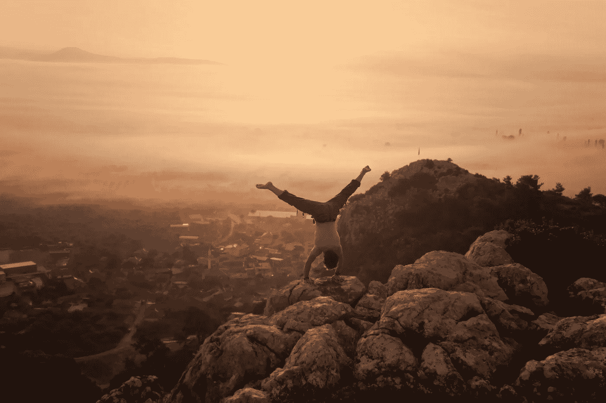

# 意识发展中的痛苦

> 原文：<https://medium.datadriveninvestor.com/the-pain-of-consciousness-fcb624099a73?source=collection_archive---------13----------------------->

> 现代心理学还没有发现意识和智力之间的直接联系。乔丹·彼得森

# 介绍

提高意识很容易，只要把注意力集中在你的牙齿上，你就能感觉到它们。在所有的生活经历中变得觉知是复杂的。思想总是在时间和空间中运动。思想、信仰、情感的云误导你远离真相。

这些年来，我已经学会了抓住发展你的意识所必须做的大量痛苦的工作。在某些时候你会退步，这是令人沮丧的。其他时候，你想加速增长，但无法跳过任何步骤。

这是我未完成的故事的哲学概述。

# 变成一只骆驼

安东尼·德·圣·埃克苏佩里的中篇小说《小王子》中的核心信息是，成熟是在失去孩童般的好奇时产生的。这个故事讲的是一个飞行员坠入沙漠，遇到了一个小男孩，小男孩帮助他找到了他丢失的东西。

哲学家弗里德里希·尼采在他的杰作*中使用了类似的比喻，查拉图斯特拉如是说。两位作家都谈到荒凉的环境和脱离社会的人。沙漠代表了其他人对现实本质的想法和信念的海洋；我们这些年积累的。燃烧的太阳反映了宗教和精神——对救赎的不懈追求，却从未获得直视上帝或任何实体的能力。*

在这片荒凉的土地上，心灵摆脱了社会的束缚。我们意识到我们对真实的渴望。只有在文化之外，我们才明白，我们的信仰体系已经成为自我安装的权威，对某些情况做出自动反应。就像巴甫洛夫的狗一样，我们受条件反射的支配。

 [## 良好的生活是习惯的形成|数据驱动的投资者

### 过度思考是过度紧张。仅仅几个简单的习惯就会在一天中产生巨大的影响。那是…

www.datadriveninvestor.com](https://www.datadriveninvestor.com/2020/01/17/a-good-life-is-habit-forming/) 

与睡眠周期类似，意识的增强是波浪式的。但是在这些意识高度集中的时期，我们可以选择加入我们称之为社会的大篷车——继续不安地前进。

或者我们控制局面。所以我们可以发一个内心的誓言来做一个个人的转变。我们再也不能接受世界的戏剧，对个人的恐惧，或者任何肤浅的关系。

Photo by [Ivan Diaz](https://unsplash.com/@mdi?utm_source=unsplash&utm_medium=referral&utm_content=creditCopyText) on [Unsplash](https://unsplash.com/s/photos/lion?utm_source=unsplash&utm_medium=referral&utm_content=creditCopyText)

# 变成一只狮子

生活会给你无尽的、痛苦的机会让你突然意识到:配偶出轨、父母去世、失去工作等等。或者书籍，帮助你记起你以前是什么——就像保罗·柯艾略的炼金术士*、茱莉亚·卡梅隆的艺术家之路*或者理查德·巴赫的海鸥乔纳森·利文斯顿。有时，我们会遇到一个陌生人，他的谈话激发了我们的自我反省。

突然你从梦中醒来，意识到自己需要改变。你的寻找，进入你人生中的个人成长阶段。一开始，你感觉很棒。你越来越健康，开始意识到自我破坏的模式，并且可以通过展示你的脆弱来建立有意义的联系。但是最终，你意识到你只是改变了舞台——甜点变成了海洋。你沉浸在这个世界的积极向上中。

在某一点上，你意识到你必须放弃一切，尤其是你通过努力和努力获得的所有智慧。尼采称之为向狮子的转变。在侵略性的咆哮中，你重新获得了你对世界的独特体验。

但是在这个过程中你失去了一些东西。

# 超越一个孩子

你不再能够敬畏地看待这个世界。现实变成了这个无限悖论的灰色地带。从某种意义上说，你已经成为一个普遍的虚无主义者。什么都不重要，所以你可以自由塑造自己的命运。但是离开金笼子感觉很孤独。

只有当你学会拥抱自我的死亡。当你把生活理解为一场创造的合作游戏，在未来和过去之外，你才能回归真实。你将不再害怕生活，因为你已经死了。

在当下，你抓住造物之美，惊叹宇宙。尼采称这个最后阶段为“bermensch ”,东方灵性称之为启蒙。

Photo by [Fatih Altas](https://unsplash.com/@altasov?utm_source=unsplash&utm_medium=referral&utm_content=creditCopyText) on [Unsplash](https://unsplash.com/s/photos/handstand?utm_source=unsplash&utm_medium=referral&utm_content=creditCopyText)

# 反光

我刚刚进入狮子阶段，这对我来说很痛苦，因为我必须面对我性格中的每一个负面。我的虚荣，小气，愤怒，都摆在桌面上。我意识到我的整个人格是程序的子集。

以下是一些例子:

a)我有博学的程序，它以知识为傲，倾向于感觉聪明和优越。

b)英雄计划，在善恶中解剖世界，渴望有意义的命运。

c)卡萨诺瓦，通过阅读《沟通》和 PUA 的书，他变得善于调情，但对爱情一点也不懂。

d)尖酸刻薄的男人，他觉得自己被太多的女人和老师拒绝，难以得到原谅。

e)厨师，他以为自己能做出最美味的菜肴，却依靠橄榄油和盐的诀窍。

f)臀肌进食者，他不知道什么是足够的，仍然倾向于加快摄入，因为他认为我有更好的事情要做。

g)战士，在炉石这样的简单游戏中，不能接受任何失败，不得不进行报复。

与其指责我的童年或其他人的影响，我接受这些都是我应该消除的责任。这些节目一直在播放；只有当我有意识的时候，我才能在他们对他人造成伤害之前阻止他们。

每次退步，我都要去看看，去承担责任。我不能再为我的不良行为辩解，说我首先需要改变这一点，或者有足够的自爱，我会到达那里。

我不得不筑起篱笆，或者将这些特征融入我的生活。但是我不能利用别人的帮助、知识或智慧。因为它不是原创的，我会安装他们的程序来抵消其他的。

# 心理疗法

感谢上帝的心理治疗，可以作为这个狮子过程中的指导原则。心理治疗师只被允许提出问题，提醒你得出结论，当你溜走的时候。

卡尔·荣格称这些外部权威或项目为影子，一套我们倾向于塞到垫子下面的个人品质。影子是个骗子，因为它不断地在自怜中伪装自己。将这一点与智慧结合起来，你会说服自己放弃所有你做过的可怕的事情。

如果我想有一个自我提升的机会，我必须像其他人一样学会原谅自己。

# 直觉

你唯一可以信任的工具是你的生物反馈，比如心率、胃的咕咕叫和大脑的直觉。这就像是对系统的彻底检修。

在生活中，你学会了解决一个问题，你应该利用你周围的资源，书籍，亲人和朋友的建议，所有的社会，人文，自然科学和灵性。但是你必须放弃这些，通过倾听自我来塑造你的教育——通过接受永恒的孤独作为礼物。

> 你永远不会真正理解别人的经历，反之亦然，这就是人性的美丽。

我希望我会重新发现我的灵魂或我的真实之地。但是我知道前面的路很长，充满了陷阱。

# 启蒙时代

尼采认为，在他的时代,“超人前传”还不存在。伊曼纽尔·康德对他的时代也有类似的想法，他曾经引用过:

> 我们生活在启蒙时代，但作为物种，我们还没有被启蒙。

相反，我认为与其他时代相比，我们生活在一个有许多开悟者的社会。他们是白手起家，能够达到各自领域巅峰的人。

我不是在谈论亿万富翁、大师、自助教练或成功的企业家。

但是一小部分人过着真正真实的生活。

Photo by [Adriana Aceves](https://unsplash.com/@adrianaceves?utm_source=unsplash&utm_medium=referral&utm_content=creditCopyText) on [Unsplash](https://unsplash.com/s/photos/dance?utm_source=unsplash&utm_medium=referral&utm_content=creditCopyText)

有一天，我希望自己也能加入这个群体。

> 当你在你真正想去的地方；认可没有意义。

如果你想拓宽你的视野，但请记住，即使这些都是计划或信仰体系。

[乔丹·彼得森——智力的傲慢](https://www.youtube.com/watch?v=txyINNJU6Qc)

[了解自己，里里外外| Sadhguru](https://www.youtube.com/watch?v=iipwjxKtRqs)

[你的大脑对你的意识现实产生幻觉|安尼尔·塞斯](https://www.youtube.com/watch?v=lyu7v7nWzfo&t=1s)