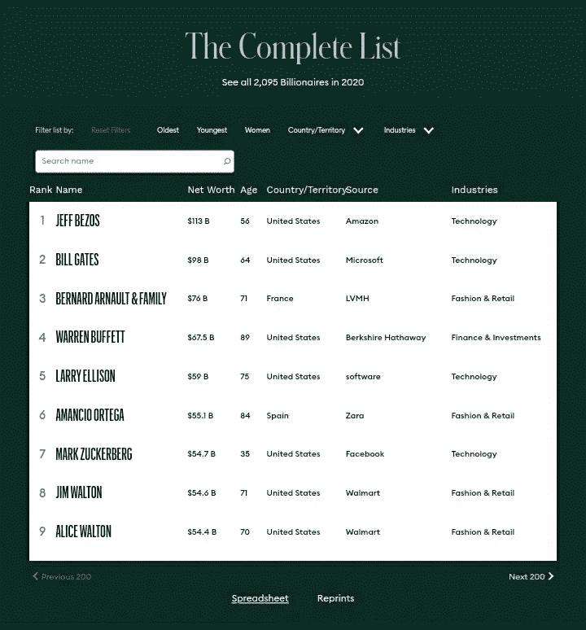

# 疫情被证明是亿万富翁赚钱的惊人时期，他们在过去的 6 个月里赚了大约 2.2 万亿美元

> 原文：<https://medium.datadriveninvestor.com/the-pandemic-proved-to-be-an-amazing-period-for-billionaires-to-make-money-they-earned-around-2-2-39200cd90d1d?source=collection_archive---------28----------------------->

## forbs 亿万富翁排行榜上出现的前五名新面孔

Photo by [Sharon McCutcheon](https://unsplash.com/@sharonmccutcheon?utm_source=medium&utm_medium=referral) on [Unsplash](https://unsplash.com?utm_source=medium&utm_medium=referral)

每个危机都代表一个机会。看你怎么看了。虽然大多数人在疫情期间变得稍微贫穷了一些，但亿万富翁们从未如此富有过。早在 4 月份，当疫情刚刚成立时，全球所有亿万富翁的财富约为 8 万亿美元。快进到今天，它已经攀升到 10.2 美元。万亿。是的，在过去的六个月里，亿万富翁们在 T2 赚了 2.2 万亿美元。

亿万富翁的数量也增加了。2017 年有[2043 位亿万富翁](https://www.google.com/url?sa=t&source=web&rct=j&url=https://en.m.wikipedia.org/wiki/The_World%2527s_Billionaires%23:~:text%3DOracle%2520Corporation-,2017,over%25202%252C000%2520people%2520were%2520listed.&ved=2ahUKEwiYuMm7mfnsAhXj63MBHSUtC0cQFjADegQIARAE&usg=AOvVaw2UuavYWp96tHfv2Eic8EZc)。猜猜现在有多少亿万富翁？[2095](https://www.forbes.com/billionaires/)！在一场和大萧条一样大的经济危机中，又有 53 人成为了亿万富翁。因此，事实证明，每一场危机都代表着机遇。

但是如果你没有为他们做好准备，你会像大多数人一样想念他们。但是不要担心，危机总是每 5 到 10 年发生一次。还会有另一场重大危机，所以与其后悔自己反应不够快，不如为下一场危机做好准备。

其中一个方法就是找出一些人是如何利用这场危机成为亿万富翁的。我们不会谈论像贝佐斯或埃隆·马斯克这样变得更富有的亿万富翁，是的，他们在这场危机中赚了很多钱。埃隆·马斯克从 2019 年的 200 亿美元涨到今年的 911 亿美元。

统计数据指出，各个行业的亿万富翁的财富都以两位数的速度增长，尤其是工业、科技和医疗保健行业的亿万富翁。在低利率和如此大规模的危机下，只有最强大和最聪明的人才会胜出，最终攫取回报。

[Screenshot captured from Forbes. Visit site for a full list](https://www.forbes.com/billionaires/)

# 蒂莫西·斯普林格

让我们从去年还不是亿万富翁，但在 2020 年加入亿万富翁俱乐部的第一个人开始。蒂莫西·斯普林格，你可能以前没听说过他，我也是，直到我做了调查。他是哈佛生物学教授。

当疫情病毒还不存在的时候，蒂姆了解病毒可能造成的危险。所以十年前，他在马萨诸塞州遇到了一家名为 Moderna 的公司。这是一家专注于药物发现、药物开发和疫苗技术的生物技术公司。

这不像电动汽车或网上购物那样令人兴奋，但作为一名生物学教授，他理解疫苗的重要性。所以他决定投资这家公司。目前，他拥有该公司 3.5%的股份。由于在本文发表时，Moderna 的估值约为 300 亿美元，他的股份相当于约 10 亿美元(T3)，对于一位哈佛教授来说，这已经不错了。

Moderna 是研究疫苗的领先公司之一。他们开发了一种新型疫苗，与我们几十年来用来制造疫苗的方式大不相同。*该公司成功通过了疫苗的第一阶段和第二阶段测试，目前正处于第三阶段。*

如果它被证明是成功的，Moderna 将成为首批发布 FDA 批准的疫苗的公司之一，这意味着该公司的股票将飙升，蒂莫西·斯普林格尔(Timothy Springier)可能在未来几个月内将他的净资产增加一倍甚至两倍。

# 特雷弗·米尔顿

如果你看看 2019 年福布斯排行榜，你不会发现 [*特雷弗·米尔顿*](https://www.forbes.com/profile/trevor-milton/?sh=1d5708228861) 在其中，因为他甚至没有接近成为亿万富翁，但 2020 年给了他一个独特的机会。在他的职业生涯中，他创办了多个企业；然而，运气从来没有站在他这边，因为他所有的冒险都很快。

他被指控商业行为欺诈，但这并没有阻止米尔顿再次尝试。2015 年，他推出了他的新业务 Nikola，灵感来自埃隆马斯克，因为他看起来像发明家尼古拉·特斯拉的名字，该公司也在致力于制造电动汽车。

他们还没有证明任何事情，但因为投资者在没有任何其他更好的选择的情况下用现金涌入股市，尼古拉暴露出来，并作为下一个特斯拉引起了投资者的注意，那些错过投资特斯拉机会的人迅速加入进来。

因此，估值迅速飙升至近 100 亿美元，使米尔顿成为亿万富翁，因为他拥有该公司 25 %的股份。没有人知道他会成为亿万富翁多久，因为*公司已经因欺诈行为被司法部和证券交易委员会调查。*

# 爱丽丝·施瓦茨

成为亿万富翁的最佳年龄是多少？大概 20 多岁或 30 多岁，因为你将处于精力的巅峰，可以尽情享受生活。但是有些人不到最后是不会放弃的，比如爱丽丝·施瓦茨，她现在已经 93 岁了，是的，你没听错，93 岁！

似乎她的孩子有很多东西要继承。施瓦茨毕业于加州大学伯克利分校，获得生物化学学位，在那里她遇到了未来的丈夫。这对夫妇接着创办了 Bio-Rad 实验室。

该公司为生命科学研究和临床诊断市场制造产品，如细胞生物学、基因表达、蛋白质纯化、蛋白质定量、药物发现领域的仪器、软件、耗材、试剂和内容。

Bio-Rad 的诊断产品和系统使用一系列技术，并在输血、糖尿病监测和传染病检测市场提供临床信息。这些产品用于支持疾病和其他医疗状况的诊断、监测和治疗。

当时，这项业务听起来并不令人兴奋；然而，事情却反过来了。疫情迫使每个人更加关注我们的健康，并推动许多投资者投资医疗保健公司，最终使爱丽丝·施瓦茨的身价达到 22 亿美元。

# 袁咏麟

这个人一生都在为这样一个机会做准备。从疫情中获益最大的公司是 ZOOM。从私人公司到政府官员，所有人都突然开始使用 zoom。

当然，也有其他的选择，比如 Skype、脸书和其他，但是 Eric Yuan 建立了一个更好更容易使用的系统。突然之间，在一个社交距离很正常的世界里，每个人都开始寻找一种交流、开会、演讲的方式，zoom 是最好的选择。

公司估值从 2019 年的*177 亿美元跃升至本文发表时的 1500 亿美元*。埃里克在这个行业工作了近 20 年，当他向思科提出自己的想法时，遭到了拒绝，所以他继续自己创办了 Zoom。现在他的净资产差不多有 200 亿美元。

# 罗德尼·萨克斯

我从来不喜欢功能饮料。我偶尔会喝红牛，但当我们不得不隔离时，我开始尝试不同的能量饮料，以此来保持自己的动力和效率，因为整天呆在家里会让你变得懒惰

这就是促使[罗德尼·萨克](https://www.forbes.com/profile/rodney-sacks/?sh=7c2bae152ae7)成为亿万富翁的原因。早在 1992 年，他和他的合伙人收购了一家饮料公司 Hansen Natural。生意做得相当好。十年后，该公司决定推出一款名为 Monster 的能量饮料，结果非常成功，以至于在 2012 年该公司更名为 Monster Beverage。

该公司引起了可口可乐的注意，他们以 21.5 亿美元的现金购买了 Monster Beverage 16.7%的股份，并向 Monster 开放了其全球分销部门。罗德尼·萨克那时已经是一个相当富有的人了；然而，疫情促使 Monster beverages 的股价飙升，让 Sack 在亿万富翁的餐桌上占据了一席之地。

给你，这是你之前从未出现在福布斯亿万富翁名单上的人的名单，然而今年，当经济衰退，当数百万人失业，当恐慌袭击世界时，这些人准备好了这样的机会，并充分利用它，成为了亿万富翁。

他们中的一些人年轻时就这样做了，其他人在 90 多岁时也这样做了。在地球上，每个人都有不同的道路，所以你不必看着别人，把自己和别人正在做的事情进行比较，而是关注你自己，你的优势，你的环境。

回到 2008 年，一些人利用房地产市场赚了很多钱。早在 2000 年的时候。com“泡沫破灭，人们发了财。不要因为错过这个机会而感到难过或遗憾，因为这样的机会每 5 到 10 年才有一次。你需要专注于为下一场比赛做好准备。