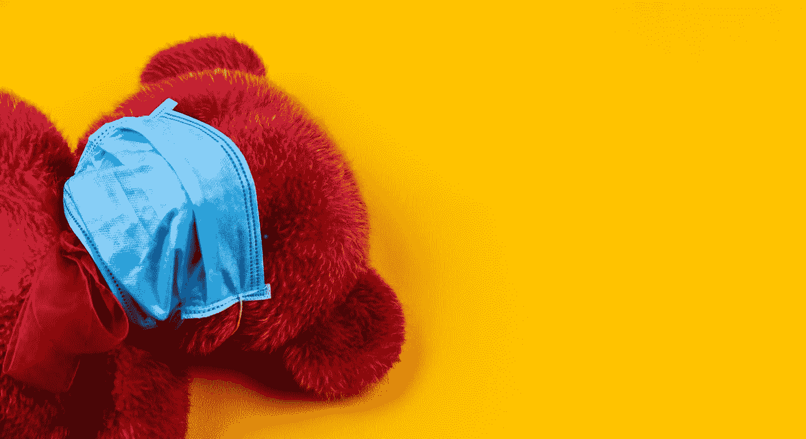

# 疫情人自己的塑料疫情

> 原文：<https://medium.datadriveninvestor.com/the-pandemics-own-plastic-pandemic-2ac9eb6fa65a?source=collection_archive---------12----------------------->

## 个人防护设备、外卖和送货上门正把我们引向错误的方向

Photo by [Volodymyr Hryshchenko](https://unsplash.com/@lunarts?utm_source=medium&utm_medium=referral) on [Unsplash](https://unsplash.com?utm_source=medium&utm_medium=referral)

迄今为止，对塑料的反抗可能是气候变化和环境破坏方面最大的进步。近年来，随着公众对一次性塑料的有害影响有了更多的了解，一次性塑料已经成为行为改变的典型代表。原始海滩上乱扔的瓶子和亮蓝色的海洋或海洋动物身上卡住的吸管的内脏图像，在一定程度上导致了禁止或增加一次性塑料成本的进步政策。然后新冠肺炎发生了。

随着人们、企业和医院争相限制病毒的传播，大量的塑料被购买。阻挡飞沫的口罩和防止表面传播的手套导致保护关键工人的个人防护装备激增。一些人估计每月使用 1290 亿个口罩和 650 亿只手套。再加上围裙和礼服，你会有更多的财富。

这带来了独特而艰难的挑战。对于大多数人来说，可清洗或可重复使用的口罩就足够了，但对于直接接触 COVID 患者的卫生和社会护理工作者来说，一次性设备是必不可少的。然而，其中绝大部分无法回收。

一些会被焚烧(造成自身的环境问题)，一部分会被回收，大部分会被填埋，但令人担忧的是，大部分可能最终会流入河流和海洋。我们已经开始看到了。今年 2 月，数十个口罩[被冲到了香港无人居住的岛屿上的一小片海滩上，这表明人类的影响远远超出了他们实际居住的地方。](https://www.economist.com/international/2020/06/22/covid-19-has-led-to-a-pandemic-of-plastic-pollution)

本周在英国，就在科学家记录泰晤士河每秒 94，000 个微塑料的流量(世界上最高污染水平之一)几天后，鸟类已经被[戴上口罩](https://www.bbc.co.uk/news/uk-england-essex-53474772)。他们担心不小心丢弃个人防护设备会使事情变得更糟。

像法国这样的国家已经对被抓到乱扔个人防护用品的人处以罚款，作为防止环境破坏和潜在污染的一种手段，但这不太可能产生真正的效果。

 [## 气候变化辩论中的科学与金钱|数据驱动的投资者

### 没有关于气候变化的公开辩论。在我发布文章的媒体上，有成千上万的文章是关于…

www.datadriveninvestor.com](https://www.datadriveninvestor.com/2020/01/30/science-and-money-in-the-climate-change-debate/) 

意大利最近的一份报告估计，仅该国每月就需要 10 亿个口罩和 5 亿副手套。正如世界自然基金会指出的，“即使只有百分之一的口罩[在意大利]被不正确地处理，也许会分散到大自然中，这将导致每个月有 1000 万个口罩进入环境。”这可能不是故意的。在有开阔荒地的地区，只需要强劲的阵风就能把这些东西传播到很远很远的地方。

然而，这不仅仅是个人防护设备。外卖食品需求的海啸和送货上门的水平[帮助](https://venturebeat.com/2020/04/30/amazon-earnings-q1-2020/#:~:text=Amazon%20today%20reported%20earnings%20for,of%20%247.09%20in%20Q1%202019).)亚马逊在今年第一季度赚取了 755 亿美元的收入(在 Q2 可能要多得多)，而且你有堆积如山的垃圾，空间有限。这一趋势可能会继续下去，一项[研究](https://www.prnewswire.co.uk/news-releases/covid-19-impact-on-packaging-market-exclusive-report-by-marketsandmarkets-tm--899467613.html)预计塑料包装市场将增长 5.5%，甚至可能高达 9.2%。

在进一步的双重打击下，塑料产品的价格也下降了。3 月份，由于供应过多且无处存放，油价暴跌。停飞的航班和更少的汽车出行意味着需求骤降。由于大多数塑料主要来源于石油，制造塑料产品变得相当便宜。这使得许多公司购买和再利用回收塑料以及回收设施处理废物在经济上不可持续。

在疫情开始的时候，人们认为更多的塑料，尤其是一次性塑料，可以通过触摸防止潜在的污染，从而有益于健康。在许多商店、咖啡馆和超市，可重复使用的袋子和容器实际上是被禁止的。随着研究的发展，许多科学家现在说塑料本身并不安全。然而，已经造成了很多损害。

在英国，政府[给予](https://commonslibrary.parliament.uk/research-briefings/cbp-7241/)超市在 10 月前不对一次性塑料袋征收 5 便士费用的选择权——这项税收减少了 90%的使用量。提议中的吸管禁令也被[搁置了。](https://deframedia.blog.gov.uk/2020/04/16/ban-on-plastic-straws-stirrers-and-cotton-buds-delayed-due-to-coronavirus-outbreak/)

美国许多州[已经停止](https://commonslibrary.parliament.uk/research-briefings/cbp-7241/)他们自己的进步塑料法。在加州，关于塑料的立法已经逆转。2014 年禁止一次性塑料袋的法律已经暂停，[导致](https://www.theguardian.com/environment/2020/jul/09/covid-19-plastic-bans-california-new-york)每个月大约增加 5 亿个塑料袋。

这为亲塑料组织和游说者打开了大门，让他们在近年来失去阵地的领域重新获得更大的立足点。他们继续向政府推销所谓的社会重要性，希望暂时的暂停会变成永久的。

虽然疫情一直支持减排，但随着全球封锁的缓解和人们试图重建某种正常的表象，排放量将再次上升。然而，在可预见的未来，个人防护设备仍将存在，这是理所当然的。

人们和决策者面临的问题变成了:在未来的岁月里，我们如何在人类和地球健康之间取得平衡？只有时间能证明一切。

## 访问专家视图— [订阅 DDI 英特尔](https://datadriveninvestor.com/ddi-intel)