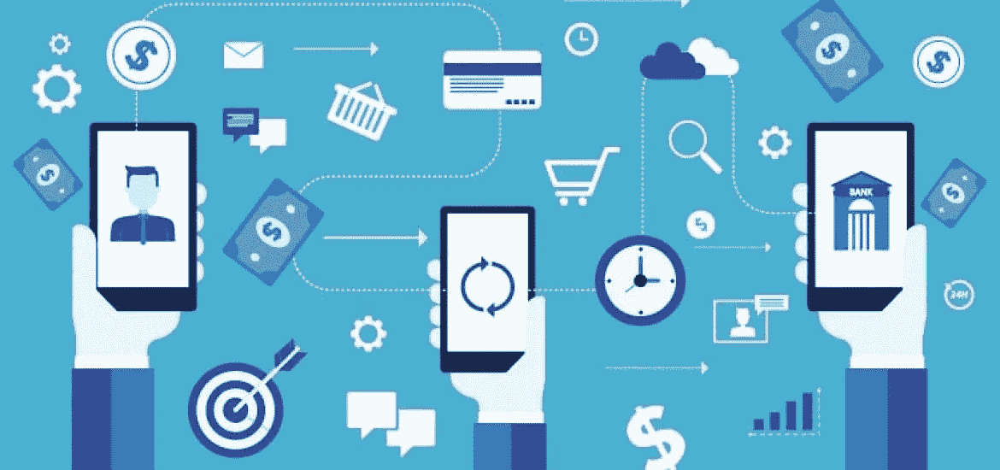

# 支付问题:用于危机救济分配的区块链

> 原文：<https://medium.datadriveninvestor.com/the-payments-problem-blockchain-for-crisis-relief-distribution-fd1ff159fc90?source=collection_archive---------14----------------------->

(shutterstock.com)

你如何快速、准确、安全地将新冠肺炎基金送到急需救援的人们手中？这是全球各国政府面临的问题，因为关闭的经济意味着他们国家的许多公民和企业，很少有人有超过几周的财务缓冲，没有办法支付租金、食品等必需品和员工工资等公司费用。

这些支付是大规模和普遍的，对个人、家庭和企业的快速分配提出了挑战。3 月 18 日，美国承诺向遭受疫情经济影响的美国公民发放两批总额为 5000 亿美元的直接付款，另一批计划为小企业提供 500 亿美元的救助。在加拿大，特鲁多总理宣布了新冠肺炎经济应对计划，其中包括向加拿大工人和企业提供 270 亿加元的直接支持。

 [## 数字货币、区块链和货币的未来|数据驱动的投资者

### “区块链”、“加密货币”、“令牌化”，以及现在的“央行数字货币”已经成为…

www.datadriveninvestor.com](https://www.datadriveninvestor.com/2020/02/18/digital-currencies-blockchain-and-the-future-of-money/) 

随着世界各国政府向公民和居民部署类似的救济计划，现有的注册和支付服务在这一巨大的意外负担下不堪重负。在大多数国家，联邦基金分配系统是官僚就业的主要来源，有大规模的手工流程和数以千计的管理员、会计和职员。

“对公民和企业来说，交易将会更有效率，几乎即时结算，而成本可能只是其一小部分。”

*普华永道，*[央行数字货币的崛起](https://www.pwc.com/gx/en/financial-services/pdf/the-rise-of-central-bank-digital-currencies.pdf)*’(2019)*

在危机中，支付申请的人工处理是延迟、高成本和错误的危险来源，也是数字技术可以简化和自动化这些功能以创建更优化、抗冲击系统的主要领域。正如新冠肺炎疫情所展示的，在未来的黑天鹅事件中，数天或数周的分发时间表将不会削减它，是时候进行系统升级了。

区块链是一种去中心化的数据存储技术，其中包含信息的分类账由加密技术保护，只能由其用户网络读取和添加，永远不会改变。这创建了一个完整的数据来源链，其中对已验证数据库或分类帐的任何添加都可以被授权方即时共享和访问。智能合同是建立在这些分类帐基础上的应用程序，这些分类帐具有事先商定的条款，并被编程为在满足合同参数时自动执行。

与通常由数千名工人手动管理的笨重的集中式数据存储和交易系统相比，区块链是网络安全和业务自动化方面的一次重大飞跃，在各个行业和应用程序中展示了巨大的成本、工时和时间节约。政府发行的区块链货币与数字化身份挂钩，并通过数字钱包应用程序分发，正越来越接近现实世界的效用。

随着该技术在其 10 年的历史中不断发展，变得更加可扩展，能够与现有的业务系统集成，世界上最大的公司已经开始在区块链的未来进行大量投资。由 60 家主要国际银行和信贷提供商组成的 [R3 联盟](/R3.com)共有 300 多家参与公司，开发了领先的区块链金融交易平台。

[Jasper](https://www.bankofcanada.ca/research/digital-currencies-and-fintech/projects/)项目是加拿大支付公司、加拿大银行和私营企业之间的合作伙伴关系，R3 及其 Corda 平台参与了其后期阶段，该项目于 2016 年启动，是一项里程碑式的探索，旨在探索如何应用区块链来优化政府结算和支付，并研究数字化中央银行发行的货币作为应急货币的挑战和优势，以防它成为未来的必需品。来自其他政府的迹象表明，这种新型冠状病毒可能是一种催化剂。

*“通过国家支付系统处理支付通常既昂贵又耗时。如果全面采用，区块链可以实现近实时和准确的支付，从而降低交易处理成本”。*

*德勤，‘*[*区块链能否在全球范围内加速金融普惠*](https://www2.deloitte.com/content/dam/Deloitte/lu/Documents/technology/lu-blockchain-accelerate-financial-inclusion.pdf)*’(2018)*

美国政府现在可能会效仿加拿大，研究和开发央行发行的区块链货币，民主党 3 月 22 日的刺激法案草案包含一项数字美元的提议，这将有助于解决向无银行账户的公民提供援助的问题，由美联储管理的数字分类账运行，并可在合格的金融机构兑换为价值单位。

据报道，中国在开发自己的数字货币方面已经进入了[的高级阶段](https://btcmanager.com/coronavirus-outbreak-delay-china-cbdc-project/)，区块链似乎是未来政府支付流程的关键。然而，对于向数亿人发放新冠肺炎救济金这一艰巨任务来说，这不是一个立竿见影的解决方案，而是一个长期的基础设施，需要政府、行业和区块链技术部门的合作。

系统性问题需要系统性解决方案，随着世界卫生组织等国际机构预测更多大规模健康危机的到来，我们不能等到当前的紧急状态过去、稳定回归后再开始准备。

现在，各国政府疯狂争夺急需资金的个人和企业手中的资金，而我们当前体系中的裂缝正变得令人痛苦地清晰。系统性的技术变革代价高昂，充满挑战，并伴随着不可避免的风险，但我们现在正处于一个全球转折点，维持我们旧的、脆弱的运营方式是更大的危险。

我们无法预测黑天鹅，但我们可以做好准备——通过像区块链这样的数字技术实现救济支付自动化将有助于我们建设一个更具弹性的未来。