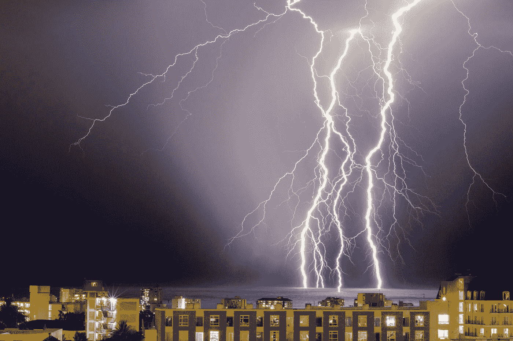
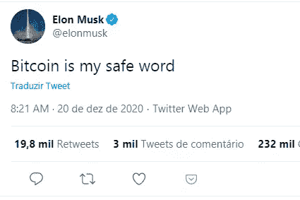
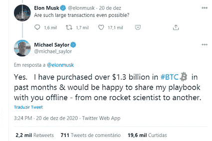

# 完美的血腥风暴来了:特斯拉收购比特币

> 原文：<https://medium.datadriveninvestor.com/the-perfect-bloody-storm-is-coming-tesla-buying-bitcoin-c9df6a330e7?source=collection_archive---------2----------------------->

## 埃隆的比特币推特风暴正在移动构造板块

Photo by [Garth Manthe](https://unsplash.com/@garth_manthe?utm_source=medium&utm_medium=referral) on [Unsplash](https://unsplash.com?utm_source=medium&utm_medium=referral)

Image from the author

在过去的一千年里，人类从未在没有权贵之手的情况下创造出由普通人拥有的价值储备。

> [比特币是网络空间的一个储蓄账户，可供 78 亿人使用](https://medium.com/the-price-of-tomorrow/bitcoin-a-free-market-flag-vs-a-suffisticated-marketing-brand-846a86892a78),在这里没有政客可以偷你的钱。这是地球上每个人都需要的简单想法。这是世界历史上第一个真正工程化的货币网络。这是一个封闭的热力系统，不会失去动力。如果你在这个系统中投入一亿美元，就像你有了一个没有能量损失的电池。迈克尔·塞勒

迈克尔·塞勒是一家名为 Microstrategy 的公司的首席执行官。几周前，他做出了金融界最改变人生的举动。

塞勒在他的董事会上，和他的员工进行了一次勇敢的谈话。他的结论是，在银行持有 500，000，000 美元现金或 3 个月期美国国债是一种负债:一文不值。

他说，货币扩张率从每年约 5%升至 15%。在接下来的 4 到 5 年里，他们每年都会损失 15%的购买力。一笔 5 亿美元的现金开始看起来像一个正在融化的立方体。几乎可以肯定的是，如果他们什么都不做，他们将在 36 到 48 个月内损失至少一半的钱。

所以，他们做到了。他们购买了[比特币](http://bit.ly/37F7nHb)。

其中的 5 亿。

Photo by [Dmitry Demidko](https://unsplash.com/@wildbook?utm_source=medium&utm_medium=referral) on [Unsplash](https://unsplash.com?utm_source=medium&utm_medium=referral)

# 勇敢地开始一场重要的对话

[有些对话有改变世界的力量。](https://medium.com/the-price-of-tomorrow/this-is-what-happens-when-you-have-tesla-buying-bitcoin-14ce2b3836b8)

据我所知，埃隆·马斯克受邀与迈克尔·塞勒进行一次真正的对话。从一个火箭科学家到另一个。

目前，他们只是互相发微博。

Image by the author

不知道这个对话是不是已经发生了？

更重要的是，我想知道埃隆·马斯克对塞勒解释的最终印象是什么。

如你所想，迈克尔·塞勒在过去几周接受了一系列采访。我分析了其中两个。一个是 Raoul Pal 的真实视觉。另一个是来自[超变](https://bit.ly/38t5Lzs)的伽利略拉什。

这些是我从塞勒那里学到的首要问题:

*   亚马逊将店面非物质化。脸书——社交网络。苹果——移动设备。谷歌——各种各样的图书馆。特斯拉——汽车和能源行业。比特币——货币系统。
*   比特币成为第一个货币网络，因为它是一种合成的避险资产。就像所有黄金的正确部分，它坐落在一个巨大的网络上。
*   它有 2100 万硬币的上限。之后，矿工就不能再生产硬币了。在过去的 12 年里它一直是安全的。它作为一种合法资产被国会和货币监管机构采纳和规范。
*   [比特币是网络空间的储蓄账户](https://medium.com/never-fear/what-bitcoin-and-medium-have-in-common-a-decentralized-theory-7d937278544f)，可供 78 亿人使用。没有政客能偷你的钱。
*   债券和股票有通货膨胀。房地产和黄金出现了通货膨胀。通货膨胀衡量的是中央银行追踪的数据。这是一篮子消费品和服务。这还不包括挥发性较高的食物和能量。现在这是两个不同的世界。
*   [如果你有比特币](https://medium.com/datadriveninvestor/dont-panic-but-money-is-gonna-disappear-c6e186a628bb)这样的东西，却不能再赚更多，那么每个人都想要它。这是一个简单的概念，随着各国央行货币供应量翻倍，它的价值将会翻倍。
*   你可以在几分钟内将一亿美元的比特币从纽约转移到伦敦，而这将花费你 3 美元。用黄金做这件事要花一百万美元。

我们处在一个时代，所有教给我们的既定原则都受到了质疑。

> 我们注意到与我们的观点相符的事物，而对不相符的事物不予理会。当我们在这个基础上建立我们有限的知识时，我们可能甚至没有意识到这个基础本身是脆弱的。因此，当我们继续我们的生活，过滤大量的信息时，我们会很快对重要的细节视而不见，陷入我们的泡沫，忽视一些信息或不同的观点，即使它们可能对我们有帮助。我们的决定是由我们认为的事实形成的，如果新的信息出现，与我们的信念不符，它通常会使我们坚持原来的观点。——杰夫·布斯《明天的价格:为什么通货紧缩是未来繁荣的关键》

 [## 蓝色起源能摧毁 SpaceX 的垄断吗？数据驱动的投资者

### 争夺太空主导权的战争即将升级吗？距离第一枚 SpaceX 猎鹰 9 号火箭升空已经过去 7 年了…

www.datadriveninvestor.com](https://www.datadriveninvestor.com/2020/11/26/could-blue-origin-demolish-the-spacex-monopoly/) 

# 说话更难，打架更容易

埃隆·马斯克拥有和迈克尔·乔丹当神时一样的武器[。](https://medium.com/never-fear/michael-jordans-advice-on-how-to-be-the-best-on-medium-2619a398d341)

这叫垃圾话。

埃隆以扰乱人们的头脑为乐。他喜欢动摇体制，并且总是说废话。

与此同时，在家中的寂静中，他正在创造下一个技术突破。另一个板块的又一次滑动。

所以，

> 不知道这种火箭科学家对火箭科学家的对话是不是已经发生了？

正如我们所知，埃隆正在通过颠覆两个领域来改变世界。汽车和能源行业。

他会出手扰乱货币体系吗？特斯拉会是第一个打破模式的大公司吗？

为什么不呢？

> 唯一有意义的是争取更大的集体启蒙。-埃隆·马斯克

埃隆·马斯克的优势在于他是一个局外人。他是汽车行业和能源行业的局外人。局外人可以从一个相反的角度观察环境。他们不再局限于公认的信仰体系或偏见。

在他们的亲切中，这些非凡的人有这种破坏性的力量。他们未经允许就干涉一个瓦解的系统。没有受过良好的教育。因为他们比任何人都相信对人类来说最公平的方式。

> 如果你看看智能手机，它大约有 13 年的历史。它现在取代了许多东西:地图、音乐播放器、视频播放器、卷尺、个人助理、个人日记、相机、录音机，而且这些应用程序是免费的或者收费很低。如果你想象每个行业都以同样的速度发展，那么技术的通缩效应将是巨大的，并且呈指数级增长。杰夫·布斯

一个世纪前，我们目睹了一项残酷的颠覆性技术。电、电话和内燃机的发明。

13 年间，纽约戏剧性地从马车转向了汽车。它改变了纽约的面貌。以及它的功能性和移动性。

所以，如果你想相信什么都没发生，那就相信吧。

巨大的变化正在发生。从深度学习到人工智能。从电动汽车到基因组学。从流媒体到机器人技术。

货币体系呢？

这些深刻的变化会抓住大人物吗？他们会赶上中央银行和政府、政治和大银行吗？

# 最后的想法

我是个永远的乐观主义者。

我仍然相信像中本聪这样的人生来就是为了让世界变得更好。

正义以其纯洁征服了我们。

欲望是从根本上侵蚀的东西。

在这场正义与邪恶的战争中，我继续把我的筹码押在正义上。

全在人性。

[**注册我的邮件列表**](https://mailchi.mp/104ad9e5f4d9/nuno-fabiao) ，加入 Medium 上最快乐的读者。
*(在这里你可以独家访问我的日常活动、经历和日常想法)*

## 访问专家视图— [订阅 DDI 英特尔](https://datadriveninvestor.com/ddi-intel)