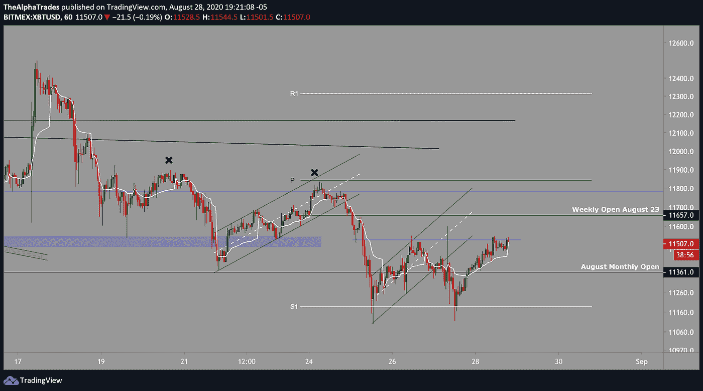
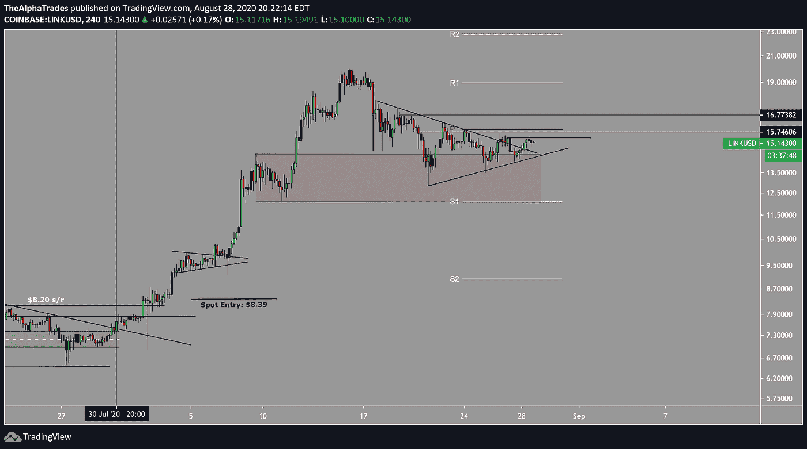
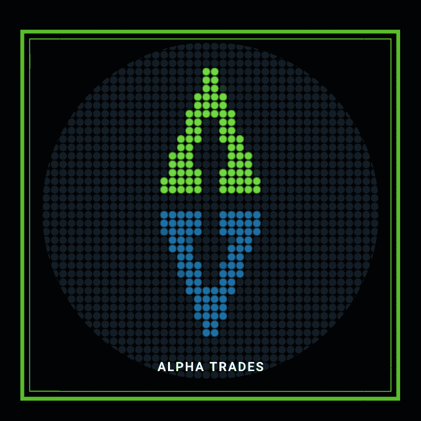

# 完美的加密交易策略

> 原文：<https://medium.datadriveninvestor.com/the-perfect-crypto-trading-strategy-5cd3554f552f?source=collection_archive---------7----------------------->

## **大胆？你来做决定，而不是财务建议。**

如果你在交易游戏中已经有一段时间了，你可能听说过“支点”和“VWAP”前者听起来像一个令人难以置信的蹩脚的大学教科书的标题，而另一个可能是一个时髦的新舞蹈序列。

我问我们的分析师 Amol 他是否愿意展示一个合适的 vee-whap，但是他拒绝了。

虽然不那么有趣，但我们会让你每天盯着图表看几个小时，很快就能快速了解我们最喜欢的两个技术指标。

# 定义:

## 数量加权平均价格(VWAP)

*交易者使用的交易基准，根据交易量和价格给出一种证券全天的平均交易价格。它很重要，因为它为交易者提供了对一种证券的趋势和价值的洞察。* ( [Investopedia](https://www.investopedia.com/terms/v/vwap.asp) )

VWAP 计算的是给定资产的价格乘以交易量，再除以总交易量。

## 支点

一种技术分析指标，用于确定市场在不同时间段的总体趋势。在接下来的一天，高于支点的交易被认为表明持续的看涨情绪，而低于支点的交易表明看跌情绪。

*支点不使用百分比，而是基于固定的数字:前一天的最高价、最低价和收盘价。* ( [投资媒体](https://www.investopedia.com/terms/p/pivotpoint.asp))

我们今天提供的策略是 VWAP-支点组合，好像这些舞步听起来不能再复杂了。

这个策略帮助我们在两个方向上找到合适的位置，我们将用两个成功的交易来证明这一点。

查看下面的交易视图图表中的价格变化。我们打开了枢轴指示器。现在你看到的是一串水平线，有点像[斐波纳契回撤](https://www.investopedia.com/terms/f/fibonacciretracement.asp)工具。

 [## 加密过山车 ETH2.0 测试网的麻烦，动荡的市场，美联储谈论 CBDCs |数据…

### 是只有我这么想，还是外面的情况越来越乐观了？从酒吧凳体育创始人戴夫波特诺伊泵他最喜欢的…

www.datadriveninvestor.com](https://www.datadriveninvestor.com/2020/08/20/crypto-rollercoaster-trouble-on-the-eth2-0-testnet-volatile-markets-the-fed-talks-cbdcs/) 

## 螺旋切线

不确定什么是斐波纳契回撤？暂时不用担心。这是一个兔子洞，我们将在未来的作品中冒险进入。如果你有什么东西要我们拆开，就给我们在 social@thealphatrades.com 写封短信。

如果你需要在交易视图中添加一个指标，从这里开始，然后在忘记我们的存在之前快速返回。作为一个金鱼大脑同胞，我理解这种挣扎。然而，如果你想深入 T2，可以试试我们内部设计的这个 T4 交易基础课程。

## 回到枢轴:

添加 pivots 指标后，单击指标设置→输入→选中“显示历史数据透视表”，然后返回图表。

这个视图有助于我们识别日常工作的重点。请记住，当您在每小时的时间范围内打开轴时，轴点每周都会发生变化。在 15 分钟的时间框架内，支点每天都在变化。

这种分析关注的是每小时，所以如果你想继续的话，把你的图表切换到那个时间段。

当价格突破 R1(pivot-speak 的意思是“第一个阻力位”)时，你希望价格保持在这个水平之上。如果价格没有停留在这个水平之上，它更有可能回到支点。然而，如果价格未能收复该阻力位并将其转化为支撑，则进一步增加了下跌的可能性。

价格在 S1 上方停留了 8 到 10 个小时，但随后跌破该水平。这就是我们的双指标策略的用武之地。

我将提醒您注意看起来像移动平均线的白线。这就是成交量加权平均价格或 VWAP。

一旦价格开始低于 VWAP，同时也低于 R1，你有两个单独的指标表明价格疲软。

我会把这看作是一种选择，打开一个短期或关闭一个长期的立场。说我们错过了那笔交易。这是我们与 Discord 服务器分享的一个想法的截图。

根据 pivot points 的说法，这种设置最适合做多，因为 S1 或第一个支撑位已经过测试。

我要分享的第二个交易是 ChainLink(链接)。

价格跌破周支点，随后[未能通过再次测试](https://www.investopedia.com/articles/trading/06/supportresistancereversal.asp)，这意味着该水平成为新的本地阻力。不仅如此，我们还可以跟踪几次在 VWAP 上方关闭的失败尝试，直到一根蜡烛最终关闭在其下方。我认为这是下一个做空的想法，目标是在 S1 获利。

我没有做那笔交易，因为我在等待测试 S1 来建立多头头寸。

# 结果

我希望这个策略能帮助你找到适合你的风格。你不需要复杂的指标来提供买入或卖出信号。你不需要 15 个不同的指标来成为一个成功的交易者。

Alpha Trades 正与我们社区的一员合作，为您带来牧羊人指标。我很高兴能在九月推出它。这一指标简化了我看待价格行为的方式，超越了买入/卖出信号。如果你对技术动作有一些基本的了解，你会喜欢牧羊人。这个指标的绝对*单位*结合了交易者常用的几个小玩意的最佳元素。

祝你交易愉快，并保持你的止损。

你想让我们报道些什么吗？[请在 Discord 服务器](https://discord.gg/a97qq2s)上给我们留言。

# 这是一个动荡的市场，你需要一个策略。

阿尔法交易团队本周深入研究市场、密码和经济。当谈到抛出一些图表和提供交易者心理服务时，我们无愧于“阿尔法”这个绰号

*我们从你正在阅读的文章中推导出:*

[完美的加密交易策略](https://youtu.be/msaG_wjX6p4)

在这种时候，随着股市估值飙升，秘密资产加速进入另一个牛市(缩写为 DeFi)，成为一个积极参与、透明的交易社区的一部分是值得的。

[订阅 Alpha Trades Discord 服务器](https://discord.gg/a97qq2s)学习技术分析以及如何投资获利。询问 2 天的高级会员试用！

# 放弃

Alpha Trades，LLC 提供的信息不用于制定任何财务决策，也不是购买、持有和/或出售特定证券或金融工具的请求或建议。

访问 Alpha Trades 的完整服务条款:[https://bit.ly/3faVeeV](https://bit.ly/3faVeeV)

**访问专家视图—** [**订阅 DDI 英特尔**](https://datadriveninvestor.com/ddi-intel)