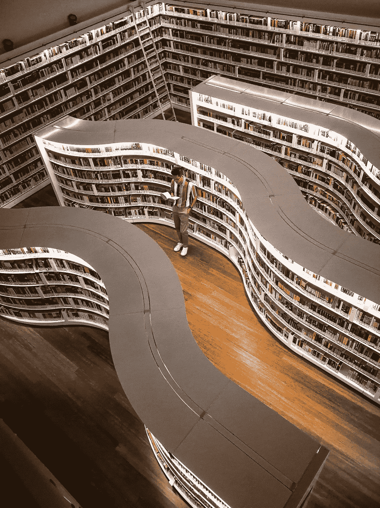
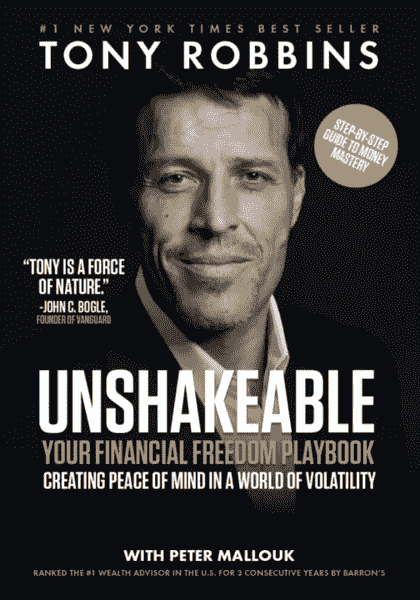
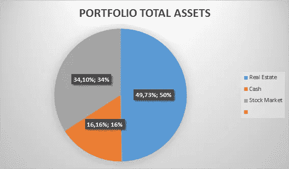

# 完美的投资组合-听，学，开始！

> 原文：<https://medium.datadriveninvestor.com/the-perfect-investment-portfolio-listen-learn-and-start-b3ab61fe6c37?source=collection_archive---------13----------------------->

让你的个人资料适应你的梦想，让我向你展示谁能比一般人更聪明，并在拥有实现梦想所需资金的时代茁壮成长！

Carlos Muza from unsplash.com

对每个人来说，倾听、学习和开始任何项目都是成功的关键。

一旦有不同的人来评估你的项目，这些人有不同的观点，不同的经历，不同的哲学，很快你就会找到最佳的结构来开始并在你的财务旅程中保持良好的速度。

正如 Twitter 和 Square 首席执行官杰克·多西所说:

“我从这一切中学到的最重要的一课就是你必须开始。从现在开始，从这里开始，从小处着手。保持简单。”

我的人生故事就像多尔西说的那么简单。

我一直是个优秀的运动员。28 岁前参加篮球和沙滩排球全国锦标赛。然后我开了一家健身公司，因为我有体育学位。

我祖父的家族也有一家由我父亲和叔叔管理的公司，但它陷入了困境，不知何故我参与进来试图帮助他们。4 年的奋斗没有成功。我的家庭深陷困境。不得不卖掉一半传家宝来关闭公司。60 年的好名声在一个葡萄牙小城市，我们死在沙滩上。这个家庭的每个人都很难从这个创伤中走出来。

 [## 利用股市相关性的最佳方式|数据驱动的投资者

### 当阿尔弗雷德·温斯洛·琼斯开创了世界上第一个“对冲”基金(后来“d”被去掉了)时，他让其他投资者大吃一惊…

www.datadriveninvestor.com](https://www.datadriveninvestor.com/2020/02/02/the-best-way-to-use-stock-market-correlations/) 

但是生活还要继续。我和我家人的公司发展得如此之快，以至于我和自己的公司脱离了关系。除此之外，我的公司也开始了一场斗争。2008 年的危机让葡萄牙政府和 IMF 大幅增税。我们注定要失败。没有利润，只是工作支付工资和税收。

于是，同样的故事又重演了。我在那里，第二次挣扎。当时我刚刚 32 岁，正面临着我创业旅程中的又一次重大失望。

幸运的是，我有一个朋友发现了我与人交谈的能力，并邀请我去房地产公司工作。

10 年后，我在一家小公司，年复一年地成长。比这更好的是，我正在存钱并投资其中的一部分。

因为父母给了我读书的习惯，所以我能把手头所有关于房地产和金融投资的东西都看完。我开始和比我懂得多的人交谈，现在我终于走上了通往平静和成长的正确道路。

Image from pexel.com

在我和你们分享永久改变我生活的书籍和展示我的作品集之前，我想和你们分享一下对我影响最大的人。

2012 年，一个名叫吉米·罗恩的人来到德国科隆的一个活动上，做了一个关于个人发展的演讲。我很幸运去见了他。它确实改变了我对很多事情的看法。尤其是关于阅读和意志力。

吉米·罗恩说:

书籍是你踩在上面带你到更高的书架的东西。你的书堆得越高，你能够到的书架就越高。想达到更高？脚下多堆几本书！阅读带给我们新的知识。它打开了新的大门。它让我们理解神秘。它让我们了解成功人士。阅读是我们旅途中的向导。为了更好的未来和成功，你所需要的一切都已经写好了。”

我通常会读一些作家的小说，比如厄恩斯特·海明威或者葡萄牙的诺贝尔文学奖得主若泽·萨拉马戈。但是在某些时候，我需要深入钻研技术书籍。所以我做到了！

我的一个好朋友，当我告诉他吉米·罗恩的时候，他提到了另一个作者的名字，他实际上是罗恩的弟子——安东尼·罗宾！

托尼·罗宾斯是自然的力量。他的活动让成千上万的人沉浸在自我认知和激励的力量中。托尼是一个了不起的人。他博爱的态度赢得了我的深深钦佩。

托尼·罗宾斯有几本关于他专业的书。但是有一天，他注意到一个问题，那就是美国的媒体阶层不能享有超级富豪们同样的特权。更糟糕的是，他们一生的积蓄被收取高额费用。

因此，罗宾斯开始与他的一些超级富豪客户交谈(他指导其中一些客户)，并意识到有办法做出一个良好而公平的金融资产投资组合，支付更低的费用，比这更好。他开始深入研究，用了七年时间，发现自己在与全球顶级对冲基金和共同基金的最佳投资组合经理交谈。

2017 年《不可动摇》诞生。基本上，这本书是一个实用的工具，比“钱”更压缩，我在床头放了两本书，里面有上百个笔记。它们实际上是强制性的！！！

Image from Google Images

《不可动摇》就是这种简单实用，人人都要看的文件。它解释了创建股票、债券、指数基金和其他金融工具的金融投资组合的简单而安全的方法，以便在一生中应对各种天气。

《钱》是一本更广泛的书。最后采访一些有史以来最具代表性的投资者，比如沃伦·巴菲特、雷伊·达里奥、卡尔·伊坎、杰克·博格尔、保罗·都铎·琼斯、约翰·邓普顿爵士以及其他许多人。这是一个新的世界进入我的眼睛。这让我明白了一些基本问题，比如:

*   有股票就有公司；
*   投资世界是一个漫长而耐心的旅程；
*   你必须大量阅读，才能开始理解这个世界的复杂性；
*   这不是感情用事。但是如果你不能把你的心放在盘子里，用你的大脑思考，不要浪费你的时间和金钱；
*   随着你对市场的了解，你可以真正做到财务独立；
*   真正的魔法召唤 [**复利**](https://www.investopedia.com/terms/c/compoundinterest.asp) 。

Image from Andrea in pexel.com

我读过沃伦·巴菲特的传记，差不多 900 页的[【雪球】](https://www.amazon.com/Snowball-Warren-Buffett-Business-Life/dp/0553384619)，在那之后，我明白了沃伦并不是一个真正的普通人。他很早就看到了金融界的运作方式，13 岁开始玩这个游戏，和最优秀的人交谈，学习，倾听，然后开始！

你有两本非常好的关于选择股票的自助技巧的书:

*   [*“巴菲特学，以前无法解释的技术，使沃伦·巴菲特成为世界上最著名的投资者；*](https://www.amazon.com/Buffettology-Previously-Unexplained-Techniques-Buffett/dp/068484821X)
*   [*《沃伦·巴菲特的基本原则》。*](https://www.amazon.com/s?k=warren+buffett+s+ground+rules&i=stripbooks-intl-ship&crid=283HGOMFVW0YO&sprefix=warren+Buffett%C2%B4s+Grou%2Cstripbooks-intl-ship%2C244&ref=nb_sb_ss_i_1_21)

通过这两本书，你可以简单地了解巴菲特选择谁的股票，他分析谁的股票，以及他如何等待股票上涨。

有一天，我在图书馆发现了一本书，作者是西班牙人，名叫丹妮尔·拉卡勒。[《金融市场中的生活》](https://www.dlacalle.com/en/life-in-the-financial-markets-soon-on-wiley/#more-2651)这是一本精彩的书，你必须读一读，才能理解全球市场的复杂性、信息的过剩、预测的过剩，以及非常好的建议，告诉你谁可以让它变得简单，以及谁，正如拉卡勒几次警告我们的那样，我们不应该跟着党走！他很有幽默感，我很喜欢他。

最后，来自全球两位最佳基金投资者的两本“圣经”:

*   [*【掌握循环】*](https://www.amazon.com/s?k=mastering+the+cycle&i=stripbooks-intl-ship&ref=nb_sb_noss_1) ，出自霍华德·马克斯；
*   [*【原则】*](https://www.amazon.com/s?k=principles+ray+dalio&i=stripbooks-intl-ship&crid=27KYDRLLD2P78&sprefix=principles%2Cstripbooks-intl-ship%2C260&ref=nb_sb_ss_i_1_10) ，出自雷伊·达里奥。

就目前而言，我认为这足以让你得到娱乐，并获得一些非常好的知识。

让我告诉你，在所有这些内容之后，我开始重新调整我的金融投资组合。我以为我突然变成了一个真正的金融专家。

很快我发现最好从小处着手，简单，并不断学习。

所以，我的投资组合中有一部分配置在房地产上。

为什么？

因为所有的资产都在市场上，房地产是最好的和安全的投资之一。但是要小心！和其他投资一样，你必须知道你在做什么。

我是 Youtube 上一个名为 [**Biggerpokets**](https://www.youtube.com/watch?v=T_7vhsSBi7c&t=4s) **的播客的超级粉丝。**主持人布兰登·特纳(Brandon Turner)是一位精力充沛的投资者，他全心全意地分享所有最佳投资策略，无论你是想卖掉一栋房子，还是想购买、修复和出租。Biggerpokets 向你展示数字、商业计划，在频道中，你有数百小时的各种经验丰富的投资者分享他们的愿景和策略，使他们取得成功。

我投资组合的另一部分是股票和指数基金。

我爱分析公司！

如果你开始调查一家公司，你会发现很多你以前不知道的新事物。

你在世界各地都知道的名字，像可口可乐、沃尔玛、泰斯塔、苹果、微软、梅西百货、摩根大通、耐克、家乐氏等等。他们是长期成功的公司。你可以通过购买他们的股票来参与他们的项目。

但是如果你开始投资，并且你真的想开始投资，像我一样，投资一个 [**指数。他们有很多。他们基本上跟踪市场的某个部分。**](https://www.investopedia.com/terms/i/indexfund.asp)

我最喜欢的是标准普尔 500 指数基金。它追踪美国最有价值的 500 家公司。

这个指数基金的前 5 名都有你不陌生的品牌，比如微软、苹果、亚马逊、脸书和 Alphabet(谷歌)。

所以，就像沃伦·巴菲特说的，如果你想在股票市场简单起步，就买 S&P500 指数基金。自 1926 年以来，它的平均年回报率为 9.7%。

托尼·罗宾斯在《牢不可破》中很好地解释了，这意味着你的钱每 7 年重复一次，复利神奇公式。

我的投资组合中有 50%投资于房地产，34%投资于股市，16%投资于现金。

通常我有 10%的现金，但这个比例会随着股票市场价格的高估或低估而变化。

现在我们处于牛市的尽头，在冠状病毒出现之前，股市上涨了 11 年。这就是为什么 a 有更多的钱在等着买深的(低价的股票)。

在股票市场上，我将 50%的资金投入标准普尔 500 指数基金，另外 50%投资于股票，这是我的图表:

为什么我没有投资黄金或比特币？

黄金和比特币可能是保护投资者恐惧的两种内在价值资产。

我读了很多关于“资产”的文章和书籍，我得出的最好结论是，黄金和比特币是让你不那么害怕市场波动的工具。

我个人的观点是，房地产是我的“黄金”。这是我的安全资产。

但这是非常个人化的，而且与你的投资者形象有关，这与我的不同，如果你告诉我，你更喜欢将 10%的投资组合投资于黄金，就像伟大的雷伊·达里奥建议的那样，这是一个非常可行和理性的策略。只是不是我的！

那你呢？你投资股票市场吗？房地产？

你的最终目标是什么？达到一百万美元？一千万美元？10 亿美元？

像 [**Chamath Palihapitiya 一样，社交资本**](http://Founder and CEO Social Capital) 的创始人兼首席执行官谈到金钱时说，“如果你有十亿美元，你就有能力带来十亿美元的变化。你拥有的钱越多，看起来越冷酷，你改变的力量就越大。你真的可以改变很多你相信的事情。它很强大。”

我将与你分享我的最终目标。这很简单。但是我需要一大笔钱来做这件事。

我的梦想是建立一个 [**同热带森林，就像恩斯特·戈奇**](http://Founder and CEO Social Capital) 在巴西所做的那样，并在世界各地复制这种商业模式。

这是我的主题目标。而我的理财组合就是我要走到那一步的必经之路！

你的呢？