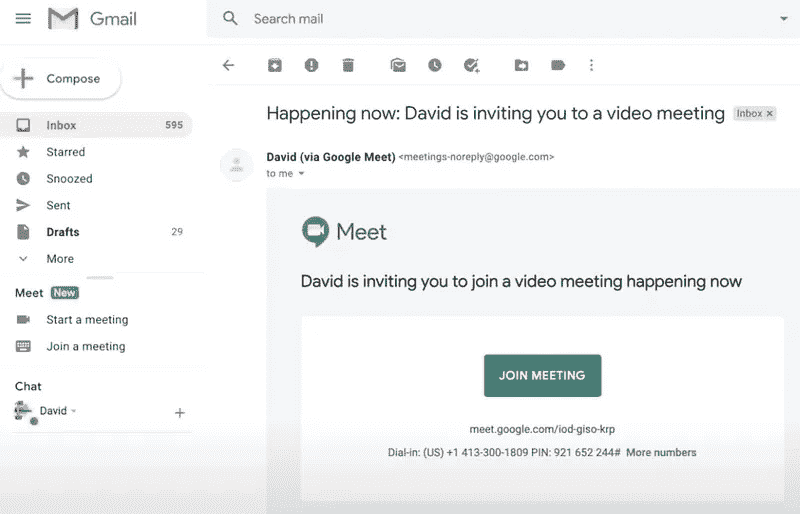
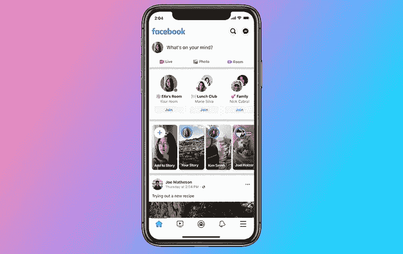

# 完美的视频聊天应用并不存在

> 原文：<https://medium.datadriveninvestor.com/the-perfect-video-chat-app-doesnt-exist-fb18999065ce?source=collection_archive---------8----------------------->

冠状病毒危机及其所有的“在家工作”和社交距离建议，可能已经将你的社交生活转变为一连串的视频聊天。你的老板，你的医生，你的家人，你的朋友，他们都想看到你的脸，技术是来帮助你的。或者是？

有这么多可用的视频聊天应用程序，很容易迷路，但重要的是要知道，并非所有的视频聊天应用程序都是平等的。事实证明，其中只有几个是考虑到你的隐私而设计的。Mozilla 基金会发布了一份很有帮助的报告，对目前最流行的视频聊天应用的安全性进行了评估。

近年来，科技行业清楚地听到，人们重视自己的隐私。隐私*就是*产品。我们知道，我们的浏览习惯、短信、社交媒体帖子和电子邮件正在被解析，以向我们投放广告(或者[更糟的是](https://geekonrecord.com/2018/03/25/fixing-facebooks-privacy-problem/))，但如今科技公司几乎不会在不谈论他们如何在考虑隐私的情况下构建服务的情况下出售任何服务。这就是为什么端到端加密——一个只有通信用户才能读取消息内容和元数据的系统——是聊天应用程序最受欢迎的功能之一。

视频聊天并不是什么新鲜事，但今天这种交流方式正在复兴。许多人都是第一次使用视频聊天应用，甚至没有考虑过这会对他们的隐私产生什么影响。这就是为什么选择正确的应用程序如此重要，以至于科技公司不断听到我们一直在念叨的同一条信息:隐私不能是一个选择加入的功能或事后的想法。

你可能会想“*我不在乎一家公司是否利用我的对话向我投放广告*”，但如果这家公司也利用跟踪工具在第三方应用和网站上收集你的数据，那会怎么样呢？视频聊天领域最受欢迎的应用之一 Houseparty 就是如此。

不幸的是，大多数大型科技公司提供的解决方案都没有端到端加密。Facebook Messenger、微软团队和 Skype 默认不使用端到端加密，而 WhatsApp 和苹果的 FaceTime 使用。这些是最好的选择吗？没那么快！WhatsApp 仅支持通过其电话应用进行视频通话，并且出于运营和广告目的，它会与第三方合作伙伴共享您的个人信息(不包括通话或信息内容)。说到苹果，并不是每个人都有 iOS 或 Mac 设备来使用 FaceTime，所以兼容性可能是个问题。看到 Skype 在这方面处于劣势也令人难过——它曾经是在线视频通话事实上的工具。

也有新人需要考虑:Zoom 是视频通话应用的新国王，这要归功于它的速度、易用性(人们可以在没有账户的情况下加入通话)，以及能够在单个屏幕上容纳数十人的用户界面。Zoom 也因其隐私和安全问题而闻名，正如 Mozilla 的报告所提到的，“*从让坏人下载存储在云中的视频的漏洞，到泄露用户数据，再到因为脸书被允许“窃听”Zoom 用户的个人数据而提起的诉讼。*

*Zoom’s gallery view is helpful on video calls with a lot of participants*

谷歌继续努力定位和正确营销其通讯应用，特别是在经历了如此多次的品牌重塑和短暂的试图在视频通话生态系统中获得主导地位之后。如果你能说服人们使用它，Duo 是谷歌唯一使用端到端加密的消息应用程序。但如果你喜欢方便，谷歌会议刚刚开始推出它与 Gmail 的集成。

*Google is integrating Meet and Chat, the evolution of Hangouts, with Gmail*

回到脸书，他们的隐私政策声明他们可以使用 Messenger 上的摄像头功能来收集你的数据，这对大多数用户来说应该是一个很大的威慑。尽管如此，如果我们暂时忘记这些隐私问题，我们可能会谈论新的房间功能——脸书对 Zoom 的回应——允许用户邀请任何人加入他们的视频通话，即使他们没有脸书账户。“开放房间”的想法听起来很吸引人，朋友们可以随时进出，而不必每次都打新电话。遗憾的是，每个房间都附有奥威尔式的政策。

*Facebook prominently features the new Rooms feature on their main app*

在介绍了所有大型科技公司之后，值得一提的是，还有其他更安全、更注重隐私的选择。例如，Signal 是一款免费、开源、注重隐私的消息应用，具有端到端加密功能。他们不会以任何方式展示广告、追踪或获取你的数据。遗憾的是，视频聊天功能仅在移动设备上可用。

现在的你，是不是和看这篇文章之前一样迷茫？归根结底，选择视频聊天应用程序可以归结为决定什么对你更重要:以牺牲你的隐私为代价的便利性，还是以牺牲让你的家人和朋友使用你选择的应用程序的艰苦斗争为代价的更安全。就像他们说的，“选择你的毒药”。

**你喜欢这篇文章吗？** [**订阅**](https://geekonrecord.com/subscribe/) **通过邮件获取新帖。**

*照片由* [*迪伦·费雷拉*](https://unsplash.com/@dylanferreira?utm_source=unsplash&utm_medium=referral&utm_content=creditCopyText)*[*Unsplash*](https://unsplash.com/s/photos/video-call?utm_source=unsplash&utm_medium=referral&utm_content=creditCopyText)*、Zoom、谷歌和脸书**

**原载于 2020 年 5 月 16 日 geekonrecord.com***。***