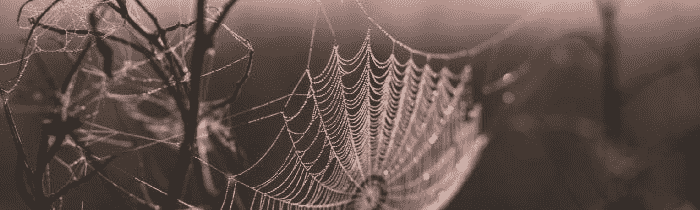

# 离合器操纵的哲学&恐慌-性能悖论

> 原文：<https://medium.datadriveninvestor.com/the-philosophy-of-clutch-maneuvering-the-panic-performance-paradox-fb28579d635?source=collection_archive---------22----------------------->

Photo by [Isiah Gibson](https://unsplash.com/@rawimg?utm_source=medium&utm_medium=referral) on [Unsplash](https://unsplash.com?utm_source=medium&utm_medium=referral)

## 第一部分:离合器操纵的哲学

性能本身是一个研究不足的概念。

自从我们迈出第一步或说出第一句话，我们就对一般的表演行为产生了某种倾向性，更重要的是，我们开始适应好的和坏的表演。

具有讽刺意味的是，我们经常表现出色的原因是因为我们习惯了糟糕的表现。事实上，我们通常倾向于真正擅长某些事情的唯一方式是通过低于平均水平的表现的重复行为，随着时间的推移而改进，并提高到杰出的执行状态。

 [## 成功人生的 25 种自我提升方式|数据驱动的投资者

### “我活得越久，学到的就越多。学的越多，体会的越多，知道的越少。”―米切尔·莱格兰德时间到…

www.datadriveninvestor.com](https://www.datadriveninvestor.com/2019/03/12/25-self-improvement-ways-for-a-successful-life/) 

然而，与所有这些交织在一起的是我们在即时时刻的表现能力，我们在一系列时刻的瞬间机动要求我们全力以赴，实现熟练与幸运、自信与坚定、勇敢面对的成功

这就是我想称之为离合器操纵的哲学。

> 在重重困境中，我没有退缩，也没有放声大哭；在机遇的当头棒喝下，我热血沸腾，但毫不屈服。
> —威廉·欧内斯特·亨利

我们看到有些人天生就有这方面的天赋，尽管他们也证明了这并不容易。无论我们看到的是像帕特里克·马默斯这样的超级碗 MVP 还是像约翰尼·柯克伦这样顽强的法律代表，看到有人在压力下完美无缺地执行，毫不费力地即兴创作出很少有人会相信是可能的结果，都令人着迷。

发展这种即兴而完美的表演技巧的唯一方法是，在同样沉浸在即时性和可怕后果中的情况下，预先失败无数次。因为这种成功和失败之间的来回往复是我们个人效能的关键所在——支撑我们如何设定自己失败或成功的公式。

换句话说，这就是生活——这就是在这些难得的决定性时刻，去冒险，去付出我们所拥有的一切。我们可能会很幸运，这可能会给我们提供一些动力，但我们都必须习惯于在坚持着陆之前舀水和翻筋斗。这就是奥运会的运作方式，这就是科学的运作方式，这就是投资的运作方式——这就是我们的工作方式。

为了将焦点转移到时刻本身——那些需要我们发挥关键作用的时刻——这些时刻充满了恐慌；恐慌本身是一个需要理解的有趣现象。

## 第二部分:恐慌-表现悖论

几乎每个人都有解决恐慌的方法，但没有人能完全摆脱它。无论是来自昨天的斯多葛派还是今天的技术专家，没有任何有效的解决方案能够超越正念的趋势，或者超越一次性的可以掌握但不能教授的个人。

因此，从这些个人身上，我们可以开始学习。从这些个体中可以得出一个明显的共同点，一个编织出恐慌问题的清晰答案的共同点:表现。

> “没有比逆境更好的了。每一次失败，每一次心碎，每一次失败，都包含着它自己的种子，它自己的教训，告诉你下次如何提高自己的表现。”
> 
> —马尔科姆·Ⅹ

具有讽刺意味的是，[表现不佳]往往是导致恐慌的首要原因，或者也许是我们对特定环境做出反应的需要。从这个角度来看，绩效是所有形式恐慌的原因和解决方案。

虽然简单得令人眼花缭乱，但这一想法值得进一步阐述，因为反焦虑或反压力运动产生了太多的噪音，这些运动试图培养追随者或出售解决方案，而实际上，这些解决方案无法像我们自己一样产生效果。

当我们知道一个确定的关键因素——性能时，我们努力确定一个有太多变量方程的公式。在这样做的时候，我们把水搅浑了，把一个相当简单的概念想得太复杂了:如果有任何恐慌，我们应该简单地执行。

我们每个人与生俱来的解决问题的能力，批判性思考的能力，以及用创造力或逻辑来处理复杂问题的能力，这些都是我们在人类时代的漫长岁月中形成的。我们知道这一点，但是我们的理解和实际运用它的意图有多清晰呢？

性能是我们能够解决恐慌并让它持续下去的唯一办法。一旦我们接受了这个观点，并排除了其他一切，我们就越容易理解这个等式的简单性。

> "如果你花太多时间想一件事，你永远也做不成。"
> 
> ——李小龙

因为这是一个不言而喻的事实，当我们的大脑受到任何形式的压力测试时，会有很多脂肪需要被去除。我们开始超载、过度计算和过度思考自己，要么被遗忘，要么陷入令人费解的安慰循环。

虽然这可能是自然的，但也不是完全必要的。

当我们面对任何引起恐慌的事件时，我们通常会采取这样或那样的行动。行动是什么并不重要，重要的是我们的表现。这样，我们就朝着解决问题迈出了第一步；然而，如果我们开始让我们的被动或主动反应机制超负荷，我们就有后退甚至跌倒的危险。

在有压力的时候，有很多东西开始流入大脑，把所有的东西混合在一起，形成一团自我挫败的判断或自我破坏的不安全感。假设我们在努力中失败了——我们可以让这种失败渗透到许多其他的自我实现中。

说我们只是表演；假设我们只是试着从错误中吸取教训，并把它当作一个成长的机会——假设我们做任何我们需要做的事情来解决它。这不仅是解决方案，也是一种新趋势的发展:在恐慌面前表演。

从那以后，失败就不那么痛苦了；至少不像从未尝试过那样痛苦，这种情况要糟糕得多。可以吸取教训，可以强化肌肉。

从一次简单的尝试——一次表演——的涟漪中，我们可以驾驭决心的波浪，在接下来的每次尝试中更加优雅。

[**继续阅读:永恒的回归——打破循环**](https://medium.com/datadriveninvestor/the-eternal-return-breaking-the-cycle-7ee183124d06)

“… that the first day should make the last, that the Tail of the Snake should return into its Mouth precisely at that time, and they should wind up upon the day of their nativity…”
- Sir Thomas Browne