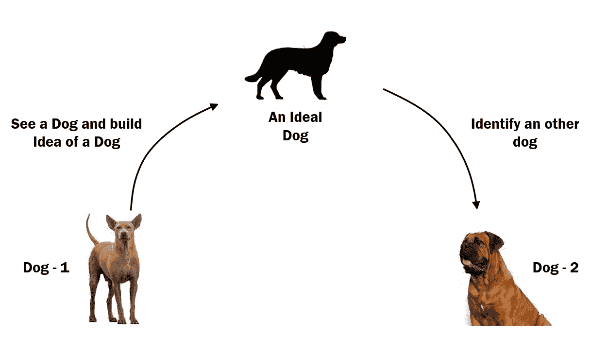

# 柏拉图连接(人工智能中的知识表示)

> 原文：<https://medium.datadriveninvestor.com/the-plato-connection-knowledge-representation-in-ai-44d59d323268?source=collection_archive---------10----------------------->

拉姆走近那座巨大的石头建筑；晚上的风很冷，他只穿了一件薄夹克。拉姆匆匆走进大学的主大厅，当他走过走廊，一次经过一根大柱子时，他开始回忆起他是如何享受努力工作进入大学的时光。大学是他所希望的一切，但事情不再一样了。他正在努力完成他的工作和任务，拉姆心想，也许学术的压力已经影响了我，我已经失去了我的运气。

Ram 关于人工智能中的知识表示的论文进度落后了，他的朋友说服他去见 Marko 教授，以获得一些见解。教授以其热情的个性和创新的方法而闻名；拉姆没有心情做激励性的演讲，但他还是决定去见教授，因为他对写论文不太感兴趣。

拉姆找到马尔科教授时，他正坐在一间空荡荡的大教室里看书。教授注意到了拉姆，热情地向他问好，晚上好，拉姆，放下手里的书，你的朋友告诉我你要来见我，我能帮你什么吗？拉姆注意到教授放下的书的标题是"哲学",他感到更不舒服，于是说:"坦白地说，我不知道你能如何帮助我，我现在正在赶写关于人工智能中知识表示的论文。"教授看着他说，那么你的论文完成了多少？拉姆沮丧地说，我甚至不能开始。教授笑着说，也许你找错了地方。拉姆抗议道:“我不认为我现在需要哲学。”他指着那本书。

 [## 我们需要的不仅仅是数据:创业公司如何驾驭人工智能|数据驱动的投资者

### 你打开手机，进行眼科检查，发现自己 3-5 年后患老年痴呆症的风险，即使你没有…

www.datadriveninvestor.com](https://www.datadriveninvestor.com/2020/07/19/we-need-a-lot-more-than-data-how-startups-can-harness-ai/) 

奇怪的是，恰恰相反，Ram 哲学可能会帮助你在论文上取得进展。Ram 需求如何如此？你对柏拉图提出的观点了解多少？Ram 几乎不同意，教授，我需要写一篇关于人工智能中知识表示的论文，而不是关于没有实际用途的想法。教授毫不气馁地说，柏拉图的思想可以被认为是人工智能中知识表示概念的关键。拉姆又有了兴趣，我不知道，请多告诉我一些。教授说他提出的一个关键观点如下:

教授，我不会假装我明白这一点，也不明白这一点如何能用于知识表达。

教授轻快地走向黑板，画了一张示意图。他指着图表说话，让我们了解一下世界模型，

有一个真实的世界，非常丰富和复杂，想象一个日出或站在交通信号上，这个世界如此丰富和复杂，以至于它不能被完全理解，但为了在这个复杂的世界中运行和导航，我们使用或感觉器官和感知来建立一个思想的世界，智能系统做一些非常类似的事情，它使用各种传感器来捕捉关于真实世界的信息，并创建一个真实世界的表示，我们可以称之为世界模型。

教授走到棋盘的另一边，画了另一张图，并说现在考虑这个更熟悉的人工智能系统的方块图。

Ref: Intelligent Systems , Architecture, Design and Control by Alexander M Meystel, James S. Albus

该系统通过在其支配下的传感器收集关于真实世界的各种信息，并处理这些信息以创建世界模型，该世界模型是真实世界在数字域中的表示，世界模型用于理解当前情况并生成行为以满足指定的目标，这些行为通过执行器、机器人、语音助手等在真实世界中被翻译。决策和行动的过程越能更好地代表世界模型。这给我们带来了人工智能系统中知识表示的重要性和动机。

拉姆现在开始明白马尔科教授是如何把他引向正确的方向的，拉姆热情地说，是的，我明白了一个人可以如何开始接近人工智能中的知识表示，但是柏拉图的联系是什么？

教授微笑着继续说，柏拉图是认识论(知识论)领域最早的贡献者之一，这可以被认为是我们今天在人工智能中的知识表示和知识管理的基础。

人工智能系统必须解决的首要问题之一是分类，想象我们正在设计一个自动驾驶系统，该系统现在必须能够区分道路和路边。对于初学者来说，如果它能够在它已经走过的路径上进行分类，这还不够好，但它必须能够在它从未走过的新路径上进行分类。

柏拉图探讨了人类通常是如何做到这一点的，比如说，我们教一个孩子认识一只狗，一旦这个孩子了解了这只狗，他就可以轻松地认识其他的狗，甚至是不同品种的狗。柏拉图说，人类之所以能做到这一点，是因为一旦他们了解了一只狗，他们就会在脑海中形成一个关于狗的形象，或者说是一个理想的狗的形象。每当一只新的狗经过时，它只是观念世界中理想形式的一个不完美的复制品，因此可以被识别(或归类)为一只狗。

这为我们如何设计和构建一个从数据集学习的人工智能系统提供了宝贵的见解，并可以对之前没有训练过的数据集执行类似的分类。知识表示是这一功能的核心。

Ram 现在完全同步，是的，教授。我看到这一切是如何增加的，所以认识论的理论是我们如何模拟人工智能系统的一些基础，以及知识表示或模型如何对这种智能系统至关重要。那么，我们该何去何从呢？

再次接手，柏拉图在这方面有两个额外的重要论断。他说，第一，他用一个数学例子证明了可操作的知识不是仅仅通过感官获得的，而是通过推理获得的，因此，即使两个人可能目睹了同一事件，并学习或得出不同的结论。这意味着我们离知识表示或世界建模的顶峰还很远，改变推理将创造不同的更好的模型，这些模型将产生更好的决策，因此人工智能的这个领域为更好的模型的更多探索和发展敞开了大门。

拉姆，哇，这太令人兴奋了，柏拉图的第二个论断是什么？

抓住这个时机，他做出的第二个重要论断是“如果细节必须有意义，就必须有普遍性”，让我来给你解释一下，如果一只狗必须被认为是狗，那么在观念的世界里就必须有一只理想的狗(或一只普遍性的狗)，没有这只理想的狗，人们可能无法认识或处理这只狗。让我们理解这个论点的深刻性，以及它对 AI 的影响。将未知归类到已知的模板中，以便我们能够做出适当的反应，这是人类关键的生存本能之一。想想看，我们如何能够轻松地将迎面而来的汽车或处于威胁中的公牛分类。我们可以通过概括来做到这一点，即能够将我在一次经历中学到的东西应用到一个新的情况中。这也是人工智能系统中广泛研究的一个主题，我们已经到了这样一个地步，我们有些相当聪明的系统可以解决特定的问题或缩小人工智能，在我们能够开发出真正广义的人工智能之前，还有很长的路要走，猜猜通往广义人工智能的道路通过知识表示和建模。

拉姆现在迫不及待地要走了，非常感谢你，教授。我非常感谢你在这里帮我，我觉得我的能量流回来，我都准备好了我的论文，并有所作为。

马尔科教授，拿起他的书，准备离开，我很高兴我能帮助你，拉姆，我很想看看你的论文，当你完成了。说着他笑着走进了大走廊。

**进入专家视角—** [**订阅 DDI 英特尔**](https://datadriveninvestor.com/ddi-intel)