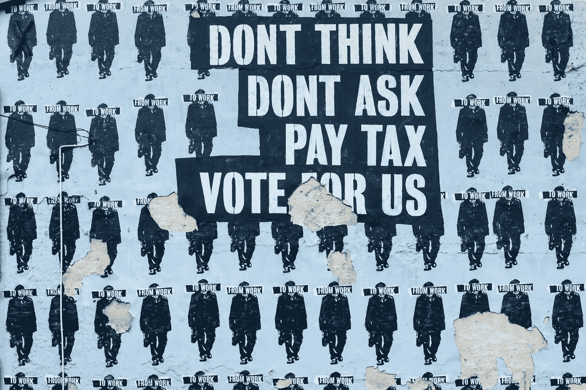

# 美国经济的政治文化

> 原文：<https://medium.datadriveninvestor.com/the-political-culture-of-the-american-economy-ea7db39f7213?source=collection_archive---------14----------------------->

## 胜利者、失败者和共同的妄想信念美国人有选择。

Photo by [Paweł Czerwiński](https://unsplash.com/@pawel_czerwinski?utm_source=unsplash&utm_medium=referral&utm_content=creditCopyText) on [Unsplash](https://unsplash.com/s/photos/political?utm_source=unsplash&utm_medium=referral&utm_content=creditCopyText)

美国人不知道美国之外还有一个世界，但是问问任何去过这个国家的人或者任何一个非美国人，他们会比大多数美国人更了解美国。美国电视频道是世界上收视率最高的电视剧，你不可能调低音量或忽视它的存在，然而美国人对这个世界几乎一无所知。加拿大人、阿根廷人、斯堪的纳维亚人、澳大利亚人、印度人、肯尼亚人，以及任何有电视或能上网的人都对美国人有一种反常的好奇心，以及对美国人看不见的正常文化行为的客观看法。为全球观众表演，美国已经失去了剧情，这个故事中的任何东西对任何人都没有意义；即使是美国人。

美国遭遇严重的[基本面归因错误](https://www.theguardian.com/us-news/2017/jul/05/us-inequality-poor-people-bad-choices-wealthy-bias)(FAE)；人们通过他们的行动和行为对他们的环境负责，而不考虑超出他们控制的外部影响。许多美国人认为，人们选择贫穷是因为他们懒惰和/或轻率地将工资花在不必要的奢侈品上，所有人都可以获得金融支持网络和/或摆脱债务负担的机会。美国的金融安全就像生活在离地面 300 英尺高的钢丝上一样稳定，没有任何安全网，如果财富没有代代相传，大多数年轻到中年的美国人就不会接受教育，拥有住房和工作关系。

美国梦的愿景是可以实现的，但只有在焦虑和抑郁最终让我们筋疲力尽、昏昏欲睡之后。一个在全国根深蒂固的信念，即每个人都有获得财富、繁荣、成功、机会的自由，并通过努力工作和牺牲来实现财务安全，是有史以来最伟大的扯淡故事。唐纳德·特朗普、老乔治和乔治·w·布什、南希·佩洛西、米奇·麦康奈尔以及无数其他出生或结婚致富的百万富翁和亿万富翁，都没有像数百万出生在没有财富的家庭的美国人那样牺牲或努力工作。繁荣是通过继承、婚姻和纯粹的运气实现的，而通过努力工作获得的停滞不前的工资仅够支付生活费用。

 [## 解决美国问题可能很容易|数据驱动的投资者

### 美国人在选举中出现了比以前更大的分歧。民主党和共和党都声称对方…

www.datadriveninvestor.com](https://www.datadriveninvestor.com/2020/11/19/fixing-american-problems-could-be-easy/) 

认为任何一个美国人都可以通过努力工作获得和伊万卡·特朗普一样多的财富，这完全是痴心妄想。工作的美国人牺牲了饮食、睡眠、家庭、健康、教育、社区和住房；获得经济保障需要付出多大的牺牲？所有美国人都有获得成功的平等机会，但贫穷的美国人选择了财务不安全，而其他人选择了不安全，这是一种应对机制，因为如果我们知道我们每个人都有多接近落后，我们就不会在晚上睡觉。维系经济的基础设施是用下沉地基上的稻草建造的，然而全民医疗和付费教育在巴西和阿根廷等国家是可行的，但美国不能/不会为其公民提供。

有多少美国人得到过父母的帮助，他们的父母需要父母的帮助吗？如果美国梦不仅仅是一个幻想，那么就不需要来自家庭的经济支持，而数百万没有父母经济支持的美国人，他们应该做些什么呢？如果他们从银行借钱，因为高等教育的理由声称大学学位能提供更好的工作机会和生计，他们进入劳动力市场时，债务和工资已经 40 年没有增加了。难怪学生们无法还清贷款，学生们没有责怪政府和银行，而是被认为愚蠢地试图改善他们的社会经济状况。不管你做不做。

纳税人认为他们的钱是政府拿着零钱包在街上乞讨时获得的，预算仅限于收集的硬币数量，但他们想要的不是来自税收的钱，而是美国人用于生产的时间。万亿美元的医改法案并非来自未雨绸缪的储蓄罐。财政部数字化地创造了这些钱，这不是他们最近发现的一些新奇的做法。他们已经这样做了几十年，但政治运动利用赤字来吓唬美国人，让他们相信如果他们不投票给财政负责任的政党，国家就会破产，但两党都在玩同样的财政游戏。坦率地说，政府一直在误导美国人，让我们彼此对立，利用替罪羊，比如无证移民在窃取工作，福利领取者在揩油。

美国人不是为政府政策投票，而是为他们认同的候选人投票，选举由单一问题的道德价值观决定。真是个骗局。道德总是不同的，核心价值观的多样性无法团结一个数百万人的国家，更不用说几个人了。90%的美国人都是工薪阶层，但通过工资积累财富的情况自 70 年代以来就没有出现过。尽管 GDP 一直在稳步增长，但对其增长做出贡献的不是工薪阶层，而是少数资产所有者。更简单地说，10%的富人对 GDP 的增长负有责任，而 90%的美国劳动力既没有获得财富，也没有为国家的繁荣做出贡献。我们没有意识到巨大的财富转移正呈指数增长，而 90%的美国人无论是左派、右派还是中间派都是输家，而是在争论不可调和的道德差异。

> 美国的经济不平等比任何一个帝国都要严重，财富的不平等严重影响着社会和政治力量的不平衡。当人们感到无能为力时，他们会在任何能找到权力的地方寻求权力。

左派和右派受到寡头政治的剥削，而政府则协助剥削。煽动两极分化作为挑起内斗的机制分散了美国人的注意力，因为他们在光天化日之下被抢劫。拜登团结国家的承诺是浪费时间，因为统一国家的道德认同是不可能的。美国人同意一些基本问题，但几十年来没有一个政府解决任何真正有价值的问题，声称种族主义是特朗普 7000 万张选票的原因，是一种逃避。除了种族主义之外，还有很多其他原因要归咎于此，如果美国人不搞清楚这一点，就会出现另一个特朗普。

**访问专家视图—** [**订阅 DDI 英特尔**](https://datadriveninvestor.com/ddi-intel)