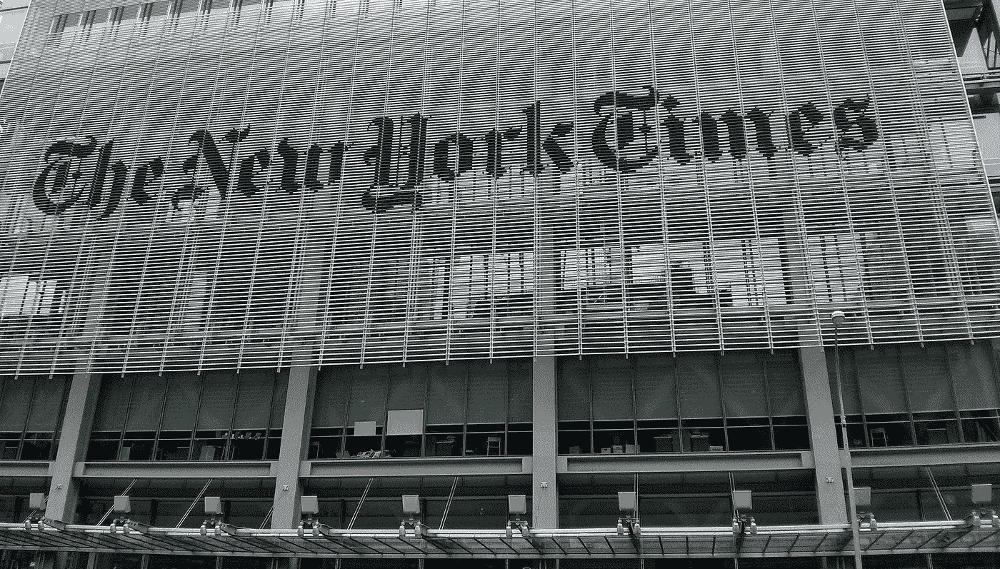
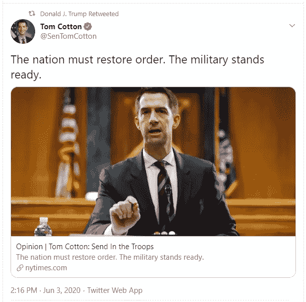

# 政治辩论还没有

> 原文：<https://medium.datadriveninvestor.com/the-political-debate-that-has-not-been-fdb8e699c308?source=collection_archive---------9----------------------->

Image by [tacskooo](https://pixabay.com/users/tacskooo-3660772/) from [Pixabay](https://pixabay.com/photos/new-york-times-editorial-1789976/)

《纽约时报》 于 2020 年 6 月 3 日在网上发布了阿肯色州参议员汤姆·科顿的[专栏](https://www.nytimes.com/2020/06/03/opinion/tom-cotton-protests-military.html)后，受到了很多关注。对于那些不合拍的人来说，纽约时报有很强的自由主义倾向。如果它写的是特朗普总统，一位专栏作家可能会称他为“[疯子和腐败分子](https://www.nytimes.com/2020/06/04/opinion/tom-cotton-op-ed-new-york-times.html)”参议员科顿是特朗普总统的热情支持者之一，他经常与总统讨论，有传言说，他正在考虑在 2024 年竞选最高职位。

有人可能会说，一个有影响力的政治家为那家大报写专栏没什么特别的。2020 年的美国没有。

由《泰晤士报》撰写的他的专栏的标题宣称:“派遣军队”字幕补充道:“国家必须恢复秩序。军方已做好准备。”在专栏中，参议员科顿列举了一些例子，表明“这些暴徒如果不被制服，不仅会破坏守法公民的生计，还会夺走更多无辜的生命。”然后，他带来了历史先例来支持他的观点，即使用军队符合我们的法律和传统。《国家评论》的 Rich Lowry 与参议员 Cotton 办公室的工作人员交谈,《T21 》,发现《纽约时报》的编辑们煞费苦心地核对了所有的事实。他们要求在参议员科顿的声明可能引起争议的所有情况下建立联系。东部时间下午 2 点左右，他们在纽约时报网站上发布了这个专栏。特朗普总统几分钟后转发了这条消息。

在 6 月 5 日添加的一篇没有署名的社论中，我们可以读到“这篇文章遭到了许多读者(和许多同事)的强烈批评。”那张纸条至少是令人困惑的。它通过声明“这篇文章不符合我们的标准，不应该发表”，点燃了政治正确性教堂中的一根蜡烛，并点燃了客观性概念的另一根蜡烛，因为:“参议员科顿提出的基本论点——无论人们可能会觉得它们有多么令人反感——代表了当前辩论中有新闻价值的一部分。”《纽约时报》没有进行辩论。

6 月 4 日，*纽约时报*发表了米歇尔·戈德堡的[专栏](https://www.nytimes.com/2020/06/04/opinion/tom-cotton-op-ed-new-york-times.html)，米歇尔·戈德堡是一位初级专栏作家。那里的著名专栏作家没有一个触及这个话题。戈德堡女士对参议员汤姆·科顿的专栏不屑一顾，称其为“长篇大论”，并揭露其发表“在《纽约时报》内部引起了反叛”她是那个称特朗普总统“疯狂且正在腐烂”的人。更重要的是，她的专栏和社论都没有对参议员汤姆·科顿动用军队的想法进行批评。

军队的目的是在解决无法和平解决的问题时尽可能多地杀死敌人。因此，在被认真考虑之前，参议员汤姆·科顿需要回答几个基本问题。我们能和平地停止暴乱吗？与其匆忙使用“压倒性的武力驱散”暴乱，难道不值得首先找出人们为什么要暴乱吗？毕竟，抢劫商店的人是我们的同胞，而不是国家的公开敌人。从参议员科顿那里了解他对为什么美国公民在美国城市焚烧美国建筑的看法难道不有趣吗？《纽约时报》的记者们没有人想过问参议员汤姆·科顿这些问题来回应他的专栏。

然后，让我们假设参议员科顿有他的方式，我们部署军队。有多少美国人需要被穿着制服的同胞杀死才能阻止暴乱？我会向参议员汤姆·科顿要一个数字；是 10，100，1000，还是更多？如果让军队走上街头会激怒现在只在电视上观看抗议活动的和平人士，那该怎么办？如果不是数千人，而是数百万美国人加入抗议活动会怎样？如果那些仍然拿着 AK47s 的人加入抗议活动，并发出一个简单的信息，即只要第一枪打响，他们就开始向士兵开枪，会怎么样？这不是一个反问句；我想让参议员汤姆·科顿告诉我他的战略计划是什么，以防公民的抵抗。

Image by [RJA1988](https://pixabay.com/users/rja1988-5385704/) from [Pixabay](https://pixabay.com/photos/george-floyd-riot-dallas-protests-5244322/)

我可以理解《纽约时报》的编辑们没有考虑到这种可能性，因为这将使更加严格的枪支管制的论点无效。美国公民需要他们的军用武器只是为了阻止像参议员汤姆·科顿和总统特朗普这样的人利用美国士兵反对美国人民。我们发现[我们差点错过了](https://www.yahoo.com/news/trump-wanted-deploy-10-000-100326276.html)，这要感谢川普政府中一些勇敢的人。

参议员汤姆·科顿也需要告诉我们，如果许多上街阻止“暴力狂欢”的士兵越过警戒线加入抗议者，他的计划是什么。他们为什么要向他们的父亲、兄弟或邻居开枪？参议员汤姆·科顿会怎么做？

在 9/11 之后政治家们如何使用我们的军队的背景下，这些都是合理的问题。在阿富汗和伊拉克之间，我们有大约 6700 名[美国人死亡](https://www.defense.gov/casualty.pdf)和 52000 人受伤，我们的经济损失大约为 6.4 万亿美元。我们取得了什么成就？我们现在与塔利班谈判，而不是在 2001 年那样做。2003 年，伊拉克是最世俗的阿拉伯国家，有着强烈的亲美情绪。萨达姆政权已奄奄一息。如果我们结束了制裁，伊拉克将有公平的机会加快经济发展，这将削弱伊朗的反美派。该地区的许多国家本可以更加繁荣，在这个过程中丰富我们的生活。与此同时，中国摆脱了战争的压力，发展速度比我们快得多。政客们，比如参议员汤姆·科顿，没有从这次痛苦的经历中吸取任何教训。我的推理哪里出错了，科顿议员？

为了便于讨论，让我们假设参议员科顿知道一些我们不知道的事情，并且军队的部署将会很快结束动乱。这会消除暴力爆发的原因吗？如果引起轩然大波的不满只是被压制，然后它们又会开始在全国范围内冒出来，那会怎么样？我们需要每个周末派士兵去不同的地方吗？如果我们达到这样的水平，为了和平，我们需要两个士兵 24/7 支持一半的美国人？

此外，参议员科顿提出了一个有效的论点，即一些媒体专家认为暴乱是合理的；他提供了一个链接，链接到 CNN 的克里斯·科莫。我同意我们应该提醒公众暴徒抢劫和焚烧他们需要的商店。最终，他们将遭受不便和重建费用。但是参议员科顿并没有写这样一篇专栏文章。对他来说，暴力是解决问题的唯一方法。因此，细心的读者可以从他的专栏中得出结论，用不了多久，参议员汤姆·科顿就会主张军方接管 CNN。一个人需要盲目天真地相信他不是在鼓吹戒严令，而他否认戒严令。如果有机会，他会让美国走上大约一百年前 T2 走过的路。

阅读社论笔记和米歇尔·戈德堡的专栏，人们可以感觉到，詹姆斯·班纳特，现在的前社论版编辑，意识到参议员汤姆·科顿的专栏将揭露他作为暴君的心态。事与愿违，因为《T4》《纽约时报》的新闻标准不允许展示支持专制的观点。

《纽约时报》的编辑们组成了一个回音室，那里只允许崇高的想法；这些有问题的想法可能最多是带着厌恶被提及，因为不值得有尊严的回应。戈德堡用这种语气写下了她对参议员科顿专栏的回应。其结果是，一方面，我们对错误的原因进行了有据可查的连贯推理。另一方面，我们用轻蔑的语气和琐碎的争论来回避核心问题。参议员汤姆·科顿看起来像一个政治家，而《泰晤士报》的编辑和作家听起来像还没有生活在现实世界中的高尚的高中生。

米歇尔·戈德堡(Michelle Goldberg)在《纽约时报》上解释标准时举了一个例子，称“特朗普高级助手斯蒂芬·米勒(Stephen Miller)关于遏制非白人移民必要性的一篇文章”不太可能发表，因为“听取各方意见的自由主义倾向会与纯粹的道德憎恶相抵触。”这意味着对于《纽约时报》的象牙塔编辑来说，如果道德上令人憎恶的东西没有在那里刊登，它就不存在。

他们还没有注意到，大约一半的美国人支持由斯蒂芬·米勒(Stephen Miller)制定的特朗普移民政策。他的反移民立场帮助唐纳德·特朗普在 2016 年获胜，并让他有机会在 2020 年再次获胜。是编辑们的错，包括《T2》、《纽约时报》的编辑们，我们才有了现任总统。停止对获得大众支持的道德厌恶的唯一方法是让其倡导者参与辩论。这是通过允许邪恶的支持者说出他们的想法。然后，一个人需要有智力潜力来粉碎对手的论点。*《纽约时报》*似乎和唐纳德·川普有资格成为总统一样有资格这么做。需要这两个人去跳探戈，才能把我们的国家带到现在的位置。

*原载于 2020 年 6 月 8 日 https://www.datadriveninvestor.com**[*。*](https://www.datadriveninvestor.com/2020/06/08/the-political-debate-that-has-not-been/)*