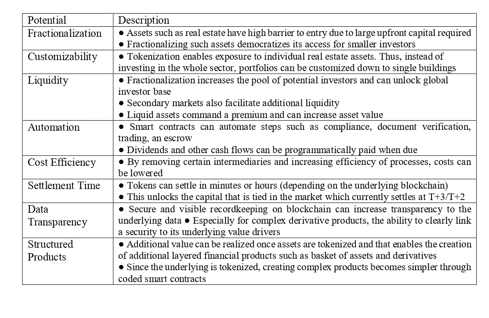

# Proptech 化的区块链未来

> 原文：<https://medium.datadriveninvestor.com/the-possible-blockchain-future-in-proptech-tokenization-53d809ee00f8?source=collection_archive---------3----------------------->

如果房地产代币化变得流行，几种创新将成为可能，包括结构化金融、混合房地产 [*代币*](https://blog.coincodecap.com/tag/token) *，以及数字基金交易所。*

## ***地点和方式***

不可避免地，由于可能的机会，关于房地产标记化的媒体标题集中在单个资产的数字细分的潜力上。出于多种原因，这种关注可能会被误导。专家们对债务和(尤其是)资金的令牌化前景更有信心。但也可能有更多创造性的可能性。

有人猜测，通过令牌化技术，可以创建杠杆多头和杠杆空头。所有这些概念在房地产上都是可能的。是的，会有一些赌博在进行，但有趣的是，如果某人是一名房地产开发商，他只是将巨额资金投入曼哈顿，他就可以非常便宜和有效地对冲他的头寸”。另一种观点是，房地产市场将在未来几年发生重大变化，变化主要由数字技术驱动，如区块链、人工智能和物联网(IOT)，这些技术将改变房地产资产的生命周期。这种观点设想了新的房地产融资方式，作为传统投资模式的替代。在过去的几年里，我们看到数字技术改变了许多行业。直到最近，房地产相对没有受到影响。有了这种能力，我们现在必须以低成本和大规模的方式实施数字技术，如 IOT、大数据和人工智能，Proptech 已成为一个新的市场可能性，将带来重大变化。任何财产，无论是商业还是住宅，现在都可以变得“活”起来，能够收集可用于许多方面的数据，尤其是测量和跟踪任何资产及其可交易价值的每个方面。资产可以产生的数据包括:

测量它的能源足迹，

照明和加热的性能，

以及(通过传感器)建筑物中人的移动。

通过符号化，这些和许多其他因素将转化为估价，以及房地产将如何使用。随着房地产令牌化实现规模化，智能合约中协调的去中心化结构性金融和结构性产品将会盛行。

如果总结房地产标记化的好处，我们可以包括结构产品。信息、付款和投票请求可以通过所有代币持有者的区块链地址同时传送给他们。投资者只需购买特定于房地产的代币，就能实现更大的多样化和可定制性。发行者可以为与房地产投资相关的不同资产(土地所有权、使用权、基础设施、租赁现金流等)创建不同的代币。发行者也可以在每种类型的令牌内创建不同的类别；例如，固定租赁付款的代币和商业租赁可变部分的代币。支付瀑布可以硬编码到智能合同中，在创建时提供一层透明度，并在每次支付时提供合规性和验证。

围绕房地产令牌化的另一个全新宣传是单一资产交换(IPSX)。该工具似乎是一项旨在实现单一资产股票的传统、非令牌化市场的举措。它比符号化更有优势，因为在一个创造性的、熟悉的、受监管的解决方案中已经有了相当大的沉没成本，而无需跳入未知的区块链世界。然而，其他反对意见(特别是缺乏明显的需求和定价不确定性)仍然存在。仍有机会将这一主张转变为所有者的融资工具，例如通过出售收入条，从而成为开发结构性金融产品的一种手段。将这种工具进一步发展到令牌化世界也是有意义的——发展令牌化证券(代表 IPSX 上市的单一资产房地产公司的 IPSX 股票的数字令牌),一如既往地受到对细分的单一房地产资产或(更好的)单一资产和基金投资组合的需求的证据的影响。

此外，我们还将数字基金交易所视为创造可扩展的下一代 B2B 房地产投资平台的机会，该平台具有更高的流动性和交易效率。Digital Fund Exchange 的目标是通过更低的成本结构和更高的基金单位流动性，使投资者更容易获得流动性较低的资产类别基金，如房地产和另类资产，这在一定程度上是通过使用数字总账技术作为主要的基金登记册实现的。专业人士正在寻求将现有行业基金结构转变为数字交易基金。这个生态系统将把投资经理和投资者聚集在一起，发行新的数字基金，并在一个由私人分布式账本技术连接的基金行业网络中开发一级和二级市场。透明和公平的价格匹配拍卖算法的应用提供了一种新的方法来利用现有的投资者网络而无需做市商来提供基金单位流动性。专家们认为，数字交易基金持有流动性较低的另类投资有着广泛的机会。在房地产领域，数字基金可以涵盖英国/欧盟/美国/亚洲开放式房地产基金；非上市房地产投资信托基金；贷款和房地产债务基金；和房地产私募股权工具。管理人员和投资者从数字交易基金中获得的好处包括接近实时的结算、在具有不同风险因素的工具之间接近即时的重新分配、保持匿名性、提高流动性、对批准方的活动进行接近实时的审计跟踪，以及显著节省运营和投资者报告成本。

## ***混合令牌***

一些专家对单一资产数字化细分的潜力表示怀疑。出于各种原因，对该应用程序的关注可能会导致资源的错误分配和对令牌化的负面宣传。公开的观点是，市场对债务和(尤其是)资金的令牌化前景更有信心。但也可能有更多创造性的可能性。混合令牌结合了安全性和实用性，在某些情况下也有很好的应用前景。在住宅领域，部分投资有一定的势头，提供半实用、半安全的代币，作为未来共享所有权计划可能发展的方式。此外，包括酒店、酒吧、酒吧、餐馆、咖啡店在内的社区设施也通过原型混合代币筹集了资金。例如，Hotel Chocolat 通过提供以巧克力支付的股息来筹集资金。就像一个有趣的例子，但是非常明显。有越来越多的观点支持房地产令牌化的破坏效应以及随之而来的创新机会。哪些标记化格式将最受欢迎？在不久的将来，我们希望得到答案。

## ***短期结论***

显而易见，标记化正处于发展的早期阶段，房地产应用程序需要时间来开发和被接受。为了判断房地产令牌化的可能前景，我们需要平衡创造的优势和可能产生的有效需求与产生的成本。道理在经济学。在实践中会给市场参与者带来什么好处？这个价值会超过成本吗？如果只关注单一资产的数字细分，创新显然有可能会倒退数年甚至数十年，因为这方面的需求有限，经济效益难以令人信服，障碍重重。

## ***标记化带来了什么？***

在实践中会给市场参与者带来什么好处？他们对这些优势的重视程度如何？这个价值会超过成本吗？建立一个高效的令牌化平台需要哪些资金投入？与传统的细分相比，运行和交易成本是多少？对产品有什么需求，是否有足够的交易速度来分摊开发成本？所有这些问题仍然没有确切的答案，但前进的方向是明确的。也许在理想世界中，记号化可能会避开规则；避税(尤其是英国的印花税土地税)；降低费用，实现脱媒；加快交易速度；避免公开信息；发挥区块链的效率；并启用加密货币交易。从专家的观点来看，很明显，这些收益中只有三个(速度、隐私、区块链)有通过令牌化引入的现实机会。令牌化的经济效益很大程度上取决于正在开发的应用程序。房地产令牌化的流行概念和近期的现实愿景之间的关键不匹配是，通常描绘的单一房地产资产被散户投资者令牌化的画面，而这不太可能聚集显著的势头。我们将进一步指出在单一资产令牌化上投资过多的危险，这似乎是最大的市场机会，但也是最具挑战性的。最好是投资于区块链支持的解决方案，以实现具有经济优势、需求得到证实的创新，而不是冒着因错误应用而削弱技术吸引力的风险。无论市场参与者从提供的证据中得出什么样的观点，很明显，房地产标记化市场正处于初始阶段。有许多忠实的追随者和几个例子显示了该技术的潜力。为了更快地发展，市场需要更广泛地采用和理解这些新产品的优势和挑战，并持续监控和报告新的发展。

***表。房地产证券化可能带来的明显利润***

## ***安全令牌帮助房地产令牌化***

在不久的将来，针对单一资产的安全令牌不会在足够大的规模上获得成功。除非 IPSX 在 2020 年起飞，否则试图创造单一资产细分的历史一直是负面的，需求证据有限。真正的问题(现货、PINCS 和 SAPCos)是缺乏这类证券的市场。只有了解房地产及其弱点的投资者才会感兴趣，对他们来说，直接所有权是自然的选择。押注于房地产的传统股票投资者坚持投资大型上市房地产公司，因为它们有良好的管理记录。对散户投资者来说，支持和反对单一资产令牌化的一些明显事实(根据麻省理工学院数字货币倡议，2019 年):

## 的事实

投资者可能对他们经常光顾的建筑有自下而上的了解；对部分所有权的需求将代表个人投资于他们熟知的房产的一种方式。

人口结构的变化和人口老龄化将推动散户投资者对这些创收型替代投资的需求。

提供单一资产的部分所有权，有助于散户投资者清楚地了解他们投资的是什么，并要求更低成本的披露。

一些监管机构(例如在英国)更愿意接受散户投资者拥有单幢建筑的部分股份，因为它们有明确的投资价值和披露要求(与房地产投资信托基金的投资相反，房地产投资信托基金的功能往往超出纯粹的房地产资产所有权，因此其价值驱动因素更难理解)。

## 反对的事实:

需求可能并不强劲，尤其是如果散户投资者对众筹房地产基金的需求不足是一个迹象的话；对标志性建筑所有权的需求可能是个例外。

由于市场规模较小，单幢建筑的股票可能会出现低流动性和高非流动性溢价。

散户投资者通常缺乏正确评估房地产投资的技能，即使他们可以获得必要的数据(相关数据可能很难获得)。

我们会添加另外几个负面因素。首先，正如上文所指出的，当散户投资者通常缺乏正确评估房地产投资的技能时，单一资产表现不佳的风险表明，投资者应该通过投资于多元化的房地产投资信托基金或由专业基金经理管理的基金来获得更好的服务。

其次，资产要么需要在允许许多所有者的管辖区内进行令牌化，然后需要就复杂的控制和管理问题达成一致并最终实现标准化；或者有必要建立一个昂贵的中间所有权结构(一个公司、合伙企业或信托，对其控制和管理问题进行标准化和理解)。

一级市场和二级市场的区别也很重要。令牌化的大部分开发成本将由一级市场承担，但许多优势可能会通过二级市场流动性来实现，除非所有者可以预期看到一级市场定价中包含流动性溢价。

## ***房地产中的公用事业或混合代币***

公用令牌具有广泛短期采用的良好前景。对于对空间使用、能量使用和诸如食物和饮料的消耗品使用进行记录和收费的高效的基于令牌的系统的可能有效需求肯定会很高。这是作为智能建筑通行证的预付费信用卡的自然延伸，也是灵活使用空间的枢纽模式的自然延伸。成本不太可能很高，产生的开发成本将分摊到非常多的交易中。此外，结合了效用(空间的使用)和回报(收入和/或资本)的混合代币有着光明的前景。例子包括细分的私人住宅，其中租/买混合结构部分通过混合代币融资，以及社区设施。

## ***债务证券化和转股***

债务市场是证券令牌化领域的一个重点领域，包括商业房地产的债务市场。基于区块链的智能合同可以标准化数据格式，并大幅降低偿债的管理成本。这将为房地产资产支持证券估值提供更容易获取的信息。这是一个充满希望的领域。

## ***代金券***

对于标记化来说，这应该是一个轻松的胜利。中间法律结构已经建立并得到充分理解。这已经是一个细分的市场，一级发行和二级交易都有长期的需求记录。基金很可能会受到监管，就像任何证券都必须受到监管一样。传统初级资本筹集的成本非常高，在经理人费用占投资者回报的比例很高的时候，令牌化是一种节省成本的方式。需要更多地关注这一明显的机会；如果对该产品的需求得到证实，大型单一资产的令牌化市场可能会随之出现。

## ***代替了***

单一资产令牌化的支持者面临的挑战是，必须同时接受两种激进的发展。首先，需要对单一房地产资产的细分有明确的需求。这方面的证据充其量是粗略的，无论是历史上还是当前时期。其次，市场参与者需要熟悉区块链，这是令牌化的数字基础。与此相关的是细分和标记化的成本。在许多土地市场，分割需要建立一个中间结构，因为土地的直接所有权不能分成许多部分。即使不是这种情况，也需要就细分资产的控制达成协议。为了确定性和风险控制，更不用说监管合规性，复制已被证明可以管理细分投资的现有结构是有意义的。在全球范围内，这些似乎是有限公司或有限责任公司，合伙企业，信托或专门的合同制度。

我们可以建议债务契约如何也适用于令牌化。银行和其他机构对控制债务投资的合同结构进行了合理的标准化，不同的结构证明了对这些资产细分的明确需求(即使只是作为创建多样化资产池的垫脚石)。

已经在基金结构中持有的较大资产(帝国大厦和其他资产)很可能会被成功地令牌化；也可能存在社会影响或社区资产的替代市场，其中投资监管和风险/回报不是行为的主要驱动因素。总之，记号化为房地产投资市场提供了令人兴奋的可能性。然而，它还处于发展的早期阶段，房地产应用程序需要时间来开发和被接受。

如果只关注单一资产的数字细分，创新显然有可能会倒退几年甚至几十年，因为这方面的需求有限，经济效益难以令人信服，而且障碍重重。资金和债务提供了直接的机会来建立令牌化的房地产应用程序的可信度；针对建筑用户的公用设施代币和针对住宅共有和社区资产的混合代币可能会紧随其后；随着时间的推移，可能会有一些成功的奖杯资产令牌化。然而，单一商业房地产资产细分的大众市场可能还有很长的路要走。

加入聊天—[https://t.me/joinchat/AAAAAE84vCXg5PK-VpHADg](https://t.me/joinchat/AAAAAE84vCXg5PK-VpHADg)

**谢尔盖·戈卢别夫**

**Crynet 营销解决方案、欧盟结构基金、ICO/STO/IEO 项目、NGO &投资项目、项目管理、业务综合支持**

> [在您的收件箱中直接获得最佳软件交易](https://coincodecap.com?utm_source=coinmonks)

