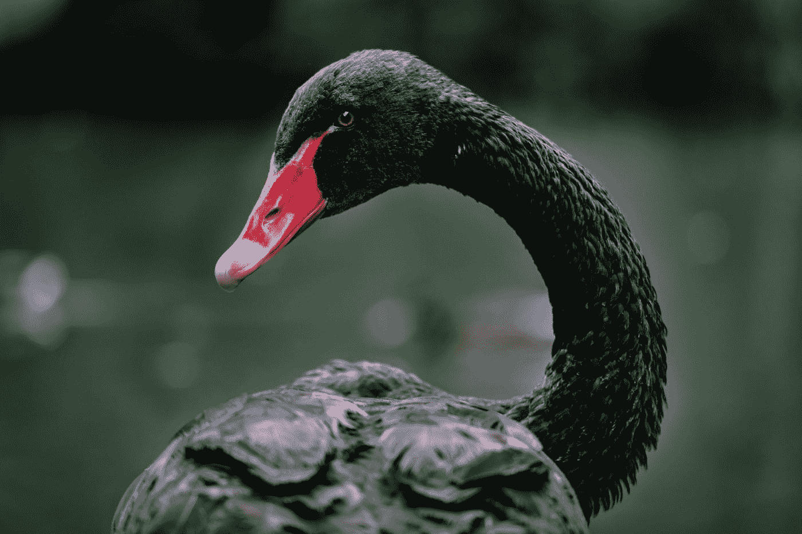
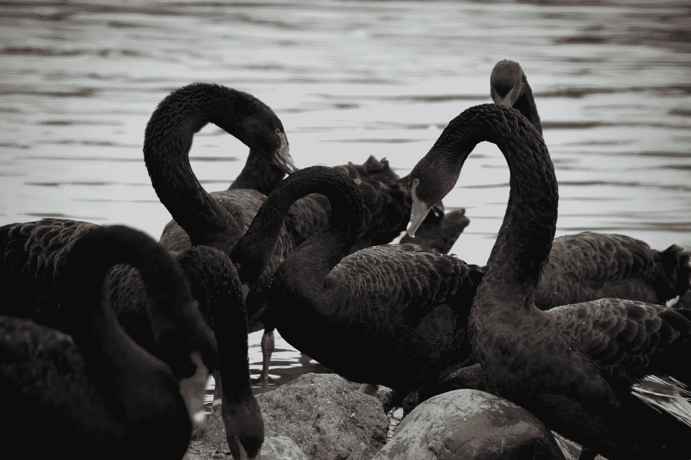

# 后新冠肺炎时代的商业世界——第一部分:概述

> 原文：<https://medium.datadriveninvestor.com/the-post-covid-19-business-world-part-1-overview-84e2a85d448e?source=collection_archive---------6----------------------->

## 调查流行病学黑天鹅事件后环境的变化

Photo by [Paweł Czerwiński](https://unsplash.com/@pawel_czerwinski?utm_source=medium&utm_medium=referral) on [Unsplash](https://unsplash.com?utm_source=medium&utm_medium=referral)

我们今天都生活在历史无疑将视为分水岭的事件中。是的，[新冠肺炎/冠状病毒](https://www.who.int/emergencies/diseases/novel-coronavirus-2019)疫情正在全世界和美国本土造成可怕的损失。可悲的是，关于有多少人将被感染和多少人将死于这场疾病爆发的预测每天都在变得更糟。2020 年，我们所有人都悲哀地想起，正如伟大的音乐哲学家[耶稣·琼斯](https://www.jesusjones.com)唱的关于柏林墙的倒塌和共产主义的终结的，是的，“T8 世界可能在眨眼之间改变……”

Photo by [Yuting Liu](https://unsplash.com/@yutinghuhu?utm_source=medium&utm_medium=referral) on [Unsplash](https://unsplash.com?utm_source=medium&utm_medium=referral)

# 新冠肺炎的黑天鹅

在商业领域，我们多年来一直在谈论所谓的“黑天鹅”事件。如 *Investopedia* 中所定义，这些是:

*黑天鹅是一种不可预测的事件，超出了正常情况下的预期，并具有潜在的严重后果。黑天鹅事件的特点是极其罕见，影响严重，而且人们普遍认为事后才明白。*

 [## 2020 年最佳短期投资选择精选资源|数据驱动型投资者

### 投资是增加你净财富的一个好方法。如果你通过遵循一个严格的…

www.datadriveninvestor.com](https://www.datadriveninvestor.com/2020/03/28/handpicked-resources-for-the-best-short-term-investment-options-of-2020/) 

虽然对新冠肺炎疫情的“事后检讨”以及世界各级政府对这一事件的反应至少应该是“有趣的”，但对这一疫情的这种审查将有几个月甚至几年的时间。然而，可以肯定地说，当前的疫情肯定会成为最大的黑天鹅事件，因为金融教授和思想家纳西姆·尼古拉斯·塔勒布在 10 多年前在他 2007 年的书《黑天鹅》中把这个概念从自然世界引入了金融/商业领域。这是及时的，因为这本书和这个概念是在 2008 年金融危机之前曝光的——我们认为这将是本世纪最大的黑天鹅事件——直到现在。

[洛杉机时报](https://www.latimes.com/)专栏作家[维多利亚·金](https://www.latimes.com/people/victoria-kim)最近[写道](https://www.latimes.com/world-nation/story/2020-03-27/will-the-coronavirus-make-permanent-our-already-diminishing-need-for-human-interaction)冠状病毒疫情给我们呈现了现代史上一个独特的事件，观察到:

这是一项规模空前的社会实验。当我们从彼此几周或几个月的距离中走出来时，我们会渴望并享受人类的接触吗，或者意识到没有它我们可以生活得多么舒适？那会对我们有什么影响？…新型冠状病毒甚至给最短暂的互动增加了危险感，改变了我们日常生活中的微小风险收益计算。与店员的那次交流、地铁上的那次擦肩而过、乘电梯会成为隐形病毒入侵的决定性时刻吗？

是的，新冠肺炎疫情就是黑天鹅事件的定义。现在，你如何，你应该，你必须在你的特定行业中，利用你所拥有的资源，是的，利用你的局限性，做出反应？

Photo by [Drew Beamer](https://unsplash.com/@drew_beamer?utm_source=medium&utm_medium=referral) on [Unsplash](https://unsplash.com?utm_source=medium&utm_medium=referral)

# 在后疫情时代，管理层必须做些什么

无论是一个月还是几个月——或者希望不会更久— *,都会有一个“后疫情时代”的商业环境。在世界各地，从最大的零售公司到当地的社区餐馆，经理们将试图在后新冠肺炎时代导航。毫无疑问，这将是一个改变了的商业环境。这就是为什么这一系列文章将试图解决一个核心问题:为了让公司在后冠状病毒时代生存甚至繁荣，我们在疫情之前在商业中做的哪些事情必须改变——并且迅速改变？各种类型、各种规模的公司需要解决的问题太多了，而且要尽快解决，而且是一蹴而就！*

因此，在这一系列文章中，我们将研究企业必须如何迅速改变他们的思维，以及在许多情况下，他们的运营，以应对在这次黑天鹅事件后发生了很大变化的消费者群。我们将着眼于各种行业，从零售、餐饮和酒店到银行和金融服务，甚至包括制造和分销。我们将看到，在所有公司中，无论大小，都需要适应不断变化的消费者预期，并重新思考他们在 2020 年 3 月之前的许多运营方式，以在后冠状病毒竞争格局中吸引和留住客户。我们将着眼于必须做出的技术和非技术变革，这些变革将在今天做出，以便更好地为疫情之后发生巨大变化的消费者服务。

简而言之，我们认为，在这个快速变化的时代，稍微修改一下[的经典谚语](https://www.legit.ng/1134389-is-phrase-cleanliness-godliness-bible.html)，在后新冠肺炎时代的商业世界中，“清洁*将成为*仅次于虔诚”——无论是在宏观层面，还是在微观层面。一旦冠状病毒的最初威胁消失，目前对细菌安全和清洁/卫生以及社会距离的高度关注不会在一夜之间消失。事实上，很有可能所有类型和规模的企业都需要进行持久的实质性变革，以服务于在疫情之后更加关注健康的消费者，也就是我们所说的几乎“恐菌症”的消费者。

我们很可能会看到一股人们“回归正常”的热潮，去购物，去外面吃饭，去住酒店，是的，甚至再次登上飞机。然而，在“第一天”反应之后，人们将如何购物、吃饭、旅行、交流、工作等。在后日冕世界？这实际上是当今几乎所有企业面临的万亿美元问题。企业将给出的答案可能不仅会决定它们从我们正在经历的“即时衰退”中短期复苏的前景，还会决定它们未来多年的成功前景。

Photo by [Alec Favale](https://unsplash.com/@alecfavale?utm_source=medium&utm_medium=referral) on [Unsplash](https://unsplash.com?utm_source=medium&utm_medium=referral)

# 结论

当我们经历这个盛大的社会实验时，这将是一个有趣的旅程！我们在这一系列文章中的目标将在接下来的几周内实现(是的，写在隔离区！)将为经理们提供有价值的、可操作的见解，以便在我们将面临的非常变化的环境中取得成功，这是我们一生中最大的——*希望是*——流行病学黑天鹅事件。请关注我在 Medium 上发布的每篇文章，了解在后新冠肺炎时代，大大小小的公司为了生存和发展都需要做出哪些必要的改变！

_________________________________

大卫·c·怀尔德([dwyld@selu.edu](http://dwyld@selu.edu))是新奥尔良郊外[东南路易斯安那大学](https://www.southeastern.edu/)的管理学教授。他是一位著名的商业顾问和当代管理问题的演讲者/作家。

*最初发布于*[*https://vocal . media/journal/the-post-新冠肺炎-business-world-part-1-overview*](https://vocal.media/journal/the-post-covid-19-business-world-part-1-overview)