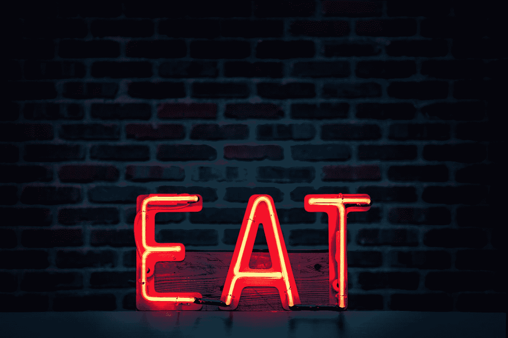
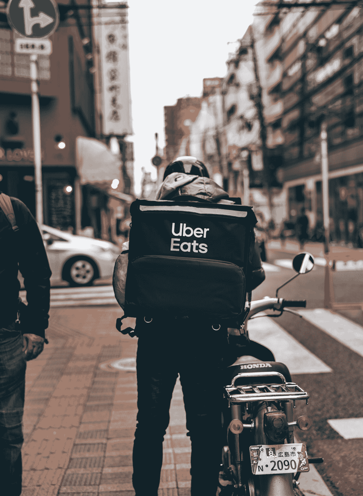

# 后新冠肺炎时代的商业世界——第二部分:餐馆

> 原文：<https://medium.datadriveninvestor.com/the-post-covid-19-business-world-part-2-restaurants-ede436e370f7?source=collection_archive---------2----------------------->

## 冠状病毒疫情之后，外出就餐会是什么样子

Photo by [Clem Onojeghuo](https://unsplash.com/@clemono2?utm_source=medium&utm_medium=referral) on [Unsplash](https://unsplash.com?utm_source=medium&utm_medium=referral)

***注:*** 在本系列的第一篇文章([后新冠肺炎商业世界——第一部分:概述](https://vocal.media/journal/the-post-covid-19-business-world-part-1-overview))中，我们勾勒出了我们所有人目前正在经历的巨大变化的世界，无论是作为个人还是作为一个社会，我们都在应对新冠肺炎/疫情冠状病毒。我们为研究在大流行后的未来环境中商业世界总体上将如何变化做好了准备(是的，它会的！).我们认为，至关重要的是，从最大的公司到小型地方企业，所有公司都要制定战略，以便在大流行后的环境中取得成功。

在这篇文章中，我们将研究餐厅经营者(从最大的连锁餐厅到当地咖啡馆)为了满足消费者的需求和要求而做出的至关重要的变化，这些消费者的态度、偏好和行为可能与冠状病毒爆发前大不相同。

Photo by [Edwin Hooper](https://unsplash.com/@edwinhooper?utm_source=medium&utm_medium=referral) on [Unsplash](https://unsplash.com?utm_source=medium&utm_medium=referral)

# 介绍

我们所有人在这段“隔离生活”中经历的一部分是，我们开始欣赏我们在新冠肺炎/疫情冠状病毒之前所拥有的东西，在 2020 年 3 月之前，我们在日常生活中认为这些东西是理所当然的。我们刚刚假设相对稳定的“事情”之一是每天都有各种类型、种类、菜系和规模的餐馆。无论是早上在星巴克喝咖啡，还是吃早餐、午餐、晚餐，甚至是在塔可钟吃“第四餐”，我们已经习惯了有很多食物可供选择，这是我们的祖先做梦都想不到的！我们可以顺道拜访，开车经过，叫外卖——见鬼，我们甚至可以在我们自己的车里，在当地的 [Sonic](https://www.sonicdrivein.com) 点外卖——通常我们的食物是由轮滑服务员送来的！有时，我们可能会因为我们的选择而感到几乎瘫痪，因为可供选择的食物是如此的丰富，而且我们在哪里、如何、何时可以享用这些餐馆的方法也是数不胜数。

Photo by [Tim Mossholder](https://unsplash.com/@timmossholder?utm_source=medium&utm_medium=referral) on [Unsplash](https://unsplash.com?utm_source=medium&utm_medium=referral)

嗯，那是过去，现在，在州封锁、家庭订单和恐惧的公众中，到处的餐馆都在为生存而挣扎。从大型连锁店到家庭小酒馆，餐厅管理团队几乎每天都要做出战术选择——他们的策略基本上被抛到了九霄云外。这时候怎么实际服务客户呢？我们怎样才能真正安全地操作呢？我们可以/应该留住哪些员工——多少人，多长时间？我们如何才能真正获得一些收入——这是否足以证明继续营业是有道理的？我们如何才能提高我们的品牌和我们在社区中的地位？当然还有最大的问题，*我们真的能熬过这个*吗？

Photo by [Felix Mittermeier](https://unsplash.com/@felix_mittermeier?utm_source=medium&utm_medium=referral) on [Unsplash](https://unsplash.com?utm_source=medium&utm_medium=referral)

以前从未有过像这样打击餐饮业的事件。正如我们在本系列的第一篇文章([后新冠肺炎商业世界——第一部分:概述](https://vocal.media/journal/the-post-covid-19-business-world-part-1-overview))中所讨论的，新冠肺炎·疫情也许是我们生活中最典型的[黑天鹅事件](https://www.investopedia.com/terms/b/blackswan.asp)。然而，在强烈的恐惧和危险过去之后，餐馆似乎特别容易受到冠状病毒对其经营的影响——无论是眼前的还是长远的——他们会的。在本系列文章中，当我们分析各种行业时，我们会反复提到的一个主题是:普通美国消费者可能会因为经历了这次疫情而永远改变。无论什么年龄段，什么民族，什么收入水平等。—无论您在 2020 年 3 月之前如何定义您的目标市场，您都需要增加一个新的维度。这是一个事实，就像我们的长辈的经历将他们塑造成消费者一样——即经历衰退、战争、9/11、社会变革等。—这一事件将重塑我们作为消费者的个人和集体行为方式。而今天，那个维度将聚焦在一个词上:*卫生*。当你处理食品和食品服务时，卫生是绝对重要的服务维度。

 [## 跑步摆脱疯狂:锻炼如何提高你的生产力|数据驱动的投资者

### 没有比锻炼更好的方式来开始一天的工作了。我试着一周至少做四天，在…

www.datadriveninvestor.com](https://www.datadriveninvestor.com/2018/10/23/running-to-get-rid-of-the-crazy-how-working-out-increases-your-productivity/) 

在本系列的第一篇文章([后新冠肺炎商业世界——第一部分:概述](https://vocal.media/journal/the-post-covid-19-business-world-part-1-overview))中，我们以如下方式陈述了这一主张:

*简而言之，我们认为，对经典谚语***稍加修改，在这个快速变化的时代，在后新冠肺炎时代的商业世界中，“清洁将近乎虔诚”——无论是在宏观层面，还是在微观层面。一旦冠状病毒的最初威胁消失，目前对细菌安全和清洁/卫生以及社会距离的高度关注不会在一夜之间消失。事实上，很有可能所有类型和规模的企业都需要进行持久的实质性变革，以服务于在疫情之后更加关注健康的消费者，也就是我们所说的几乎“恐菌症”的消费者。**

*因此，当你看到餐饮业在大流行后的环境中向前发展时，无论这是在一个月、三个月还是今年晚些时候开始，也无论在全国、地区甚至当地是否会是同样的时间线，我们都可以确定五个关键趋势，所有餐馆老板在制定计划时都应该考虑如何在疫情后的“新常态”中前进。这些是:*

1.  *送外卖送外卖。*
2.  *外卖将构成未来餐厅收入/数量的重要部分*
3.  *社交距离永远不会真正消失*
4.  *远离细菌的安全性将是消费者心目中的一个关键区别因素*
5.  *物理空间需要重新考虑/重新配置/重新规划*

*虽然企业管理团队和个体餐厅老板在打眼前的战斗时很难专注于长期，但我们相信，这些力量将被证明是餐厅游戏向前发展的关键考虑因素和关键成功因素。现在，即使在充满挑战的时代，餐厅管理层也需要考虑他们能够和应该做些什么，以便在最终的大流行后环境中更好地定位他们的公司。*

**

*Photo by [eggbank](https://unsplash.com/@eggbank?utm_source=medium&utm_medium=referral) on [Unsplash](https://unsplash.com?utm_source=medium&utm_medium=referral)*

# *1.送外卖送外卖。*

*[DoorDash](https://www.doordash.com/en-US) ， [GrubHub](https://www.grubhub.com) ， [Uber 吃](https://www.ubereats.com)，[鱼子酱](https://www.trycaviar.com)， [Postmates](https://postmates.com) ， [Waitr](https://waitrapp.com) …美国人使用送餐公司的趋势在 2020 年 3 月之前一直在[加速。然而，由于越来越多的人在新冠肺炎疫情期间外出和行动受到非常现实的限制，因此利用这些服务，食品配送在这段时间从一个方便的选择变成了我们许多人的一项重要服务。随着数千万美国人就地避难，食品配送服务使他们能够享受他们知道的食物选择，并尝试使用这些服务的其他餐馆，因为他们在许多情况下不仅寻求舒适和多样化，以帮助养活自己和家人。在受灾严重的纽约市，食品配送公司成了许多家庭的绝对生命线。这意味着食品配送公司是少数——极少数——从疫情脱颖而出的“赢家”行业之一。](https://www.forbes.com/sites/sarwantsingh/2019/09/09/the-soon-to-be-200b-online-food-delivery-is-rapidly-changing-the-global-food-industry/#247825f7b1bc)*

*当然，当分析完成后，疫情的条件当然鼓励许多人第一次尝试食品配送。因此，当这些数字出现时，疫情很可能会使人们使用送货服务的总体可能性大幅增加——包括第三方和餐馆自己提供的服务。凭借良好的体验和客户信息，快递公司将能够吸引越来越多的美国人更频繁地使用他们的服务，并使快递成为越来越多的人事实上的选择。因此，外卖作为一种服务模式在所有餐厅中的突出地位将是疫情经验的一个关键影响。*

*展望未来，餐厅管理层将义不容辞地与大型和小型送餐公司建立更紧密的合作伙伴关系，并尽可能方便顾客通过他们从餐厅点餐。虽然食品配送行业可能会发生[洗牌，但在短期内，餐厅管理层在与这些服务提供商合作时保持“平台不可知”至关重要，因为现在可能需要一些时间来通过可能发生的合并和收购来确定该行业的“赢家”和“输家”。这些组合将有助于在全国范围内将该领域划分为几个强大的参与者，但可能会有本地化竞争对手的出现和增长。](https://www.qsrmagazine.com/pizza/dominos-ceo-shakeout-coming-delivery-industry)*

*最后，我们认为餐厅管理层应该检查他们自己的运营，看看如何提供他们自己的内部交付服务可能对他们的运营有战略利益。当然，我们有全国披萨连锁店和当地小经营者(想想你家附近的披萨店或中国餐馆)，他们多年来一直在调整他们的经营和菜单，让外卖成为他们营销组合的重要组成部分。如今，随着外卖越来越成为餐馆顾客的首选，无论是大型连锁餐馆还是小型、单个或多个商店的经营者，都应该认真考虑建立和/或大力加强自己的外卖业务的前景。与大多数商业决策一样，在运营成本、薪资以及债务问题上，都会有权衡。然而，我们认为，大型连锁店和小型企业一样，可能能够使其交付服务的质量成为后电晕消费者心目中的一个关键区别因素，有助于提高品牌忠诚度和声誉，并使客户成为更频繁、更满意的买家。*

*当然，挑战在于这一变化的*执行*——以及餐厅管理层承诺将外卖作为其业务核心部分的意愿。然而，当前疫情的持久影响将是餐厅外卖服务采用曲线的加速——其潜力远远高于黑天鹅事件之前的预期。*

**

*Photo by [Kelly Sikkema](https://unsplash.com/@kellysikkema?utm_source=medium&utm_medium=referral) on [Unsplash](https://unsplash.com?utm_source=medium&utm_medium=referral)*

# *2.外卖将构成未来餐厅收入/数量的重要部分*

*我们坚信，随着外卖业务的发展，所有餐馆都将看到疫情冠状病毒对其外卖业务的持久影响。总的来说，很有可能对于大多数餐馆来说，甚至那些以前可能没有任何重要外卖业务或者甚至提供可能不利于外卖的食物(例如，像炭火、汤、河粉等。)，他们的外卖销售额/数量/收入可能是未来的一个重要成功因素。*

*随着对外带和送货的重视，我们认为还没有这样做的餐厅可能需要重新思考/修改他们的菜单，以更好地适应这些目的。菜单可能需要简化(例如，可能有 20 个选项，而不是 60、70、80 或更多)。可能需要添加和/或特色化家庭风格的饭菜，以更好地服务于外卖/递送市场。食物可能需要以更好地适应其运输容器的方式来准备。最后，正如许多全国连锁店和当地餐馆今天开始做的那样(受当地和州法律的约束)，取送酒现在正成为他们营销和收入组合的关键部分。此外，人们将重新关注开发比今天标准的泡沫聚苯乙烯和纸板产品更复杂的食品容器，并从中获利。*

*总之，随着越来越多的美国人不再把餐馆食物与体验餐馆本身的需要联系起来，他们愿意为在家里而不是在餐馆里消费的菜单项目支付同样的价格——甚至更多，餐馆管理层不仅必须重新考虑他们的商业模式，而且必须重新考虑他们配置、运营和配备业务人员的方式。如果像许多专家预测的那样，从社会和工作的角度来看，隔离经历将改变美国人的生活模式，鼓励更多的聚会，不是面对面，而是通过家中的技术，餐馆必须重新考虑他们的外卖服务，以迎合变化很大的顾客群。*

**

*Photo by [visuals](https://unsplash.com/@visuals?utm_source=medium&utm_medium=referral) on [Unsplash](https://unsplash.com?utm_source=medium&utm_medium=referral)*

# *3.社交距离永远不会真正消失*

*在过去几周我们都成了“纸上谈兵的流行病学家”之前，大多数美国人从未听说过社交距离的概念然而，随着一个又一个专家出现在我们的电视屏幕上，兜售社会距离的好处，以[阻止冠状病毒的传播](https://www.medicalnewstoday.com/articles/why-social-distancing-is-key-in-containing-the-new-coronavirus)和[使曲线变平](https://www.livescience.com/coronavirus-flatten-the-curve.html)，使我们的医疗保健系统更容易控制流行病的水平，我们*突然*开始认真审视我们在生活的许多方面有多接近。六英尺的距离突然变得至关重要——这是所有企业都应该努力在个人之间建立的标准，无论是客户还是员工。除了你可能在当地三明治店或自助餐厅看到的“喷嚏卫士”之外，物理障碍在很多餐饮业中并不被认为是必不可少的。*

*然而，在疫情的经历之后，我们相信，在未来一段时间内，社交距离可能会继续成为社会中许多人非常真实、积极的担忧。我们可能不会真的测量出 6 英尺的距离——是的，随着时间的推移，我们可能会在更拥挤的空间里变得更舒服。然而，我们相信，我们将称之为“社会距离思维”的现象将在未来几个月甚至几年内继续存在于相当一部分人口中。餐馆应该考虑如何减少排队的需求，减少酒吧区等拥挤区域的拥挤，以及如何将桌子分散得更远，以增加不同顾客聚会之间的距离。桌子本身可能需要重新配置，以消除像*实际上*只能舒适地坐 4 个人的 6 人展位或咖啡厅的站立吧台这样的情况，在那里顾客可能面对面仅相距 12-18 英寸！在许多新的餐馆区域，很可能需要设置物理的有机玻璃屏障，例如在快餐店的收银员和顾客之间，也许很难想象，在酒吧的酒保和顾客之间！*

*因此，为了吸引和留住顾客，餐馆管理层在一段时间内应该关注当前对社会距离的强调所带来的长期影响。事实上，在很大一部分顾客的心目中，缺乏社交距离可能会成为“交易破坏者”,这可能会消除他们成为回头客甚至成为餐厅顾客的可能性！*

**

*Photo by [Free To Use Sounds](https://unsplash.com/@freetousesoundscom?utm_source=medium&utm_medium=referral) on [Unsplash](https://unsplash.com?utm_source=medium&utm_medium=referral)*

# *4.远离细菌的安全性将是消费者心目中的一个关键区别因素*

*疫情事件之后，餐馆需要适应的最大挑战可能是经营上的。也就是说，这一挑战是，在冠状病毒疫情的近期和长期影响下，管理层需要审视他们所做的 98%至 99%的事情，以迎合我们大多数人都会在某种程度上挥之不去的细菌恐惧症。*

*想想餐厅体验中涉及到多少直接的食物处理，无论是在从全方位服务的坐下式餐厅到快餐的范围内。从厨房到预备线，再到服务员，再到你的桌子，有很多处理过程，这意味着有很多*手*。在你当地的星巴克或独立咖啡馆，你的咖啡师会给你一杯咖啡——或者更好喝的饮料。手套——甚至可能是口罩——现在将成为所有餐饮服务的必需品，就像将处理收银机和处理顾客食物的任务分开一样(是的，这肯定会增加人员需求)。从顾客对食物处理偏好的角度来看，在这种环境下“最好”工作的运营模式是[快速休闲餐厅](https://money.com/best-fast-casual-restaurant/)目前采用的模式(想想 [Panera Bread](https://www.panerabread.com/en-us/home.html) 、 [Five Guys](https://www.fiveguys.com) 、 [Shake Shack](https://www.shakeshack.com) 等。今天操作)。总的来说，整个餐饮业都将推进非接触式服务，管理层如何应对这种新的消费者期望将是他们在大流行后的竞争环境中取得成功的关键因素。*

*一个将对餐饮业产生长期影响的变化将是停止通过自助服务亭在店内点餐的趋势。这是一个快速发展的趋势，即使是最不经常光顾的餐馆顾客也能发现。纵观全局，从快餐巨头麦当劳、T2、温迪快餐、T4 塔可钟到休闲餐厅，如辣椒、苹果蜂，各大连锁餐厅在引导顾客走向自助点餐方面占据了重要位置。事实上，[最近的行业预测](https://thespoon.tech/report-global-kiosk-market-to-reach-30-8b-by-2024-thanks-to-restaurants/)显示，到 2024 年，信息亭市场将增长到 300 亿美元以上。然而，随着餐馆顾客对可能已经触摸过很多很多次的触摸屏的新关注，我们相信，无论餐馆管理层如何努力通过经常清洁触摸屏来“减轻”触摸屏的细菌和清洁问题，这些自助服务机制的增长率很可能会大大降低，如果在大流行后的市场上没有停止的话。*

*   *随着对送货和外卖的新重视，专门为在餐厅外就餐的顾客服务的物理空间和订单流的设计将需要认真检查。*
*   *考虑到社交距离，餐饮和/或酒吧布局需要重新考虑。制造餐厅家具的公司可能会有新的创新，以更好地利用餐厅空间来适应这方面不断变化的顾客偏好。*
*   *越来越多的餐厅将需要快速休闲餐饮的外观和感觉，因为全方位服务模式——以及用餐和厨房空间的物理布局，以及任何等候区，将需要重新设计，以满足大流行后顾客对食品处理和社交距离的期望。*

*然而，我们并没有看到餐厅体验中更多自助服务的趋势减弱。恰恰相反，我们认为整个餐饮业的趋势将是更高级别的顾客自助服务，包括点餐，只是不是在自助服务亭。然而，无论是自己还是在餐厅管理人员的巧妙“推动”下，顾客很可能会倾向于更多的在线和基于应用程序的点餐——甚至是在店内，而不是使用固定的售货亭。从运营的角度来看，越来越多的顾客通过手机或其他移动设备订购并支付，这将减少店内现金处理的需求——是的，减少服务柜台人员的需求。当然，顾客在网上和餐厅的应用程序中点餐越多，可以收集的信息就越多，利用顾客忠诚度计划的机会就越大。因此，最终，从自助服务亭向个人设备的转移可能会被证明是餐厅更好地与客户联系的真正战略利益。*

**

*Photo by [Jose Losada](https://unsplash.com/@joselosada?utm_source=medium&utm_medium=referral) on [Unsplash](https://unsplash.com?utm_source=medium&utm_medium=referral)*

# *5.物理空间需要重新考虑/重新配置/重新规划*

*这种力量实际上是前面四个因素的产物。随着大型连锁店和独立经营者应对顾客不断变化的需求和偏好，餐馆的外观和感觉在未来几年可能会发生巨大变化。这些变化中的许多都需要时间，因为在回归“正常”后的几个月里，必要的要素——金钱——将会短缺所有餐馆，无论是有数千个分店还是只有一个分店，都将因新冠肺炎疫情及其导致的不得不采取的阻止人们不必要外出的行动而遭受巨大的经济损失。然而，从现在到 2022 年，2023 年的时间窗口，我们建议所有的餐厅老板和管理团队不仅需要认真检查他们的经营，而且要检查他们的位置的物理形式。这包括以下需要考虑的事项:*

*   *随着对送货和外卖的新重视，专门为在餐厅外就餐的顾客服务的物理空间和订单流的设计将需要认真检查。*
*   *考虑到社交距离，餐厅和/或酒吧的布局需要重新考虑。制造餐厅家具的公司可能会有新的创新，以更好地利用餐厅空间来适应这方面不断变化的顾客偏好。*
*   *越来越多的餐厅将需要快速休闲餐饮的外观和感觉，因为全方位服务模式——以及用餐和厨房空间的物理布局，以及任何等候区，将需要重新设计，以满足大流行后顾客对食品处理和社交距离的期望。*

**

*Photo by [Nik Shuliahin](https://unsplash.com/@tjump?utm_source=medium&utm_medium=referral) on [Unsplash](https://unsplash.com?utm_source=medium&utm_medium=referral)*

# *结论*

*是的，我们正在经历前所未有的时代——至少在我们有生之年。对我们所有人来说，今天的主要挑战是在疫情期间，通过躲在适当的地方并避免不必要的社交活动来保证我们自己和彼此的安全。*

*冠状病毒在医学战线上似乎是致命的。然而，它也将对整个经济造成数月甚至数年的严重破坏。在一个一开始就有着[异常高失败率](https://pos.toasttab.com/blog/restaurant-failure-rate)的行业里，餐馆今天确实是在不亚于危机模式下运营，预计全国连锁餐馆及其特许经营者以及全国各地的独立餐馆都将面临前所未有的失败水平。[纽约时报](https://www.nytimes.com)最近刊登了一篇[文章](https://www.nytimes.com/2020/03/20/dining/local-restaurants-coronavirus.html)，据餐饮业专家估计，75%因冠状病毒而不得不关闭的独立经营者可能无法挺过当前的疫情——预计未来三个月整个餐饮业将损失近 2 . 5 万亿美元！因此，从麦当劳到主街，在整个美国，今天餐馆管理的主要焦点很简单，正如《餐馆潜水》的编辑艾玛·莱姆·贝克特直言不讳地说的那样，只是为了“让灯亮着”疫情的一个长期影响是，消费者可能会继续区分本地餐厅和全国连锁餐厅，许多人会寻求支持并经常光顾他们的本地业务。因此，对于全国连锁店的特许经营者来说，通过标牌、社交媒体和电子邮件通信来表明他们也是他们所服务的社区中的小企业，因此，应该得到基于社区的支持是至关重要的。*

*最终，会有一个大流行后恢复期，无论是从六月、七月还是十月开始。因此，餐厅管理层有责任考虑他们未来需要做出的许多改变，以吸引、服务和保留一个与 2020 年 3 月日之前*存在的新冠肺炎之前的常态截然不同的顾客。我们认为，尽管所有餐厅(从最大的连锁餐厅到家族企业)及其管理层在今年晚些时候经济确实“启动”时肯定会面临大量财务和运营挑战，但我们强烈建议这些公司的领导层考虑他们需要在短期和长期进行的更多战略和战术变革。今天餐馆在菜单、运营和物流方面所做的大部分改变仅仅是为了生存。然而，这些策略将被证明是重要的“经验教训”,餐馆需要在大流行后的环境中做出更长期、永久的改变。**

*我们敦促餐厅管理团队和个体餐厅老板在内部以及与其他组织中的同行沟通时，认真考虑本文中提出的建议，作为做出必要改变的起点，以便在大流行后的餐厅市场中生存——是的，甚至可能繁荣。*

*_________________________________*

*大卫·c·怀尔德([dwyld@selu.edu](http://dwyld@selu.edu))是新奥尔良外东南路易斯安那大学的管理学教授。他是一位著名的商业顾问和当代管理问题的演讲者/作家。*

**最初发布于*[*https://vocal . media/feast/the-post-新冠肺炎-商业-世界-第二部分-餐馆*](https://vocal.media/feast/the-post-covid-19-business-world-part-2-restaurants)*