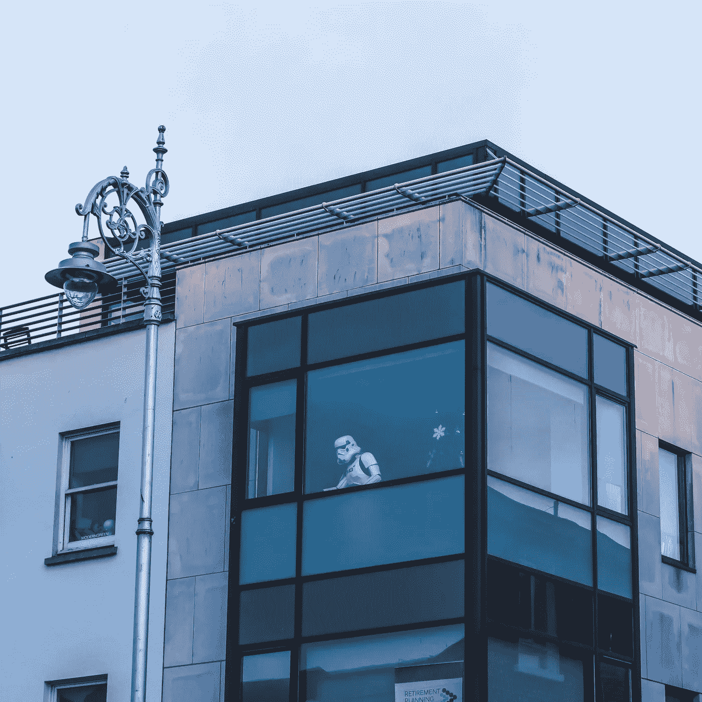

# 后疫情时代的住所

> 原文：<https://medium.datadriveninvestor.com/the-post-pandemic-abode-7fc82bdc982f?source=collection_archive---------21----------------------->

Robert Alves-de-Jesus 在 Unsplash 上拍摄的照片

仅仅几个月的时间，很多事情都发生了变化，包括“梦想家园”是什么样子。在疫情之前，购房者更喜欢较小的房子和有利于娱乐的开放式概念空间。在花了几个月的时间关在里面，这些功能不再有吸引力。

开发商已经注意到这一点，并正在重新评估现有的室内外观和设施。

**未来几年，家居设计的趋势可能会改变**

**家的大小。房子越来越小，这种趋势可能会结束。随着我们中的许多人最近花更多的时间呆在家里，我们需要更多的个人空间。这意味着我们应该预期住房面积会相应增长。**

**家庭办公现在是重中之重**。随着越来越多的企业放松“在家工作”的政策，家庭办公室将成为许多购房者的必需品。对许多公司来说，还有一种完全向“全职远程”工作的转变。这迫使我们许多人在家中狭小的空间里制作临时办公桌。

 [## 预算是获得数据驱动型投资者生活方式的关键

### 谈论财务可能会很艰难，但这种对话是必要的。62%有预算的人说这让他们…

www.datadriveninvestor.com](https://www.datadriveninvestor.com/2019/12/14/budgeting-is-key-in-obtaining-the-lifestyle-you-what/) 

多么有趣的是，一个曾经被认为是多余的空间现在需要提供隐私、良好的照明，并为远程办公预先布线！

**封闭平面图的回归？在过去的一两年里，开放式平面设计已经开始走下坡路了。过去几个月只是让原因变得更加明显。花更多的时间和空间在家里需要更多的隐私用于学校工作、爱好和娱乐。一个开放式的厨房成为吵闹的中心，整天在家做更多的饭菜。**

住宅建筑商预计，对封闭平面图的需求将会上升，这种平面图的房间会被分隔开来。

**智能技术是一种快速发展的趋势**。谈到家居设计，智能家居技术将很快从“附加”变成“必须”。现在可以通过声音或动作来控制温度和灯光。免触摸水龙头曾被认为是奢侈的，但现在是一种健康意识的升级。空气过滤和监测系统将变得更加普遍和廉价。

虽然定义历史的冠状病毒仍在肆虐，但很难预测大流行后的住所会是什么样子。现在，即兴冲向商店、在酒吧喝酒、与朋友庆祝生日、假期、体育课、家庭访问、拥抱和握手已经从我们的生活中取消了，我们被迫向正常生活迈出“小步”。与此同时，开发商继续预测新冠肺炎将刺激的居民需求和偏好。

*想更多地关注我的内容吗？给我鼓掌，关注我并在下面评论你的想法，观点甚至对以后帖子的想法！*

## 获得专家视图— [订阅 DDI 英特尔](https://datadriveninvestor.com/ddi-intel)