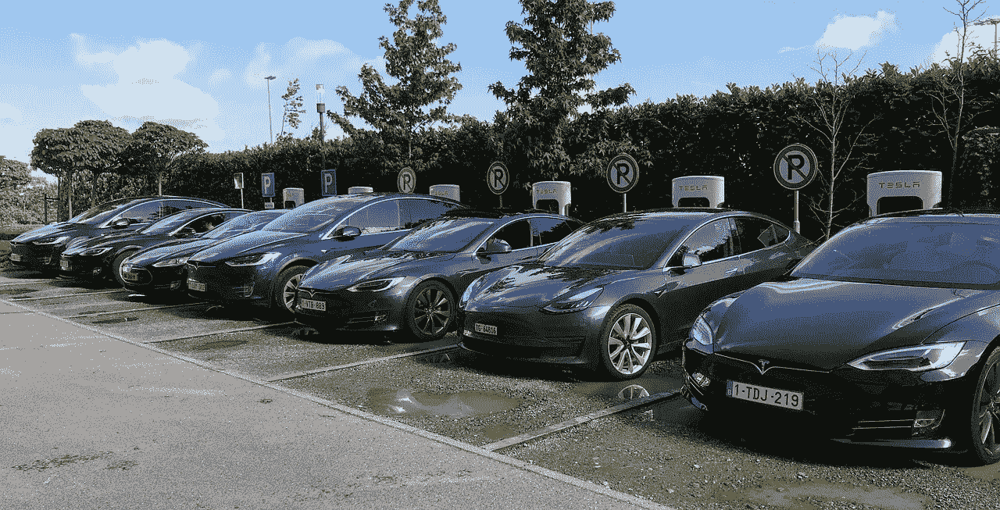
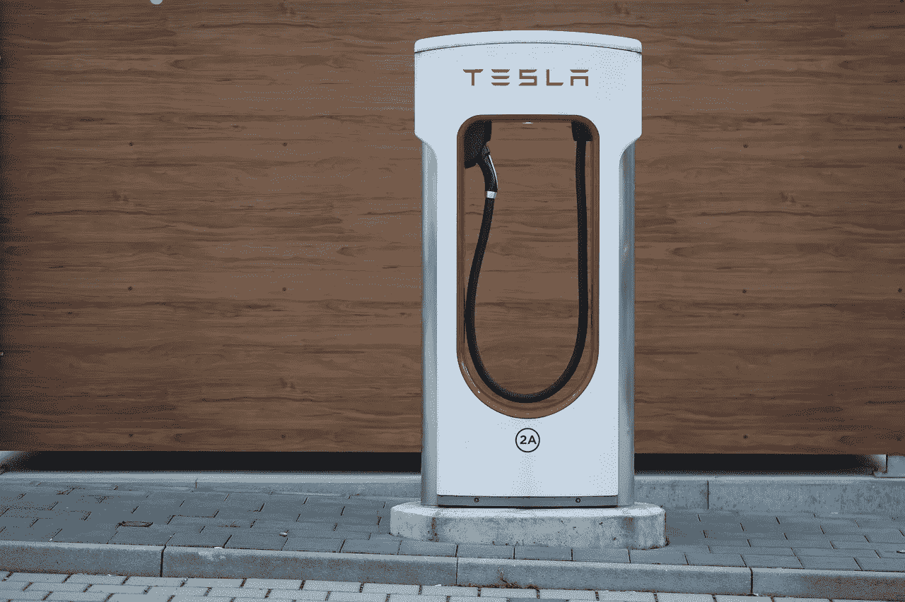
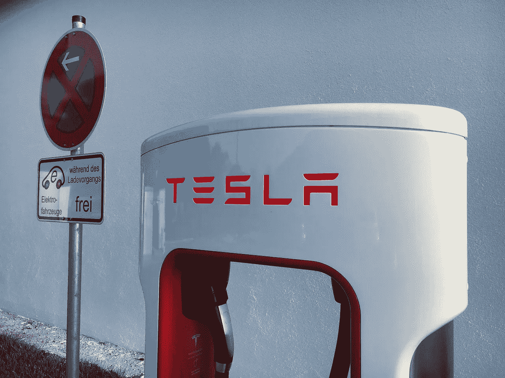
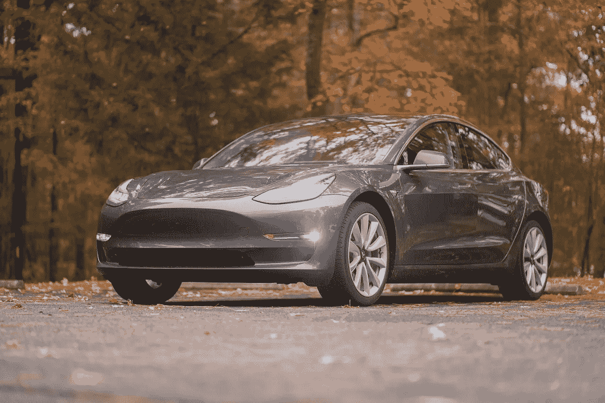
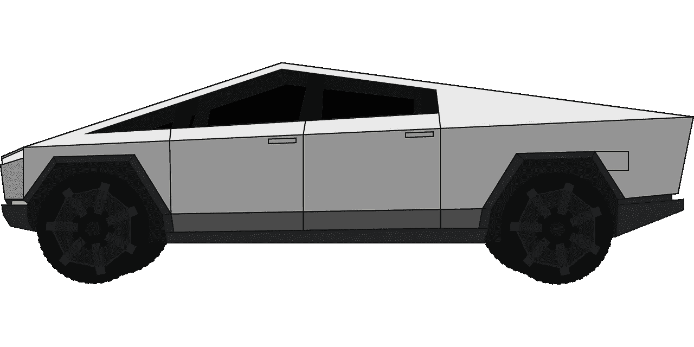
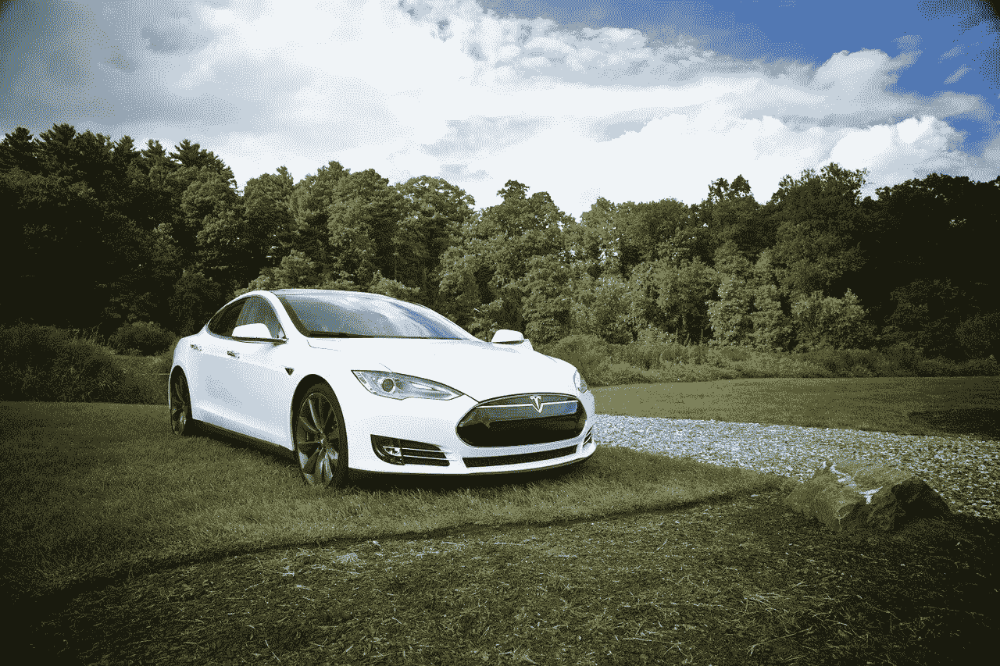
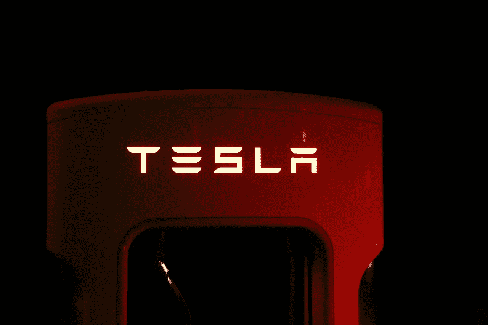

# 特斯拉的潜在价值(纳斯达克代码:TSLA)

> 原文：<https://medium.datadriveninvestor.com/the-potential-value-at-the-potential-value-at-tesla-nasdaq-tsla-a32a9375be07?source=collection_archive---------16----------------------->

我认为在今天的股票市场上，没有哪家公司比**特斯拉(纳斯达克股票代码:TSLA)** 更有潜在价值。

解释一下，我认为特斯拉由四家公司组成，每家公司都有巨大的价值潜力。首先，**特斯拉汽车公司(纳斯达克股票代码:TSLA)** 显然是一家汽车制造商和客运提供商。

第二，特斯拉能源是电力供应商和电池制造商。第三，特斯拉制造太阳能电池板。第四，特斯拉可以通过特斯拉 Semi 成为一家货运和物流公司。

# **特斯拉的实际值是电**

有趣的是，我认为特斯拉最大的潜在价值可能是作为电力供应商。

例如，特斯拉运营 1870 个[特斯拉超级充电站](https://www.tesla.com/en_EU/supercharger)；电动汽车的加油站。因此，特斯拉是一家满足电动汽车电力需求的基础设施公司。特别是，特斯拉运营着 16，585 台单独的增压器。

因此，特斯拉可以通过为其竞争对手计划的所有电动汽车提供动力来赚钱。例如，自吹自擂的**福特**电动皮卡。绿色汽车报道[声称](https://www.greencarreports.com/news/1126453_electric-ford-f-150-pickup-confirmed-for-michigan-assembly-likely-for-2021)福特没有增压器，但计划在 2020 年推出电动版 F-150 皮卡。

F-150 是美国最受欢迎的交通工具。福特在 2020 年第一季度在美国销售了 186，562 辆 F-150 卡车，*福特权威* [估计](https://fordauthority.com/2020/04/ford-f-series-sales-numbers-figures-results-first-quarter-2020-q1/)。值得注意的是，福特和另一家电动卡车制造商 Rivian 都没有自己的增压器。

 [## 投资区块链前要问的三个简单问题(也是一个困难的问题)|数据…

### 现在是了解区块链的最佳时机。不同货币之间的增长率，比如…

www.datadriveninvestor.com](https://www.datadriveninvestor.com/2020/03/12/three-simple-questions-and-one-difficult-one-to-ask-before-investing-in-a-blockchain/) 

值得注意的是，**亚马逊(NASDAQ: AMZN)** 计划从 Rivian 购买 10 万辆电动送货车，*汽车&司机* [报道](https://fordauthority.com/2020/04/ford-f-series-sales-numbers-figures-results-first-quarter-2020-q1/)。里维安货车和 F-150 卡车需要在某个地方充电。特斯拉可以通过提供电力来赚钱。

# **特斯拉会成为电力制造商吗？**

除了增压，特斯拉还通过家用电池系统 Powerwall 提供家庭电力。特斯拉声称 [Powerwall](https://www.tesla.com/en_GB/powerwall) 可以为家庭或企业提供超过 7 天的持续电力。

此外，特斯拉正在成为电力制造商。特别是，[霍恩斯代尔电力储备](https://hornsdalepowerreserve.com.au/)的特斯拉电池农场可以为 3 万个家庭供电，*大众机械师* [声称](https://www.popularmechanics.com/science/a31350880/elon-musk-battery-farm/)。

Neon SA 拥有的 Hornsdale Power Reserve 是世界上最大的锂离子电池。Neon 声称 Hornsdale 可以储存高达 100 兆瓦或 129 兆瓦时(MGH)的电力。

# **特斯拉的基础设施价值**

彭博 [声称](https://www.bloomberg.com/news/articles/2020-02-28/two-years-on-musk-s-big-battery-bet-is-paying-off-in-australia)南澳大利亚的 Hornsdale 花费了 5000 万美元来建设，但是每月减少了 7600 万美元的网络成本。

通过储存太阳能电池板和风力涡轮机产生的电力，Hornsdale 成为南澳大利亚电网的备用电源。今年夏天，Neon 将在 Hornsdale 再增加 50 兆瓦的电力储存。

BBC [报道](https://www.bbc.com/news/technology-52533224)有趣的是，特斯拉已经申请了在英国发电的许可。然而，BBC 没有报道特斯拉将如何使用它在英国生产的电力。目前还不清楚特斯拉是否有在英国建设电池农场的计划。

我认为电池和发电可以为特斯拉创造价值。解释一下，特斯拉可以通过为电动汽车和家庭电力系统提供底层基础设施来赚钱。

# **特斯拉能源公司的数值**

因此，[特斯拉能源](https://www.tesla.com/en_GB/energy)可能类似于**亚马逊的**现金奶牛亚马逊网络服务(AWS)。

Statista [估计，AWS 的收入在 2020 年第一季度以 33%的速度增长。AWS 季度年收入从 2017 年的 174.6 亿美元增长到 2019 年的 350.3 亿美元。](https://www.statista.com/statistics/422273/yoy-quarterly-growth-aws-revenues/)

因此，特斯拉能源可以成为推动特斯拉增长的摇钱树。因此，特斯拉可能正在开发类似于 AWS 的东西。

一个相关的收入来源可能是[特斯拉太阳能屋顶](https://www.tesla.com/en_GB/solarroof),这种房屋带有太阳能电池板或看起来像木瓦的瓦片。我认为“未来的电网”可能是太阳能屋顶和电池电力的结合。

# **特斯拉能源是价值投资吗？**

解释一下，城市中所有建筑上的太阳能屋顶可以取代传统的发电厂。太阳能屋顶将向电网输送电力。然后他们会把电储存在一个电池农场里，比如 Hinsdale Reserve。

我认为太阳能和电池农场的商业模式理论上可以产生大量的金钱。值得注意的是，沃伦巴菲特的**伯克希尔哈撒韦公司(纽约证券交易所代码:BRK。B)** 正在对太阳能和电池存储进行巨额投资。

Mazorsedge [声称](http://mazorsedge.com/massive-nevada-solar-farm-will-set-record-for-battery-storage/)伯克希尔能源公司计划建造一个 380 兆瓦的阵列，具有 1.5 千兆瓦时(15 亿)小时的存储容量。伯克希尔计划在内华达州未合并的克拉克县拉斯维加斯以北的公共土地上建设所谓的双子座太阳能项目。双子座项目可能会推动伯克希尔哈撒韦公司(纽约证券交易所代码:BRK)。一)子公司 NV 能源。

因此，特斯拉能源公司与伯克希尔·哈撒韦公司属于同一行业。重要的是，巴菲特和他的团队嗅到了特斯拉能源业务的价值。

# **特斯拉做货运能赚钱吗？**

奇怪的是，**特斯拉(纳斯达克股票代码:TSLA)** 可以用它的电动半挂卡车在货运上赚钱。

解释一下，[特斯拉 Semi](https://www.tesla.com/semi) 是一款电动 8 级半挂牵引车。因此，Semi 是一种货运机器。

引人注目的是， *Clean Technica* [声称](https://cleantechnica.com/2020/02/16/tesla-semis-are-cheaper-than-rail-enough-of-the-time-to-reshape-ground-freight/)特斯拉 Semi 的运营成本可能比铁路还便宜。具体来说，埃隆·马斯克声称他的 Semi 将比今天的大型钻机具有更低的维护成本和燃料成本。特别是，特斯拉[声称](https://www.tesla.com/semi)Semi 为运营商节省了 20 万美元的燃油。

清洁技术公司的迈克尔·巴纳德声称，自动驾驶的特斯拉 semis 可以以更低的成本在车队中行驶。在巴纳德的估计中，车队中运行的特斯拉 semis 可能比铁路运输成本更低。通常，他们认为铁路是最便宜的货运方式。

目前，我认为特斯拉正在为可以与铁路竞争的半货运走廊奠定基础。例如，特斯拉正在内华达州斯托里县的 Gigafactory 和加利福尼亚州弗里蒙特的工厂之间测试这样的运行。

# **特斯拉计划货运网络**

此外， *Elektrek* [报道](https://electrek.co/2019/12/20/tesla-trans-canada-supercharger-route-goes-live-all-at-once-mostly-v3-250kw/)特斯拉已经建造了一条横跨加拿大的超级充能器走廊。这条走廊从不列颠哥伦比亚省温哥华的一个主要太平洋港口延伸到大多数加拿大人居住的安大略省。

我认为这个增压器走廊可以为穿越加拿大的特斯拉 Semis 提供动力。与此同时，特斯拉在美国建立了几条超级充电站走廊。因此，特斯拉可以在美国各地运行车队的 Semis。

因此，我认为特斯拉可以在运输低成本货物方面与铁路竞争。重要的是，包括**沃尔玛(纽约证券交易所:WMT)** 在内的大公司都在购买特斯拉 Semis。值得注意的是， *Endgadget* [报道](https://www.engadget.com/2018-09-06-walmart-orders-30-more-tesla-semi-trucks.html)沃尔玛加拿大公司购买了 30 辆特斯拉 Semis。

我认为特斯拉正在规划一个半拖车网络，这可能有助于它进入货运和物流业务。因此，特斯拉可以与卡车运输公司、铁路公司竞争，甚至可能与亚马逊竞争。不幸的是，我论文的所有证据都是间接的。

# **特斯拉的疯狂股票之旅**

因此，特斯拉的理论价值可能远远超出其汽车业务。然而，投资者会问，这一价值能否证明特斯拉股票的狂飙。

事实上，2020 年特斯拉的股价已经翻了近一倍。市场先生在 2020 年 1 月 2 日支付每股 430.26 美元，但在 2020 年 5 月 11 日上涨到 816.66 美元，在 2020 年 5 月 13 日下降到 803.33 美元，在 2020 年 5 月 15 日下降到 799.17 美元。令人难以置信的是，特斯拉的股票在 2020 年 2 月 19 日达到了 917.42 美元的高点。

事实上，2020 年特斯拉的股价已经翻了近一倍。市场先生在 2020 年 1 月 2 日支付每股 430.26 美元，但在 2020 年 5 月 11 日上涨到 816.66 美元，在 2020 年 5 月 13 日下跌到 803.33 美元。令人难以置信的是，特斯拉的股票在 2020 年 2 月 19 日达到了 917.42 美元的高点。

# **特斯拉赚钱了吗？**

**特斯拉汽车公司(纳斯达克股票代码:TSLA)** 报告称，截至 2020 年 3 月 31 日，该季度的收入为 59.85 亿美元，毛利为 12.34 亿美元。

值得注意的是，特斯拉在同一天公布了 2.83 亿美元的季度运营收入和 6800 万美元的季度净收入。因此，特斯拉赚了一点钱，但产生了大量现金。

例如，特斯拉报告 2020 年最后一个季度的融资现金流为 27.08 亿美元，期末现金流为 85.47 亿美元。然而，特斯拉报告称，2020 年 3 月 31 日运营季度现金流为负-4.4 亿美元。最后，截至 2020 年 3 月 31 日，特斯拉拥有 80.8 亿美元的现金和短期投资。

# **特斯拉是新的亚马逊吗？**

因此，特斯拉赚了一点钱，但它的业务产生了大量现金。这让我想起了**亚马逊。**

例如，亚马逊报告称，2015 年的年收入为 889.88 亿美元，年营业收入为 1.78 亿美元。截至 2015 年 12 月 31 日，亚马逊还有 174.16 亿美元的现金和短期投资。

如今，特斯拉的营业收入和净利润都很低，但却有巨额现金。这将让许多人想起亚马逊最近的过去。

同样，斯托克罗[估计](https://stockrow.com/AMZN/financials/income/quarterly)亚马逊在截至 2020 年 3 月 31 日的季度收入增长率为 26.39%。相比之下，Stockrow [显示](https://stockrow.com/TSLA/financials/income/quarterly)特斯拉在同一季度的收入增长率为 31.8%。

因此，特斯拉的最新收入增长数据可以与亚马逊相媲美。此外，特斯拉上个季度产生了大量现金。

归根结底，我认为**特斯拉(纳斯达克股票代码:TSLA)** 定价过高。然而，我也认为特斯拉的业务有潜力产生大量价值。如果你能忍受高股价和高风险，特斯拉可能是一项有趣的投资。

*原载于 2020 年 5 月 14 日 https://marketmadhouse.com**。*