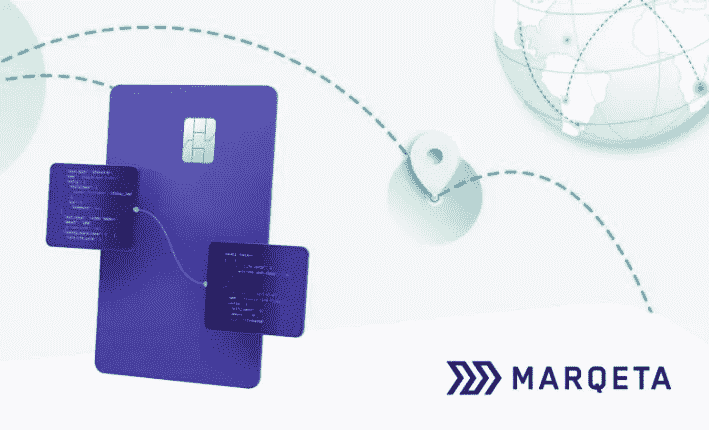

# Marqeta-MasterCard 合作伙伴关系作为 SaaS 金融科技平台的潜力

> 原文：<https://medium.datadriveninvestor.com/the-potentials-from-the-marqeta-mastercard-partnership-as-a-saas-fintech-platform-bdc7371423f?source=collection_archive---------3----------------------->

根据一份联合新闻稿，10 月 8 日，发卡 API 平台初创公司 Marqeta 宣布与万事达卡进行金融投资并扩大全球合作伙伴关系，以“扩展到新的地理区域，开放新产品”。

# 谁是玛克塔？

Marqeta 成立于 2010 年，已经建立了一个基于 API 的平台，为商户和品牌提供发卡和其他金融服务。Marqeta 之前的投资者包括 Iconiq、高盛、Visa、Affirm 的麦克斯·拉夫琴等。

Marqeta 的客户包括优步、DoorDash 和 Instacart，它们利用 Marqeta 的 API 平台向其零工经济工人发放卡片。与此同时，Marqeta 与主要金融机构和金融科技公司合作，如摩根大通(JPMorgan Chase)的虚拟商务卡令牌化、Square on Square Card 与现金账户的关联，以及 Affirm 和 Klarna 的 B2B 支付。

早在 2020 年 7 月，纳斯达克就报告称，Marqeta 在 5 月份从未披露的投资者那里筹集了 1.5 亿美元后，已经聘请投资银行家为潜在的 IPO 做准备。这一轮融资使该公司的估值从 2019 年的 19 亿美元翻了一倍多，达到 43 亿美元，当时该公司筹集了由 Coatue 牵头的 2.5 亿美元的巨额融资。

对于 Marqeta 来说，万事达卡的合作和投资加强了其竞争地位，因为 B2B 发卡已经成为一个竞争激烈的市场。2019 年，Adyen 和 Stripe 都为其全球商户推出了发卡产品。

Finix 和 Bond 等更年轻的初创公司也带着巨额资本进入了这个市场。乘着以开发者为中心的解决方案的浪潮，Finix 认为自己是 B2B 支付的 Twilio。2020 年 8 月，它宣布在由红杉、光速和美国运通牵头的 B 轮融资中筹集 7500 万美元。

邦德是由 Twilio 的前首席运营官 Roy Ng 创立的。2020 年 7 月，Coatue 领导了一笔 3200 万美元的债券首轮投资，高盛和万事达卡也加入了投资。其他知名个人投资者包括摩根士丹利前首席执行官约翰·麦克(John Mack)和 Nextdoor 首席执行官、Square 前首席财务官萨拉·弗里亚尔(Sarah Friar)。

 [## 革命还是法规？Avant 和 Marlette 和解后金融科技的未来|数据驱动…

### 科罗拉多州司法部长(AG)就金融科技公司 Avant 和 Marlette Funding 的诉讼达成和解，此前一项…

www.datadriveninvestor.com](https://www.datadriveninvestor.com/2020/10/22/revolution-or-regulations-fintechs-future-after-the-avant-and-marlette-settlements/) 

# 借助金融科技转向亚洲

这笔交易标志着万事达卡对 Marqeta 的首次投资，此前自 2014 年以来，双方在美国和欧洲市场就 Square Card 等知名项目进行了合作。具体来说，联合新闻稿提到亚太地区是他们合作的关键新区域。

对于万事达来说，亚太无疑是未来几年的战略区域。2020 年 2 月，初步获准进入中国支付市场，成为仅次于美国运通的首批国际支付组织之一。最近在 2020 年 9 月，美国运通与上海浦东发展银行和均瑶航空公司发行了联名信用卡，这是 2020 年 6 月正式进入中国市场后的第一笔重大商业交易。

过去 10 年，亚太地区见证了移动支付钱包的腾飞，而传统的信用卡和借记卡变得越来越不相关。来自中国的支付宝和微信支付已经成为世界支付钱包的榜样，而 Paytm 和 Grab 则借鉴了他们的模式，在南亚和东南亚市场取得了成功。

可以说，由于新兴市场国家的银行渗透率低得多，银行卡从未在亚太市场占据主导地位。因此，与它们在美国和欧洲的主导地位相比，Visa、MasterCard 和 American Express 在这里的支付领域影响有限。

然而，随着 API 正在蚕食世界，这些卡网络正在从技术角度重新调整自己，以重新获得相对于崛起的金融科技巨头的竞争优势。

Visa 一直在牵头与基于 API 的金融科技公司进行战略投资和合作，例如对 Plaid 的早期投资，Plaid 是一个连接金融机构和消费者的 API 平台，后来以 53 亿美元收购了该平台。它还投资了 Stripe、Marqeta、Finix、N26 等金融科技公司，以及东南亚的区域性超级应用 Grab 和 Gojek，以及拉丁美洲的 Rappi。与 Visa 相比，美国运通并没有投资太多主要的金融科技公司，除了 Stripe、Plaid 和与 Visa 一起的 Finix，以及收购亚特兰大的贷款初创公司 Kabbage。

对于万事达卡来说，COVID19 并没有放缓其金融科技投资的步伐。除了上述对 Bond 的投资，它还在 4 月份参与了中端市场 B2B 发票和支付自动化初创公司 AvidXchange 的 128 美元 F 系列投资。但与 Visa 相比，它的投资和合作伙伴缺乏对 Stripe 和 Plaid 等大型平台以及 Grab、Gojek 和 Rappi 等主要区域性超级应用的访问。

# 打开中国市场

与过去几年中国商业银行和资产管理市场逐渐向外国公司开放类似，预计中国国内支付处理市场将很快全面开放。如上所述，美国运通已经开始在当地开展业务，万事达卡正处于审批过程的最后阶段。

不久之后，这些全球支付网络的 SaaS 金融科技合作伙伴(如 Marqeta 和 Finix)也将把中国纳入其全球扩张路线图。它们有潜力极大地塑造中国国内不成熟的 SaaS 生态系统。

诚然，蚂蚁集团和腾讯通过支付宝和微信支付主导了中国金融科技市场，但他们的主导地位迄今仅限于消费者金融科技领域，使企业金融科技领域成为一个饱和程度低得多的市场。

事实证明，Marqeta 在为优步、DoorDash 和 Instacart 等零工经济参与者提供虚拟商务卡方面取得了成功，同样的商业模式也适用于中国同行，如滴滴、美团和饿了么，可以充分理顺内部财务对账流程，提高零工效率。

事实上，Marqeta 和 Finix 等平台的影响力远远超出了商业发卡。他们可以通过 API 将品牌和商家的整个财务后台带到云上，无论是多方交易对账、插件式金融产品还是独立的支付处理。

这样一个 SaaS-金融科技平台可以让品牌和商家更加自主和自由，毫不费力地创建和拥有自己的忠诚度计划，从而充分了解自己品牌的受众和消费者。

尽管如此，像 Marqeta 这样的 SaaS 金融科技平台非但不会对阿里巴巴和美团这样的巨头构成严重威胁，反而可以充当金融服务基础设施，从电子商务平台夺走一些商业支持服务。总的来说，在中国科技领域，企业解决方案和 SaaS 仍然是一个欠发达的垂直行业，Marqeta 风格的平台的加入基本上可以为 SaaS 的创业公司创造一个更良性的环境。

它还可以作为科技公司和银行等现有金融机构之间的中间件层，就像 Marqeta 如何支持 Square Card 和摩根大通的商务卡令牌化工作一样。不是所有的科技巨头都在建立自己的金融科技基础设施，就像阿里巴巴、腾讯、百度、京东和小米都在做的那样，而是应该有空间和机会让更专业的金融科技平台成长，特别是面向企业的平台。

潜在的影响可能是有益的。实际上，现有巨头的角色可能会转向与这种 SaaS 金融科技平台的生态系统合作，而不是成为占据整个生态系统的庞然大物。缺乏多样性和活力的生态系统是脆弱的。因此，中国科技行业更可持续的框架可以受益于 Marqeta 这样的 SaaS 金融科技平台。

## 访问专家视图— [订阅 DDI 英特尔](https://datadriveninvestor.com/ddi-intel)