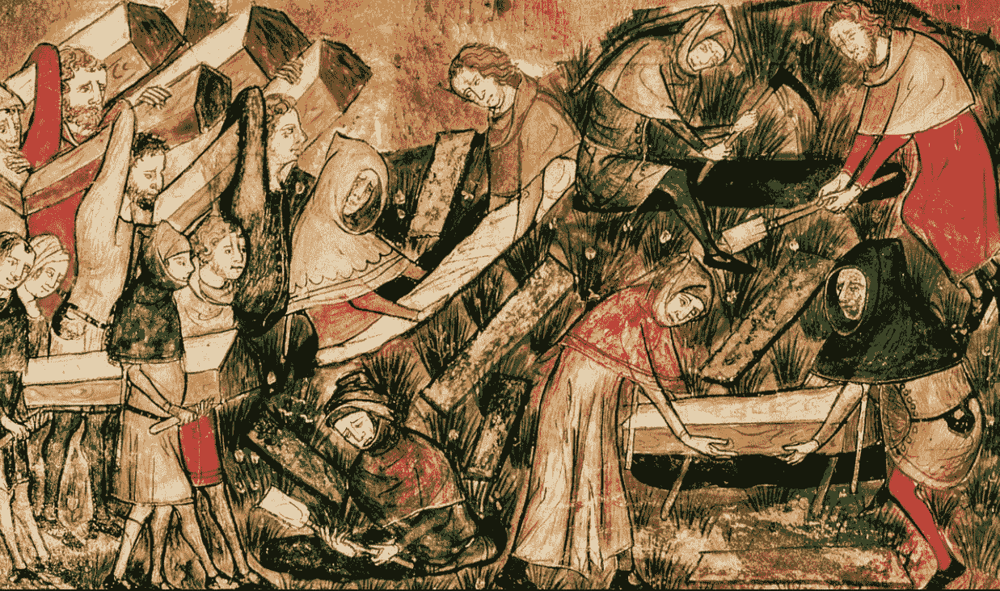
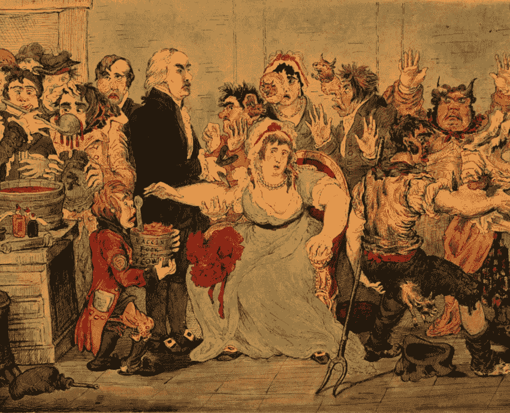
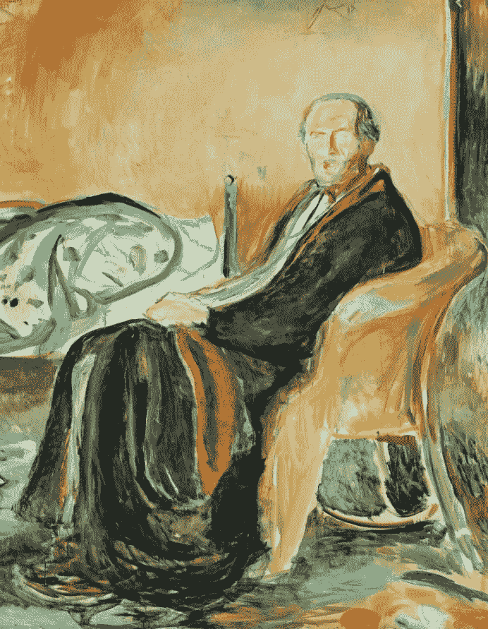
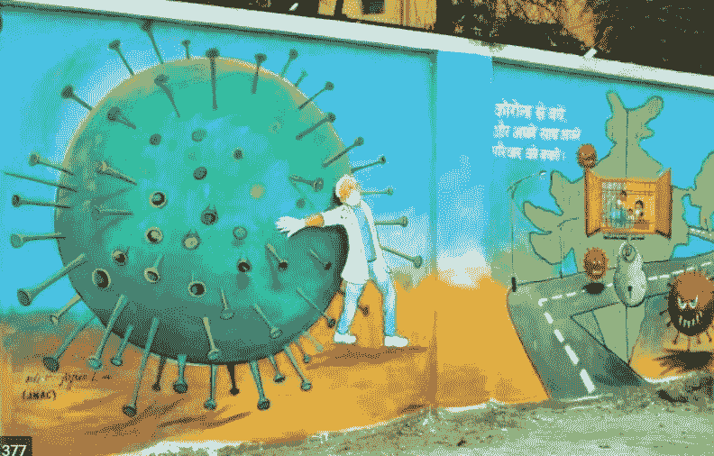

# 历史上最严重的流行病如何改变了我们所知的世界。

> 原文：<https://medium.datadriveninvestor.com/the-power-of-a-pandemic-c01aa4fb26ee?source=collection_archive---------12----------------------->

就像地球历史上一个新时代的开始一样，每个疫情都带来了人类新时代的开始。无论是 19 世纪的青霉素医学进步时代，还是先进的自动化时代，还是 21 世纪的数字时代或人工智能时代。

这一切都是从疫情开始的。

# 13 世纪——黑死病

[https://www.sciencemag.org/news/2016/04/how-europe-exported-black-death](https://www.sciencemag.org/news/2016/04/how-europe-exported-black-death)

## 历史上第一次隔离

“在 T2 黑死病时期，人们对瘟疫没有科学的理解,”莫卡蒂斯说,“但是他们知道它与邻近有关。”。这就是为什么威尼斯控制的港口城市 Ragusa 有远见的官员决定隔离新来的水手，直到他们能够证明他们没有生病。

起初，水手被扣押在船上 30 天，这在威尼斯法律中被称为“T4”。随着时间的推移，威尼斯人将强制隔离增加到 40 天，也就是 quarantino 这个词的起源和它在西方世界实践的开始。

# 17 世纪——天花

[https://wellcomecollection.org/works/rhjuf8zs](https://wellcomecollection.org/works/rhjuf8zs)

## 疫苗的发明。

在被欧洲水手带到北美海岸之前，天花一直是一种流行病。因为大多数墨西哥和美国的土著居民对天花没有免疫力。这种疾病以比种族灭绝更大的规模迅速消灭了他们的人口。

后来是爱德华·詹纳发明了天花疫苗，他用牛痘感染了一名儿童，这名儿童后来似乎对天花免疫。这就是第一个疫苗的发明过程。

在世卫组织宣布天花已经在世界范围内被根除两个世纪之后。

# 19 世纪——西班牙流感

[https://news.artnet.com/art-world/spanish-flu-art-1836843](https://news.artnet.com/art-world/spanish-flu-art-1836843)

## 社会公共保健系统的发明。青霉素的发明。

这是首次如此大规模的流行病之一。它夺走了 5000 万到 1 亿人的生命，占当时世界人口的 2.5%。从这些数字来看，第一次世界大战死了大约 1800 万人，第二次世界大战死了大约 6000 万人。疾病和死亡的规模如此之大，穷人和富人都不能幸免。

政府很快吸取了教训，创建了针对人群而非个人的公共卫生 Cre 系统。他们很快意识到治愈一个人已经不够了。为了对抗如此大规模的流感，有必要向公众提供整体医疗保健。

俄罗斯是第一个建立中央公共医疗系统的国家。美国建立了以雇主为基础的保险计划，但在流感后的几年里，它也采取措施巩固医疗保健。

# 21 世纪- COVID19

**数字时代加速**

今天我们身处另一个疫情。随着技术的最新进步，从 15 分钟内检测出 COVID 的快速抗体测试，到科技巨头开发的帮助我们跟踪我们与感染者接触过的 fi 的软件和应用程序。在家工作成为常态。

我们也在一个将永远改变我们生活的旅程上。

每次都有前所未有的对人类的攻击。人类挺身而出。这个疫情也不会有什么不同。行业、个人、组织、政府将携手创造我们需要的变革，以度过这个疫情。

> 正如世卫组织数字健康和创新部主任 Bernardo Mariano Junior 所说:
> 
> “世界需要做好充分准备，并本着共担责任的精神团结起来，以数字方式检测、保护、响应和准备 COVID 19 的恢复。没有一个实体或一个国家的倡议是足够的。我们需要每个人。”

参考

[https://www . Smithsonian mag . com/history/how-1918-流感-疫情-革命化-公共卫生-180965025/](https://www.smithsonianmag.com/history/how-1918-flu-pandemic-revolutionized-public-health-180965025/)[https://www . history . com/news/pandemics-end-瘟疫-霍乱-黑死病-天花](https://www.history.com/news/pandemics-end-plague-cholera-black-death-smallpox)