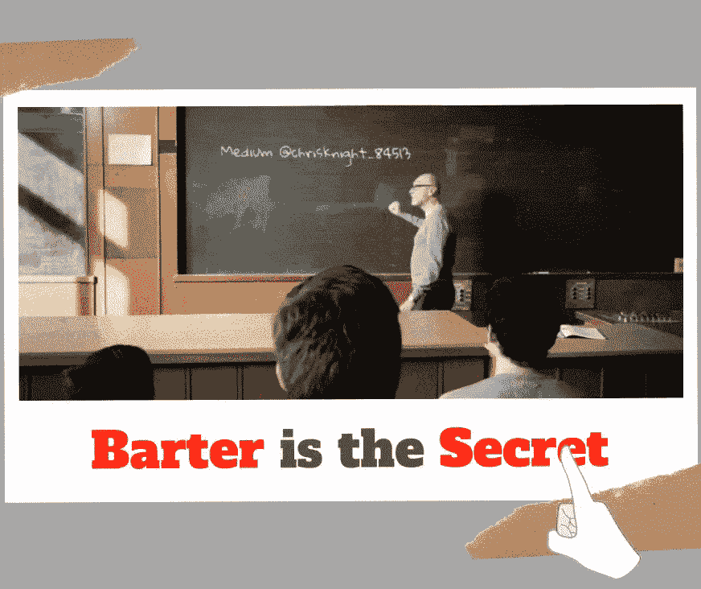
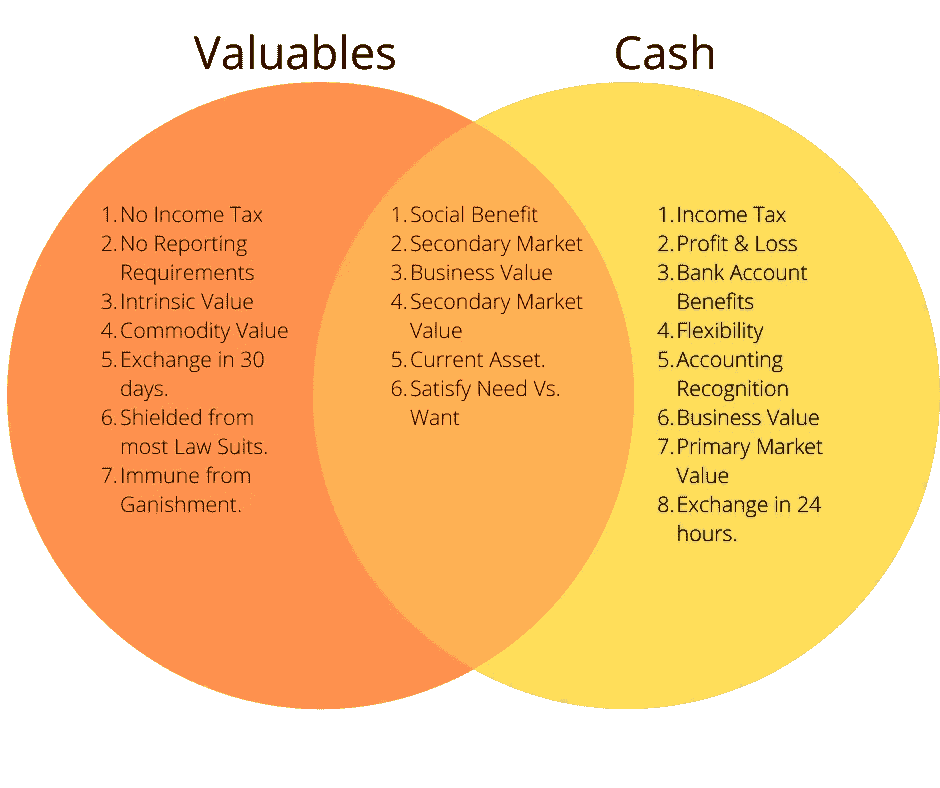

# 物物交换的力量…得到比现金更多的东西。

> 原文：<https://medium.datadriveninvestor.com/the-power-of-barter-getting-paid-more-in-things-than-cash-c62cdcdcd10e?source=collection_archive---------8----------------------->

## 现金是获取物品的转换机制。别忘了我们用现金购买物品，因为现金本身是不值钱的。

Source: Self Created Image with Canva

任何企业的底线都是现金流。财务审查很大程度上受现金进出的控制。现金流量表、损益表和资本化报表似乎主宰着商业战场。我们很少听到或理解物物交换的概念。

> 讽刺的是，现金是我们用来物物交换的机制。在追求满足自我的过程中，我们忽略了价值。

得到 10 万美元的现金听起来比得到 10 万美元的贵重物品好得多。毕竟，物以类聚是无法在银行对账单上体现出来的。非存款活动是坏事吗？我不认为用贵重物品付款是不好的。在许多情况下，贵重物品比现金更有价值。

当唯一的目的是用你寻求的现金获得有价值的东西时，为什么有义务支付所得税呢？

**了解你的动机**

每个人都有所求。*注意到我说每个人都想要一些东西*。我们大多数人都希望有一所漂亮的房子、可靠的交通工具、食物、衣服，为我们的家庭提供必需品。这些都是令人钦佩的目标。

> 如果你要写下一张清单，列出你想要的所有东西，我敢肯定，纸上已故总统的照片不会排在第一位。

你渴望从那些毫无价值的纸屑中获得的才是真正的目的。我们觊觎现金，因为它是获得我们想要的东西的转换机制。如果社会存在这样一种状态，在杂货店、住房市场、停车场或珠宝店的消费金额是以善行来衡量的，那么前景将会不同。

 [## 数据驱动始于数据素养|数据驱动的投资者

### 光是听到“数据”这个词就令人生畏。老实说，只有 21%的全球员工对自己的工作充满信心

www.datadriveninvestor.com](https://www.datadriveninvestor.com/2020/03/22/data-driven-starts-with-data-literacy/) 

现金之所以能控制价值，是因为那些错误地相信其力量的人头脑中产生了错误的假设。

激励我们的不是现金。激励我们的是物质或拥有这些物质。

**易货对现金**

在交易中，现金不需要成为我的支付机制。除了现金之外，很有可能给我一些东西来获得我的服务。我期待的付款方式需要满足几个要求。

第一个要求是满足真正的需求。我需要往返工作地点的可靠交通工具吗？给我一辆卡车。我需要一个住的地方吗？给我一间公寓免费使用。

**第二个要求是现有二级市场的内在价值**。如果我需要用我的物品交换另一件物品，我需要能够在不到三十天内卖掉它。

**第三个要求是计税依据和申报**。我需要得到一些东西，在我卖掉它之前，我没有义务把它作为收入报告给国税局。

如果作为交易对价提出的项目满足这三个要求，我就接受。就这么简单。任何满足真正需要的项目都在清单的最上面。如果你得到了一个真正需要的东西，忘掉现金吧。无论如何，获得的任何现金都将用于购买该物品。消除所得税负担。简单地获得你想要的东西，跳过现金这一步。*不要让自我阻碍一个合理的决定*。

**成本效益分析**

人们放弃东西比放弃现金更容易。银行账户中的现金充其量只能被视为社会地位。往坏里说，银行账户里的现金隐藏着不安全感和性格缺陷。几乎所有的人都关心他们在社会中的地位。

我对过去的社会地位感到内疚。我想走进银行，受到尊重。我不想成为无名小卒。我没有安全感。我从来不在乎钱。我在乎尊重和不被边缘化。我相信大多数人都有这种感觉。我们都是人。谁喜欢被当成无关紧要的人？我很确定没有人喜欢被当成无名小卒。通过自我反省，我意识到人们不尊重现金。人们尊重我关心他们的真实想法。

我在美国银行的银行家喜欢和我聊天，因为我关心她的家庭。这和我的现金没什么关系。我是在经历了某些人生教训后才明白这一点的。与现金相比，购买贵重物品的成本效益是巨大的。与其写下来，我不如用一幅简单的图片来说明。

如你所见，贵重物品有很大的好处。将贵重物品转换成现金可能需要一些步骤，但收益可能远远超过成本。

从易货交易中获得比现金更多的东西

人们常常变得不懂得欣赏事物。那些受消费推动的人通常会在花钱而不是持有物品中找到满足感。虽然受消费驱动的人不总是容易放弃物品，但他们更容易受这种想法的影响。通常，一个非常富有的人会更容易放弃一件价值 5 万美元的物品，而不是 1 万美元的现金。

心理学是任何成功的人际交往的重要组成部分。成功的关系取决于一个人对另一个人的同情程度。通常，有更多同理心的人会获得更大的成功。

我的通过移情进行物物交换的概念并不等同于操纵。**操纵就是按下人们身上的按钮，以获得你想要的结果**。通常这些按钮会打开人们不想打开的门。这些人根据你说的或做的让自己假装舒服或不舒服。如果你失败了，被操纵的人会觉得被利用了。这些负面情绪让人们猛烈抨击你“玩弄他们”。

**同理心是顺应他人动机的自然流动，不按按钮就自愿接受他人所做的事情**。社会关系中的共情是关于发现和谐。共情中没有操纵。只有发现别人自然渴望的东西，才是真正的洞察。一旦发现，你就在人们想做的范围内运作。寻求适当的价值可以让你为自己获得最大的价值。这不是自私或操纵。这是为他人着想的技巧。

傻瓜称之为操纵，但这是缺乏理解，因为那些不能跳出自己的思维去思考的人认为移情是操纵。

这就是为什么有人乐意为你的服务给你 50，000 美元，并且从不要求退款(不管你成功与否)。不是每个人都以同样的方式看待现金。相反，不是每个人都以同样的方式看待贵重物品。

**收官**

记住，在交易中重要的是诚信、意图和真正的努力。没有人能 100%保证成功。那些要求保证成功的人是不合理的。价值最大化的关键是发现人们愿意付出什么。有些人用现金，有些人用物品。我发现物品有时比现金更值钱。通过社会互动发现谁做什么。人们有时会贪图现金，心甘情愿地释放物品。如果物品可以货币化，那就去买吧。

祝你知识成功！

****

关于 Christopher:Christopher Knight Lopez 是一名职业骗子，在他的职业生涯中，他与职业企业家进行了广泛的合作。在他 14 年的职业生涯中，Christopher 已经开了超过 7 家公司。克里斯托弗的目的是利用各种市场驱动的机会。Christopher 是注册项目经理(MPM)和认证财务分析师(AFA)。Christopher 之前通过了 65 系列证券执照考试。克里斯托弗也有他的总路线——人寿、意外、健康和健康维护组织。Christopher 已经管理了总计 2 . 86 亿美元的报告管理资产和建议资产。Christopher 在 29 个国家有工作经验，为各种业务筹集了超过 5000 万美元，在他的个人职业生涯中总收入超过 1300 万美元。Christopher 曾在高科技行业工作:生物技术、金融、证券、制造、房地产和住房抵押贷款。克里斯托弗是一名美国空军老兵。克里斯托弗热爱家庭、竞技体育、钓鱼、武术，并倡导企业家精神。克里斯托弗为崭露头角的企业家提供自助课程。克里斯托弗对导师的热情来自于企业家和骗子需要指导的信念。这个世界充满了关于企业家身份的相互矛盾的信息。在[www.christopherklopez.com 看更多。](http://www.christopherklopez.com.)

免责声明:这些信息并不意味着是一种投资建议或财务建议。不要把这种情况应用到你自己的个人环境中。各种风险包括:商业风险、投资风险、政治风险和其他风险。此信息仅用于信息和教育目的。请不要向作者寻求任何投资策略或哲学。针对自己的情况，请咨询自己的理财顾问或法律顾问。不是任何形式的推荐或认可。