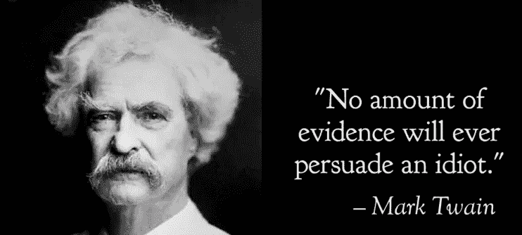

# 令人信服的力量

> 原文：<https://medium.datadriveninvestor.com/the-power-of-being-convincible-8864044263c3?source=collection_archive---------6----------------------->

# 伟大的领导者，像其他人一样，并不总是对的，但是让他们与众不同的是，他们认识到并有意识地努力弥补这一点。

在这篇文章中，我将稍微偏离我的共同主题——我将讨论人类领导者的领导力，而不是人工智能。毕竟，我仍然是一名 MBA，这并没有降低我的数据科学学位的重要性。尽管如此，公开讨论这个话题的紧迫性在某种程度上是由机器学习的成功推动的——基于“数据”的一致性自我调整如何帮助机器学习在许多 ***智力*** *任务中取得比人类更好的表现。*

在一个不断自我完善的商业世界里，关于“如何更好地说服”、“在沟通中更有说服力”等的材料、培训、文章、研讨会不计其数。然而，令人怀疑的是，缺乏的是对被说服的能力的重要性的认识。诚然，它的对立面偶尔会被嘲讽，尤其是在科学领域，“当面对新的更好的证据时，大多数人仍然不能改变他们的想法”，或者，换句话说就是固执。

## “令人信服”是一种经常被误解的能力，随着知识的爆炸，这种能力变得越来越重要。

我们的文化倾向于承认事后成功，我们的宣传刻板地将领导者描绘成具有预言未来的神奇力量的超级天才，包括他们制定的每个计划的结果，他们不顾一切困难坚持这些计划，并说服追随者为他们坚定不移的想法工作、投资甚至奋斗。

我们还从媒体报道中获得社会“暗示”，即“改变主意”等同于优柔寡断、软弱甚至不可信。受利润驱动的大众媒体耗尽了公众人物的人性细节，并以简单的决心和非凡的说服能力来推销人物。当然，社交媒体只会让情况变得更糟，任何稍微不那么固执的人都会被认为优柔寡断、摇摆不定，或者干脆就是“不知道自己在说什么”。

不幸的是，刻板的决定性“领导”实际上更接近于邪教的“成功”,而不是真正的企业家愿望——预言家应该比其他人更早知道事情，对他们来说不应该有任何“新”的东西，所以他们永远不应该改变主意，至少不会公开改变。

老实说，**“专家系统”在 80 年代和 90 年代开始流行，但很快就不流行了，其功能很像这个**。它们是装有由专家精心设计的软件的计算机系统，并试图“复制少数人拥有的专业知识”。问题？他们不能学习，所以他们以“专家”的身份开始，但无法适应不同的情况或随着更多知识的获得而成长。

因此，毫不奇怪，在科学、工程和企业家中，“永远正确”的人通常会发现这样的“上帝礼物”更像是诅咒而不是适合。在这些领域，伟大的领导者开始寻找未知，发明不存在的东西，并建立新的解决方案，而知识和经验有助于规划这种努力，一个特征在这些领域的成功中越来越占主导地位——适应。

作为我们职业抱负的一部分，我们面临着不断变化的条件，我们周围都是超级聪明的同事、客户，甚至我们的竞争对手也经常“不太笨”。相信我总是知道最好的答案可能不是一个必胜的策略。毕竟，在所有尝试的人中，我是唯一一个永远正确的人的可能性相当低。如何增加这种可能性？这非常直观——利用的不仅仅是我自己的大脑。

**根据新信息或处理信息的新方式(包括他人清楚表达的经过处理的信息)调整自己的想法，这实际上是企业领导者的一项重要能力。对于领导者来说，这种头脑的灵活性通常是以“令人信服”的形式实现的。**

SpaceX 的埃隆·马斯克在过去 3 年中多次改变了他的“星际运输系统”的设计，这是出了名的。他对团队和托马斯·穆勒的大部分“更新”给予了充分的信任，包括有史以来第一次使用夹在两层不锈钢外壳之间的液体。他还将“大猎鹰火箭”改名为 Starship 和 Super Heavy，大概是基于媒体的反馈。

已故的伟大的史蒂夫·乔布斯以完美主义而闻名，他曾想“拥有并控制我们所做的一切中的主要技术。”但蒂姆·库克说服他将制造业外包给中国。

我真的希望我不需要让太多人相信史蒂夫·乔布斯和埃隆·马斯克一点也不优柔寡断，也不容易被说服。

我们遇到的一个常见困惑是“令人信服等于优柔寡断”，讽刺的是，这与事实正好相反。“有说服力”代表真正的豁达，更重要的是循证思维原则的一致性，而优柔寡断则代表缺乏原则，思维浅薄，在没有新证据的情况下改变想法。

**这里有三个让你信服而不优柔寡断的关键:**

首先，“令人信服”需要**彻底的逻辑思维**。能够评估证据，处理信息，得出结论，预测结果和推理。对相关主题建立良好的分析基础是具有说服力的先决条件。相比之下，优柔寡断通常表现为对主题的无知或傲慢，缺乏对相关证据的独立分析，不能或不愿意根据现有信息进行推理。那些“摇摆不定”的人往往缺乏自己真正的观点，而改变主意只是对他们缺乏头脑的掩饰。

“令人信服”也要求**透明**，尤其是关于一个人拥有的证据和思考过程。清楚并自信地说明我是如何得出某些结论的，包括支持的证据，这样其他人就可以花时间准备有意义的论点，而不用浪费我太多的时间去回顾基本事实。没有交换证据、数据和知识，一场争论仅仅是一场叫喊比赛，不出所料，不会说服太多的参与者。另一方面，优柔寡断通常带有秘密性，一个人的证据不能被其他人审查，缺乏其他人对手头信息的关注很容易导致盲目和偏见。

最后，但同样重要的是，为了练习“令人信服”，你需要确保他们不会选择“T4”去听谁的话，而是分析“T6”应该相信什么“T7”。这是一种非常常见的心理捷径，人们对一些选定的个人产生信任，并减少对他们的审查。在丛林中，这是非常有效的，因为我们通常没有太多的时间来过度分析是否有老虎藏在下一个灌木丛后面，倾听那些已经证明早期预警能力的人将是救命的(和节能的)。然而，作为一名领导者，在应对高度智力挑战时，这种直觉在高风险决策中可能会适得其反。分析事实、思考过程、假设和风险比“谁”说的重要得多。另一方面，优柔寡断的人根据证据来源的“状态”来评估信息，并且根据谁在何时说了什么，人们会改变优柔寡断的人的想法。

其实说起来容易做起来难。像机器学习，这是一个在 50 年代后期构思的概念，直到 2010 年才真正开始。

如果你去过机器学习场，你可能还会注意到上面的 3 个关键因素与机器学习中的 3 个成功因素不谋而合:1)对手头问题的正确理解(因此可以进行数据准备和数据工程)；2)数据越多越好；3)偏见是我们最大的敌人。

实践“令人信服”是相似的，它需要大量的实践来优化一个人的策略、技能和自我提高。除了“过度分享”信息，我总是鼓励我的团队“说服我”。我的团队中的每个成员都可以畅所欲言，没有等级，没有“历史”(“你上次的想法失败了”在我的会议中不是一个有效的论点)，或者他们可以在看到需要时随时联系我。我指导我的团队进行基于证据的说服，这导致了大量的民间讨论，并通过整合许多伟大人物的思想，恰当地表达他们的思想，经常导致更好的决策。

最后一句话，说服和被说服不是对立的，说服别人的人不是赢家，被说服的人不是输家。相反，每个人都可以在同一个对话中被说服，因为这个过程，当经常练习时，可以帮助组织达成更好的决策——比任何一个人都更好的决策。

没有人生来就知道一切，伟大的领导者认识到这一点，并积极利用他们周围的伟大思想。要比自己伟大，从有说服力开始，但不要优柔寡断。