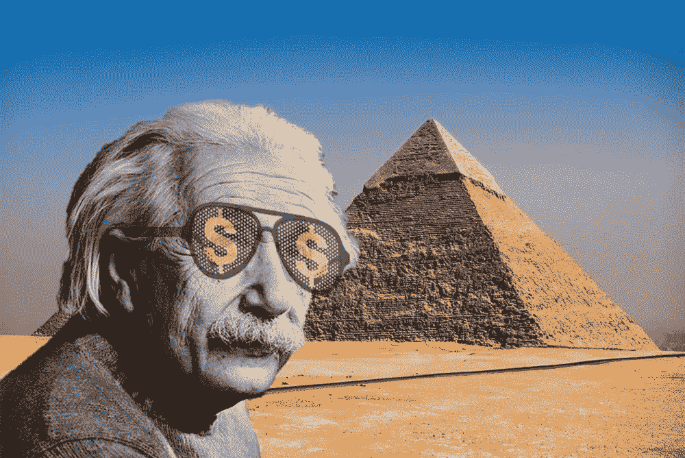
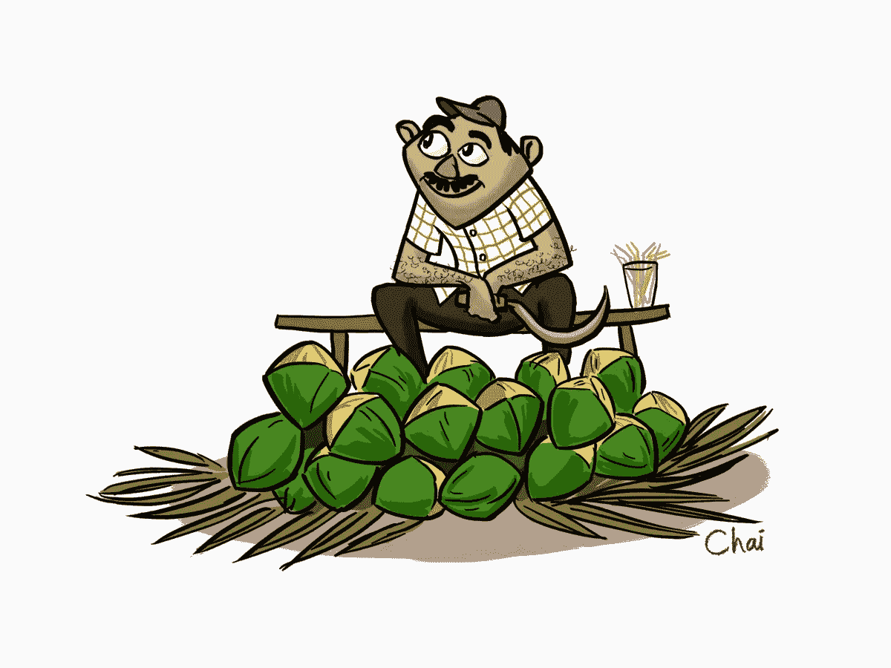
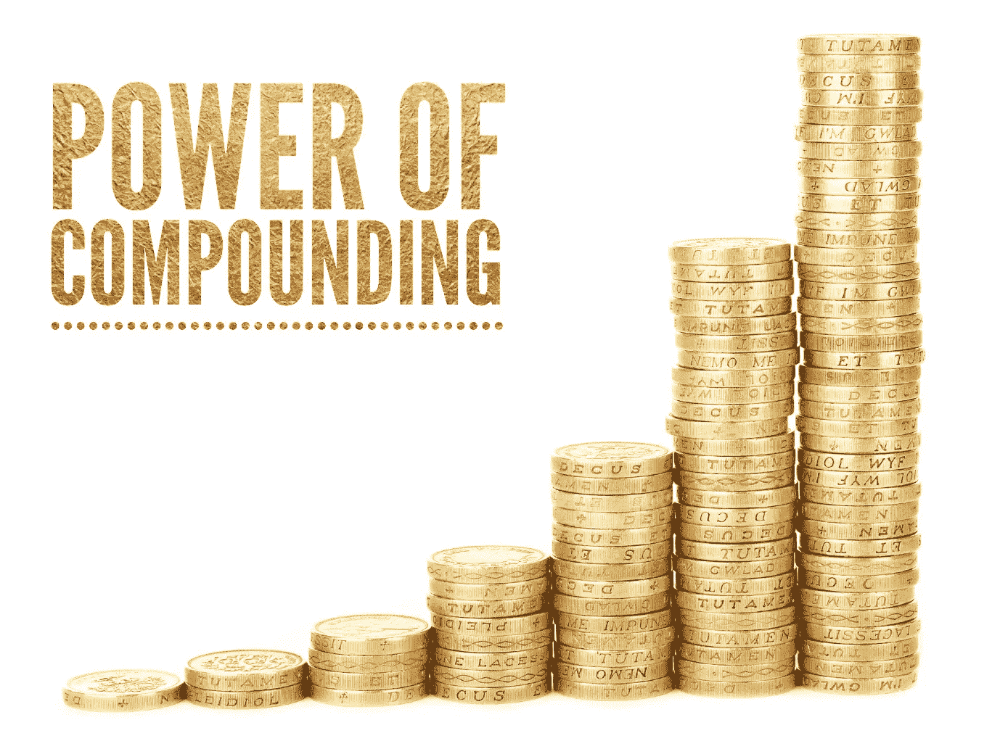
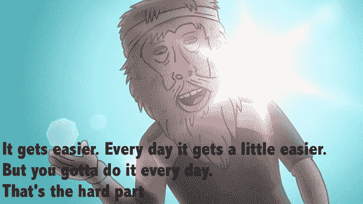

# 复利的力量:世界第八大奇迹。

> 原文：<https://medium.datadriveninvestor.com/the-power-of-compounding-8th-wonder-of-the-world-d853fc61609?source=collection_archive---------5----------------------->

## 探索如何利用复利的魔力来积累财富和改善你的生活。

Image Source: Google

> 复利是世界第八大奇迹。懂它的人赚它…不懂它的人…付出它
> 
> ——阿尔伯特·爱因斯坦

谁没有听说过古老的格言— *“时间就是金钱”*并将其视为另一句格言而不予理会呢？

> 我确信我们都有做那件事的罪过。

事实证明，正如我们的朋友复利所证明的,*字面上的*是正确的——复利是复利魔力的著名例子之一。

复利是，*咳咳，*蛮有意思的。要知道为什么，让我们沿着记忆中的小路走到中学的一堂数学课。让我们先复习几个术语。

> 因弱小而惨败

# 利息和通货膨胀。

让我们稍微跑题一下，说说*呃*嫩椰子水。

*“最好有很多水和肉”*，我告诉卖椰子的人，他磨快了手里的镰刀，熟练地在一大片椰子中寻找合适的椰子。

熟悉的镰刀敲击声，一股水喷了出来，下一刻，我啜饮着清凉的液体。

”*那将是* ₹ *30”，*他说。

我记得几个月前₹25 的价格，两年前₹18 的价格，几年前只有₹8 的价格。

Source: Chaitanya’s Animation Blog

> 很明显，购买同样的椰子所需的钱已经花了很多年了。

我想强调的一点是，金钱的价值或购买力往往会随着时间的推移而降低。这叫做*通货膨胀。发生这种情况的年通货膨胀率叫做通货膨胀率。*

> 这意味着今天的₹100 比几年后的₹100 更有价值！

**椰子够多了！回到兴趣。**

你借钱给某人，比如说₹1000，期限为 5 年。

5 年后，由于通货膨胀，比方说₹1.25 的价值等于你借钱给₹1 时的价值，所以你得到的回报是₹1250 甚至更高！

> 为弥补通货膨胀而支付的额外费用被称为利息。

# **单利 vs 复利:**

假设你以 5%的年利率借给₹1000 卢比(*本金)*。在单利的情况下，你会得到₹50.所以 3 年后，你将获得 3 倍于₹50 或₹150 的利息。

有复利，赚的利息就赚利息！

第一年→1000 的 5% = 50 卢比。新校长= ₹1050

第二年→1050 的 5% = ₹52.5.新校长= ₹1102.5

第三年→1102.5 的 5% = ₹55.125.新校长= ₹1157.625

用 CI 比用 SI 更能赢得₹157.625 或₹7.625。

没什么区别吧？

事情开始变得疯狂了。

现在假设上例中的时间段是 20 年。我将跳过数学，但这是 CI 和 SI 得出的结果:

SI = ₹1000 或 100%的本金。

CI =巨大的₹2653.3 或本金的 265%。

> CI 是这里 SI 的 2.65 倍！

现在假设时间周期是 40 年。

SI = ₹2000 或 200%的增长。

CI =令人难以置信的₹7039 或本金的 703.9%。

> CI 是 SI 的 3.5 倍！

**更疯狂的事情:**

> 40 年后，以 5%的季度复利计算，₹1000 的价值将翻 2457 倍，超过₹24 10 万卢比！
> 
> 让它深入人心！

Source: Google

> 这就是复利的力量——财富成倍增长！

# **如何利用复利的力量？**

正如那句名言所说，选择赚取利息还是支付利息，取决于你自己。

让我们看一个简单的例子。

拉杰和拉姆都想买一辆车。这辆车花了₹7,00,000.

Image Source: Google

Raj 知道复利的力量，并通过将₹10,000 每月存入一笔定期存款(RD ),在过去的五年里每年支付他 10%的利息，攒够了买他梦想中的汽车的钱。成熟时，他收到₹779,079.他可以买下这辆车，同时拥有₹79,079。他总共只投资了₹6,00,000。所以他总共只花了₹6,00,000 减去₹79,079 或者₹5,20,921。

另一方面，Ram 以 10%的年利率购买了一辆 5 年期 EMI 计划的汽车。在接下来的 5 年里，他必须每月支付₹14,873。他最终总共支付了 **₹8,92,376** 的费用。

注意同样的车，拉姆付给₹3,71,455 的钱比拉杰多。

> 你可以说拉姆为不知道第八大奇迹付出了代价。

> 教育管理信息系统、贷款、信用卡等。让你付利息。
> 
> FDs、RDs、政府债券、sip、共同基金和其他投资为你赚取利息。

# 生活中的复合。

复利只是复利的冰山一角。请继续阅读，了解如何在生活中应用复利来实现奇迹般的结果。

Image Source: Google

# **自我提升:**

**所以这里有一个窍门，目标是每天提高自己 1%。**

你认为一年后你会变得多好？

> 有什么猜测吗？
> 
> 1.2 倍，1.5 倍，甚至 2 倍？
> 
> 读到最后。你将会大吃一惊

**那么如何每天变得好 1%呢？**

你可以每天做一次。

*   将智能手机的使用时间减少 5 分钟。
*   把你的闹钟提前 5 分钟。
*   用一种更健康的食物代替一种不健康的食物。
*   多花 5 分钟阅读。
*   在一餐中加入一小份蔬菜。
*   开始每天锻炼。从 10 分钟开始，逐步积累。
*   再喝一杯水。
*   提前 5 分钟上床睡觉。
*   多笑一点。
*   如果你有一个坏习惯，比如说你一天抽 5 支烟。少抽一根烟。
*   给你的生产时间增加 5 分钟。
*   多花 5 分钟听播客。
*   再走 10 步。
*   通过减少花费来节省更多的钱。
*   多花一分钟自省。
*   在脱口而出任何事情之前多考虑几秒钟。
*   从你的待办事项列表中再做一件事。
*   下一次你和别人说话时，多做些眼神交流。
*   粉碎一个消极的想法。
*   多一个积极的想法。
*   做一件好事。
*   与一个新的人联系。
*   多花 5 分钟和家人在一起。

发挥创造力，找到更多的方法来实现那难以捉摸的 1%。

回到一年后你会变得多好。

> 这是一个巨大的(1.01) ⁶⁵ ie。37 倍多一点！

Source: Google

# **习惯**

养成好习惯和改掉坏习惯可能相当麻烦。一个真正有效的方法是通过小而一致的步骤。

## 改掉坏习惯

假设你是一个老烟枪，想戒烟，下面是如何做到的:

Image Source: Google

1.  逐渐减少香烟链中的香烟数量，也许每开始一个链就减少一支。
2.  通过少买一包烟来减少你一天的吸烟量。
3.  通过远离球杆来减少链开始的次数。也许把这包烟放在一个难以接近的地方。

4.冲洗并重复。

变化将是缓慢的，几乎微不足道，但久而久之，他们会复合，在你知道它之前，习惯被打破。

## 灌输好习惯

假设你是一个想采取健康生活方式的电视迷。直接开始严格的饮食和过度运动是导致倦怠和复发的原因。

Source: Google

这里有一个更好的方法:

1.  从减少你的屏幕时间开始，比如说 10 分钟，每隔几天就用健康的食物代替一种垃圾食物。
2.  开始锻炼 5 分钟，每天或每隔几天增加 5 分钟。
3.  早几分钟上床，早几分钟醒来。
4.  冲洗并重复。

随着时间的推移，你会被你的生活方式会发生多大的变化所迷惑。

感谢你的阅读，希望你能从中受益。

快乐生活！