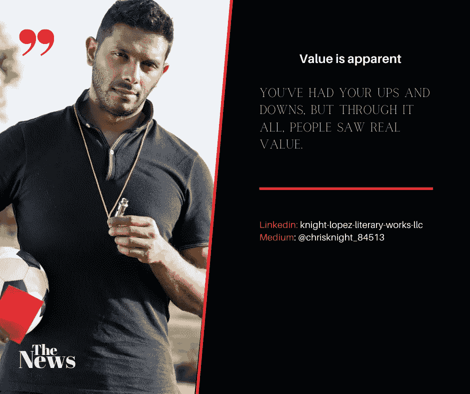

# 意图在所有经济力量中的力量

> 原文：<https://medium.datadriveninvestor.com/the-power-of-intention-in-all-its-economic-might-e73e4d418260?source=collection_archive---------13----------------------->

## 我们在生活中所做的会永远回响。我们说的话永远不能收回。写在屏幕上的字母编码了存在。

Source: Self Created Image with Canva

思想在很长一段时间里都被低估了。

也许今天隐私的最后堡垒是你的思想。你的头脑产生思想。如果你自言自语，没人知道你在想什么。自称的话保持在一个不可逾越的思想堡垒。技术无法突破你的思维。

一个小小的想法如何影响一个经济体？让我们一起来了解一下。

**思想的力量**

你不能把你的想法藏在心里。*真的*。思想确实会表现出来。在本能和直觉之后，人类行动的第二驱动力是你的思想。思想塑造你的行动、行为和情绪。这些想法会产生影响他人的感觉。

[同情心和同理心是人际关系中的伟大推动者](https://www.tandfonline.com/doi/abs/10.1080/17470919.2015.1087427)。

我们都听说过这样一句话，“这感觉就是对的。”

在几乎没有明显解释的情况下，人们可以停止生意，抛售股票，离婚，变得多疑，或者只凭“勇气”孤注一掷。

情绪可以压倒逻辑。尽管人们缺乏将理性与情绪联系起来的愿望，但推理受到情绪的影响很大(来源:转化学习理论中的理性和情绪:一种神经生物学的视角，泰勒博士，爱德华，安托伊奇大学 314 页)。

许多人拒绝承认情绪是如何影响我们看到的结果的。

> 一切都在我们的脑海中开始和结束。一个经济体只不过是一群人的联合体。人们感觉，人们思考。人们的感受和想法是经济成败的基石。

微观层面和宏观层面都是如此。

心理健康是良好经济产出的最重要因素。

 [## 对有商业头脑的投资者有用的行为经济学概念|数据驱动的投资者

### 在美国企业界，高斯统计，对我们周围世界的确定性解释，以及理性…

www.datadriveninvestor.com](https://www.datadriveninvestor.com/2020/07/09/helpful-behavioral-economics-concepts-for-the-business-minded/) 

**我们的经济**

恐惧助长了我们的经济。我们害怕一个疫情。我们害怕警察的暴行。股市交易是由一条推特上的文字推动的(谢谢特朗普)。*不确定性空前高涨*。我在媒体上读到一篇文章，作者认为会发生一场暴力革命。

**恐惧具有可衡量的经济影响。最近，预计 2020 年主要经济体的国内生产总值(GDP)将至少下降 2.4%。**

由于 COVID 引起的动荡，主要经济学家降低了他们对 2020 年全球经济增长的预测。这一减少导致从[的 3.0%](https://www.statista.com/statistics/273951/growth-of-the-global-gross-domestic-product-gdp/)下降到[的 2.4%](https://www.statista.com/statistics/1102889/covid-19-forecasted-global-real-gdp-growth/)。

为了说明这个名义数字，在 COVID 之前，2019 年全球国内生产总值估计约为 86.6 万亿美元。经济增长下降 0.4%，接近 3.5 万亿美元。

基于恐惧的情绪，被基于恐惧的思想合理化，导致了基于恐惧的经济影响。

**希望、和平的思想&诚实的意图**

我自己的经历给了我重要的教训。在个人经历教给我的少量课程中，我学到了一些非常有价值的东西。拥有正确的思想、情感和想法是有道理的。

> 当一个人不诚实、缺乏同理心或不体贴时，人们可以感觉到。人们也能感觉到一个人是否别有用心。这叫“直觉”。

有些人会为了金钱、感知、名誉或其他抽象的目标而不顾直觉。通常无视直觉的人生活非常混乱。

不要求任何东西就能得到你想要的一切是可能的。有人说这很疯狂。如果一个人什么都没要求，他怎么能得到一切呢？

**意向对微观层面的影响**

*意图就是行动*。当你从一个有钱人开始，你的唯一目的是帮助他们，你会发现生活对价值有一定的慷慨。帮助他们不能泛泛而谈。啦啦队员很棒，但并不能让你到达你需要的地方。你必须拥有一项技能或手艺。

> 我所说的价值是真实的、有形的内在价值。技能和手艺不是价值。技巧和手艺是“有用”的。因此，您必须将价值与有用性结合起来，才能看到适当的影响。

一个人如果:1)忠诚，2)有个性，3)诚实，4)正直，5)运用有用的技能去帮助真正需要的人，那么这个人是没有金钱价值的。

这些属性是现存的最有价值的东西。处于权力、影响和经济地位的好人通常认识到这一点。

当受过教育的人(全体)采取一种立场，把性格、正直和道德放在他们技能应用的最前面时，就会发生一些事情。这些思想的力量从微观经济层面(即你自己的个人情况)入手，影响宏观经济尺度。

我们每个人都尽自己的一份力量，可以做一些伟大的事情。

**我自己的例子**

我有幸认识一位音乐界的传奇人物。我很幸运认识一个传奇吉他手。这个人是遗产时代的一部分(想想杰克逊 5，地球，风与火，et cet)。为了保密，我将略去他的名字。他是一个老朋友，我们是通过一系列幸运的事件认识的(更多的是我而不是他)。

作为朋友，我最关心的是他的健康。作为朋友，我最关心的是他的安全。作为一个朋友，我最关心的是保护他免受那些不关心他的人的伤害。

娱乐业可能非常危险。娱乐圈经常是残酷的。这个道理在开创性的想法出来改变景观的时候非常明显。

当我接了他的电话，我意识到他的处境。(出于隐私原因，我将保留他所说的内容)。

我同意了，但告诉他，如果我收不到钱，我就不会这么做。

是的，我说过…“没钱。”

我的目标很简单。如果我真的想帮助某人(我的朋友)，我需要把自己放在无可指责的位置上。其他人会试图推翻我的建议，因为这不符合他们的最佳利益。我不是为别人来的。我来这里是为了我的朋友，我需要每个人都知道这一点。

谁能反驳一个在交易中没有金钱利益的人呢？

因为当我给出一个建议时，无论如何我都没有经济上的好处…这是因为它是我想要的意思。

我的意图是，“这是对我朋友最好的。”

我得到了什么？我确实得到了一些东西…但不是钱。我也不想要。我从来没有被金钱所驱使，将来也不会。

我还获得了其他有价值的东西。真正的价值是对你的认可，当你说话时，让别人听你说话，让别人问“我这辈子怎么才能找到像他这样的人？”

**因不求回报而提供某物**

在我参与这些对话和会议后，人们开始问我想要什么。很明显，我想要什么，并且热衷于追求。我想要什么？很简单…我想让更多的人看这个故事。我想让更多的人看我的文章。我想让更多的人听我说的话，我写的话。

你觉得我会得到什么回报？我会让你们自己解决的。更好的是，也许几个月后你会看到纯粹的想法和意图所能产生的经济效果。也许我会引用这篇文章来说明 6 个月后成功的力量。毕竟…你知道我喜欢做出会成真的预测。

祝你知识成功！

***

关于 Christopher:Christopher Knight Lopez 是一名职业骗子，在他的职业生涯中，他与职业企业家进行了广泛的合作。在他 14 年的职业生涯中，Christopher 已经开了超过 7 家公司。克里斯托弗的目的是利用各种市场驱动的机会。Christopher 是注册项目经理(MPM)和认证财务分析师(AFA)。Christopher 之前通过了 65 系列证券执照考试。克里斯托弗也有他的总路线——人寿、意外、健康和健康维护组织。Christopher 已经管理了总计 2 . 86 亿美元的报告管理资产和建议资产。Christopher 在 29 个国家有工作经验，为各种业务筹集了超过 5000 万美元，在他的个人职业生涯中总收入超过 1300 万美元。Christopher 曾在高科技行业工作:生物技术、金融、证券、制造、房地产和住房抵押贷款。克里斯托弗是一名美国空军老兵。克里斯托弗热爱家庭、竞技体育、钓鱼、武术，并倡导企业家精神。克里斯托弗为崭露头角的企业家提供自助课程。克里斯托弗对导师的热情来自于企业家和骗子需要指导的信念。这个世界充满了关于企业家身份的相互矛盾的信息。在[www.christopherklopez.com 看更多。](http://www.christopherklopez.com.)

免责声明:这些信息并不意味着是一种投资建议或财务建议。不要把这种情况应用到你自己的个人环境中。各种风险包括:商业风险、投资风险、政治风险和其他风险。此信息仅用于信息和教育目的。请不要向作者寻求任何投资策略或哲学。针对自己的情况，请咨询自己的理财顾问或法律顾问。不是任何形式的推荐或认可。

## 获得专家视图— [订阅 DDI 英特尔](https://datadriveninvestor.com/ddi-intel)