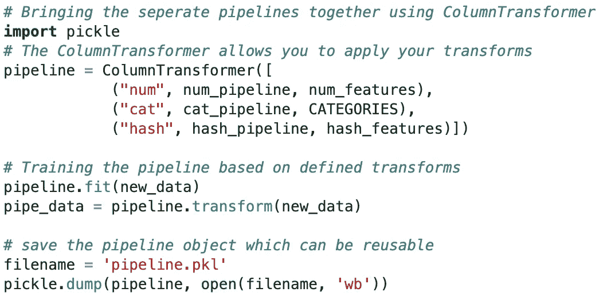

# 机器学习中形状、散列和列转换器的力量

> 原文：<https://medium.datadriveninvestor.com/the-power-of-shapes-hashing-and-column-transformers-in-machine-learning-44b6a0c65cc2?source=collection_archive---------8----------------------->

对我来说，兴奋有多种形式。可以是看 EPL，或者看国际足联。然而，最让我兴奋的是编写一个模型，当我通过深度学习模型传递图像时，它可以预测未来发生的事情或正确预测我最喜欢的谷物(水果和纤维)。我怎么这么快就到了深度学习？我们刚刚在谈论 EPL，GoT，FIFA，lol！

我想从回忆之旅开始。作为一名数据科学家/机器学习工程师，当你面临解决业务问题时，当你有很多疯狂的想法，你在本地机器上做了很多工作，但没有任何东西被推向生产时，情况会变得很紧张(简单来说，**可用的**想法/工作/产品)。你真的开始担心，可能会有很大的压力(不一定像你想的那样被解雇)。这是我早期的许多问题之一，对我来说，关键问题是当我想在我训练的模型上使用测试数据集或通过 API 将其暴露给实时数据(具有全新属性的真实用户)时，再现我的数据预处理步骤(例如，修复形状错误)。

我说的形状是什么意思？它只是你的数据的维度。在二维上下文中，这可能意味着您熟悉的 excel 中的按列排列的行或表格数据。在图像中，它可以是灰度图像(二维)或彩色图像(三维)。这里有趣的是，形状可以有任何形式，在测试时应该考虑训练模型时使用的属性(在逻辑意义上)。最终，当引入新事物时，您希望您的模型仍然能够执行所需的操作(根据您的目标进行分类或预测)。

 [## 认知计算——一套被广泛认为是……

### 作为它的用户，我们已经习惯了科技。这些天几乎没有什么是司空见惯的…

www.datadriveninvestor.com](https://www.datadriveninvestor.com/2020/02/19/cognitive-computing-a-skill-set-widely-considered-to-be-the-most-vital-manifestation-of-artificial-intelligence/) 

为了切入正题，我将展示可能出现的与数据帧和张量的形状误差有关的不同问题。出于本文的目的，我将更多地关注数据帧。我将以 PyTorch 为例，从构建简单网络时常见的张量错误开始。

The diagram above shows a shape mismatch between two tensors

这里发生的是，张量的形状不适合执行矩阵乘法。重要的是，第一个张量中的列数必须等于第二个张量中的行数。要解决这个问题，有三个选项:

*   tensor . shape(a，b)
*   tensor.resize(a，b)
*   张量视图(a，b)

通过使用 tensor.view(a，b)，上述代码的解决方案将是让我们的输出**" y = activation(torch . mm(features，weights.view(10，1)) + bias)"** 。这种方法的一个典型应用是在任何图像分类问题的图像预处理中(例如，许多人熟悉的猫和狗)。

由于张量不是本文的核心，我将更多地关注数据帧错误。对模型工件(已被定型并保存为对象的模型)运行预测时出现的一个常见问题如下所示:

The model expected 187 features but got 619 instead

此类错误的常见原因有:

*   用于定型模型的输入数与测试数据集的输入数不同(在尝试预测时)
*   训练或测试数据集中类别列表中的偏差(属性的增加/减少)
*   库更新以及在新更新中如何处理数据

要解决这个问题，有几种解决方案。这里有两个对我很有效的解决方案:

*   使用 pandas category 数据类型——虽然不可伸缩，但它需要预先了解您的分类属性
*   sci kit-学习管道和列转换器(数值、分类和散列)-圣杯

我会给出更多关于管道的细节，因为它给我*省了很多*压力。拥有管道背后的想法是拥有一系列将在数据集上执行的转换步骤。管道更有趣的地方在于，您可以将其保存为可重用的对象。为了更清楚地描述我的意思，请考虑如何对训练数据进行归一化，填充 NaN 值，并对分类数据进行一次性编码。然后，当测试数据或外部数据(实时用户)被引入模型时，这些步骤被重复；这可能有点麻烦。Scikit-learn 在其预处理包中有内置函数来处理许多这样的场景。我根据下面的属性类型对 pipeline 的几个应用程序进行了分组:

*   数字特征
*   分类特征
*   哈希特征

在上图中，我们有三类管道。num_features 类别包含数据集中出现的所有数字数据。此外，结合了类别和散列特征的猫特征；这里的区别在于,“CATEGORIES features”具有中等基数，本质上是静态的，而“hash_features”具有高基数，也是动态的。我将对下面的每个特性及其各自的管道给出更多的上下文。

# 数字管道(数字管道)

数字属性的典型问题是缺失值或异常值。如果有一个值缺失，您可能希望像大多数人一样用平均值、中值或众数来替换它。当您有异常值时(这可能会扭曲您的数据)，您基本上想要缩放您的值(有不同的缩放选项)。简单估算器可用于替换缺失值，最小最大缩放器可用于缩放数值，如果您想使用标准缩放器，您的数据必须呈正态分布。

# 分类管道(目录管道)

要使用数据集来构建机器学习模型，有必要处理分类变量，最流行的技术是标签编码或一次性编码。在下图中，假设我们使用尼日利亚西南地区的六个州来训练模型，并且在进行预测时，我们将阿布贾作为测试/实况数据集中的州的一部分，那么模型肯定会抛出错误(形状错误),因为训练数据集中没有阿布贾。使用一键编码时，维数也是一个大问题。这就是 hash_pipeline 派上用场的地方。

# 哈希管道(哈希管道)

许多数据科学家都熟悉一种热编码(OHE)，如果您必须处理大型数据集，维度就会成为一个问题(当然，当您有大型计算时除外)。但是，使用 hash_pipeline，您可以为高基数数据建立单独的管道。哈希的概念类似于 OHE，但维度更少，并且由于冲突会丢失一些信息。除非有很多重叠，否则冲突不会对性能产生很大影响。这背后的逻辑是，对于非常稀疏的特征来说，很少特征看起来是信息丰富的，并且总的来说，任何散列冲突都有可能影响信息较少的特征。

特征散列背后的核心思想相对简单；我们使用哈希函数来确定特征在低维向量中的位置，而不是保持分类特征值与特征向量中位置的一对一映射。简而言之，OHE 不会产生 100 000 个新属性，而是会产生 100 00 个散列向量(低维)。这在解决**形状错误**时也会派上用场，因为对于任何给定的输入，它都会生成相同的哈希值。通过使用列转换器(在 scikit-learn 中可用)，可以将所有转换放在一起，并最终保存为单个管道对象，该对象可以在任何时间点重用(如下图所示)。

Full pipeline object (a combination of numerical, categorical and hash features)

最后，为了重用管道对象，从保存文件的目录中打开该文件，并对您想要使用的新数据集进行. transform 操作(这可能是您的测试数据集，也可能是进行 API 调用时的实时数据)。总之，此工作流程的主要优势如下:

*   它们强制执行项目中的步骤顺序
*   你的工作很容易复制，不那么麻烦
*   你不会遇到不必要的形状误差