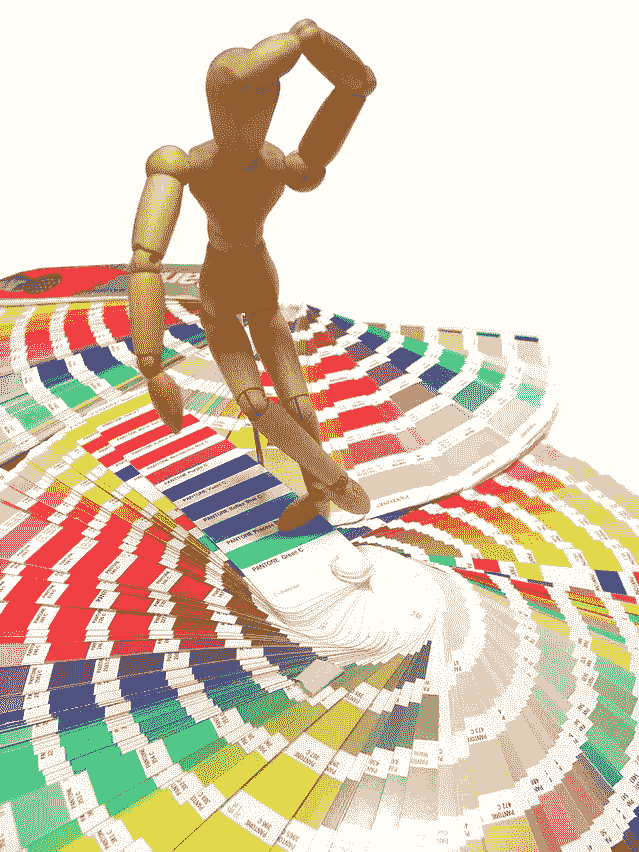

# 你的网站/应用程序的力量

> 原文：<https://medium.datadriveninvestor.com/the-power-of-your-website-app-ea531ff250a8?source=collection_archive---------18----------------------->

我们生活在一个可及/可转化的世界。我们生活在信息丰富的世界里——然而内容却很简单。我们生活在由可见性决定的世界里

知名度、参与度和转化是一个 3 步流程，如果你仔细观察，就会发现知名度有多种形式，包括社交/电子邮件/短信/网站。但是参与和转化只有一种形式——要么是你的网站，要么是你的应用。

> 你可以通过任何平台推广它——但最终转化只能通过网站/应用程序进行(极少数情况除外)。
> 
> 你的网站/应用是你的资产。称之为大/小交易。
> 通过专门的推荐称之为交易——最终转化是通过网络/应用程序进行的。
> 
> 你的网站也需要你照顾其他平台的照顾。你的品牌有助于人们了解你，你的网站增加了额外的价值。
> 比方说，如果你正在打造品牌+产品知名度=你的转化率

 [## 防范内部威胁:新方法|数据驱动的投资者

### 企业网络安全的一个关键问题是数据泄露的内部威胁。员工可以是数据的来源…

www.datadriveninvestor.com](https://www.datadriveninvestor.com/2020/07/30/protecting-against-insider-threat-a-novel-approach/) 

以下是根据我的经验总结的一些注意事项:
**在你搭建之前:
→** 线框/思维导图起主要作用。记得确定能见度和预期的热点。专注于这些领域。
→确保网站的页面加载时间更短
→在任何阶段，如果您无法控制加载，那么使用最有价值的内容(具有市场带宽的产品功能)，然后立即点击行动按钮，可以是“了解更多、填写表格、联系我们”等
→在网站中应用设计思维实践。
→该网站的目标是参与，我们需要的是回头客，而不是快照访问者。

DESIGN THINKING — A PROCEDURE TO PERFECTION

D 设计思维(请参考我关于设计思维的笔记[这里](https://medium.com/datadriveninvestor/my-note-on-design-thinking-1cb1a733198f?source=friends_link&sk=362029f23c48d3bbc0b0f3635fd3ce97))在实现网站的真正需求方面起着主要作用。这是一个开发人员+数字营销人员=访客参与的过程和接受。
→网站/App 从来不是一个走形式的过程。我们从来没有建立它来杀死和想象如果你不能爱你的网站花费足够多的时间…这也意味着人们可能只是说好，但不能爱它。这也意味着有些东西是必需的，但却是缺失的。
→为了克服这种情况，应用设计思维过程，你应该像一个**开发者+营销者+所有者+访问者**那样思考。换句话说——你应该像一个倡导者一样思考，知道并遵循和建议更好的建议
→说服并妥协，但绝不是到了不适合更好的用户参与的程度
→建立网站的预算支出起着主要作用，这是一个真正的专家**知道如何利用最佳可用资源的地方，即使专家较少等。**

最后，你的网站/应用程序是你的宝贝——永远不要忽视它
寻求建议/咨询——通过 [LINKEDIN](https://www.linkedin.com/in/madhuvad/) 联系我

M adhu
Vadlamani

**访问专家视图—** [**订阅 DDI 英特尔**](https://datadriveninvestor.com/ddi-intel)