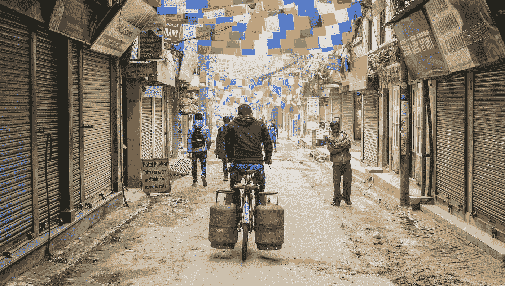
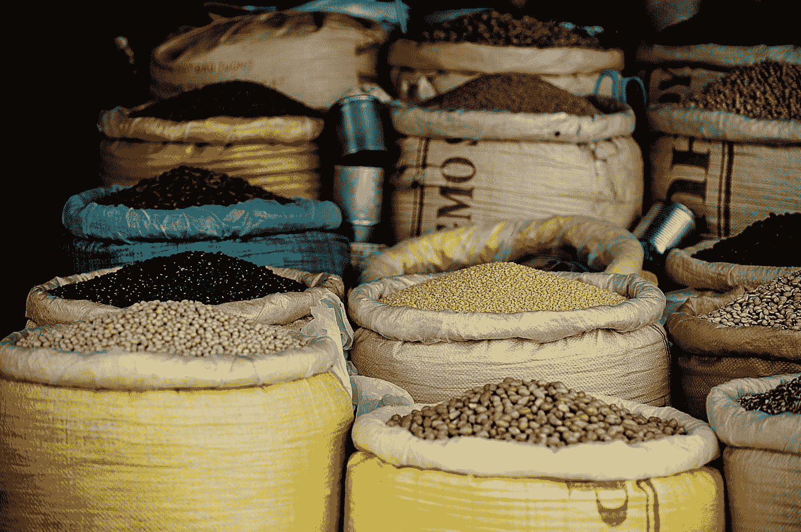
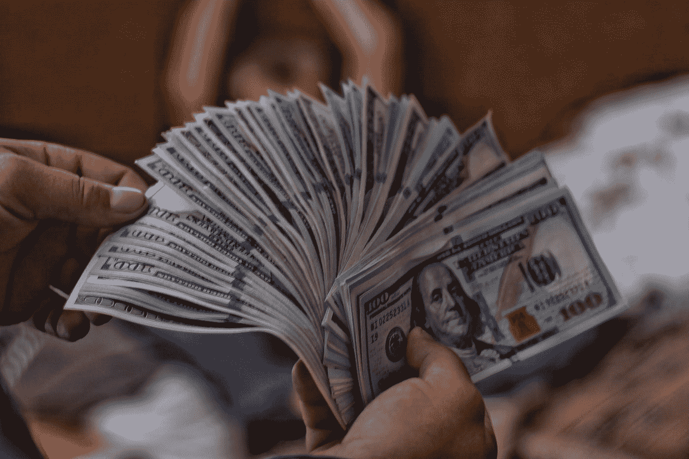
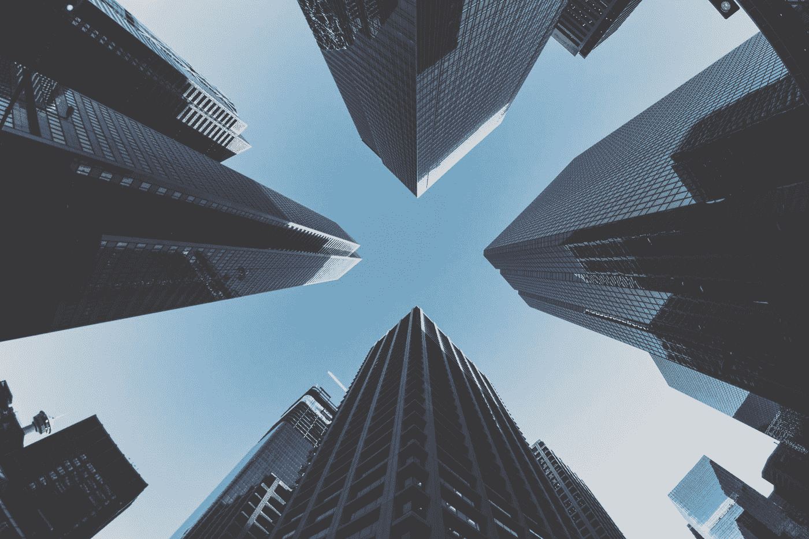

# 贫穷的代价

> 原文：<https://medium.datadriveninvestor.com/the-price-of-poverty-468dc009f1ea?source=collection_archive---------23----------------------->

## 那些没有任何资源支付的人的生活需要付出很高的代价。

Photo by [Adli Wahid](https://unsplash.com/@adliwahid?utm_source=medium&utm_medium=referral) on [Unsplash](https://unsplash.com?utm_source=medium&utm_medium=referral)

大多数人可以想象贫穷并不理想。但是很多人没有意识到他们对贫穷的理解可能是错误的。西方世界存在贫困。事实上，贫困也确实发生在最富裕的国家。有时候，很难想象如果这不是发生在联合国儿童基金会的广告中会是什么样子。

此外，贫困往往会延续下去。有一个真实的概念叫做“贫困陷阱”。这是一个循环，人们做出选择来维持他们的财务状况。今天我想深入探讨其中的一些，因为它们表明贫困在很大程度上是市场失灵的产物。

 [## 为什么包容性财富指数比 GDP 更能衡量社会进步？|数据驱动…

### 你不需要成为一个经济奇才或金融大师就能知道 GDP 的定义。即使你从未拿过 ECON 奖…

www.datadriveninvestor.com](https://www.datadriveninvestor.com/2019/03/08/why-inclusive-wealth-index-is-a-better-measure-of-societal-progress-than-gdp/) 

穷人买什么？好吧，给你个提示:没有那些不贫困的人多(惊喜)。持续限制资金的最大问题之一是，你无法从批量购买中获益。

Photo by [v2osk](https://unsplash.com/@v2osk?utm_source=medium&utm_medium=referral) on [Unsplash](https://unsplash.com?utm_source=medium&utm_medium=referral)

如果你去过超市，你就会知道单位价格会随着你买的越来越多而下降。你从超市进货实际上得到了回报。这在超市环境之外也同样适用。有很多大宗交易。大宗交易的问题是:虽然单位价格更便宜，但你买的所有东西的总价通常不是(否则谁负责定价？！).如果你只能买得起 2 公斤的东西，那么买 4 公斤就没有意义了，因为单价现在便宜了 30%。如果你没钱买 4 公斤的，你就只能买 2 公斤的了。通常，对于那些贫困的人来说，他们不能再多等一会儿来攒钱买 4 公斤。如果我们在谈论食物，你需要吃！

在我之前的陈述中也有一些讽刺:那些贫困的人实际上可能比那些没有这些限制的人更频繁地购买某些东西*？为什么？因为他们不能投资于更贵而且通常质量更高的东西。质量差、价格便宜的东西往往更容易出故障。*

我认为这里有很多例子:更便宜的衣服面料更薄，更容易撕破，或者洗几次后就掉色或不合身。技术崩溃得更快或者变慢得更快。汽车也一样。尤其是买二手货的时候(这没什么错！)存在的风险是，它已经使用了一辈子，更有可能在下一个所有者使用它之前就坏掉或用完。

Photo by [Viacheslav Bublyk](https://unsplash.com/@s1winner?utm_source=medium&utm_medium=referral) on [Unsplash](https://unsplash.com?utm_source=medium&utm_medium=referral)

让你的钱增值的最佳方法是什么？[复利](https://www.moneyonthemind.org/post/the-mystery-that-is-compound-interest)。我相信被动收入(储蓄，但最好是投资)。但是你知道你需要什么来获得这种收入吗？钱。这不是很讽刺吗？

让我们现实一点，这种增加收入的选择对任何贫困的人来说都不是一个选择。但其他选择也不太可能出现……最需要获得信贷的人最不可能获得信贷，这是市场失灵及其反社会本质的一个重要标志。

现在，我个人不认为借钱投资是个好主意(我非常厌恶风险，这不适合我)。但有很多人成功地做到了这一点(也有很多人失败了)，但对于信用评分糟糕的人(或者根本没有评分)，这甚至永远不会是一个选项。你知道贫穷的事实会把你排除在金融市场的很大一部分之外。

这样的话，你能转向哪里？现在事情变得更糟了:不仅“正规”市场拒绝你，而且“非正规”市场也非常乐意接纳你。当我说非正式的时候，我指的是放高利贷的人和其他应该呆在浑浊的水里永远不浮出水面的生物…

我已经写了关于[发薪日贷款如何运作](https://www.moneyonthemind.org/post/the-mystery-that-is-compound-interest)和[为什么它们是可怕的债务](https://www.moneyonthemind.org/post/we-need-to-start-teaching-personal-finance-in-education-now)(它只是增长)，但是如果这是从某种(财务)死亡中的暂时解脱，没有人会借给你钱，你打算怎么办？

如果你不相信我，外面有这样的人，他们积极地掠夺那些处于不稳定财务状况的人，请观看约翰·奥利弗的这两个视频，关于汽车贷款和一般掠夺性贷款。然后告诉我市场没有被操纵。

Photo by [Samson](https://unsplash.com/@samsonyyc?utm_source=medium&utm_medium=referral) on [Unsplash](https://unsplash.com?utm_source=medium&utm_medium=referral)

我认为现在是我们停止指责人们贫穷的时候了，他们做出了“错误的决定”并使他们自己的贫穷永久化。这是一种令人厌恶的耻辱和信念，几乎没有任何现实依据，而且那些事实上可以进入正规市场的人往往相信这一点，他们可能会要求二次抵押贷款或担保良好的贷款，因为从长远来看，这可能会为他们带来某种形式的税收优势。因为他们有钱预先证明他们事实上“善于理财”

那些生活在贫困中的人所遭受的苦难要比上面概述的多得多。我写过关于心理健康和金钱之间关系的文章，也写过关于 T2 长期压力如何导致精神和身体疾病的文章。一部分原因是因为每周都要努力坚持下去的压力，但大部分原因也是因为耻辱。

正如我在本文开始时提到的，西方世界的白人多数对什么是贫困有一个非常清楚的概念:它不是白人的，不是西方的，也不在我们自己的后院。但随着社会在融合中挣扎(我们只是没有正确处理)，政治腐败，厌恶和隐蔽的性别歧视和种族主义变得明显，我们变得越来越分裂，贫困就在我们的眼皮底下发生，我们对贫困的想法已经过时(和种族主义)。但是“这样的事情不会发生在一个优秀的西部白人身上”的想法是有害的。因为它表明，从根本上说，种族主义的基础上，贫穷是低于。

因此，我认为重要的是[解决](https://www.datadriveninvestor.com/glossary/address/)是什么让一个人变穷，以及它如何影响他们的决策:在我的下一篇文章中，我们将更深入地探究贫困的心理。

莫尔·范·登·阿克是华威商学院行为科学专业的博士生。她研究了不同的支付方式，尤其是非接触式和移动支付方式，对我们管理个人财务的影响。在她的“空闲”时间里，她写了一些关于个人理财、行为科学、行为金融和博士生生活的文章，这些都发表在《金钱在头脑》上。通过 DDI，她撰写了关于个人和行为金融的文章，以确保学术界的知识流入主流，并能帮助尽可能多的人！

*原载于 2020 年 1 月 29 日 https://www.datadriveninvestor.com**的* [*。*](https://www.datadriveninvestor.com/2020/01/29/the-price-of-poverty/)