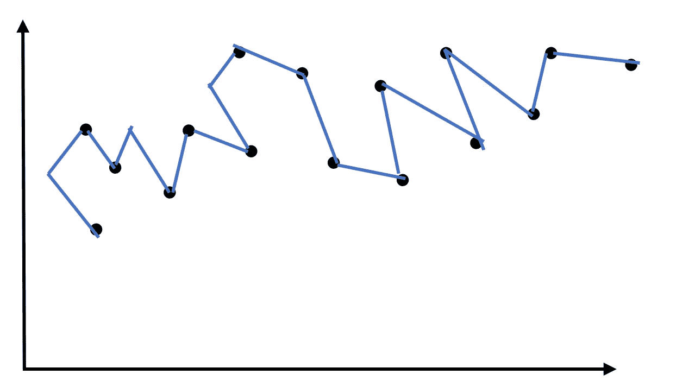
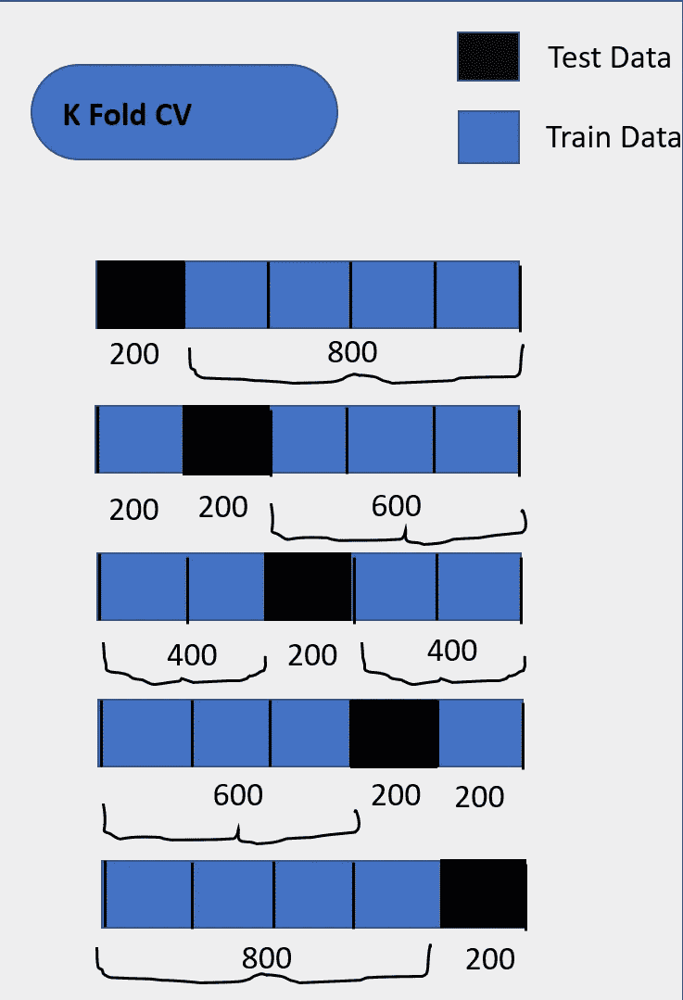

# 回归中的过拟合问题，如何避免？

> 原文：<https://medium.datadriveninvestor.com/the-problem-of-overfitting-in-regression-and-how-to-avoid-it-dac4d49d836f?source=collection_archive---------1----------------------->

H ello 世界！我的数据科学社区博客。上一篇文章我们已经讨论了线性回归中的端到端管道，这里我们将讨论数据科学家和从业者面临的最常见的问题。如果你的模型是**过度拟合**并且你试图解决它，那么这篇文章是给你的。

# 什么是过度拟合？

**过拟合**是一种建模错误，当一个函数或模型过于接近训练集，并在测试集中获得拟合的巨大差异时，就会出现这种错误。**过度拟合**模型通常采用制作过于复杂的模型的形式来解释研究数据中的模型行为。



Overfitted Data [‘Image Created By Dheeraj Kumar K’]

# 过度拟合的例子

让我们用例子来说明，

假设我们需要根据一个学生的简历来预测他是否会得到一份工作面试。现在假设我们从 20，000 份简历及其结果的数据集训练一个模型。

然后我们在原始数据集上尝试一个模型，它预测的结果有 98%的准确率…哇！很神奇，但现实中没有。

[](https://www.datadriveninvestor.com/2020/02/19/five-data-science-and-machine-learning-trends-that-will-define-job-prospects-in-2020/) [## 将定义 2020 年就业前景的五大数据科学和机器学习趋势|数据驱动…

### 数据科学和 ML 是 2019 年最受关注的趋势之一，毫无疑问，它们将继续发展…

www.datadriveninvestor.com](https://www.datadriveninvestor.com/2020/02/19/five-data-science-and-machine-learning-trends-that-will-define-job-prospects-in-2020/) 

但是现在坏消息来了。当我们在新的简历数据集上运行一个模型时，我们只有 50%的准确率。

我们的模型没有从我们的训练数据中很好地一般化，以查看看不见的数据。这被称为**过拟合**，是数据科学中的常见问题。

事实上，**过拟合**在现实世界中无时无刻不在发生。我们需要处理它来推广这个模型。

# 如何发现过度拟合？

机器学习和数据科学中的主要挑战是，在测试之前，我们无法评估模型的性能。因此，找到过度拟合的第一步是将数据分成训练集和测试集。

**如果我们的模型在训练集上比在测试集上表现得更好，那么我们很可能过度拟合了。**

可以使用在两个数据集中观察到的准确度百分比来测量性能，以推断是否存在**过度拟合**。如果模型在训练集上比在测试集上表现得更好，这意味着模型很可能**过度拟合**。例如，如果我们的模型在训练集上看到 99%的准确性，但在测试集上只有 50%的准确性，这将是一个很大的警报。

# 如何防止过度拟合？

1.  使用更多数据进行培训
2.  数据扩充
3.  交叉验证
4.  特征选择
5.  正规化

让我们深入一点，

# 1.使用更多数据进行培训

防止**过度拟合**的方法之一是借助更多数据进行训练。这使得算法能够更好地检测信号，从而将误差降至最低。用户应该不断收集更多的数据，作为提高模型准确性的一种方式。然而，这种方法被认为是昂贵的，因此，用户应该确保所使用的数据是相关的和干净的。

# 2.数据扩充

使用更多数据进行训练的一种替代方法是数据扩充，与前者相比，它的成本更低。如果您无法持续收集更多的数据，您可以使可用的数据集看起来多样化。每次模型处理样本数据时，数据扩充都会使样本数据看起来略有不同。该过程使得每个数据集对模型来说看起来是唯一的，并且防止模型学习数据集的特征。

# 3.交叉验证

交叉验证是防止**过度拟合**的有力预防措施。

这个想法很聪明:使用你的初始训练数据来生成多个迷你训练测试分割。使用这些分割来调整您的模型。

在标准的 k 折叠交叉验证中，我们将数据分成 k 个子集，称为折叠。然后，我们在 k-1 个折叠上迭代地训练算法，同时使用剩余的折叠作为测试集。



Cross-Validation [‘Image Created By Dheeraj Kumar K’]

交叉验证允许您仅使用原始训练集来调整超参数。这允许您将您的测试集作为一个真正不可见的数据集来选择您的最终模型。

```
from sklearn.model_selection import cross_val_scorefrom sklearn import model_selection **def** kfold(models, train_X, train_y, seed=7, scoring='accuracy', n_splits=10):
    results = []
    names = []
    **for** name, model **in** models:
        kfold = model_selection.KFold(n_splits=n_splits, random_state=seed)
        cv_results = model_selection.cross_val_score(model, train_X, train_y, cv=kfold, scoring=scoring)
        results.append(cv_results)
        names.append(name)
        msg = "**%s**: **%f** (**%f**)" % (name, cv_results.mean(), cv_results.std())
        print(msg)
```

# 4.特征选择

一些算法具有内置的特征选择。

对于没有概化的要素，您可以通过移除不相关的输入要素来手动提高它们的概化能力。

一个有趣的方法是讲述一个关于每个特性如何适应模型的故事。如果任何事情都没有意义，或者如果很难证明某些特征，这是识别它们的好方法。

```
from sklearn.feature_selection import VarianceThreshold
varModel=VarianceThreshold(threshold=0)
varModel.fit(x_train)constArr=varModel.get_support()
constArrimport collections
collections.Counter(constArr)
```

# 5.正规化

## 什么是正规化？

正则化是一种降低模型复杂性的技术。它通过惩罚损失函数来做到这一点。这有助于解决**过拟合**问题。

## 为什么我们需要正规化？

让我们看一些例子，

我们想预测一个学生的学生成绩。对于预测，我们使用学生的 GPA 分数。该模型无法预测一系列学生的分数，因为该模型过于简单，因此具有较高的偏差。

我们现在开始添加更多可能会影响学生成绩的功能。我们向我们的模型添加了更多的输入特征，出勤率、中学生的平均成绩、初中生的身体质量指数、平均睡眠时间。我们看到随着更多的输入特征，模型开始变得过于复杂。

我们的模型还学习了数据模式以及训练数据中的噪声。当一个模型试图拟合数据模式以及噪声时，那么该模型具有高方差 ad，这将**过度拟合**。

一个**过度拟合的**模型在训练数据上表现很好，但是不能泛化。

正规化有三种类型

1.  L 1 或套索
2.  L 2 或山脊
3.  L 3 或弹性网

# L 1 正则化或套索

**套索回归**非常**相似就像脊回归**和**有**非常**的区别。类似于 Ridge** lets，我们从一群老鼠的**重量**和**尺寸**测量开始。我们将数据分成两组**红点**是**训练数据**而**绿点**是**测试数据。**

我们**使用最小二乘法将直线**拟合到**训练数据**，这意味着**最小化残差平方和。**

当我们这样做时，即使**线与**训练数据**非常吻合，它**具有低偏差**，如果它**与**测试数据**不吻合，它**具有高方差。**在 Lasso 回归中**残差平方和+λ*(|斜率|)** 这里我们采用绝对值代替斜率平方。

像岭回归 **λ** 值可以是从 **0 到正无穷大**的任何值，并且使用交叉验证**来确定。**岭回归和套索回归的**大区别**在于**岭**只能**将变量** **渐近于 0** 而**套索**可以**将变量一直收缩到 0**

```
from sklearn.datasets import load_boston
from sklearn.linear_model import LinearRegression
from sklearn.linear_model import Ridge
from sklearn.cross_validation import train_test_splitboston=load_boston()
boston_df=pd.DataFrame(boston.data,columns=boston.feature_names)newX=boston_df.drop('Price',axis=1)
print newX[0:3] # check 
newY=boston_df['Price']X_train,X_test,y_train,y_test=train_test_split(newX,newY,test_size=0.3,random_state=3)lasso = Lasso()
lasso.fit(X_train,y_train)lasso100 = lasso(alpha=100)
lasso100.fit(X_train, y_train)train_score=lasso.score(X_train,y_train)
test_score=lasso.score(X_test,y_test)lasso00001 = Lasso(alpha=0.0001, max_iter=10e5)
lasso00001.fit(X_train,y_train)train_score00001=lasso00001.score(X_train,y_train)
test_score00001=lasso00001.score(X_test,y_test)
coeff_used00001 = np.sum(lasso00001.coef_!=0)
```

# L 2 正则化或岭

**岭回归**。**岭回归**是线性**回归**的延伸。它基本上是一个正则化的线性回归模型。

让我们开始收集一群老鼠的体重和尺寸。由于数据看起来相对线性，我们使用线性回归，最小二乘法，来模拟体重和体型之间的关系。我们应该找到残差平方和最小的线结果。

直线方程

尺寸= 0.9+0.75 * **重量**

尺寸= 0.9 +0.75* 2.5

尺寸= 0.9 +1.88

尺寸= 2.8

当我们进行大量测量时，我们可以相当确信**最小二乘法直线**准确地反映了**尺寸**和**重量之间的关系。**

如果我们只有两个测量值，那么**新线**用最小二乘法拟合。由于**新线**与数据点重叠，**最小残差平方和= 0。**第二张图显示了原始数据和用于比较的原始线。

两个**红点**为训练数据其余**绿点**为测试数据。两个**红点****训练数据**的残差平方和较小(本例中为 **0** ，而**绿点、****测试数据**的残差平方和较大。

让我们从**插入**对应于**最小二乘拟合的数字开始。**

**体积=** 0.4 + 0.3 * **重量**

**残差平方和+ λ *(斜率)^ 2**

(因为线重叠点)0 **+** 1 * (1.3) ^2 = 1.69

现在让**将**数字插入**脊线回归线**

**尺寸=** 0.9 + 0.8 * **重量**

**残差平方和+ λ *(斜率)^ 2**

(0.3) ^ 2 + (0.1) ^ 2 + 1 * (0.8) ^2 = 0.74

因此，**λ**值增加，然后**对尺寸**的预测变得**不敏感**，因此我们必须进行**交叉验证**来决定 **λ** 值**。**

```
from sklearn.datasets import load_boston
from sklearn.linear_model import LinearRegression
from sklearn.linear_model import Ridge
from sklearn.cross_validation import train_test_splitboston=load_boston()
boston_df=pd.DataFrame(boston.data,columns=boston.feature_names)newX=boston_df.drop('Price',axis=1)
print newX[0:3] # check 
newY=boston_df['Price']X_train,X_test,y_train,y_test=train_test_split(newX,newY,test_size=0.3,random_state=3)rr = Ridge(alpha=0.01)
rr.fit(X_train, y_train)rr100 = Ridge(alpha=100)
rr100.fit(X_train, y_train)train_score=lr.score(X_train, y_train)
test_score=lr.score(X_test, y_test)Ridge_train_score = rr.score(X_train,y_train)
Ridge_test_score = rr.score(X_test, y_test)Ridge_train_score100 = rr100.score(X_train,y_train)
Ridge_test_score100 = rr100.score(X_test, y_test)
```

## L 3 正则化或弹性网

如果我们很了解我们模型中的所有参数，就很容易选择我们是想使用**套索回归**还是**岭回归。**

如果我们的模型有几个变量，我们能做什么？

要知道太多的变量是很困难的，那么我们当然需要用一些正则化的方法来估计它们。

然而我们的变量可能有用或无用，我们事先并不知道。

现在应该选择**套索回归**还是**岭回归？**

我们什么都不用选，反而可以去**弹网回归。**

就像 Lasso 和 Ridge **弹性回归从最小二乘**，**开始，它结合了 Lasso 回归罚函数和 Ridge 回归罚函数**

**λ1 * |变量 1| + … + |变量 x |+λ2 *[|变量 1|] + … + [|变量 x|]**

**套索回归+** 我们不用选择任何东西，相反，我们可以去**弹性网回归。**

就像套索和岭**弹性回归从最小二乘**，**开始，它结合了套索回归罚函数和岭回归罚函数**

**λ1 * |变量 1| + … + |变量 x |+λ2 *[|变量 1|] + … + [|变量 x|]**

**套索回归+岭回归**

我们对λ1 和λ2 的不同组合进行交叉验证，以找到最佳值

我们对λ1 和λ2 的不同组合进行交叉验证，以找到最佳值

# 结论

在这篇博客中，我们讨论了过度拟合、过度拟合的预防以及正则化技术的类型，正如我们所看到的，Lasso 帮助我们在偏差-方差之间进行权衡，并帮助我们选择重要的特征。然而，Ridge 只能收缩接近于零的系数。

我希望这有助于探索其他测试和方法。

此外，让我知道我是否错过了**过度配合**概念中的任何内容。

与我联系:- [LinkedIn](https://www.linkedin.com/in/dheerajkumar1997/)

与我联系:- [Github](https://github.com/DheerajKumar97)