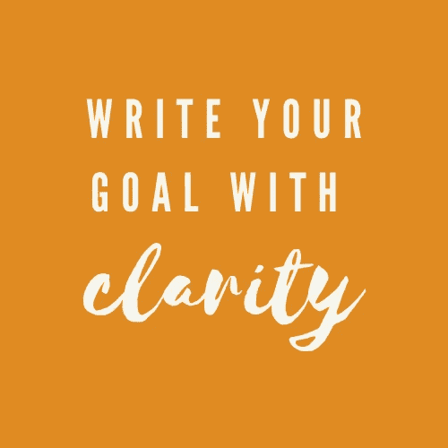
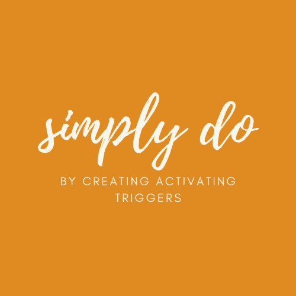
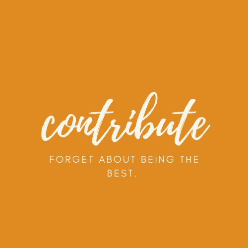
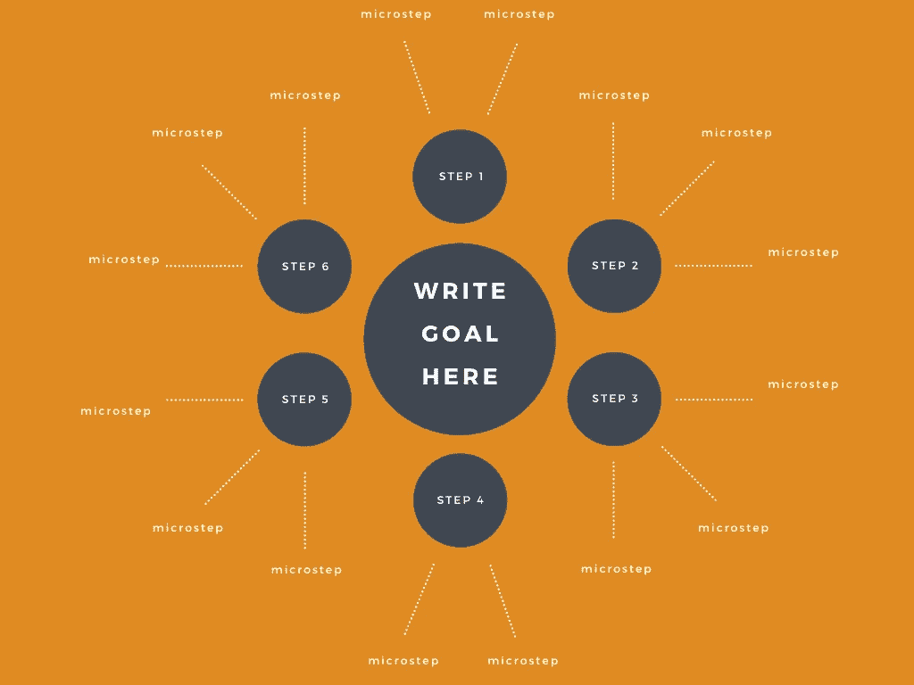

# 如何实际设定和完成你的目标(使用可编辑的模板)

> 原文：<https://medium.datadriveninvestor.com/the-process-in-setting-and-accomplishing-goals-ca6b2164a865?source=collection_archive---------25----------------------->

你认为自己是 A 还是 B？

答:你有*许多*目标。你无时无刻不在想他们，你梦见他们，你变得超级兴奋，你告诉自己‘现在是你的时候了！’，你甚至采取了一些步骤来完成这个目标，但在大多数情况下，你努力实现它们。

运筹学

**B:** 你积极地完成你的目标，创造新的目标，并带着难以置信的动力前进。似乎没有什么能阻挡你。你知道你希望你的未来是什么样的，它就在你的掌握之中。

如果你认为是 B——恭喜你。你可以关闭这篇文章，再找一篇对你有用的。但是如果你和 A 有共鸣——像我们大多数人一样——那就留下来。事情即将改变。

# 1.知道你要去哪里

如果你不知道你要去哪里，你不能也不会改变你的生活。

所以让我问你:

一年后，你的生活会是什么样子？

它看起来和感觉上和现在的生活一样吗？你能想象吗？

*其实问问自己。*

不要拐弯抹角。不要置之不理。问问你自己:一年后的生活会是什么样子？

**如果你不知道答案，就继续问自己。让它陪着你，直到你知道。直到你能清晰地描绘出自己，在接下来的一年里，做你知道已经深深扎根于你内心的事情。**

当你知道的时候，*写下来。*

你希望你的目标不仅仅是你谈论的梦想——所以写下来，清晰地写下来。

不仅仅是“我想成为自由职业者”，而是“我将拥有一个繁荣的播客，拥有 x 数量的订户和 x 数量的资金支持”。

不是“我想减肥”，而是“我想减掉 20 磅，散发自信，感觉充满活力”。

能够自信地想象自己已经在那里*是一个目标游戏改变者。*

当你在脑海中看到它时，你的注意力会转移，你的决定会转移，你如何度过你的时间也会转移。

让我们举第一个想成为自由职业者的例子:

你不再武断地希望成为自由职业者。在你的脑海中，你看到自己在那里。你现在积极参与，寻找实现目标的方法。你与能让你更接近目标的事物合拍。你参加了创建播客的课程，你有了一个名字，你设定了一个愿景，你自信地练习说话。你买了一个麦克风。你开始把自己融入这个世界。你注意到 instagram 上的人可能是你播客的嘉宾。

你现在看这个世界就好像你是 T21，而不是潜意识中的“永远不会是我”。

 [## 如何管理优秀的团队和你自己|数据驱动的投资者

### Janice Presser 博士是团队科学及其基础理论的先驱实践者。老生常谈就是说她…

www.datadriveninvestor.com](https://www.datadriveninvestor.com/2020/05/26/how-to-manage-great-teams-and-yourself/) 

# 2.不要依赖意志力——触发你的成功

你的大脑非常努力地为你优化生活。它接受信息，将其转化为行为，并围绕信息/行为组合创建触发器，以消除决策过程，使您更容易做出决策。

例如:孩子们上床睡觉(触发)——打开网飞(行为)；观察网飞(触发)——吃一份松脆的零食(行为)；吃一份松脆的零食(触发)——喝一杯(行为)；

为了实现你的目标，你必须确定并积极设置触发因素，这些触发因素将促成你想要的行为*，并为你做出决策。*

*这种情况发生了(触发),你只是简单地做下一件事(行为),没有太多的思考。你不再依赖意志力，你只是简单地触发自己做出你想要的行为。*

*最重要的是:*你创造的触发器需要比你想要完成的目标更容易。**

*集思广益，找出 2-3 个有助于你实现目标的触发点。*

*目标:减掉 20 磅，散发自信，充满活力*

*触发器:*

*   *前一天准备好运动服——在你的镜子上贴一张便条来提醒你(触发)*
*   *下载自信心态宣言，准备在开车时播放——在回顾镜上挂一个宣言来提醒你*
*   *清空抽屉，只放那些让你感觉强壮和充满活力的衣服(触发心态和自我保健)*

*目标:学习一种乐器*

*   *将乐器放在您最喜欢的座位旁(便于拿起)*
*   *周一、周三、周五下午 4 点自动给自己发送课程链接；日历显示“约会”时间为下午 4 点到 5 点*
*   *经常去洗手间的时候，把书/短训班/复习页放在浴室里学习*

*请记住，**的触发器越简单越好**和*的触发器最好*是可以自动化的——这种自动百分比的工资支票将用于储蓄或定时电子开关。*

*如果你已经被触发开始，你想要的行为将更有可能跟随。换句话说，你已经开始了。你的大脑不必现在就尝试做决定，也不必为是否开始而苦恼。你不再依靠意志力来让自己朝着目标前进。你真的需要。*

*你的运动服在那里，所以你当然要穿上。然后你就去健身房。你会听到已经排好队的肯定。你穿上你喜欢的衣服，让你感觉很好，因为它们很容易得到。你越爱你自己和你的身体，你就越想给它应得的爱。*

**

*有时候诱因真的很简单。我在卧室门上贴了一张蓝色便利贴，提醒我在睡觉前把一堆要洗的衣服放进洗衣机。这样，在早上，我走过的时候只要按一下按钮，它就开始了。当早餐做好，我回到楼上给孩子们穿衣服，整理床铺，快速收拾东西的时候，衣服洗好了。*

*注意那些在你心中根深蒂固的触发因素，以至于你甚至不再注意到它们。对你有害的触发器*除掉它们*。*

*对我来说，我会在孩子们上床睡觉的时候打开《办公室》的一集，在我洗碗的时候看；但是很难关掉它，我的夜晚消失了。菜肴引发电视。电视引发了懒散的欲望，随之而来的是效率低下。*

# *3.不要告诉别人*

*只要和别人谈论你的目标，你就能获得巨大的多巴胺刺激。谈论这件事并不会因为你把它公之于众而让你更有责任感，这仅仅意味着你很早就有了“我做到了”的高度(即使它还没有完成)。一旦最初的兴奋和兴奋消退，就很容易失去方向和注意力。*

*所以把你的目标留给自己。让人们通过看到你的成功来了解它，看着你积极地向前迈进。*

# *4.解构你的目标*

*带着你的目标，你的梦想，你对未来的憧憬去解构它。问问你自己:*

**为了实现我的目标，我需要做些什么？**

*怎样才能最快地将指针移向我的目标？*

*有哪些事情是我告诉自己需要“去做”但实际上却是无聊和拖延的？*

*创建一个列表，并准确地**规划出流程中每一步需要做的事情。你可以随心所欲地梦想，但是如果你想达到你的目标，你需要计划，一步一步来。然后，你需要执行这个计划，不要被闪亮物体综合症所干扰(你知道，一旦兴奋消退，事情变得艰难，你就会转向下一个令人兴奋的想法)。***

# *5.关注有意义的贡献*

*听着，你不能再追求完美了。在你把某样东西投入世界之前，你需要停止努力成为最好的。你需要忘记让你所有的鸭子排成一排。*

**

*相反，关注有意义的贡献。*

*坚持你的目标是重要的，你对它是认真的，它有一个重要的目的。*

**因为确实如此。**

*你有实现目标的理由。*

*一个完全属于你自己的、带来价值和意义的理由。*

*也许只是为了你，也许是为了别人；但不管是为了谁，它都有一个影响你周围世界的目的。*

# *6.相信你的目标可以改变世界*

*也许你不相信你的目标有意义。“我只想有一个干净的厨房。这对世界有什么影响？”*

*让我告诉你，我们采取行动并有目的地朝着行动和期望的每一个目标都会对我们周围的世界产生重大影响。*

**

*不仅仅是干净的厨房。*

*压力更小。*

*压力小会让你成为更好的妈妈。*

*一个更好的妈妈会有更好的孩子。*

*更好的孩子造就更好的社会。*

*一个更好的社会会创造一个更好的世界。*

*是的。甚至一个干净厨房的目标也很重要。*

*不管你的目标是什么。追求它，就像它有能力改变世界一样。*

# *这是你的行动模板！*

*你可以使用这个模板来帮助你思考并写出完成目标所需的所有步骤。*

*只需[点击此处](https://www.canva.com/design/DAEJaueMW80/y-hmT1-l9MbvmzIxN9drjg/view?utm_content=DAEJaueMW80&utm_campaign=designshare&utm_medium=link&utm_source=publishsharelink)即可访问！*

**

*你能行的！*

*杰萨林*

## *获得专家视图— [订阅 DDI 英特尔](https://datadriveninvestor.com/ddi-intel)*