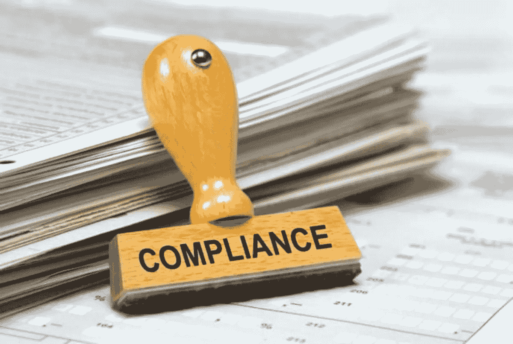

# 每位受托人都需要了解的行之有效的合规方法

> 原文：<https://medium.datadriveninvestor.com/the-proven-approach-to-compliance-every-trustee-needs-to-know-about-7c72bba308d6?source=collection_archive---------9----------------------->

作为一名受托人，你可能并不清楚需要承担大量的报告和备案义务。随着《海外账户税务合规法案》( FATCA)和《通用报告标准》( CRS)的出台，新受托人越来越难以了解他们需要做什么。为了让它变得简单，我们创建了一个简单的 3 分钟阅读，旨在让你跟上速度。

**什么是 FATCA 和 CRS 定律？**

众所周知，逃税是一个全球性的问题，而且这个问题经常出现在高净值个人的门口。新的法律法规旨在通过允许个人居住国从其他国家收集有关他们在这些国家的任何金融资产的信息来发现逃税者。简而言之，它们旨在阻止个人将资产隐藏在海外。

**对我有何影响？**

作为家族信托的受托人，您将被要求遵循 FATCA 和 CRS 的尽职调查流程和您的报告责任，以确保合规。虽然这产生了大量的文书工作，但也有助于确保合规性和准确的报告。

**你必须知道报告的是什么**

你需要对与你的信托有关的所有金融机构将要报告的信息有一个清晰的概述。这将消除任何重复努力，使已经顺从的家庭成员不得不经历漫长的审计调查，最终对任何人都没有经济利益。同样重要的是，FATCA 和 CRS 的所有报告都要与您的纳税申报完全一致。所有托管人、受益人和保护人都需要听取该建议，具体要求由信托的个人结构决定。

**民营信托公司合规进场**

民营信托公司也将受到新规出台的进一步审视。特别是，这意味着所有董事必须遵守当地所有相关的公司法，并且公司必须保留全面的公司记录。它还必须召开年度会议，在美国国税局(IRS)一个名为 FI 的特殊报告类别下注册，并在 CRS 注册为投资实体。还需要保存年度会计记录，清楚显示任何适用的受托人服务费。

**投资主体 FI 状态的维护**

信托的结构由多家标的公司组成是再正常不过的事情。这样做的一个常见原因是，如果不同的家庭成员使用多种投资策略。然后，他们需要成立不同的公司来分散他们的工作。

 [## 股票捐赠:知道什么|数据驱动的投资者

### 有很多交易者和投资者也分别试图找出捐赠他们的…

www.datadriveninvestor.com](https://www.datadriveninvestor.com/2020/08/03/stock-donations-what-to-know/) 

在这种情况下，每个基础公司都必须获得并保持金融机构投资状态，以确保合规。要做到这一点，它需要有一套书面的 FATCA 和 CRS 政策和程序，以及一套清晰准确地详细说明其所持资产的投资表现的年度账目。

接下来会发生什么？

家族信托是一种行之有效的方式，可以确保财富和辛勤劳动的成果代代相传，而不会让个人承受高额税收负担，或者不受限制地获得财富。管理它们是一项复杂且高度专业化的工作，联系有经验的专业人士可以最有效地完成这项工作。

**访问专家视图—** [**订阅 DDI 英特尔**](https://datadriveninvestor.com/ddi-intel)