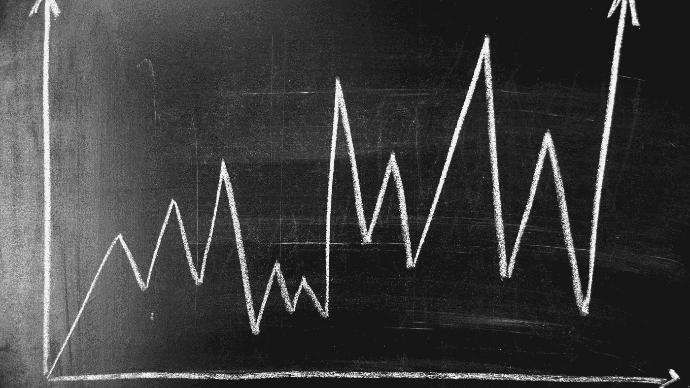
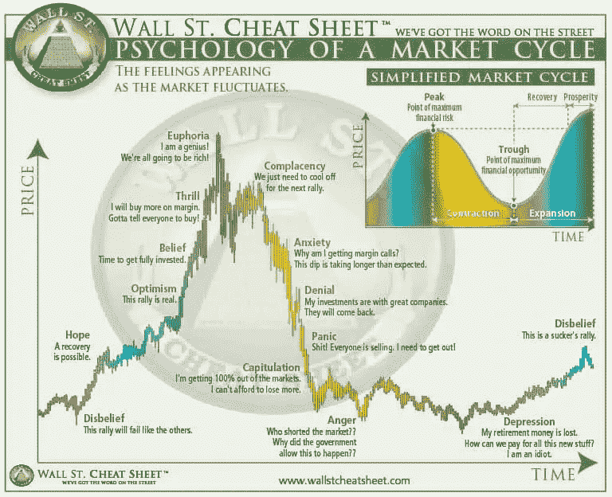

# 股票市场周期的心理学

> 原文：<https://medium.datadriveninvestor.com/the-psychology-of-the-stock-market-cycles-bfc5f23d8c56?source=collection_archive---------4----------------------->

## 学会适应起起落落

Canva Pro Image

我喜欢投资公司，因为我从 12 岁就开始思考了。

当我开始有意识地思考为什么有些人变得富有，而有些人却没有，以及经济和企业与此有什么关系时，我记得非常清楚。

我是一个很自豪的拥有 C64 的人，并且得到了一些可以玩的游戏。其中一个非常简单却又令人着迷的游戏是

> [凯泽](https://www.c64-wiki.de/wiki/Kaiser)

它在德语中的意思是皇帝，是关于领导一个帝国的。另一个史诗模拟游戏是 [M.U.L.E.](https://en.wikipedia.org/wiki/Business_simulation_game)

这些游戏有一个简单的目标:

> 建立一个成功的企业/帝国。

随着时间的推移，模拟在技术上变得更好，是了解我们经济基础的完美方式。

为了获得更多的见解，我上了一所商业学校，在学习经济的同时试图搞清楚一些事情，为了实践我所学到的东西，我不断地玩经济计算机模拟。

这里有一份在电脑上进行的[令人难忘的商业模拟](https://en.wikipedia.org/wiki/List_of_business_simulation_video_games)的完整列表，供那些喜欢走在记忆小道上的人参考。

不用说，我一直玩到 2015 年，这是我决定在股市上全押的一年。

# 全部有现货

今年，我发现了第一个社交交易平台，并认为这是社交媒体提供的最佳发明之一。

这些平台邀请每个人展示他们的投资和交易技巧。我使用 Wikifolio 来尝试不同的投资方法，然后将它们转移到我的真钱投资组合中。

为了保持我的积极性，我把我所有的积蓄都投入到这个投资组合的股票中。最值得学习的是在没有任何安全网的情况下害怕失去一切的情绪。

要么你学习，要么你失败，没有中间的选择。

过去 5 年，我不得不学习，因为我经历了许多错误和失败，有时我恨自己。

要是我能事先知道这个和那个就好了，这是我决定孤注一掷以来最深思熟虑的想法之一。

至少有了社交交易档案，我有机会在市场条件下尝试许多新事物，而没有机会伪造任何东西——除了不涉及真钱。

我学到的最重要的一点是:

[Source to more information](https://cryptopotato.com/what-are-crypto-market-cycles/)

# 理解市场周期的动态

这是一个非常重要的学习动力。单一股票和市场不会直线上升或下降。

它们的上升或下降趋势有周期，这对于那些想直接投资股票市场而不是间接投资标准普尔 500 ETF 的人来说至关重要。

即使有人决定通过 ETF 进行投资，部署资金来识别模式也可以在多年后对整体表现起到甜蜜的推动作用。

这些周期的关键要素是什么？

让我们把注意力集中在我认为最重要的两座山峰上:

# 愤怒、沮丧和恐慌

无论环境有多好，公司有多好，市场和公司都会不时失败。

即使公司的经营业绩很好，它们也不容易受到市场动态的影响。想想 2000 年和 2001 年的亚马逊就知道了。

经营业绩如日中天，但互联网泡沫破裂，亚马逊股价从每股 100 多美元跌到 6 美元以下。

在这些问题发生的日子里，报纸上的抱怨是最大的。

一般的散户投资者通常会在他们觉得自己在股市上损失了巨额资金的时候撤资，因为他们相信自己不会损失更多的钱。

这也是百万富翁和亿万富翁把他们的钱投资到像股票这样愚蠢的东西上的日子。

> 当街上有血的时候买

这句话出自罗斯柴尔德男爵之口，这正是富人中最富有的人正在做的事情。

他们向市场投入了数十亿美元，因为他们知道，在那些日子里，富人创造了更多的财富，而普通人却决定在一旁观看比赛。

## 规则 1:当每个人都在哭泣时，考虑投资。

很多时候，我犯了在高点买入，在低点附近害怕的错误。我花了一段时间才明白，在暴风雨中保持冷静是最好的解决办法。

除了向市场投入更多资金外，什么也不做。

在过去 30 年里，每次崩盘，市场都会迅速恢复，甚至达到更高的高点。这是我观察市场的时候，市场总是上涨。

崩盘日是创造新百万富翁的日子。那些聪明的、身边有钱的、足够大胆的、在波涛汹涌的时候投入市场的人，是几年后的赢家。

# 甜蜜的欣快感

我们生活在一个通过社交媒体获得短期满足的时代。科学证明，这些社交媒体喜欢点燃我们的荷尔蒙腺体，用甜蜜的多巴胺愉悦我们的身体。

我把这种效应归因于市场反弹带来的情绪。与崩盘的低点相反，那些反弹的日子是一个秘密的毒贩子。

伟大的是，没有人必须购买那些自产的药物——市场先生挑逗我们内心的药房，感到快乐。

当大众意识到市场正在上涨时，这种从众心理会增加社交乐趣，让高点变得更高。

我们一起走向欢欣鼓舞，并使彼此相信，艰难和贫困的日子已经过去，一去不复返了。

在那些日子里，不寻常的投资者开始突然冒出来。这位优步司机向你解释了他从上周开始使用的防弹投资策略。

这位老奶奶展示了有史以来最好的股票选择，她在三天前开始写投资策略的杂志上看到了这个消息。

或者一个服务员在读了他的第一本关于投资股市的书后，想向你推销他设计的网上研讨会。

所有这些都是我一次又一次看到的迹象，在市场崩溃的黑暗之夜开始之前，在每次反弹的黎明，市场都接近历史高点。

## 规则 2:当每个人都投资时，开始跑步。

当每个买了第一只股票的人都觉得自己是投资大师时，是时候开始从桌上拿些筹码了。

一次反弹可以持续很长时间，而且并不是所有的崩盘都是一样的。毕竟，市场中的时间胜过不断地选择市场时机。

但是在最高点增加一点谨慎，在最低点增加一点大胆不会有什么坏处。

你不相信？回想一下 2017 年比特币暴涨的时候就知道了。2017 年 12 月，比特币达到约 2 万美元的历史高点，并在约一年后的低点 3500 美元后暴跌。

许多人在 2017 年 12 月全部出局，相信比特币价格不断上涨的新时代，并在随后的 12 个月里失去了神经。今天呢？比特币在 5 万美元以上。

没人建议在低点买比特币，很多人说它死了。

如果有人没有全押，而是决定在 2018 年的 12 个月内投资储蓄并持有硬币，会发生什么？试着弄清楚。

现在是 2021 年，在 2020 年初因新型冠状病毒疫情而发生可怕的崩盘后，市场在飙升，而部分经济却在遭受打击。

由于市场只有一个方向，今天许多人看起来像投资天才:

> 起来，起来，走！

这种巨大向上运动的原因是什么？

自从疫情开始以来，全世界的政府和中央银行都开始了一生一次的拯救计划来拯救经济。

由于零利率，资本只有两个地方可以流动

*   房地产和
*   股票市场

什么时候会结束？也很难预测 2021 年的未来，但最有可能的是在央行决定再次加息的时候。

我决定在接下来的几个月里更加谨慎，但不要过度害怕。

投资愉快。

**更多关于理财素养的故事:** [**点击此处**](https://christian-soschner.medium.com/17-great-stories-on-financial-literacy-4c7cbe5dbb10)

自 1999 年以来，我是各行各业公司的执行官、顾问和教练。我专攻企业发展和金融，从种子轮到 IPO 级别，从 2006 年开始专注于生命科学。

[**加入我的邮件列表，保持联系！**](https://mailchi.mp/5a50875fb5ea/newsletter)

*本文仅供参考，仅代表我的观点。不应将其视为财务或法律建议。在做出任何重大财务决定之前，请咨询财务专家。*

# 读者:

 [## 你知道密码市场周期吗？你应该

### 我们都记得 2013 年底那场巨大的比特币挤兑，或者给它一个更通俗的名字——“2013 年泡沫”。我不是…

cryptopotato.com](https://cryptopotato.com/what-are-crypto-market-cycles/)  [## 准确了解我们在股市周期中的位置——交易者和投资者

### 下面你有两个选择来学习瘦信息:1。观看本文的 13 分钟视频版本。2 .阅读文章…

www.thetechnicaltraders.com](https://www.thetechnicaltraders.com/three-charts-every-trader-and-investor-must-see/)  [## 商业模拟游戏

### 商业模拟游戏，也被称为经济模拟游戏或大亨游戏，是游戏的重点是…

en.wikipedia.org](https://en.wikipedia.org/wiki/Business_simulation_game)  [## 多巴胺、智能手机和你:争夺你的时间——新闻中的科学

### 由特雷弗海恩斯数字由丽贝卡克莱门茨“我感到非常内疚，”承认查马斯帕里哈皮蒂亚，前副…

sitn.hms.harvard.edu](http://sitn.hms.harvard.edu/flash/2018/dopamine-smartphones-battle-time/)