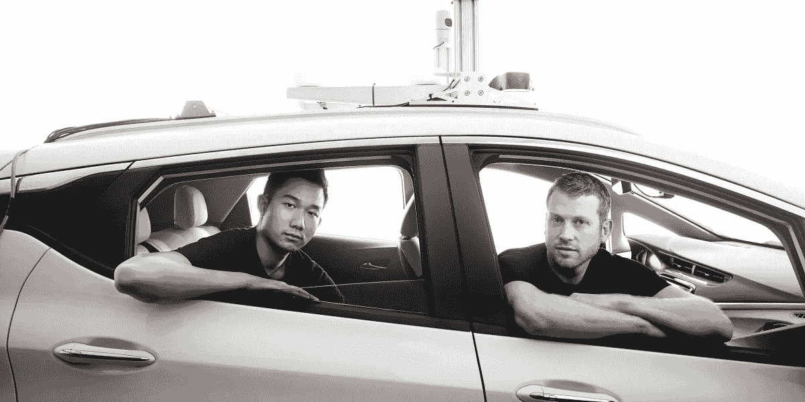
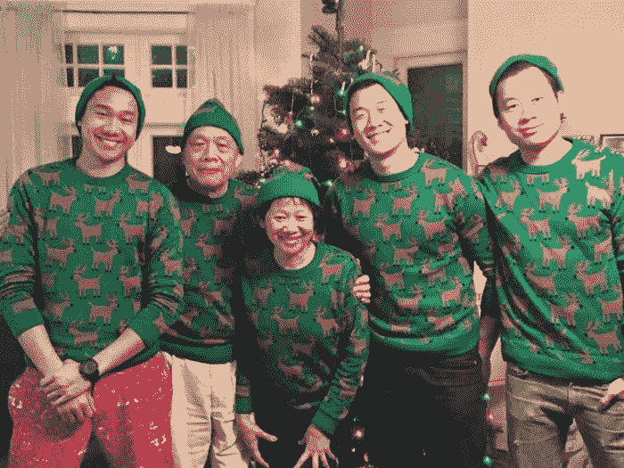
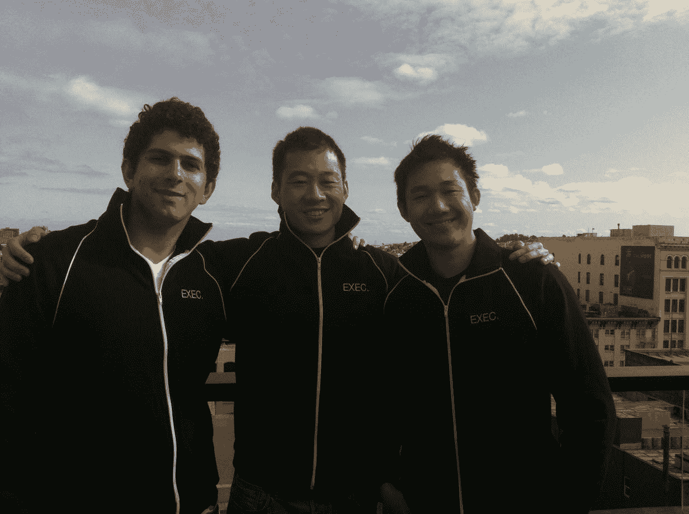
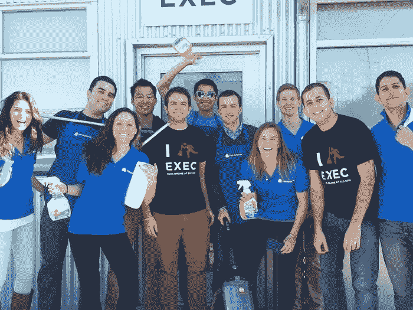
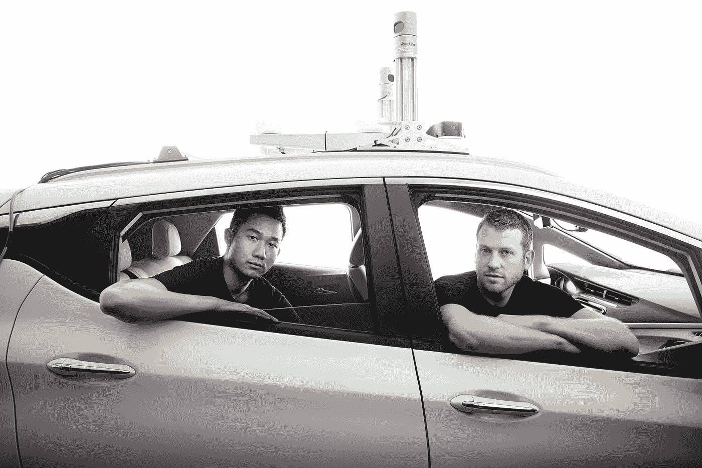

# 任务记录:丹·坎

> 原文：<https://medium.datadriveninvestor.com/the-quest-minutes-dan-kan-a915baa4d01e?source=collection_archive---------2----------------------->

## 以十亿美元退出的肯兄弟

Dan Kan (left) and Kyle Vogt (right) in a Cruise car

> 这篇文章是由 Quest Minutes 的撰稿人 Jimmy Hsu 撰写的。我们一直在寻找伟大的故事讲述者。你可以在这里申请让你的作品以[为特色。](https://airtable.com/shrADX8MNwdmW2vjA)

# 介绍:丹·坎。

[**丹·坎**](https://www.linkedin.com/in/danielkan) ，贾斯汀·坎的兄弟，以 30 多次求职被拒开始了他的职业生涯，他接着说道:

*   在 **UserVoice** 工作(帮助公司收集用户反馈)
*   发现**开胃**(每家餐厅的 app)
*   和 Justin 一起运行 **Exec** (个人助理点播)
*   成为 **Cruise** 的联合创始人兼首席产品官，这是一家无人驾驶汽车公司，以超过 1B 的价格被出售给通用汽车。

# Kan 元素

企业家精神在菅直人家族中根深蒂固。丹·坎非常感谢他的母亲，她开创了各种事业。

> *“可能在某些方面，我们周围的人只是说，‘好吧，你必须完成它——这是任务，找出如何完成它’，这就是企业家精神。”*
> 
> *—* ***丹侃***

It runs in the family!

# 火的考验

2009 年，丹在经济衰退最严重的时候毕业，得到了两份工作——在韩国教英语或者加入一家名为 UserVoice 的初创公司。

丹选择了用户之声，这是一次试射，因为他的老板在他开始工作的那天就被解雇了。

> “我当时负责除了产品以外的所有事情——比如销售、办公室事务、公司文化、会议事务，都是一些随机的事情，但主要是公司的销售。”

这教会了他经营一家初创公司所需的早期技能，近两年后，他决定自己创业。

# 第一站

丹从一个朋友开始，让餐馆为自己开发应用程序。两个月后，苹果公司打电话告诉餐馆将所有应用程序合并，或者购买大多数人负担不起的单独的开发者许可证。

> “看到你和我周围的其他人创办公司，我觉得，‘这似乎并不难。’结果，我完全错了。”

他们不得不转向，因此，随着贾斯汀加入团队，Exec 诞生了。

The start of it all.

他一点也不知道，这将是他们有史以来最具挑战性、最耗费情感的创业公司之一。

# 高管:领先于时代

Exec 本质上是一个跑腿服务。然而，领养并不顺利。很快，Kan 兄弟意识到他们身处两个市场:

杂货和房屋清洁。

> “我记得曾经争论过是食品杂货还是房屋清洁更好，不管出于什么原因，我们决定转向房屋清洁，结果发现这是一个他妈的糟糕的市场。”
> 
> —贾斯汀·坎

页边太薄了。Homejoy 和 Handy 是两个竞争激烈的巨头，他们不得不退出这个行业。

> “我记得当时想，好吧，我们要卖掉它。我们去了其他风险投资公司，比如 Handy 和 Homejoy。他们在这场僵持不下的比赛中，基本上规模相同，争夺下一轮资金，我只是说，“嘿，我要在感恩节前把它卖给你们中的一个，不管你们给我什么——不管是什么最好的报价。”这很有效。这是最有趣、最搞笑、最令人惊讶的事情。"

A lesson learned.

# **克鲁斯的故事**

退出后，丹联系了一位老朋友凯尔·沃格特(Kyle Vogt)，他在 Justin.tv 实习时创办了 Cruise。

> “凯尔告诉我他的新创业想法，那就是制造无人驾驶汽车和清洁服务。我当时想，你知道，这听起来太棒了。”
> 
> —丹·坎

丹以非技术型创始人的身份维持公司运营，而凯尔在 3 个月内创建了一个 MVP，在高速公路上进行现场演示以筹集资金。

> “在一年的时间里，我们把它从可以在高速公路上行驶几秒钟的原型变成了从旧金山开到帕洛阿尔托。”

Cruising through the pivots.

尽管面临着技术和昂贵的支点的挑战，他们所做的事情的巨大影响使工作变得令人兴奋。

> “有时对空间的天真，只是带着初学者的心态进来，你可以做任何事情，这使你作为一名企业家获得足够的动力，当你发现问题有多困难时，你不会气馁。”
> 
> —贾斯汀·坎

今天，克鲁斯可能看起来像一个巨人， ***，但每一步都是从过去的*** 的教训中建立起来的。

从在丹母亲的早期企业里干坏事，到在 UserVoice 的一家初创公司里打拼，再到与 Handy 谈判的经历，最终促成了通用汽车 10 亿美元的收购。

Dan and Justin — in their true form.

每一步都伴随着巨大的情感成长和无价的教训，这些教训将应用于未来，丹指导并带给克鲁斯今天。

> “任何事情都可以分解成足够小的步骤，这样它们看起来就容易管理。人们不会记得或忘记的是，在你走到最后一步之前，你必须不放弃。”
> 
> —丹·坎

谢谢你的精彩谈话，丹。

> 这篇文章是由 Quest Minutes 的撰稿人 Jimmy Hsu 撰写的。我们一直在寻找伟大的故事讲述者。你可以在这里申请让你的作品成为特色。
> 
> 吉米是 Astro 的创始人，该公司支持创作者的每一笔交易。他也是一名自学成才的移民，克服了无家可归和贫困，之前曾在 WeWork 和 Pandora 担任高级首席工程师。
> 
> 在空闲时间，他喜欢用喷火器做饭，并在所到之处建立社区。
> 
> 你可以在[推特](https://twitter.com/202accepted)、 [LinkedIn](https://linkedin.com/in/jimjam) 和 Clubhouse @doge 上找到吉米。