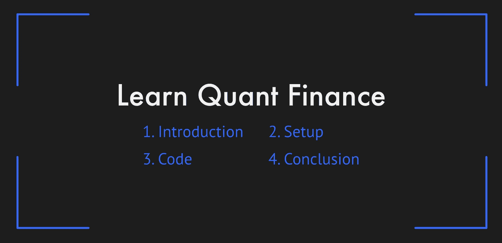
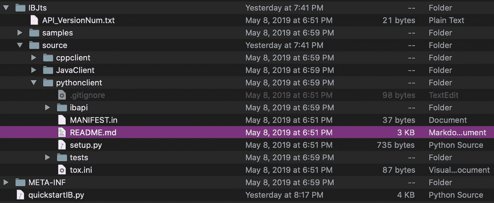
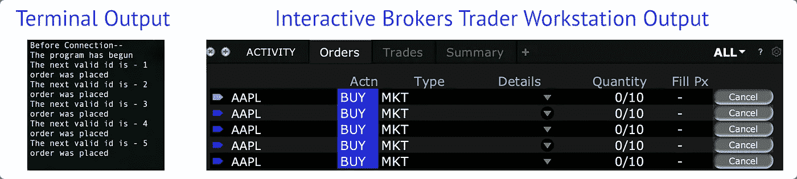

# 交互式代理 API (Python)快速入门指南

> 原文：<https://medium.datadriveninvestor.com/the-quick-beginners-guide-to-interactive-brokers-api-13a89de14b7d?source=collection_archive---------1----------------------->

This article is a three-minute read with 30-minutes of total setup & runtime

# 介绍

本文将向您展示在 [Interactive Brokers](https://www1.interactivebrokers.com/en/home.php) API 上执行 Python(纸)交易程序的最快路径(大约 30 分钟)。

文字和图表将尽可能简洁，同时保持一套清晰的流程。

如果您想了解更多信息，请参考我在该系列中的其他媒体文章:[连接&服务器通信](https://medium.com/swlh/structure-and-communicating-with-interactive-brokers-api-python-78ed9dcaccd7)和[订单执行](https://levelup.gitconnected.com/executing-orders-on-interactive-brokers-api-how-to-guide-b8fb6059a0f0)。完整指南可在 Quant 学院的[找到。](http://thequantacademy.com?utm_source=Medium&utm_medium=writing&utm_campaign=quick_guide)

*免责声明:本指南旨在简化和加快学习过程。在完成任何真正的交易之前，充分理解代码是至关重要的。*

# 设置

*   [在互动经纪人上创建账户](https://www1.interactivebrokers.com/en/index.php?f=4695)
*   [下载](https://www1.interactivebrokers.com/en/index.php?f=16040)交易员工作站(TWS)
*   从 Github 文档中下载 API 文件

打开交易者工作站，用你的交互式经纪人账户登录(选择纸上交易)。转到文件->全局配置-> API。设置您的配置设置以匹配以下内容:选中*启用 ActiveX 和套接字客户端*；取消选中*只读 API*设置 socket 端口为 7497 进行票据交易；

解压缩 API 文件并放在一个方便的位置。如果以后 API 出现错误，可能需要按照设置步骤:IBJts-> source-> python client-> readme . MD(如下图)。

# 密码

*注:关于代码和过程的解释，请访问本节专用的* [*扩展媒体文章*](https://medium.com/swlh/structure-and-communicating-with-interactive-brokers-api-python-78ed9dcaccd7) *。*

*   从 Github 下载[“快速启动”代码](https://github.com/corbinbalzan/IBAPICode)
*   将快速入门文件夹放在 TWS API 文件夹中(与 IBJts 处于同一级别)

File tree and Readme location inside API folder

导航到可以运行文件“quickstartIB.py”的 API 文件夹。确保交易者工作站正在运行。使用以下命令运行 Python 脚本:

> python3 quickstartIB.py

**程序现在将执行五个苹果**订单，每个订单数量为 10 个。你可以去你的交易员工作站，在“订单”或“投资组合”部分进行核实。

Output after running ‘python3 quickstartIB.py’

# 结论

恭喜你！**现在你有了一个正常运行的 Python 交易程序。**这应该会给你一个提示，说明在交互式代理 API 上进行开发对你来说是否是正确的选择。

本指南省略了每一步的推理、中间操作和故障排除注意事项，以提供一篇快速、易读的文章。本文旨在让交互式代理初学者(有编程经验)快速了解 IB API。

如果你需要更多的解释(作为一个真正的初学者)或者在这个过程中出了什么问题，请查看下面的步骤。

## 后续步骤:

*   学习 [**全指南**(Quant 学院)](http://thequantacademy.com?utm_source=Medium&utm_medium=writing&utm_campaign=quick_guide)
*   阅读更多关于[交互式经纪人文档](http://interactivebrokers.github.io/tws-api/)
*   在 [Twitter](https://twitter.com/TheQuantAcademy) 或 [Medium](https://medium.com/@corbinbalzan) 上保持最新状态

## 最终免责声明:

*本指南专为媒体而设计。它确实代表了任何公司或雇主的观点。该技术和名称是互动经纪人的商标。*