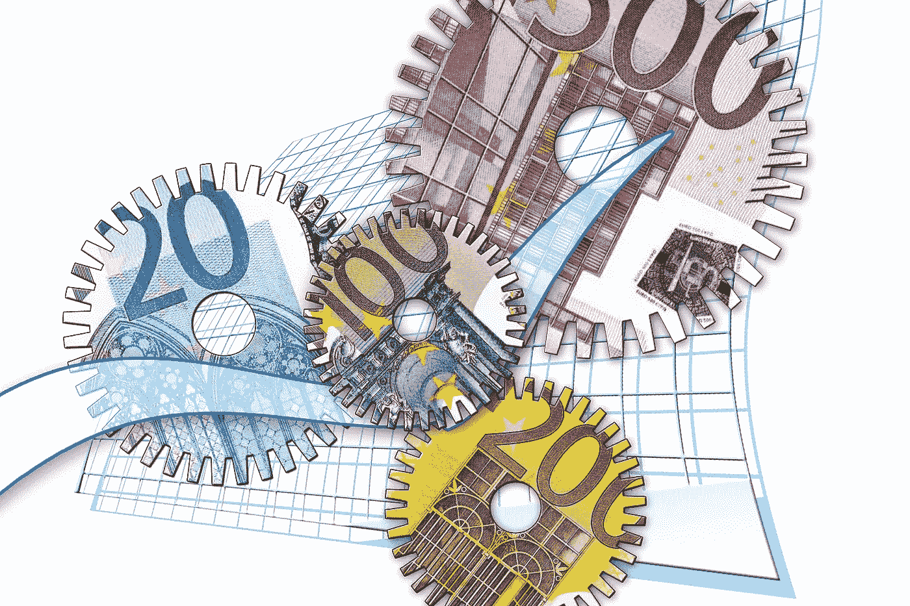

# 静悄悄的金融危机

> 原文：<https://medium.datadriveninvestor.com/the-quiet-financial-crisis-b01898a809a7?source=collection_archive---------15----------------------->

## 疫情仍是最大的不确定因素

Image by [Sebastian Thöne](https://pixabay.com/users/hoagypeterman-7470429/?utm_source=link-attribution&utm_medium=referral&utm_campaign=image&utm_content=4928021) from [Pixabay](https://pixabay.com/?utm_source=link-attribution&utm_medium=referral&utm_campaign=image&utm_content=4928021)

疫情终将过去，人类将逐渐治愈，但国家的资产负债表将陷入长期的病态。在 2021 年初疫情的强劲反弹下，全球企业债务、政府债务、银行不良贷款都面临更加严峻的考验，全球金融市场的脆弱性也在上升。

【2020 年 3 月，疫情开始在欧美蔓延，全球金融市场一度动荡，美股经历多次熔断。**当时的主流观点是，这次冲击的本质是一场经济危机，而不是金融危机。**

最常被提及的原因是**家庭和企业部门的杠杆率处于相对健康的状态(尤其是在美国)，金融市场只是暂时受到信心和疫情的冲击，这与 2008 年次贷危机******之前的情况相同。完全不同。****

**此外，各国政府都从过去的危机中吸取了经验和教训。疫情之初，他们不遗余力地采取极度宽松的财政和货币政策，包括一向以严谨著称的德国政府，其刺激力度前所未有。因此，疫情的影响不会造成全球性的金融危机。**

> ****事实证明这个判断是正确的****

****虽然疫情对全球金融市场造成了一定冲击，但金融恐慌很快消散，资产价格随后出现反弹，甚至许多主要资产类别的价格都超过了疫情前的峰值。****

**此后，尽管疫情出现反弹，但这并没有改变金融市场的乐观情绪。在充裕的流动性支撑下，资本市场的盛宴似乎兴致勃勃。**

****时间已经到了 2021 年初****

****It****

**与 2020 年 3-4 月相比，疫情不仅在全球范围内以更大的规模和更快的速度蔓延，家庭、企业、金融机构和政府资产负债表的健康状况也比一年前糟糕得多。**

** [## 疫情如何改写金融史

### 正是美联储向散户投资者发放的近两万亿美元疫情补贴…

medium.com](https://medium.com/datadriveninvestor/how-the-financial-history-rewritten-by-the-pandemic-3bce41d8e138) 

各部门资产负债表的病，可能需要很长时间才能修复。全球金融风险至少不会像 2020 年 3 月时那样遥远。

Image by [Gerd Altmann](https://pixabay.com/users/geralt-9301/?utm_source=link-attribution&utm_medium=referral&utm_campaign=image&utm_content=384743) from [Pixabay](https://pixabay.com/?utm_source=link-attribution&utm_medium=referral&utm_campaign=image&utm_content=384743)

# **疫情仍是最大的不确定性**

目前，全球已有 50 多个经济体在英国报告了变异冠状病毒，20 个经济体在南非发现了变异病毒。2021 年 1 月初，日本也报告了一种新的突变病毒，从巴西传到了世卫组织的 T2。病毒变异后传播速度加快。从全球范围来看，每天新增确诊病例数仍在创新高。

【2021 年 1 月上旬，当天全球新增确诊病例达到近 **86 万**，日死亡人数达到最高近**1.7 万**，分别是 2020 年 4 月当地峰值的 10.6 倍和 2.4 倍。

**2021 年 1 月 13 日，** [**世卫组织卫生应急项目负责人迈克尔·瑞安**](https://en.wikipedia.org/wiki/Michael_J._Ryan_(doctor)) 表示，在此前一周，全球新增病例近 500 万例；考虑到病毒传播的动态趋势，疫情可能比 2020 年更加严峻。目前，英国、德国、意大利、葡萄牙等国已经实施了不同程度的紧急状态和封锁措施，而且持续时间可能会延长。

另一方面，世界上许多国家已经开始接种新型突变病毒疫苗，但疫苗的普及仍面临诸多障碍:**发达国家民众对疫苗有信任，贫穷国家疫苗资源有限，疫苗面临生产、运输、成本等问题。**

> **2020 年 12 月 17 日至 12 月 20 日，** [**益普索**](https://www.ipsos.com/en)**[**世界经济论坛**](https://www.weforum.org/) **对 15 个经济体的 13500 名成年人进行了一项民意调查。****

**结果发现，中国、韩国等 7 个国家的接种意愿比例高于 70%，符合群体免疫要求。其中，**中国占比最高，达到 80%。**美国的比例为 69%，勉强满足群体免疫 70%的接种率要求；而其他国家的接种意向普遍较低:德国 65%，意大利 62%，西班牙 62%，日本 60%，南非 53%，俄罗斯 43 %，法国 40%。**

****不愿意接种疫苗的原因有很多****

**有人担心副作用，也有相当一部分人和拒绝戴口罩的人重叠。总的来说，欧洲国家，尤其是南欧国家的疫情更严重，民调显示他们接种疫苗的意愿也较低。**

****在此背景下，2021 年初，**欧洲经济大概率出现双底衰退；后续情况要看疫苗的普及推广。更广泛的发展中国家没有进入民意调查的范围。其实他们的疫苗资源更有限，经济承受能力更脆弱，比如拉美、非洲、南亚国家。**

****

**Image by [Steve Buissinne](https://pixabay.com/users/stevepb-282134/?utm_source=link-attribution&utm_medium=referral&utm_campaign=image&utm_content=1726618) from [Pixabay](https://pixabay.com/?utm_source=link-attribution&utm_medium=referral&utm_campaign=image&utm_content=1726618)**

# ****全球公司、银行和政府向前发展****

**受疫情最大不确定性影响， [**世界银行**](https://www.worldbank.org/) 近日将 2021 年全球经济增长预期下调 0.2 个百分点至 4%。与此同时， [**国际货币基金组织(IMF)**](https://www.imf.org/en/Home)[**经济合作与发展组织(OECD)**](https://www.oecd.org/) 也纷纷下调了对 2021 年全球经济增长的预期。其中，经合组织甚至大幅下调了全球增长预期 0.8 个百分点。**

**如果全球经济下滑的风险成为现实，需要更长时间才能恢复到 2019 年疫情前的水平。这将损害家庭、企业和政府资产负债表的恢复，甚至使这些部门。**

****债务问题更加突出****

**尤其是在 2021 年初疫情的强劲反弹下，全球企业债务、政府债务、银行不良贷款都将面临更加严峻的考验。**

**[**S & P 评级**](https://www.standardandpoors.com/en_US/web/guest/home) 在 2020 年 11 月中旬的《全球银行业 2021 展望》中指出，自 2020 年以来，企业杠杆率持续飙升，2021 年企业违约率可能进一步上升，这将给银行带来重大风险。**

**报告预测，2020 年全球企业债务占 GDP 的比例将升至 103%，比 2019 年增加 14 个百分点。**另一份标普&报告**预测，美国公司债违约率将从 2020 年 9 月的 6.3%升至 2021 年 6 月的 12.5%，欧洲将从 4.3%升至 8.5%。**

**2020 年以来，在各国财政货币政策的大力支持下，银行通过停止计息、提供贷款宽限期等多种方式为居民和企业提供喘息机会。**

** [## 价格敏感度:这里是你需要知道的一切

### 价格应该是经济中最敏感的变量。尽管在…的影响下经济发生了迅速的变化

medium.com](https://medium.com/datadriveninvestor/price-sensitivity-heres-everything-you-need-to-know-5c42a82c7049) 

如果是短期震荡，这种扶持政策的后遗症相对容易消化，但本轮疫情持续时间长，波及全球。有些国家的疫情会持续一年，有些国家的疫情可能会持续两年以上。

**在这种情况下，**对于很多国家来说，不良贷款只是被延迟和低估了，最终会完全暴露出来。这些国家的金融机构或国家财政将面临严峻考验。对于一些脆弱的国家来说，这方面的压力更大。

还有， [**标准&普尔评级**](https://www.standardandpoors.com/en_US/web/guest/home) 预测 2020 年全球政府债务占 GDP 的比重将升至 97%，较 2019 年增长 15%。[**Trading Economics**](https://tradingeconomics.com/)2020 年 12 月发布的数据显示，2020 年，全球主权信用评级下调次数创下自 1980 年有数据以来的历史新高。

最糟糕的一个月是大约 14%的国家。主权信用被降级。疫情最终会过去，人性会逐渐被治愈，但国家的资产负债表会陷入长期的病态。

Image by [Ahmad Ardity](https://pixabay.com/users/ahmadardity-3112014/?utm_source=link-attribution&utm_medium=referral&utm_campaign=image&utm_content=1730089) from [Pixabay](https://pixabay.com/?utm_source=link-attribution&utm_medium=referral&utm_campaign=image&utm_content=1730089)

# **疫苗资源分配失衡给地方财政带来风风险**

一般认为，大多数发达国家将在 2021 年中期大规模普及疫苗，其经济将在 2021 年下半年开始恢复正常。最近的 [**IMF**](https://www.imf.org/en/Home) 报告也支持这一判断。这虽然给全球经济整体增加了确定性，但也在一定程度上增加了局部的不确定性。

可以想象，2021 年年中以后，绝大多数发达国家都将普及疫苗，而绝大多数发展中国家的疫苗资源相对有限。全球经济复苏将在拥有疫苗的国家和没有疫苗的国家之间呈现双轨复苏，直到更多。

> **2022 年底，将有可能实现疫苗的全面普及。**

在这一年多的时间里，发展中国家的经济活动复苏将会滞后，企业经营和政府债务将继续不容乐观。

**从美国的角度来看，**2021 年 1 月 6 日大选的最终结果显示，拜登的民主党政府同时控制众议院和参议院，预计其推出强有力的财政刺激计划将会顺利进行。

受此影响，美国国债收益率大幅上升。同时，**美国是疫苗生产大国**，2021 年美国经济复苏有望呈现相对强势。

**自 2021 年 1 月**， [**高盛**](https://www.goldmansachs.com/) 也两次上调美国年度增长预期。美债收益率上升，美国首次普及疫苗，美国经济复苏相对领先。这些因素将支撑美元指数的强势，并对一些发展中国家的货币汇率和资本流动构成压力。

**总的来说，**在不平衡、不同步的疫苗推广过程中，如果发达国家率先走出疫情，出现经济复苏，特别是美国经济平稳复苏，而一些发展中国家仍在受疫情困扰。发展中国家将面临进一步资本外逃和货币贬值的风险。

美元指数的相对强势，对于以美元债务为主的疫情严重的国家来说，可能是一个沉重的打击。尤其是那些依赖国际旅游、汇款收入的国家，或者重债低收入国家，其金融风险更值得关注。

 [## 2021 年美国经济展望

### 回顾 2020 年，美国经济受到新冠肺炎的重创

medium.com](https://medium.com/datadriveninvestor/2021-u-s-economic-outlook-6a9800af7d4a) 

况且，即使在发达经济体范围内，南欧国家打预防针的意愿也明显较低，南欧国家的主权债务问题也没有得到根本解决。欧元区和欧盟的救助机制效率也受到多边治理机制的限制。

因此，南欧国家的局部金融风险也值得关注

2021 年 1 月中旬， [**世界银行首席经济学家卡门·莱因哈特**](https://en.wikipedia.org/wiki/Carmen_Reinhart) 在《世界新闻辛迪加》上撰文警告说，**金融危机并不总是伴随着** [**雷曼兄弟**](https://en.wikipedia.org/wiki/Lehman_Brothers) **倒闭的巨大冲击，它也可能是当前的一次。一个无声的过程，并将进一步损害未来的全球增长潜力。**

事实上，如果你回顾一下美国的**次贷危机，你会发现，虽然它的全面爆发是在 2008 年 9 月的雷曼时刻，但 2007 年初是 [**贝尔斯登**](https://en.wikipedia.org/wiki/Bear_Stearns) 和 [**新世纪**](https://en.wikipedia.org/wiki/New_Century) 破产的开始。在这个过程中，从基础资产开始腐蚀到金融衍生品市场崩溃，次贷危机悄然酝酿了一年半。**

****从现在开始回顾过去的一年，**全球性的疫情也在侵蚀和消耗经济基础。如果 2021 年疫苗接种情况不及预期，疫情的破坏程度和持续时间超出预期，一些国家金融市场的基础资产可能继续恶化，引发局部危机，影响全球金融市场的稳定。**

**但是，疫情将引发的金融危机是不是 [**莱因哈特**](https://carmenreinhart.com/) 描述的那种平静，还是看起来惊心动魄，还要看疫情的范围和时间。**

***2021 年，最大的不确定性仍将是疫情本身。*******