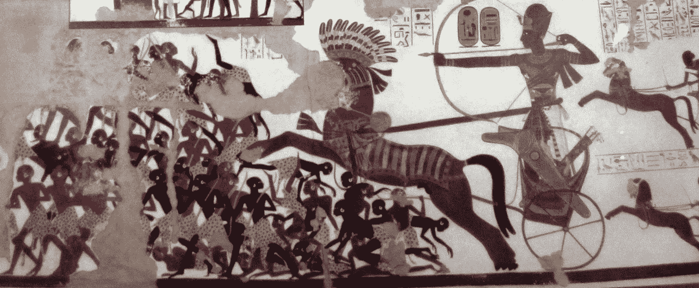
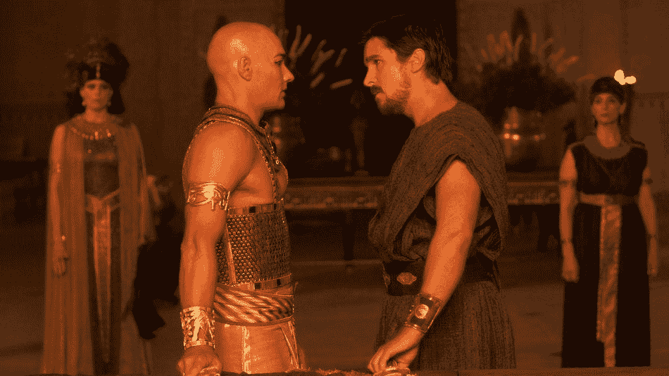

# 拉美西斯悖论

> 原文：<https://medium.datadriveninvestor.com/the-ramses-paradox-9c8966083da5?source=collection_archive---------6----------------------->

## 承认过去所有的罪恶

听到许多有色人种和他们的白人盟友公开反对当今美国的系统性种族主义，无异于听到两个历史的故事。一方面，这些人讲述了一个大多数美国白人不想听的故事，关于我们国家肮脏和受污染的种族历史的客观真相，以及仇恨、种族主义和奴隶制的遗产如何没有结束，只是在演变。这是一个我们美国白人需要听到的重要故事，它提升了非裔美国人和其他有色人种的声音，他们在美国的经历并不全是烟花和苹果派。这是一个关于痛苦、苦难和堕落的故事，也是一个关于英雄主义、胜利和尊严的故事，它应该迫使这个国家以更长远、更深刻的眼光审视历史，并真正尝试承认和纠正过去的错误。

然而，许多美国白人拒绝倾听，更不用说接受我们国家过去和现在的客观事实。我认为，这有许多原因，但一个重要的原因是，更客观的美国历史故事如此重要地被讲述，却被同一批人讲述的一个相当可笑的历史故事冲淡了，简单地说，就是“白人”创造了种族主义。

我稍后会解释为什么“白色”出现在“”中，但我把这种现象称为拉姆西斯悖论，这是基于对 2014 年电影、*、*的[批评。这种批评是基于一种合理的抱怨，即主要角色，最著名的是摩西和拉美西斯，是白人，这一事实更令人难堪的是，不少仆人和宫廷卫兵等角色都是由肤色较深的演员扮演的。](https://mashable.com/2014/12/11/exodus-movie-racist/)

Ramses II rushes into battle looking much more sun-kissed than Australian actor Joel Edgerton, below left, portraying him in “Exodus” three millennia later.

Critics correctly noted that the historical Moses, at right, and particularly the historical Ramses, at left, would have had darker skin. Lost on those same critics is that by pointing out this historical inaccuracy, they have also acknowledged a structure of systemic racism in which “darker than seen here Egyptians” enslaved an entire “also darker than seen here” people, the Jews.

这种批评反映了一种“鱼与熊掌不可兼得”的紧张关系，这种紧张关系要么源于虚伪，要么源于无知。如果拉美西斯的皮肤确实比乔尔·埃哲顿黑，那就必然会得出一个非白种人有系统地压迫另一个民族的结论；毕竟，犹太人是建造昨天的坟墓和今天的旅游景点的奴隶劳工。

这并不是试图把故事颠倒过来，或者追求一些关于压迫白人的愚蠢阴谋，而是要指出，系统化的结构总是优先考虑精英而不是其他人，而其他人经常被种族或民族所识别。这并不是说，在 1492 年后的某个时候,“白人”经历了基因突变，从而产生了偏见。导致系统性压迫的倾向和本能是普遍和永恒的，是人类状况的一部分。

 [## 保护主义、政治和经济动荡|数据驱动的投资者

### 美国股市昨日出现 400 多点的大幅反转，为未来的事情发出了警告信号。市场…

www.datadriveninvestor.com](https://www.datadriveninvestor.com/2018/06/28/protectionism-politics-economic-turmoil/) 

我相信拉美西斯悖论令人震惊的愚蠢负担是许多美国白人不愿意或不能承认我们国家过去和现在的罪恶的原因之一。有时我们会觉得，我们不仅仅是被要求对我们国家的失败负责，而是被要求对压迫和仇恨的历史负担负责。美国白人面对我们国家的历史罪恶不仅是完全公平和恰当的，而且是务实的必要之举，但这是过度的负担，客观上是错误的，我认为指责“白人”是系统性压迫的创造者是无益的。

这让我想到了“白色”的用法，以及为什么这个词和“黑色”一样是自然和文化现象的产物。

诚然，我们所理解的“白人”和“黑人”的术语和概念是美国特有的概念，通常是由“白人”精英有意推行的身份，他们不希望任何身份的贫困劳动者联合起来反对他们。法律是围绕这些身份建构起草的，为一个群体编纂特权，为另一个群体编纂奴隶制。

但正如贾雷德·戴蒙德在他的书中指出的， [*第三只黑猩猩*](https://www.amazon.com/Third-Chimpanzee-Evolution-Future-Animal/dp/0060845503/ref=sr_1_1?crid=GPC9XGRBQFXG&keywords=the+third+chimpanzee+by+jared+diamond&qid=1573174616&sprefix=the+third+chimp%2Caps%2C205&sr=8-1) ，文明是文化上的绝育。也就是说，人们总是在建立新的更大的身份的过程中，在这个过程中消除了多样性。举个简单的例子，想想现代意大利，在 1861 年之前，它实际上是撒丁王国、两西西里王国、托斯卡纳、教皇国、威尼斯、伦巴第和其他国家。所有这些微观国家在被一个更大的人为构建的国家吞噬之前，都是人为构建的身份。

因为这是我们人类的天性，我们创造身份，发展身份，是的，用身份来把我们分成团体或团体，好人或坏人，我们或他们。那些最先适应久坐生活方式的人定居在河流附近，给河流命名，然后把自己认定为他们刚刚命名的那个地方的人。随着时间的推移，这些集团变得更大，最终成长为帝国，其广泛的身份必然包括和包容较小的。例如，人为构建的罗马公民身份被授予地理上广阔的帝国中的个人，通常用于军事或民事服务。就像“白人”和“黑人”一样，罗马公民身份将精英和平民、美国人和他们之间的区别编成法典。

在上面的壁画中，拉美西斯二世被描绘成打败了努比亚人，这个民族生活在现在的埃及。换句话说，在上面的壁画中，拉美西斯正在创造我们认为是“埃及人”的人造身份，将努比亚人、他们的语言和文化纳入一个更大的实体，并抹去他们存在的独特元素，除了作为历史文物。

这就是为什么这些身份不是真正的人工的。或者更确切地说，这就是为什么在整个历史中，人们创造并扩大了我们的身份，即使我们继续使用这个概念作为一种将我们自己分为“好”和“坏”或“我们”和“他们”的方式。我们所有的身份，无论是“黑人”、“白人”、“美国人”、“哈萨克人”还是“因纽特人”，都是我们与其他事物形成对比(如果不一定是对立的话)的自然倾向的表现。我希望有一天我们能够接受一个共同的“人类”身份，但那是另一天的另一个话题。

可以肯定的是，所有这些都不能免除最早的欧洲定居者在美国制造无处不在的种族分裂——这是他们正在构建的另一个身份。但这确实意味着这些欧洲移民并不是第一个以这种方式使用身份的人。“帝国”一词的内在含义是承认一个民族征服并压制了另一个民族，这就是为什么当埃尔南·科尔特斯摧毁阿兹特克帝国时，他与被阿兹特克征服的一些民族结盟，而他暂时解放了这些民族，也就不足为奇了。虽然他们的臣民都没有帮助皮萨罗篡夺印加，但统治精英在整个帝国建立了强制劳动服务——MIT ' a。麻省理工学院的服务有时包括为建设项目迁移人口，就像埃及人对待犹太人和欧洲奴隶贩子对待非洲土著人一样。阿兹特克人和印加人都是统治其他民族的统治精英；这些帝国中没有阿兹特克人和印加人，就像大英帝国中没有来自英格兰的白人一样。

因此，我们美国白人要负责的是我们的祖先在殖民地将种族主义制度化时留下的分裂遗产，这些殖民地将成为我们的国家。这是一个独特的美国遗产，尽管它的根源超越了美国的概念一个世纪，尽管它也是欧洲殖民主义更大叙事的一部分。

殖民叙事和非裔美国人的故事是历史的重要组成部分。从美洲的奴隶制到刚果的种族灭绝，殖民主义的罪恶和野蛮行为本身就是不朽的历史事件，但当然，殖民主义的遗产塑造了过去的 600 年，因此是历史的巨大和持续的一部分。此外，因为这种更近的偏见和种族主义的历史，嗯，是更近的，它已经进行的工具和武器，给予压迫者更多的控制和能力，造成伤害比拉美西斯可以获得。这些事件，这段历史，继续困扰着我们，阻碍着我们，在美国，美国白人必须正视这段历史，这样我们才能以一种造福于所有人的方式战胜它。

但我认为，如果不是大量的历史压迫被引导到以拉美西斯悖论为代表的半真半假的叙事中，我们更多的人会愿意承认这一遗产，在拉美西斯悖论中，历史的弧线被弯曲到这一时刻，以便美国白人的罪恶可以被推断到过去，从而被视为白人邪恶的不可避免的高潮。这不是历史的故事，但是，对每个人都不利的是，故事往往是这样讲述的。