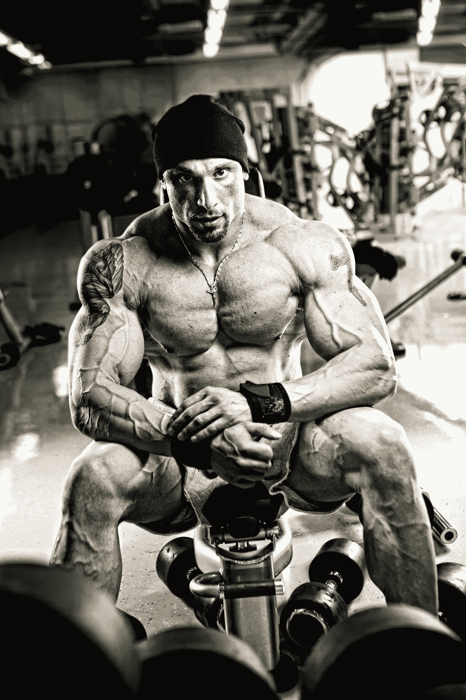

# 为贝塔人辩护

> 原文：<https://medium.datadriveninvestor.com/the-realest-shit-i-ever-wrote-275022996463?source=collection_archive---------9----------------------->

## 为什么我们有男性气质都错了

Photo by [Clem Onojeghuo](https://unsplash.com/@clemono?utm_source=medium&utm_medium=referral) on [Unsplash](https://unsplash.com?utm_source=medium&utm_medium=referral)

我们的社会存在一个问题。

这也是一个大问题。一个跨越所有种族、民族和社会经济背景的问题。这是社交媒体和流行文化普遍存在的一个问题。我们面临的是一个标签问题。

> 更确切地说，我们所面临的是一个 T2 的标签问题。

在我们探索理解周围世界的过程中，我们倾向于将一切事物归类为黑与白，对与错，善与恶。在这样做的过程中，我们错过了存在于灰色地带的美好和真实。

这就是阿尔法和贝塔男性的二分法。在谷歌上快速搜索一下，就会发现一个人应该努力成为大男人的所有理由。相反，在 Beta male 上搜索，你会看到一张杂志图片，上面有一排男人手插在对方的口袋里。这足以让那些不是典型的大男人的人尖叫。

Photo by [Tony Rojas](https://unsplash.com/@tonyrojasstudio?utm_source=medium&utm_medium=referral) on [Unsplash](https://unsplash.com?utm_source=medium&utm_medium=referral)

# 为什么这是一个问题

从很小的时候起，男人就被社会化，表现出大男人的特征。我们被鼓励参与体育运动，在体育运动中，我们了解到最具身体优势的运动员将获得这座城市的虚拟钥匙。国际象棋或阅读之类的智力活动并不被看好，至少在我成长的那个社区是如此。

我们知道，为了成为最酷的，得到所有女孩的注意，成为最棒的，我们必须是最高的，必须以特定的方式穿着，在许多情况下，是房间里最大声的家伙。我从来都不是那种人。从来不想成为那样的人。然而，成为那种人的压力是真实的，这就是问题所在。

> 在动物界，据说贝塔比阿尔法多 21 倍。显而易见，我们人类也可以说同样的话。**不是每个人都是阿尔法，这没关系。**

Photo by [Leonard von Bibra](https://unsplash.com/@leonardvonbibra?utm_source=medium&utm_medium=referral) on [Unsplash](https://unsplash.com?utm_source=medium&utm_medium=referral)

当你有一群贝塔(或者奥米加，或者德尔塔——我们会回到他们身上)跑来跑去假装是阿尔法狗的时候会发生什么？暴力。我认为这种动态在困扰我们内城区的许多枪支暴力中发挥了作用，因为年轻男孩努力寻找自己的身份，坚持最新说唱中倡导的流行生活方式，但从未真正了解自己。

同样的情况也发生在更富裕的地区，尽管方式不同。在这里，你有同样的等级制度和同样的争夺令人垂涎的阿尔法位置的竞争，但在食物链的更深处，我们通常会看到这种向下的社会压力的表现。这是校园枪击者和反社会者成长为掌权人物的温床。

> 我们都知道结果会如何。

Photo by [Andrea Piacquadio](https://www.pexels.com/@olly?utm_content=attributionCopyText&utm_medium=referral&utm_source=pexels) from [Pexels](https://www.pexels.com/photo/mad-formal-executive-man-yelling-at-camera-3760790/?utm_content=attributionCopyText&utm_medium=referral&utm_source=pexels)

那么，我们为什么需要把事物分成整齐的小类呢？此外，真的有可能将男性人格局限在两个广泛的原型中吗？事实证明，根据那些追求这种东西的人，至少有 5 种主要的人格类型。

**三大原型**

根据你问的人的不同，以下三种性格特征会有很大的不同。

> 为了我们在这里讨论的目的，我已经将类别缩减到与动物王国的行为最接近的三个，省略了诸如适马、德尔塔和伽马这样的个性[类型](https://themindsjournal.com/alpha-beta-omega/2/)。

Photo by [Damir Spanic](https://unsplash.com/@spanic?utm_source=medium&utm_medium=referral) on [Unsplash](https://unsplash.com?utm_source=medium&utm_medium=referral)

**阿尔法-** 在流行文化中，我们把阿尔法理解为多项运动明星学生运动员、在马里布拥有一栋海滨别墅的七位数广告高管、你最喜欢的动作电影中轮廓分明、粗犷豪放的英雄。这种描述和野生的阿尔法动物有很大的关联。

像在野外一样，阿尔法通过其存在的绝对力量来吸引雌性的注意力。在社交场合，他们倾向于比他们的对手更多地维护自己。

> 从体育的角度来看，想想 6 次世界冠军的 NBA 传奇人物迈克尔·乔丹。阿尔法以将轨道内的一切都弯曲到它们严格的规格而自豪。

Photo by [Yogendra Singh](https://unsplash.com/@yogendras31?utm_source=medium&utm_medium=referral) on [Unsplash](https://unsplash.com?utm_source=medium&utm_medium=referral)

**贝塔-** 虽然你的普通八卦杂志会让你相信贝塔从哭哭啼啼的懦夫到消极好斗的都市美男，但它们在动物王国里的角色一点也不“软”。

在许多物种中，贝塔是阿尔法的得力副手，随时准备并愿意在需要时担任领导角色。

> 就像在动物界一样，贝塔雄性的定义特征不是他不是什么，而是他的驱动力和他与周围人的关系。

贝塔是移情的。Alphas 测试者关注的是竞争和优势，Betas 测试者更感兴趣的是合作，以及在他们遇到的大多数社交场合中促进双赢的可能性。斯科蒂·皮蓬是乔丹冠军赛跑中的搭档，他是贝塔男的象征。

> 皮普结实、可靠、能干，从来都不是一个喜欢晒在聚光灯下的人。不是一个控球者，他用他的组织能力和顽强的防守补充了乔丹。很多年来，他本可以场均得分更多，但出于对乔丹的尊重，他把精力放在了那些对比赛影响最大的地方。把大部分得分留给了他。当乔丹退役后，皮蓬挺身而出，带领公牛走得比预想的远。

尽管皮蓬的身体对球队贡献巨大，但他的心理素质很可能让他成为公牛队的宝贵财富。成功的组合如沙奎尔·奥尼尔和科比·布莱恩特，以及最近的詹姆斯·哈登和拉塞尔·维斯特布鲁克将作为决斗的阿尔法继续交锋(通常是公开的)，**乔丹和皮蓬之间的伙伴关系巩固了他们对彼此独特技能和不同气质的相互理解和欣赏。**

> 在占主导地位的男性原型中，还有第三个不太为人所知的部落。这种类型的例子是丹尼斯·罗德曼，完成公牛队第二个三连冠的缺失部分。

Photo by [Joshua Hoehne](https://unsplash.com/@mrthetrain?utm_source=medium&utm_medium=referral) on [Unsplash](https://unsplash.com?utm_source=medium&utm_medium=referral)

阿尔法战士痴迷于控制，贝塔战士渴望合作，欧米伽是完全不同的动物。在流行文化中，野生动物有时被视为任性的反叛者或被抛弃者，属于这一类别的动物通常是社会阶梯上的最低一级。组成欧米茄部落的这些动物和人类之间的共同点是他们拒绝文化规范。在某些情况下，他们拥有和阿尔法一样的身体和精神力量，但对以任何有意义的方式影响他人完全不感兴趣。

> 在他们最后的三次冠军赛中，乔丹会哄骗甚至欺负队友，让他们按照他设定的标准去表现。就皮蓬而言，他会哄他们接受比赛计划，同时努力抵消乔丹造成的任何心理伤害。与此同时，罗德曼将离开自己，甚至在他们最后一个赛季的关键比赛期间前往拉斯维加斯。

## 名字里有什么？

那么这一切意味着什么呢？皮蓬式的贝塔比阿尔法或奥米加斯更重要吗？当然不是，但是我们有一个重要的目的。在一个沉迷于成功的外在表象的世界里，贝塔们不看重有形的成就。比如培养牢固的关系，推广推动每个人前进的想法，以及创造一份不能用金钱来衡量的遗产。

所以让世界的阿尔法们继续捶胸吧。更不用说奥米加人站在边线上，按照他们自己的节奏行进。我们贝塔人的使命是向世界展示看待事物的新方式。用杰出的芝加哥嘻哈艺术家 Lupe Fiasco 的话说，这不是一支笔，这是一支画笔，我打算重新安排他们如何描绘我们。