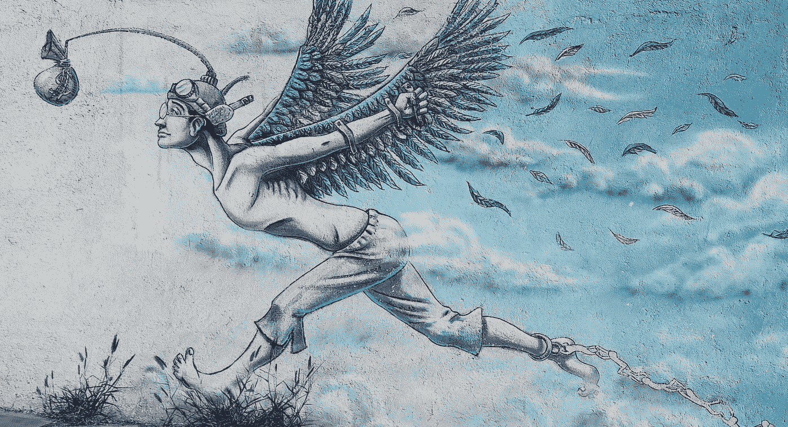

# 货币和货币的现实

> 原文：<https://medium.datadriveninvestor.com/the-reality-of-money-and-currency-4aa7df31a1a?source=collection_archive---------20----------------------->

## 这个系统在很多方面都有缺陷——但这并不意味着它不能变得更好。

Photo by [Alexander Mils](https://unsplash.com/@alexandermils?utm_source=unsplash&utm_medium=referral&utm_content=creditCopyText) on [Unsplash](https://unsplash.com/s/photos/economy?utm_source=unsplash&utm_medium=referral&utm_content=creditCopyText)

很久以前，人类是狩猎采集者。你四处追踪游戏并追捕他们。你采集了坚果、浆果、野树根等作为食物。

然后，人类转向了农业社会。人们不是四处去打猎和采集，而是建立农场来种植和培育庄稼。

这两种文化共存了一段时间。他们会来回交易。这位农民种植了一种作物，并将一些作物与另一位农民交换。农民用他们的一些庄稼和猎人交换动物的肉和皮。

随着时间的推移，人类形成了社区。现在贸易变得更加复杂，人们开始为自己建造房屋。一路走来，他们开始形成一种对财产的概念。在这个过程中的某个地方，货币的概念产生了，而不是以物易物或以物易物。

早期的钱是字面上的东西。你有贵重金属，宝石，或者任何你拥有的东西。它本身就有价值。但是，随着时间的推移，这种货币被代表货币所取代，以黄金或白银为标准价值的硬币出现了。

在 19 世纪和 20 世纪初，一切都与金本位有关。货币是基于你的国家所拥有的一定数量的黄金。硬币和纸币被铸造来代表这一点，因为它比携带黄金，白银和珍贵的宝石更容易。

现在，在 21 世纪初，你知道你的钱的价值来自哪里吗？

如果我告诉你这都是编造的呢？

# 法定货币

在 20 世纪，政府基于政府监管创造了自己的货币。换句话说，“他们”已经决定了你所知道的钱的价值，以及你能拥有多少钱是一个复杂的、完全人为的系统。

更重要的是，随着我们不再携带现金和使用借记卡和信用卡，法定货币不仅不是基于任何东西，而是基于对价值的信念，而且完全是非物质的。

例如，欧元是仅次于美元的第二大交易货币，1999 年才出现，2002 年才以硬币和纸币的形式出现。

换句话说，他们在 20 多年前创造了这种货币。

另一个完美的例子是加密货币。与政府支持的美元和欧元不同，加密货币是一种不受监管的货币，老实说，对我来说几乎没有任何意义。但总而言之，这完全是编造的。

 [## 使用谷歌搜索趋势预测首次申请失业救济人数|数据驱动的投资者

### 几年来，我的重点一直是使用多种替代数据来预测宏观经济统计数据…

www.datadriveninvestor.com](https://www.datadriveninvestor.com/2020/03/25/using-google-search-trends-to-predict-initial-jobless-claims/) 

许多人努力挣的钱，争夺的钱，生活的钱，以及其他用途的钱都是虚假的。这是一个虚构的概念，除了我们通过信念赋予它的价值之外，它没有真正的价值。

因此，所有的债务，所有的短缺和缺乏都是谎言。完全是虚构的，除了被赋予的信念之外，没有任何依据。

众所周知，货币只有被任意分配后才有价值。“中央银行”创造了它——但它不是基于任何真实的商品。

# 为什么重要？

你知道有多少人一直在思考或谈论金钱？有多少新闻故事是关于债务和没有足够的钱买这个、那个或其他东西的？有多少人因为钱而处于不断挣扎的状态？

美国政府的刺激计划将很快给许多人钱。多少钱？可能高达 1200 美元。很好，对吧？

那么，他们是如何为这个刺激计划拿出 2 万亿美元的呢？公司将收到或过去已经收到的几万甚至几百万和几十亿美元又如何呢？它从哪里来？

回答:有人瞎编的。然后，它与另一个虚构的东西相对应:债务。

我们所知道的整个经济几乎完全建立在这种人造货币的交换上。由于目前的形势，经济停滞不前。

雪上加霜的是，人们正在失去工作，更难负担医疗保健费用，并面临不确定的未来，预计经济将因冠状病毒而崩溃。

如果我告诉你这不需要发生呢？

Photo by [Webaroo](https://unsplash.com/@webaroo?utm_source=unsplash&utm_medium=referral&utm_content=creditCopyText) on [Unsplash](https://unsplash.com/s/photos/credit-card?utm_source=unsplash&utm_medium=referral&utm_content=creditCopyText)

# 还有另一种方法

美国政府可以彻底改变这种运作方式。他们可以创建一个真正的刺激方案，该方案将做两件事:

第一——支持员工。政府可以创造一种方式为你提供收入，这样你就不会失去你的房子，可以购买食物和衣服，让你的生活继续下去。

它会从哪里来？它来自同一个虚构的地方。他们可以绕开已经造假的数字，创建一个“疫情基金”来弥补收入损失，让人们继续下去。

许多利润微薄的小企业也可能因此得以维持。例如，如果你的利润低于 5%，你就有资格。

第二，激励企业。当这一切都结束时，通常相当盈利的大公司可能会受到激励，重新雇用人员，提供保险，以极其合理的成本销售商品和服务，等等。与其提供除了超级富豪之外任何人都不会看到的可笑的税收减免，不如真正激励这些实体为他们的员工和他们所服务的人们做正确的事情。

这笔钱从哪里来？它总是来自于想象力。

货币是货币，货币是能源的一部分。金钱就像亚原子粒子、星系、你和我一样，其核心只不过是能量。

这就是为什么吸引力法则适用于金钱。因为你不需要一堆黄金——只需要一堆 1 和 0 来显示你的财富——它是可以被发现和/或创造的。

它的虚假和真实程度丝毫不亚于现在。

# 关于利润的旁注

很多人根本不明白什么是利润。

利润是超出运营成本的钱。

如果你正在制作一个小部件，制作它的成本是 1 美元——一个小部件收费 1 美元意味着你将达到收支平衡，没有出现意外的余地。

(顺便说一下，这一美元包括零件、劳动力和其他辅助零件)。

如果你每个部件收费 2 美元，那么每卖出一个部件，你就赚了 1 美元。如果你卖出 100 个小配件，你不仅能赚回你的费用，还能获得 100 美元的利润。

你用你的钱做什么？你有选择。把它投资到制作更好的部件上。雇佣更多的小部件制造商。还是自己留着吧。

当一家公司获得数十亿美元的利润时——这是数十亿美元——该公司或该公司内的个人或他们的投资者——往往会保持沉默。他们很少选择再投资或雇佣更多的人——他们通常试图用更少的钱做更多的事。

当你的收入是运营成本的十亿倍时，你应该享受税收减免吗？或者你应该为了更大的利益而返还一部分钱？如果你有 100 亿美元的利润，被征税 10%，你还有 90 亿美元。记住，那是超出收支平衡的钱。

我不知道你怎么想，但是 6 万美元对我来说太多了。您知道 90 亿美元除以 60，000 美元可以为 150，000 人提供 60，000 美元吗？

因此，为什么利润如此之高的公司缴纳如此之少的税是没有道理的。或者，坦率地说，为什么他们在面临这种情况时总是需要政府的帮助。

然而，不知何故，他们被捆了起来，而你和我却被期待着接受现实。

Photo by [Arie Wubben](https://unsplash.com/@condorito1953?utm_source=unsplash&utm_medium=referral&utm_content=creditCopyText) on [Unsplash](https://unsplash.com/s/photos/economy?utm_source=unsplash&utm_medium=referral&utm_content=creditCopyText)

# 你和我可以改变这一切

我不想撒谎。金融如何运作的概念在很大程度上是一个谜。我们接受并争夺的虚构货币似乎有限而稀缺。但事实是他们不是。它们是人造的，如果那些创造它们的人选择这样做，它们可以被扩展。

要做到这一点，需要思维方式的巨大转变。这意味着一个巨大的变化。人们害怕改变，而这将是一个奇迹。

但是目前的经济模式已经被打破了。我们需要练习社会距离和自我隔离来减少这种病毒的传播的时间越长，这将变得越明显。

对经济崩溃的恐惧被用来将我们困在这个不可持续的体系中。为什么？因为大多数“当权者”都是通过这种虚构的法定货币获得权力的。拿走它，你就拿走了他们的力量。

我不是专家。但是我在这里分享的一切都是真实的。只要做一点研究，你就会亲眼看到我与你分享的事实。世界上大多数国家的人为货币经济之所以保持这样，只是因为我们相信它，接受它，并让它延续下去。

你和我都有能力改变这一切。这就是为什么我要分享这个——以扩大对它的普遍认识。

你自己去调查吧。当更多的人看到真相时，你就有能力影响甚至控制变化。

冠状病毒是一种可怕的东西。但如果这也是一个机会呢？另一方面，如果我们可以改变集体意识，变得更有力量，会怎么样？

不可能？除非你相信它是。

你是值得的，值得用正念去发现和/或创造你渴望生活的现实。当该说的都说了，该做的都做了，你我都很重要，我们改变世界的能力也很重要。

## [看看我让世界变得更好的五个简单步骤](http://www.mjblehart.com/mailinglist/)