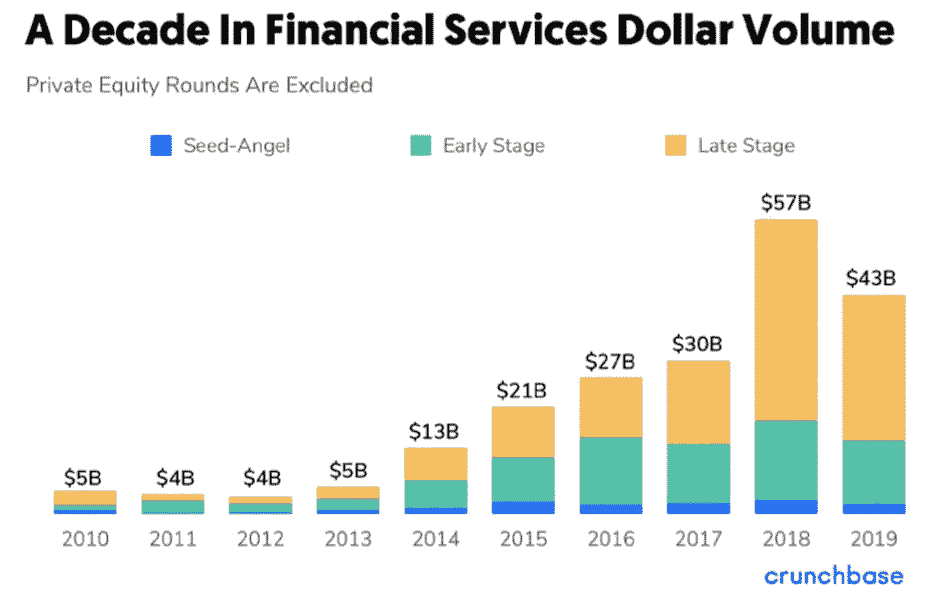
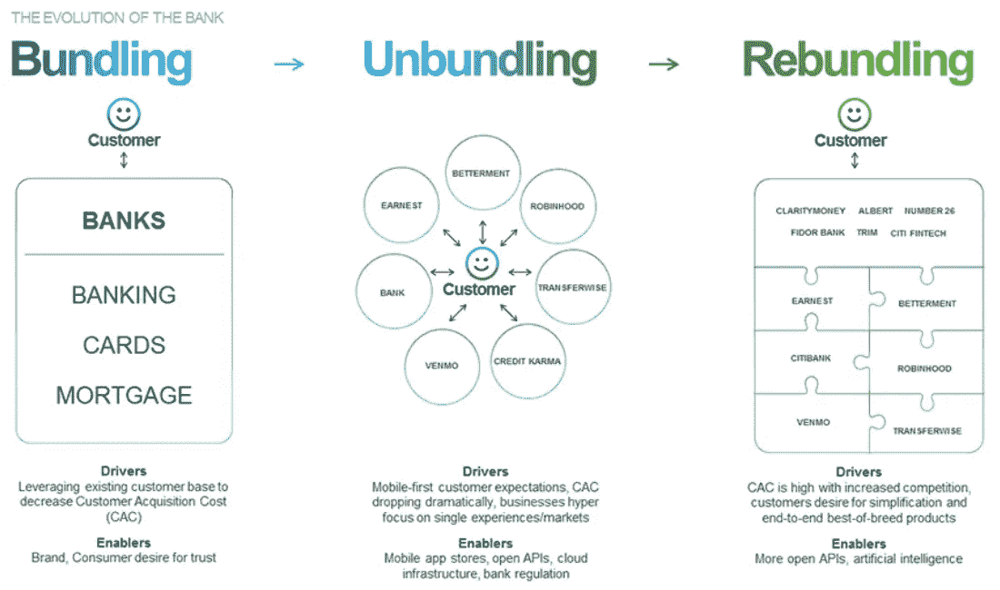

# 金融服务的重组

> 原文：<https://medium.datadriveninvestor.com/the-rebundling-of-financial-services-7836c3885991?source=collection_archive---------0----------------------->

## 经过十年的金融服务分拆，银行和早期进入者已经开始整合。

Photo by [Etienne Martin](https://unsplash.com/@etiennemartin?utm_source=medium&utm_medium=referral) on [Unsplash](https://unsplash.com?utm_source=medium&utm_medium=referral)

> *“做生意赚钱的方式只有两种:一种是捆绑；另一个是解绑。”—吉姆·巴克斯代尔(网景公司前首席执行官)*

要了解一家银行，你必须首先了解它提供的六项主要服务:

1.  支付(收入和支出)
2.  跟踪和预算财务
3.  保护您的资金安全
4.  借钱给你(透支、贷款、抵押)
5.  付给你储蓄的利息
6.  提供其他产品

当你阅读这份名单时，你想到了多少家不同的公司？

我愿意打赌不止一个，我相信这表明我们与传统银行模式的距离有多远。金融服务的非中介化已经成熟，未来十年将围绕整合展开。

自 2008 年以来，超过 7500 种金融科技解决方案出现，蚕食了现有的市场份额。著名的公司横跨支付(Venmo、Stripe、Remitly、Circle)、另类贷款(Avant、Prosper、Affirm、Bond Street)、个人金融(Robinhood、SoFi、Acorns、Dave)、neobanks (Chime、Revolut、N26、Monzo)以及众多其他类别。在获得数百万的资本和客户基础后，这些公司不再被视为事后诸葛亮。

[http://about.crunchbase.com/wp-content/uploads/2020/04/Fintech_Report_v11.pdf](http://about.crunchbase.com/wp-content/uploads/2020/04/Fintech_Report_v11.pdf)

从融资角度来看，数十亿美元已涌入金融服务领域的风险投资。过去十年，种子、A 轮和后期投资者都对金融科技感兴趣，早期赢家向市场注入了更多资本。如上图所示，过去 5 年的大部分投资都流向了后期投资，因为投资者对赢家加倍下注。

为了拆分银行的某项职能，过去的金融科技公司专门从事某项职能。

Venmo 和 Square 专门从事 P2P 支付。专门做预算的造币厂。Lending Club 专门为消费者寻找最具吸引力的各种贷款利率。

 [## 银行和金融科技初创公司的未来|数据驱动的投资者

### 银行的概念没有太大变化，但随着技术的发展，旧的概念也在更新。不相信我？拿一个…

www.datadriveninvestor.com](https://www.datadriveninvestor.com/2019/10/22/the-future-of-banks-and-fintech-startups/) 

从创新的角度来看，我们开始看到金融服务领域越来越少的突破性产品，越来越多的相同想法被回收和重复。用彼得·泰尔的话来说，纵向创新的时代似乎已经过去，横向创新的时代正在到来。

换句话说，银行的分拆已经走到了尽头。捆绑和分拆是周期性的，我们已经进入了重新捆绑金融服务的时代。

[https://www.citi.com/ventures/perspectives/opinion/rebundling-of-the-bank.html](https://www.citi.com/ventures/perspectives/opinion/rebundling-of-the-bank.html)

银行已经理解捆绑销售在提供相关产品以提高客户忠诚度方面的价值。过去，公司努力满足消费者在保险、贷款、财富管理、银行、信用卡和抵押贷款方面的金融需求，但事实证明，单一实体很难提供所有资产类别的所有相关金融产品，为每个客户提供个性化服务。通过试图将所有东西打包在一个屋檐下，银行忽略了一些客户的需求，利基、差异化产品开始出现。

如此多的新金融产品带来的挑战是，消费者已经被账户压得喘不过气来，他们一直在努力有效地优化账户。留出一部分钱给机器人顾问很简单，但理解这笔钱如何影响你偿还长期债务的能力就变得更加复杂了。随着银行业的每一个部分都变得非中介化，消费者数据在各个账户之间变得孤立，而中央枢纽的缺乏让消费者对自己的财务状况更加困惑。

金融科技公司已经开始缓解这些担忧，这些专家现在正在拓宽他们的产品。Credit Karma、SoFi、Wealthfront 和其他公司正在提供其原始价值主张之外的功能，许多其他公司也在追随他们的脚步。去年，许多公司开始争夺利率诱人的存款账户。尽管随着美联储最近决定将隔夜利率降至零，这一策略最终失败，但其他人注意到了这一点，其他扩张性产品开始出现。

通过扩展产品特性和功能，这些公司正在为其细分的目标群体有效地创造整体银行体验；他们正在为那些他们已经拆分的服务重新打包。

除了简化客户的金融之旅之外，扩展产品也有商业原因。与所有银行一样，金融科技公司通过保证金和费用赚钱，但与大银行不同的是，许多著名的金融科技公司仍然没有盈利。每一个额外的产品功能都创造了额外的收入流，这些补充服务允许这些公司补贴运营，而不是在投资者对其现金持保守态度的时候继续依赖外部资金。

Photo by [Austin Distel](https://unsplash.com/@austindistel?utm_source=medium&utm_medium=referral) on [Unsplash](https://unsplash.com?utm_source=medium&utm_medium=referral)

随着这一过程的展开，可能会出现改变的商业模式。

第一种方法是构建、拥有和维护广泛的产品。在我看来，这种模式似乎不太可能被采用，因为早期进入者通过先发优势建立了护城河，其他人不值得用淡化的产品来模仿。

在我看来，更有可能出现的情况是，这些金融科技公司和银行通过与现有参与者的合作，继续扩大产品种类。这种方法允许每个参与者忠于他们的核心竞争力，同时仍然向他们的客户群提供扩展的产品套件。合作的每一方都将通过佣金、增强的平台粘性或用户群的扩大而受益。

过去十年，数十种新的渠道和平台吸引客户远离他们现有银行的舒适环境。替代金融服务产品的扩展带来了更激烈的竞争，为消费者提供了更便宜的抵押贷款、更有吸引力的利率、更低的费用和新的支付系统。

过去的赢家通过专注于狭窄的服务并通过深度定制和无缝体验更好地生产服务来赢得客户。这些赢家现在意识到，风险资本不会永远存在，辅助的高利润产品使这些企业能够自我维持，并更有效地将客户货币化。消费者通过更低的费用和更友好的界面获得了回报，但随着更多解决方案的出现和他们的数据在各种渠道中变得孤立，他们也遭受了损失。金融服务的下一个时代将是通过一个中心枢纽重新配置消费者的旅程，未来将对消费者更加友好。