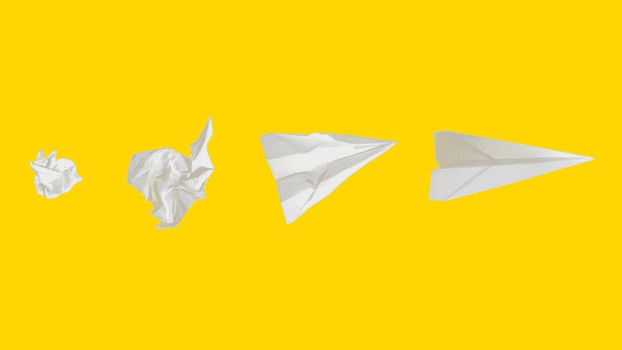
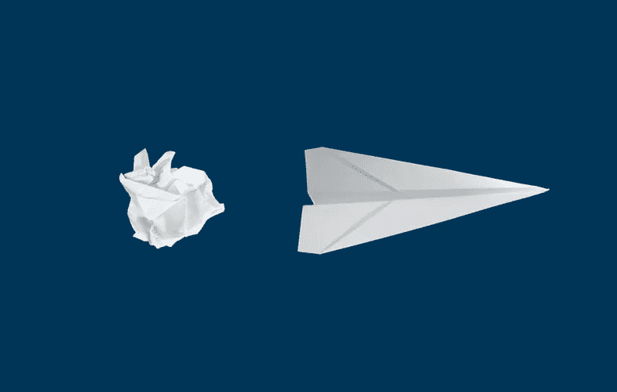
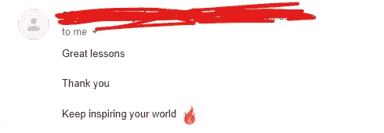

# 关系经济:什么是关系经济以及如何从中受益

> 原文：<https://medium.datadriveninvestor.com/the-relationship-economy-what-it-is-and-how-to-benefit-from-it-c297c136af67?source=collection_archive---------20----------------------->

在商业中，你与顾客和客户的关系是最重要的。品牌知道与他们的观众保持联系并让他们感觉像朋友是多么重要。

过去，这是通过发送邮件、礼物、优惠券和以客户为中心的活动来实现的——这种情况仍在发生——所有这些努力都有助于改善关系和建立信任。

但是随着一切数字化——给我们带来便利——当然。我们现在可以虚拟地与人联系。但不知何故，它让我们变得不那么爱社交了。我仍然困惑的是，社交媒体是如何帮助我们彼此联系的，却同样让我们变得反社会。顺便说一句，这是另一天的故事。

商业关系就像货币一样。这就是为什么许多公司投资于沟通。

今天的情况有所不同，因为随着世界变得遥远，在当前的形势下，企业面临着与受众保持沟通的巨大压力。

每个人都试图与他们的客户保持联系——不是通过身体，而是通过技术。虽然它让每个人都变得更容易，但正如我们所知，它扰乱了人类的交流。我们习惯了属于某样东西。

从那时起，我们就属于家庭、宗教、政治团体、社区、部落等等。所以，如果我们没有那种共同的感觉，我们就不会满足。

这就是 [**关系经济**](https://thedijuliusgroup.com/product/the-relationship-economy/) 的用武之地。这是一个商业术语，表明雇员、顾客、客户和供应商之间的忠诚和信任如何使价格显得无关紧要。

企业通过创建社区与客户建立关系来做到这一点，在社区中，每个人都会感到他们属于某样东西，因为这是我们的需求之一。

根据[亚伯拉罕·马斯洛](https://www.simplypsychology.org/maslow.html)的说法，我们有 5 种需求:

1.  生理需求——食物、水、住所、温暖
2.  安全需求—安全性
3.  归属感和爱情需求——友谊和亲密关系
4.  尊重需求——声望和成就感
5.  自我实现——实现你的全部潜力

技术给了我们社交媒体来交朋友，但它实际上带走了那些友谊。我们现在与电子产品的关系比与人的关系更好。

但是如果你能给你的观众他们所需要的，他们所缺乏的，那么你就玩对了关系游戏。

**在这个时代，要想从中获益**,可以做以下 5 件事来改善你的品牌和受众之间的关系:

[https://unsplash.com/@mattwridley](https://unsplash.com/@mattwridley)

# 向不同渠道持续传递有价值的信息

每个人都喜欢额外的信息。你了解你的客户，你知道什么样的信息会对他们有帮助——尤其是在这场危机中。

我记得我总是通过电子邮件从我在尼日利亚的银行获得新冠肺炎的提示，告诉我如何保护自己免受感染——我记得一开始开了一个玩笑，说他们希望我活着，这样他们就可以继续从我身上赚钱——但我最终读了他们的邮件，发现这很有帮助，因为他们继续向我发送邮件。

所以，我在说什么？一封邮件是不够的。你必须做得更多。持续向他们发送有价值的信息。

但是在发送这些教育信息时，你必须小心。不是每个人都需要它们。这就是为什么你必须理解你的清单，并相应地对它们进行分类。

一旦他们发现你总是发送对他们毫无用处的邮件，你可能会被列入垃圾邮件文件夹。

社交媒体在这里也很有用。你可以创建 IG 生活或脸书生活，让他们与你进行一对一的交流。它可以是任何平台，只要它能让他们交流，让他们觉得自己是某个事物的一部分。

因此，你可以使用电子邮件、社交媒体、论坛或网络研讨会。

**当你学到一些东西时，与他们分享**

我在我的[简讯](https://mailchi.mp/91ab170a8236/tochukwu)中经常这样做。当我从书本、课程、播客或其他地方学到一些东西时。我只是试着和他们分享我所知道的。

它总是有效的，因为大多数时候，当我这样做的时候，我从我的订户那里得到了积极的反馈。

这是我上周得到的反馈。对您来说，这可能看起来没什么，但对您的订户来说却是一件大事。

# 利用他们给你的建议

每个人都想被听到。如果你能表现出当别人给你见解时你会倾听，你会让很多客户把你当成朋友。

你会让他们给你更多这样的建议，因为他们看到你在倾听。

这在你们两人之间建立了非常牢固的关系

# 做一些小事

这些小事实际上会对客户如何看待你产生巨大的影响。我在说什么？这些小东西可以是手写的信件或生日祝福等。

你可能不知道顾客的生日，但像一张“感谢卡”这样的小事也可能发生。

没有多少人会做所有这些事情，所以，想象一下当他们看到你的卡片或手写的便条时会有多开心。

# 拥有出色的客户服务

客户服务是让人们回来和你做生意的原因。如果它很差，你就不会有很多回头客。

当你的顾客有抱怨时，要快速回应。当他们退回损坏的产品时，不要犹豫给他们退款，或者你可以用新产品和一封信给他们退款——这样做，你就赢得了一个终身客户。

# 做个朋友

我分享的这些观点都指向一件事——友谊。所有这些都是朋友应该做的——他们提供价值，采纳对方的建议，为对方做事，善待对方。

为了充分利用关系经济并从中受益，你的客户的幸福必须是优先考虑的。

戴尔·卡内基的《如何赢得朋友和影响他人》是一本永远有意义的书

**感谢您阅读**