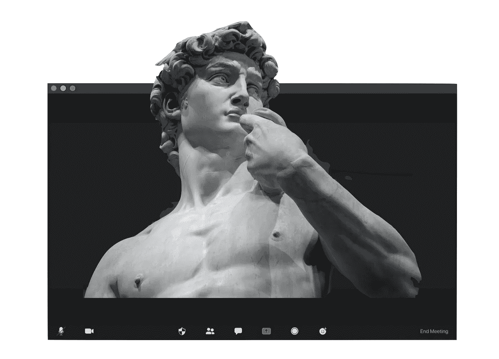
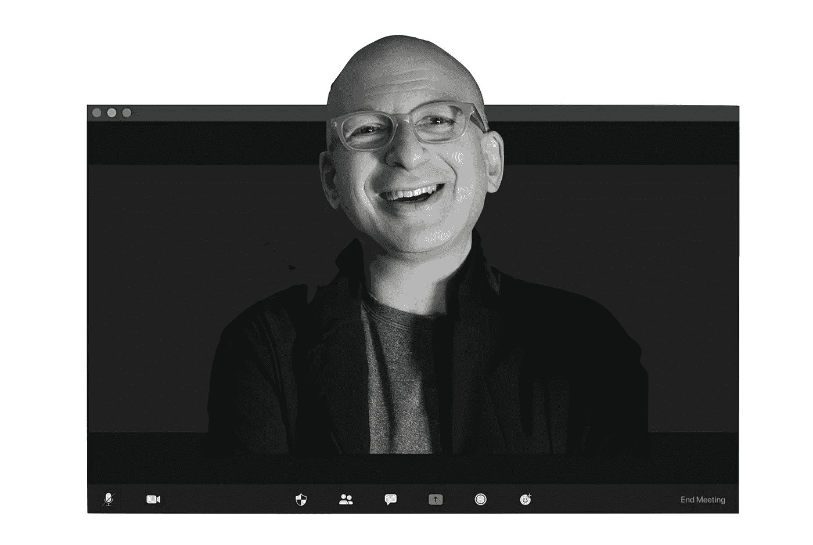

# 遥远的文艺复兴

> 原文：<https://medium.datadriveninvestor.com/the-remote-renaissance-b4626d596337?source=collection_archive---------13----------------------->

## 在家工作如何帮助你建立个人品牌

我将在本文中着手回答的问题如下:

> 向远程工作的转变如何让我们更有创造力并建立个人品牌？

要回答这个问题，首先让我们快速记录下历史上最突出的时期之一；文艺复兴。文艺复兴是欧洲历史上的一个狂热时期，标志着文化和艺术创造力的惊人增长。一听到这个词首先想到的是艺术、美、知识，当然还有艺术家。这是一个艺术家激增的时期，他们的作品以指数增长，导致他们的个人品牌具有难以置信的价值。

我们需要注意的第二件事，是我们在 2020 年在一个令人费解的疫情中经历的世界的新状态。我们大多数人，如果不是全部的话，现在已经完全适应了在家工作。

# 有什么影响？

我们努力记住地理上的限制和与物理办公室的联系。我们努力想象一个我们必须回到过去的未来。事实上，我们认为这样做毫无意义。我们为什么要这么做？在家工作，至少有一部分时间，可以让我们花更少的时间在通勤上，花更多的时间在家享受舒适和与家人在一起。

因此，如果我们愿意的话，我们有更多的时间可以支配，也有更多的自由时间可以有效地利用。我们也有了更多的能量，通过减少通勤等消耗能量的活动，增加给予能量的活动，如与最亲近的人共度美好时光。

这些影响是巨大的，不容低估。但是还有另一个我感兴趣的影响，我们将在本文中深入探讨。那就是这种新的转变将重新定义我们身份的未来。我们现在比以往任何时候都更有能力培养我们自己的个人品牌，成为我们自己的艺术家。

# 机会在哪里？

我们从未面临过如此有利的环境。创新的方法和机会。成为一名艺术家。所以，我们可以设计自己想成为什么样的人。我们可以选择我们的立场。我们可以定义我们想用我们的艺术服务于谁。那到底是什么样子的？

## 船舶创意工作

首先，我们必须考虑创造力的流通。文艺复兴时期的艺术家们用生产出来的有形作品的货币工作，不管是绘画、雕塑、文学等等。我们今天生活的数字世界改变了一切。**我在这里谈论的是创造力的现代货币。这种货币就是内容。**

内容成了王道。如果你想建立你的个人品牌，你需要内容。这可能有许多不同的形式，在许多不同的分销渠道上，这完全取决于你的偏好和你喜欢如何沟通——例如，你喜欢拍摄和编辑创意照片吗？也许 Instagram 和 Pinterest 是适合你的平台。比如说话和表达想法？视频或播客。喜欢写作？尝试在媒体或其他博客网站上发表文章。对我个人来说，我发现我最好通过写作来澄清我的想法和表达我的想法，因此你今天正在阅读这篇文章，但也喜欢对话，所以我也[开始了播客](https://podcasts.apple.com/gb/podcast/modern-sapien/id1538557522)。

说到创造力，我见过的最鼓舞人心的人是赛斯·戈丁。最近，我发现了他使用的一个简单的短语，“船舶创造性工作”，每个词都有自己的内涵。

> *出货→不出货，不放在外面就不算*
> 
> *创意→专注于让你愉快的过程*
> 
> 工作→出现，即使你不喜欢

> “内容是创造力的现代货币”

## 不再有守门人

我们必须触及的第二个领域是**守门人已死**的事实。传统上，在任何你想让自己出名的行业，都有守门人提高进入门槛。如果你想成为一名歌手，你的看门人就是录音室和唱片公司。如果你想成为作家，你的看门人就是出版商。如果你想成为专业顾问，你的看门人就是媒体报道、个人关系网、行业出版物。

现在，由于数字革命，这些看门人已经死了。那个歌手可以直接录制歌曲并上传到 YouTube 上。作家可以在亚马逊上自助出版他们的书。专家可以发布有价值的内容，在特定的领域为自己树立品牌，为特定的受众服务。

你明白了。

> "现在，由于数字革命，看门人已经死了."

# 建立个人品牌

正如我前面提到的，我已经尽我所能地努力了。在过去的几个月里，我开始写一些关于商业和产品策略的文章，我认为人们会觉得这些文章很有价值。最近的话题包括[优先级](https://medium.com/@shayankhomami/the-art-of-prioritisation-bbdc57b4fd3f)、[路线图](https://medium.com/@shayankhomami/minimalist-product-roadmap-d523dadf9a3d)、[产品战略](https://medium.com/swlh/essential-product-strategy-building-great-products-797ebfddedc4)、[商业分析](https://medium.com/swlh/the-art-of-business-analysis-1c8138ed5938)。我正试图在产品世界中培养我自己的个人品牌，用我自己的极简主义风格，来剔除那些无用的东西。

我还开设了一个播客，讨论一些大的话题和概念，这些话题和概念将使任何人都能够实现卓越，变得不同凡响。事实上，我的最新一集就是关于这个主题，创造力。我会更详细地讲述如何创作出创造性的作品，如何应用约束，以及如何避免大多数人面临的常见陷阱。如果你有兴趣，你可以在这里找到那集。

我在展示，我在运送创意作品，我在努力打造自己的品牌。这并不容易，而且我离我想去的地方还很远。但我会继续磨练我的技艺，提高我能增加的价值，并确保我完全享受这样做的过程。

> “每个孩子都是艺术家。问题是当你长大后，如何保持艺术家的身份。”——巴勃罗·毕加索

我们面临的情况是，我们有更多的时间和精力。与此同时，不同的交流平台和方法对我们所有人都是开放的，可以使用。用它来定义你想成为什么样的人。利用这一点来建立你的个人品牌。**用它来建立个人品牌，打造你自己的远程文艺复兴。**