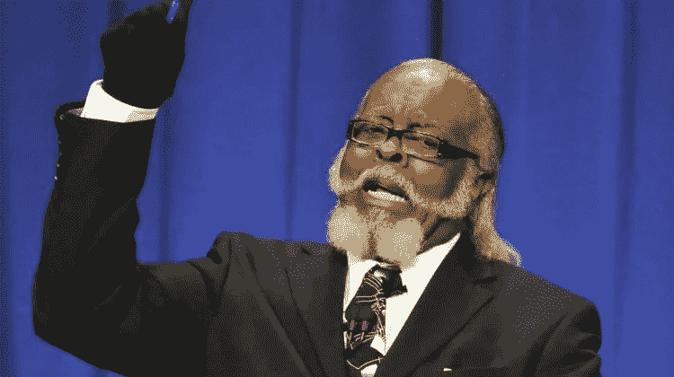
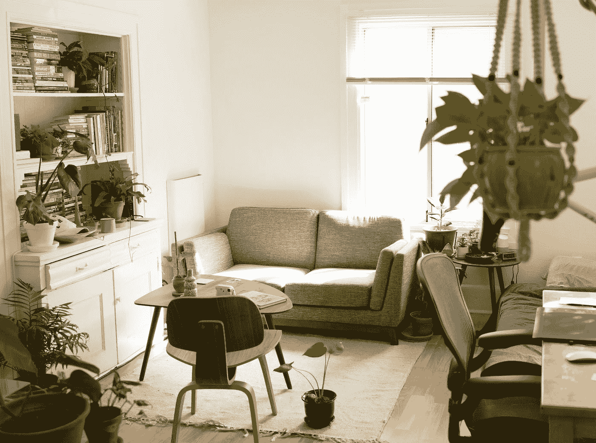

# 租金还是太高了

> 原文：<https://medium.datadriveninvestor.com/the-rent-is-still-too-damn-high-4800eaac5bf?source=collection_archive---------12----------------------->

## 为什么生活成本在上升，如何停止围绕社会的期望塑造自己

Jimmy McMillan from a political debate in New York in 2010\. [Source](https://www.wfyi.org/news/articles/when-buying-a-home-is-too-costly-and-the-rent-is-too-damn-high)

哦，为什么 2010 年没有政客听吉米·麦克米兰的？他的整个政党被命名为“租金太高”党，他们所做的只是嘲笑他。2010 年，当我看到这段政治辩论的视频时，你可以打赌，在吉米开始说话之前，我根本不知道他们在说什么。

回到 2010 年，我是一名高一学生，仍然和父母住在一起，我不知道我所在地区的房租价格。我知道我妈妈时不时会为她的开销而挣扎，但我们总是能挺过去，所以我从他的话中得到的只有笑声。

现在，作为一个 25 岁试图找到自己成年之路的人，我希望他现在就成为参议员或总统。我刚刚开始我的大学教育，我正试图找到一种方法，在兼职工作的同时负担得起马萨诸塞州的房租。我和两个室友目前在马萨诸塞州的租金是每月 1700 美元，我的公寓刚刚将 2021 年的租金提高了 100 美元。

当我看着我住在亚利桑那州和印第安纳州印第安纳波利斯的朋友，看到他们如何独自负担得起房租，或者只是和一个单身朋友或重要的人一起，这个价格似乎很疯狂。这些地区的房租价格相差很大，但一套普通公寓的月租金在 500 美元左右。在马萨诸塞州，如果没有几个小时的搜索和一点运气，你甚至找不到一个月租金 1000 美元的单间公寓。

## 为什么房租在涨？

Photo by [Patrick Perkins](https://unsplash.com/@patrickperkins?utm_source=medium&utm_medium=referral) on [Unsplash](https://unsplash.com?utm_source=medium&utm_medium=referral)

看着他现在的辩论，我在想，“2010 年纽约的房租是多少？”如果他把他的整个政党都建立在这个基础上，那一定会变得非常糟糕！根据我的研究，平均租金大约是每月 1600 美元。目前，每月约 2200 美元，而且似乎只会越来越高。

为什么纽约和马萨诸塞州等地的房租持续上涨？嗯，我不是政治家，对经济学也一无所知，所以诚实的回答是我不知道。这话出自一个已经成年 7 年，并且有房产证的人之口。

很多人说这是因为最低工资在上涨，所以房租价格一直在上涨！这是一个绝对有道理的理论，但工资本身根本没有上涨。例如，纽约和马萨诸塞州的高中教师工资都在 5 万美元/年左右，自 2010 年以来一直如此。是的，它每年上涨一两个百分点，但这仍然不能解释 10 年内租金上涨 600 美元。这当然不会让支付那么高的租金变得更容易，尤其是如果你有孩子的话。

## 值得的

Photo by [Robson Hatsukami Morgan](https://unsplash.com/@robsonhmorgan?utm_source=medium&utm_medium=referral) on [Unsplash](https://unsplash.com?utm_source=medium&utm_medium=referral)

有时候，我觉得政府改变租金价格是为了根据收入来决定谁值得拥有一个栖身之所，谁不值得。要想在马萨诸塞州舒适地买得起一套每月 1400 美元的一居室公寓，一个人必须赚 3 倍的钱，即每月 4200 美元或每年 5 万美元。这还没有考虑到他们的其他开支，如汽车保险、医疗费用、食物和其他必需品，甚至还没有考虑到他们每月大约 10 美元的小需求，如网飞。

他们或许能负担得起，但即使每年租金高达 5 万美元，他们也很难挣到房租。像我这样的人，打两份工，上工程学校，在我还没筋疲力尽的时候偶尔做做兼职，每个月能挣 2300 美元左右。这对于马萨诸塞州的任何公寓来说都是不够的。如果我没有朋友或家人一起住，我就不走运了，只能住在我的车里。

这不一定是一件坏事，但在马萨诸塞州、纽约州和加利福尼亚州等生活成本高昂的州，这种现象在 20 多岁的年轻人中出奇地普遍。我们可以让它工作，但同时，我们问自己，“为什么？”我们在做多份工作，做兼职，去上学希望赚更多的钱，但我们仍然被冷落。有些人可能会说，生活本该如此，但我说不。

有很多不同的方式来思考“值得”。你不值得生活中的坏事，老实说，我们也不值得很多好事。我认为值得是错误的思考方式，我们试图向更高的力量证明我们应该能够负担得起这个屋顶，因为我们口袋里有这种特殊的纸。

我们不应该这样看待生活。

Photo by [Ali Kazal](https://unsplash.com/@lureofadventure?utm_source=medium&utm_medium=referral) on [Unsplash](https://unsplash.com?utm_source=medium&utm_medium=referral)

在生活中的某些时候，我们会觉得自己在努力满足这个世界想要我们做的事情。我们上大学是因为这是社会要求我们做的，即使每年的学费高得惊人，我们也要去做。我们被告知住在你的车里是不正常的，我们应该想点别的办法。有些人听那个，有些人不听。

我们都是不同的个体，对生活和我们想要做的事情有不同的看法。我们中的一些人在尝试了几种不同的职业道路后，发现大学是正确的选择，而另一些人认为大学很可怕，高中一毕业就开始创业。

其他人只想忽略这一切，尽可能地自由！他们买了一辆可以生活的汽车，用他们买得起的能让他们开心的东西装饰它，然后他们离开，成为一名数字流浪者。也许他们在咖啡店写作赚钱，或者他们在国家公园做导游！

在今天的社会中，生活被戏剧化了很多，同时也被看不起，但事实上，他们只是想让生活正常运转的人。我们只是想快乐，赚足够的钱做我们喜欢做的事情，顺其自然。

无论你在人生的哪个阶段，请不要试图围绕社会对你的期望来塑造你的人生。做货车生活，创办一个 OnlyFans，或者成为一名工程师，然后去上大学。继续做你，继续奋斗。这是我们学习的方式。