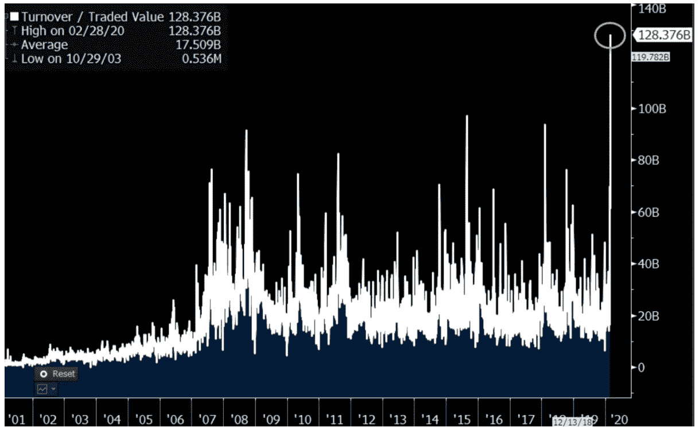

# ETF 市场在 2020 年市场低迷时期的弹性

> 原文：<https://medium.datadriveninvestor.com/the-resilience-of-the-etf-market-in-the-2020-market-downturn-196318fa0ef8?source=collection_archive---------12----------------------->

## ETF 交易量、相对于资产净值的溢价/折价以及流量告诉了我们什么？

在 2 月份的最后一周，市场指数急剧下跌，在 2020 年历史性下跌的第一阶段抹去了数万亿美元。我一直担心 robo-advisors 可能面临的流动性问题，因为我对 2016 年 7 月的 Betterment/英国退出欧盟事件记忆犹新！当意外的英国大选结果冲击市场时，ETF 变得流动性不足，定价错误，Betterment 在英国退出欧盟选举结果公布的那个周五暂停零售交易近 3 个小时。

ETF 一直是所有机器人顾问的饭碗。截至 2019 年底，根据我的计算，在职和独立机器人占整个 ETF 市场的 12%(见[此处](https://efipylarinou.com/will-robo-advisors-take-control-of-the-etf-market/))。独立的金融科技公司和现有公司都使用这些高效的包装器来创建他们的投资组合。

 [## 分散金融的出现|数据驱动的投资者

### 当前的全球金融体系为拥有资源、知识和财富的人创造了巨大的财富

www.datadriveninvestor.com](https://www.datadriveninvestor.com/2019/03/14/the-emergence-of-decentralized-finance/) 

ric Balchunas 报道称，2 月 28 日创造了历史，价值 1000 亿美元的间谍 ETF 成为首只单日交易超过 1000 亿美元的证券！

间谍交易量

几只大型 ETF 在同一天创下了历史最高成交量纪录。例如，纳斯达克追踪器$QQQ 达到 280 亿美元，最广泛使用的高收益债券 ETF $ HYG 达到 78 亿美元的日交易量。

总体而言，在市场血战的第一阶段，ETF 市场表现良好。

创纪录的交易量是一个健康的迹象。专业人士利用交易所交易基金快速有效地进出市场。我说创纪录的交易量是一个健康的迹象，因为它们与紧密的利差和合理的溢价-折价水平相结合；不像 2016 年夏天发生的情况。

在最近的市场动荡中，管理流动性并在 ETF 买卖价差中发挥重要作用的授权参与者(AP)创造了奇迹。在我的 [2016 帖子](https://dailyfintech.com/2016/09/06/are-etfs-trackers-that-fintech-can-turn-into-trucks-with-no-breaks/)中，我详细讨论了 ETF 固有的流动性风险。归根结底，APs 的 ETF 业务是一项运营密集型业务。AP 创建和赎回 ETF 份额，平均每个 ETF 有 5 个活跃 AP。这些通常是大型美国银行，但欧洲银行也作为 AP 参与了大型美国 ETF 市场。

我们需要庆祝这些实体在危机第一周处理创纪录交易量的方式。1.2 万亿美元的 ETF 交易！

美国银行、高盛、JP 摩根和 ABN AMRO 是一些主要的美联社成员，这使得机器人顾问可以吹嘘他们为最终客户提供了顺畅的服务。

ETF 在这场股市恐慌中证明了自己，这场恐慌是自 2008 年危机以来短时间内最严重的下跌之一。

在经济低迷的第一周，ETF 整体经历了 240 亿美元的净流出！与股票价值的整体下跌相比，这只是沧海一粟。这表明，散户持有 ETF，HODLedETF 交易量高表明专业人士使用 ETF 来管理他们的风险敞口。

实际上，如果我们看看今年年初以来的 ETF 净流量，我们不会知道股市出现了如此大幅度的下跌。标准普尔 500 从历史高点(3 月 12 日，周四)下跌了 27%。ETF.com 的 Sumit Roy 报告称，今年迄今为止，接近 900 亿美元的票据净流入进入了 ETF，而去年同期为 550 亿美元。

进入 3 月，恐惧袭击了西方市场，ETF 市场遭遇了第二次清算海啸。我们突然切换到“不健康”模式，单边市场和最低限度的流动性。巨大的息差、对资产净值的折价以及 ETF 和基金的错误定价的丑恶嘴脸出现了，尤其是在固定收益包装中。在美联储于 3 月 3 日紧急降息后，公司利差受到了打击，因为市场认为降息不足以防止公司债务违约，特别是在受到重创的行业(能源、旅游等)。

一些最大和最具流动性(正常情况下)的债券 ETF 受到挤压，以 3%-8%的折扣进行交易。这是前所未有的水平。

**3 月 11 日**

$ LCD——310 亿美元的 [iShares iBoxx $投资级公司债券](https://www.bloomberg.com/quote/LQD:US)ETF——其资产净值的 3.3%的折扣

$ TLT——230 亿美元的 20 年期国债 —比其资产净值低 5%

HYD——价值 40 亿美元的 VanEck Vectors 高收益市政指数 ETF 的交易价格比其资产净值低了 8.3%

## **回顾投资者在繁荣时期忽视的 ETF 风险**

ETF 的流动性风险比乍看之下更加复杂。

有一些 ETFs】瞄准流动性差的市场(如埃及股票市场的股票敞口；或特定债券市场)。

有些交易所交易基金没有积累足够的交易量，因此他的买卖价差很大(T3)。这是因为做市商面对的是一个狭窄的市场。有大量的交易所交易基金是低交易量的(据报道，接近 30%的交易所交易基金每天的交易量不到 5000 股！).交易所正在向参与做市的交易公司提供激励，以保持这些结构的活力。

还有**溢价/折价价差**，它反映了 ETF 本身的交易价格是高于还是低于基础投资组合的资产净值。这可能是由行为趋势造成的(例如，大众涌入某个投资主题，或者某个投资主题因为某个事件而不再受欢迎)。这是 Betterment 在英国退出欧盟灾后停止交易时试图保护其客户免受的风险类型。

最后一个也是最不为人所知的与流动性和交易对手相关的风险是与 ETF 的创建/赎回流程相关的风险。这实际上是这些结构的秘方，给了它们共同基金和税收效率所缺乏的日内流动性。ETF 的创建/赎回流程是指如何创建或赎回份额。这个过程很复杂，如果你想理解它，在 ETF.com[这里](http://www.etf.com/etf-education-center/21014-what-is-the-creationredemption-mechanism.html)有解释。需要揭示的隐藏风险与授权参与者(AP)有关，他们是创建和赎回 ETF 份额的实体，有时也是做市商；但并不总是如此。他们是通常的嫌疑人(大型经纪交易商)，并与 ETF 发行人签署了 AP 协议(见 SEC 注册 AP 协议[此处](https://www.sec.gov/Archives/edgar/data/1532203/000093247111003885/formofauthorizedparticipanta.htm))。综上所述，对于每只 ETF，人们不得不想到的是**发行方**(如 Vanguard、black rock)**授权参与方** AP(如美国银行)和做市商**托管方**(如 JP 摩根、道富银行)。

因此，可以说 ETF 中至少有四种固有的流动性风险。与 AP 相关的风险或 ETF 的“神奇”创建/赎回过程中固有的风险。这是金融领域无法逃脱雷曼时刻的风险。即使你投资的 ETF 与金融业没有直接关联，但由于对 ETF 授权参与者和做市商的双重流动性依赖，风险是真实存在的。2015 年 8 月，当市场出现缺口时，ETF 价格不可用，活跃的投资者需要通过 ETF 对冲；面对的是一片空白。专注于镜像指数的被动投资者也感到失望。恐慌和行为偏差会把一个看似运转良好的市场变成一个缺乏流动性、不稳定和扭曲的市场。所有这些因素都集中在金融领域。这与抵押贷款结构性产品危机和比例失调的多米诺骨牌效应没有什么不同。

【www.efipylarinou.co】T2 米