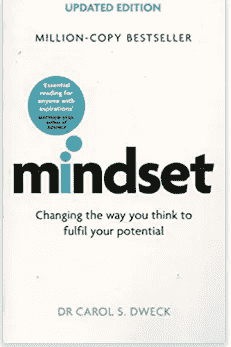
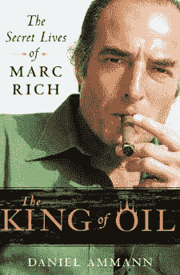
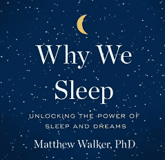
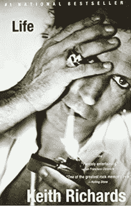
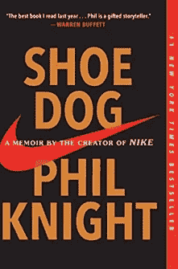

# 居家企业家的狂欢阅读清单

> 原文：<https://medium.datadriveninvestor.com/the-revel-reading-list-for-homebound-entrepreneurs-c57446f8a07e?source=collection_archive---------12----------------------->

*创始人和企业家在新冠肺炎隔离期间必读的 5 本书*

Photo by [Thought Catalog](https://unsplash.com/@thoughtcatalog?utm_source=medium&utm_medium=referral) on [Unsplash](https://unsplash.com?utm_source=medium&utm_medium=referral)

虽然一些州现在刚刚开始重新开放，但我们大多数人仍处于某种形式的官方隔离或自我隔离状态。尽管我们中的许多人仍然很忙，或者至少试图忙碌，但在可预见的未来，我们似乎会比平时拥有更多的空闲时间。这确实是一个如何充分利用空闲时间的问题。作为一名创始人或企业家，总会有其他东西帮助你增长知识，或者给你一个新的视角来看待你的生活和生意。因此，如果你想保持动力，丰富你的商业知识，或者只是让你的思维转移到别处，远离冠状病毒新闻的冲击，停止看第三遍《虎王》,深入研究 Revel 团队推荐的这 5 本书。

[**心态:新成功心理学**](https://www.amazon.com/Mindset-Psychology-Carol-S-Dweck/dp/0345472322) **作者卡罗尔·s·德韦克**(推荐作者[格利·迈尔斯](https://www.linkedin.com/in/gayle-meyers-2823a2/))

随着我们的世界似乎每隔几天就在发生变化，保持灵活的心态是有好处的。这本书有助于解释为什么——也许现在比以往任何时候都更是如此——采取正确的心态对成功至关重要。斯坦福大学心理学家 Carol S. Dweck 博士向我们展示了我们如何看待自己的天赋和能力，会对商业、工作、体育、艺术以及人类努力的几乎所有其他领域的成就产生怎样的巨大影响。它证明了思维固定的人不太可能成功，而思维增长的人却更容易成功。《开始的艺术 2.0》的作者盖伊·川崎说，“如果你管理人或者为人父母(这是管理人的一种形式)，放下一切，阅读心态。”对于我们生活的时代来说，这是一本很棒的书，将极大地帮助企业家们驾驭新常态，并试图带领他们的公司前进。

[**石油之王**](https://www.amazon.com/King-Oil-Secret-Lives-Marc/dp/031265068X) **丹尼尔·阿曼[托马斯·福尔克](https://www.linkedin.com/in/thomasfalk/)推荐**

在 Revel，我们一直在寻找利用大数据和先进技术创造新市场的方法。探究亿万富翁石油交易员马克·里奇是如何发明现货石油市场并改变世界经济的，不仅完美地展示了新市场的纯粹潜力，也展示了我们为什么喜欢试图创造新市场的公司！这本书也是一本引人入胜的引人入胜的书。这本书读起来像惊悚片，因为它涉及到他的私生活，他与阿亚图拉·霍梅尼、菲德尔·卡斯特罗、饱受战争蹂躏的安哥拉和种族隔离的南非的交往。他与以色列和美国的幕后合作——尽管被指控税务欺诈和多次被美国政府绑架未遂——也令人着迷。

 [## 数据驱动始于数据素养|数据驱动的投资者

### 光是听到“数据”这个词就令人生畏。老实说，只有 21%的全球员工对自己的工作充满信心

www.datadriveninvestor.com](https://www.datadriveninvestor.com/2020/03/22/data-driven-starts-with-data-literacy/) 

图书馆杂志称之为“一个从赤贫到暴富的传奇故事和一个隐身术惊悚片的结合，但也是一个关于全球经济中商品交易世界的优秀和及时的初级读本。”这位近代史上最成功、最具争议的大宗商品交易者的肖像受到了强烈推荐，是消除隔离引起的厌倦的完美解药。

[**我们为什么睡觉**](https://www.amazon.com/Why-We-Sleep-Unlocking-Dreams/dp/1501144316) **马修·沃克**(推荐[马科斯·马丁内斯-维拉巴](https://www.linkedin.com/in/marcos-martinez-villalba-91b038a1/))

这些天我们都睡得更多，或者至少，我们有更多的时间去尝试(当我们没有在凌晨 4 点被即将到来的厄运和世界末日的想法吵醒时)。这本《纽约时报》畅销书令人振奋地深入探究了睡眠的目的和力量。正如比尔·盖茨所说，“*我们为什么睡觉*是一本重要而迷人的书……沃克教会了我很多关于这个地球上每个人都需要的基本活动。我怀疑他的书也会对你产生同样的影响。”对于企业家来说，我们为什么睡觉是必读的。它探讨了影响睡眠质量和数量的认知、健康和商业后果。这些见解不仅会改变你的生活方式，还会改变你创业和工作的方式。在这个令人担忧和焦虑的时代，良好的睡眠可能很难获得，这本书的重要性不能低估。

[**人生**](https://www.amazon.com/Life-Keith-Richards/dp/031603441X) **詹姆斯·福克斯和基思·理查兹(**推荐[克里斯·扬](https://www.linkedin.com/in/chris-young-ab702515/))

有时候，在 COVID 的时代，我们最想要的只是逃避我们周围的残酷现实，在 Keith Richard 的生活中，你可以得到你想要的。《费城问询者报》的丹·迪鲁卡将它描述为“可爱、有见地、充满动感、优雅、慷慨、勇敢、有趣”。这是一本引人入胜的读物，讲述了一个(仍然令人惊讶地)活着的最迷人的人，或者，正如大卫·雷姆尼克所描述的，“一个知道每一种快乐，什么都不拒绝自己，并且从不付出代价的人。”有时你只需要脱离，让头脑充电，这是一本完美的书。它的教训——尽管它们可能并不总是显而易见——很多而且(偶尔)深刻。正如基思曾经指出的，“你所需要的只是爱？试试靠它生活吧。”

菲利普·奈特 [**鞋狗**](https://www.amazon.com/Shoe-Dog-Memoir-Creator-Nike-ebook/dp/B0176M1A44) (由[瓦伦·斯里达尔](https://www.linkedin.com/in/varun-sridhar-439a318a/)推荐)

这本回忆录揭示了耐克背后那个众所周知的不愿面对媒体的男人的故事。企业家们会发现这是一个揭示和坦诚的商业成功之路的真实写照。菲尔·奈特是耐克公司的创始人。他从 1964 年到 2004 年担任该公司的首席执行官，并在 2016 年担任董事会主席，目前他是名誉主席。他的故事作为创业成功的蓝图赢得了近乎普遍的赞誉。在《华尔街日报》上，比尔·沃顿称之为“登上山顶的终极企业家指南”谁能否认这一点？