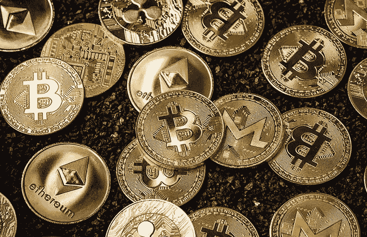

# 2020 年赚取加密货币的正确指南

> 原文：<https://medium.datadriveninvestor.com/the-right-guide-to-earn-on-cryptocurrencies-in-2020-4ec825cc592e?source=collection_archive---------24----------------------->

*明智地选择不要输掉游戏*

即使在熊市和不确定性迫近的时期，也有很多机会从加密货币资产中赚钱，但必须认识到，并非所有这些方式都像乍看起来那样安全和直接。临时投资者总是在寻找一个神奇的公式或方法，以最少的行动轻松赚钱。因此，围绕加密货币出现了许多理论和猜测，这使得这条道路对于新的市场参与者来说更加复杂。

世界各地成千上万的爱好者通过从事加密领域获得被动收入。我们只需要清楚地看到可能性。今天，让我们面对现实和从加密中获利的每一种选择的缺点。

# 1.买入并持有！

首先，也是最重要的，密码社区的一个基本概念，仍然很强大。最有效的策略之一被称为“HODL”:建立一个你喜欢的数字钱包，购买或挖掘你喜欢的加密货币，然后长时间忘记它——它可能会大幅涨价，有一天会让你大吃一惊。你感到安全和健康，不需要担心汇率或交易所黑客或交易机器人。

这种方式类似于银行存款，可能有更高的回报，并可能出现 DOGE 等意外资产的暴涨。尽管随着时间的推移，钱包仍有可能被黑客入侵，除非你使用的是冷藏钱包。拥有一个用于购物的在线钱包，同时建立一个单独的离线钱包也是一件不错的事情——用于存储大量的密码，而不参与任何类型的操作。还有什么更简单的？

# 2.挖掘硬币

很久以前，在加密技术走向月球和主流之前，加密货币开采曾经非常有利可图和流行。作为先锋的第一批矿工在没有大量投资的情况下成功获得了数字硬币。然而，现在的情况恰恰相反。2018 年末至 2019 年初历史上最长的熊市效应在最糟糕的情况下使整体市值减少了近 7 倍！即使在今天，2017 年的高度也从未达到过。

接下来，2020 年用于开采硬币的设备的异常高的进入门槛和回收期。没错——如今，要想采矿盈利，组装一个所谓的“农场”钻机(一个由十几个功能强大的显卡和一个特殊软件组成的特殊发电站)需要的不仅仅是合适的设备。2020 年，在家建造一个钻井平台不会让你有所作为。即使是经营这种“农场”的专业矿工也绝望地承认，这种实现加密的方法对今天的大多数人甚至公司来说已经无利可图了。事实是，在 5 月份又一次比特币减半后，区块奖励再次降低，迫使许多玩家关闭了在挖矿游戏中的活动 [**关店**](https://news.bitcoin.com/up-to-30-of-bitcoin-miners-close-shop-as-business-turns-unprofitable-after-halving/) 。

随着排名第一的加密货币供应量的减少，支付给矿工解决数学难题的奖金已经减少了 50%，降至每块 6.25BTC。综上所述——挖掘不是现在任何人会推荐给临时用户的东西。

# 3.加密货币交易

这个方案似乎并不复杂——只需在交易所开立账户，转移资金，买卖加密货币，希望在某个时候变得富有。有各种各样的加密货币:以更低的价格购买，以更高的价格出售，人们可以获得大量收入。只是看起来是这样。

无论如何，即使当今最好的交易所都有顶级的安全措施，但也不是完全安全的，可能会被入侵/黑客攻击。利用特定的交易机器人和算法来提高交易效率是可能的。他们允许在下跌和下跌的市场中获利。事实是，对于那些愿意全天监控汇率和波动、24/7 花费时间研究交易策略的勤奋人士来说，这是一种非常令人兴奋的方式，但也存在许多风险。

# 4.定义它

自 2019 年底以来，分散金融(DeFi)已成为加密领域最突出的趋势之一。在过去的六个月中，该行业以****的速度快速增长，DeFi 资产市值超过 10 亿美元，距离突破 30 亿美元的里程碑还很遥远！大多数在区块链领域经营的公司已经推出了他们的 DeFi 产品。Compound、Balancer、Curve 和其他公司等流行的 DeFi 协议为寻求深度流动性、不同风险回报比以及有趣和负担得起的现代金融工具的投资者打开了一扇通往全新加密机会世界的大门。随着机构资本进入数字资产领域，随着用户群的增长，我们将看到进一步的采用。****

# ****5.对您的资产进行信托管理****

****如果你害怕交易效率不高，你可以选择特定资源的专业经理，他们会将你的资金投资于加密货币，并确保你从中获利。你可以跟踪经理的投资组合的成交量，以及它给投资者带来了什么样的盈利能力。平时利息 5%起，入门门槛低。然而，也有一个最少几个月的时间，你不能撤回投资的钱。综上所述，我们可以说这是一个相当危险的高收益工具。****

# ****艰难的选择？****

****如果你选择一个特定的数字资产或创建一个加密组合，必须考虑一个明确的最终目标。即使在 2017 年的 crypto fever 天后，你仍然可以在 crypto 上赚钱。然而，你必须明智地选择，不要投资:花时间完成个人研究，不要投入你害怕失去的钱，永远不要试图从事可疑的非法庞氏骗局和可疑的项目，保持冷静，不要把所有的鸡蛋放在一个篮子里。****