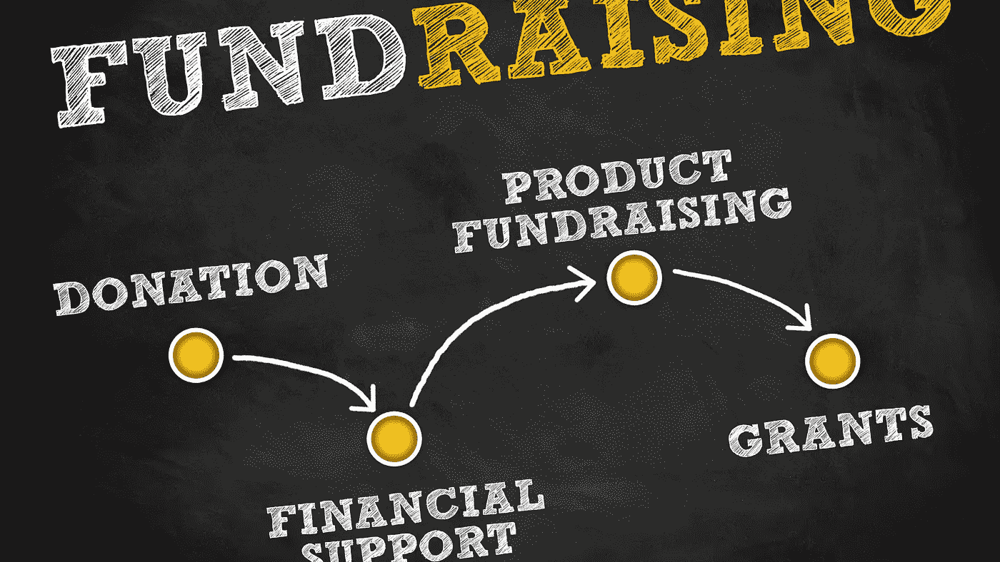

# 开始筹款的最佳时机

> 原文：<https://medium.datadriveninvestor.com/the-right-timing-to-start-fundraising-affef89de023?source=collection_archive---------18----------------------->

## 为高科技企业家筹集资金

## 是现在，还是永远，还是永远？

All pictures in the article are Canva Pro Images

今天我的收件箱里收到了一封来自生命科学企业家的邮件。他向我提出了一个商业想法，最后请求让他和他的公司与我的网络中的投资者合作。

我问了他一些常见的问题:

“你的现金跑道有多长？”

“如果你能快速注入 10 万欧元，并组织整个筹款过程在 3 个月内完成，那就最好了。否则，我们就破产了。”

“你需要多少钱？”我要求更进一步。

“两千万”，他说。

我不能接受一个任务，因为目标是不现实的，不管技术有多好。太晚了。

我经常看到被各行各业的企业家忽略的主要问题是得到这个问题的答案:

“什么时候是开始筹款的合适时机？”

以下是我的 5 个想法，以一种切实可行、易于理解的方式来回答这个问题。

# 在创办公司之前开始。

> "没有人比什么都不做的人犯的错误更大，因为他只能做一点点。"
> 
> **—埃德蒙·伯克**

在过去 5 年里，我作为孵化和加速项目的导师遇到的十个企业家中，有九个在意识到公司资金短缺时，第一时间想到了融资。

以前，他们经常说服朋友、家人和公共基金相信他们的故事。但与不知名的投资者交谈并不是他们宏大游戏计划的一部分。许多企业家与客户一起制定增长计划，同时将大部分股权掌握在自己手中。

有时候，成长计划在现实中并不像计划阶段那样奏效，这是第一次进行筹款活动的起点。

这已经太晚了。为什么？

想象一下，一个陌生人在街上向你走来，告诉你，你今天向他借一千欧元，他下周会还你两千欧元。

你会毫不犹豫地把钱给这个陌生人吗？

我认为不会。投资者也是如此。谁会给陌生人几百万？

当我还是格拉茨大学的学生时，奥地利一家上市公司最著名的董事会成员之一告诉我。

“在你需要别人的帮助之前，开始建立联系和网络。与他们成为朋友，这样当交易的时机到来时，交易就会自然进行。”

**我做了什么，你也能做什么:**

*   如果你感觉到企业家在召唤你，现在就开始了解投资者，即使你不知道你的公司应该是什么样子
*   参加会议或在你喜欢的行业的金融部门的公司工作，在那里你有机会与投资者一起工作。
*   创建一个播客，开始采访企业家和投资者。

# 把建立关系放在第一位，而不是交易。

> “通过对别人感兴趣，你可以在两个月内交到更多的朋友，而不是在两年内让别人对你感兴趣。”
> 
> **–戴尔·卡内基**

想想吧。你有没有这样的朋友或者远方的熟人，他们从来不出现或者和你联系？他们有他们自己的生活，庆祝他们的聚会，生活中的事件，而不会向你伸出援手。

除非他们需要什么。当他们有需要时，可以是私人贷款、咨询或类似的事情。当然，每个人都想友好和乐于助人，但问题是，一旦他们得到了他们想要的东西，他们就会消失几周、几个月或几年，直到他们再次需要某样东西时才回来。

实话实说吧。你真的喜欢被那样对待吗？

戴尔·卡内基说得很好。如果你想接近人们，开始对他们做什么，他们是谁，他们的成功和失败表现出兴趣。当你不需要任何东西的时候，向他们伸出援手，一句亲切的问候，一句赞美的话，一次午餐时的会面…

所有这些都有助于与人建立稳固持久的关系。毕竟，投资者也是人，和所有其他人一样，受到同样力量的驱动。

当你在需要任何东西之前就开始建立关系时，你就非常了解这些人和他们的位置。它是以友好的方式对投资者进行尽职调查。

一旦交易成熟，自然地，你可以从你的商业朋友圈子中选择那些与你的商业努力的价值观、方向和愿景最有共鸣的投资者。

**我做了什么，你也可以:**

*   支持投资者的工作。他们需要投资那些将会成功并产生回报的公司。
*   当你有这样的公司时，把它们介绍给投资者，不要期待任何回报。
*   在会议上，与他们交谈，更多地了解他们的价值观、动机、成功和失败。

# 做有价值的人，而不是穷人。

> “尽量不要成为一个成功的人。而是成为一个有价值的人。”
> 
> **—阿尔伯特·爱因斯坦**

“我现在需要 100 万，不然明天就是我的公司破产，我要裁员 50 人。”

这个故事我每年听到不止一次。筹款开始得太晚了。这是一个企业家能够投放到市场上的最需要的故事。这是绝望和贫困的声音。

作为一名企业家，你不会乞求金钱或希望从慈善慷慨中获益。

我不建议你用这种方式和那些投资赚钱的人交谈。接近投资者的方法是给他们带来他们所寻求的价值。

这仅仅是解决他们的专业问题，将满足他们标准的交易放在他们的桌子上。要了解这些标准，我们必须了解初始点。

**我做了什么，你也可以:**

*   在你需要投资人之前，请先了解他们。
*   与他们交谈，了解他们的核心价值观、愿景和使命。
*   他们在寻找什么样的交易？
*   他们作为人有哪些价值观？

# 知道你想在市场上做的交易，而不是希望交易找到你

> “只有那些你应得的交易才会成交。”
> ― **阿米特·卡兰特里**

有时候，我会有一些令人惊讶的对话，人们希望从投资者那里获得报价。还有，在专业的交易书上，我有时会看到这样的建议，让自己成为欲望的目标，让人家出价。

对于像亚马逊、谷歌、苹果或脸书这样的垄断者来说，这绝对是一个合理的建议。此外，国家建立的垄断企业也能从这种建议中受益。

在扩大创业规模的初创阶段，即使好交易很少，我也宁愿做一名服务人员，而不是傲慢自大。

在与投资者交谈时，终极问题会出现:

> “你需要多少钱？”

接下来是问题

> “为了什么？”

并以这句话结束

> “这对我们有什么好处？”

因为我正在筹款，所以我强烈主张知道你想提出的交易。非常详细，没有任何有趣的谈判游戏的余地。好吧，毕竟我是有德国血统的奥地利人。也许这就是原因。

但从那以后，它一直很好地为我服务。

**我做什么你也能做什么:**

*   了解未来 5 年的发展规划。
*   有一个收入和支出的财务模型
*   了解你所在行业的相关价值拐点
*   计算你需要多少钱来达到下一个重要的点
*   知道之后会发生什么。
*   以及如何为你的投资者创造一个出口
*   做你的作业。这份工作很辛苦，但值得一做。

# 收盘后是收盘前。

> “今天有人正在完成交易，不管天气、经济、政治或任何其他借口。
> 走出去，通过帮助人们走向财务自由、安心和遗产，为他们的生活增添价值。”
> **——法沙德 Asl**

我开始与大公司和投资者合作并购已经有 20 多年了。从事融资轮自然就有了这些话题。我在制药行业呆了 15 年，就是做这个的。

我的核心重点是药物开发、诊断、医疗设备和数字健康的早期阶段。风险高，钱少的地方。

封锁摧毁了一切。虽然我喜欢在世界各地参加行业的主要会议，亲自与人们见面，但自 2020 年 3 月以来，一切都变得数字化了。

我对这个问题的回答是建立一个商业和技术播客来保持我的网络快乐、活跃和参与。

今天我和 Sriram Subramanian 教授一起录制了一段录音，他正在研究和开发可触摸的三维全息图。

我们聊到《星球大战》和《星际迷航》中的可触摸全息图是如何变成现实的。他说我们已经非常接近了。苏布拉马年教授把他的一部分研究剥离给了一家公司。

公司名称？ [Ultraleap](https://www.ultraleap.com/)

他在 2013 年联合创立了这家公司，并带领它经历了几轮融资。

在播客采访中，他说了一些意味深长的话:

> “募捐之后，就是募捐之前。企业家可能犯的最大错误，是在收到上一轮融资的支票后就停止融资”

萨勃拉曼尼亚教授的话完美地总结了我过去 15 年为高科技公司融资的所有经历。

*   通过尽早了解投资者来建立自己的安全网
*   永远建立牢固、持久的关系。
*   给人们带来价值，而不是期望交易对你有利。
*   了解交易，并把它清楚地放在桌面上
*   在开发技术的同时，继续筹集资金。

自 1999 年以来，我是各行各业公司的执行官、顾问和教练。我专攻企业发展和金融。从种子轮到 IPO 级别。我从 2006 年开始关注生命科学。

[**加入我的邮件列表保持联系！**](https://mailchi.mp/5a50875fb5ea/newsletter)