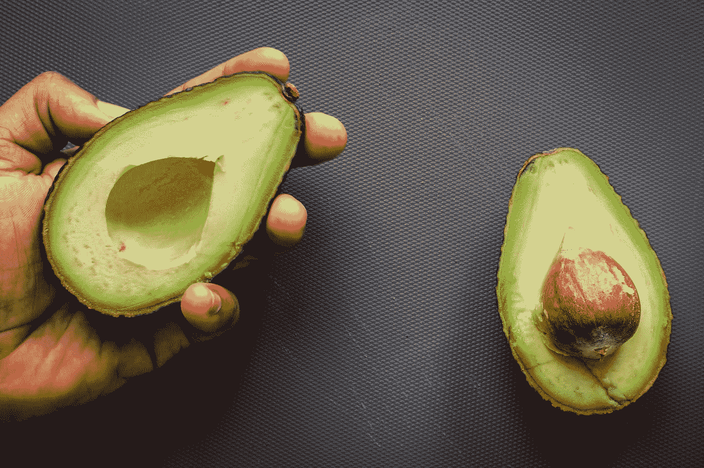

# 鳄梨领袖的崛起

> 原文：<https://medium.datadriveninvestor.com/the-rise-of-avocado-leaders-7035736f86cd?source=collection_archive---------38----------------------->

## 不确定性下的领导力

## 新冠肺炎的一线希望

Photo by [Louis Hansel @shotsoflouis](https://unsplash.com/@louishansel?utm_source=medium&utm_medium=referral) on [Unsplash](https://unsplash.com?utm_source=medium&utm_medium=referral)

新冠肺炎改变了工作方式，团队领导和人事经理与团队互动的方式也发生了变化。作为对这种新工作方式的回应，人们观察到了一种有趣的领导趋势——出现了 ***鳄梨领导*。**

## 鳄梨领导人

> “鳄梨领导者外表强硬，但内心柔软且富有同情心”

过去，一些领导者可能更喜欢发挥他们的“强硬”特质，并保持与团队成员的专业关系。大多数高管受到增长和收入等硬性业务 KPI 的激励，而不是他们的同理心或自我意识水平。

然而，当前的健康危机确实成了这些领导人展示“温和”一面的催化剂。例如，在 zoom 会议期间，团队领导有更好的机会了解他们同事的家庭情况——他们的宠物、孩子数量、爱好以及他们喜欢的室内设计风格。

## 组织中有鳄梨领导者的好处和危险

疫情和间接的牛油果领导者已经产生了一些积极的影响——生产率提高了 63%,协作更好了 57%,效率提高了 55 %( Jepsen 2020)。这些鳄梨领导者必须进行更多的学习、倾听和适应，以确保团队在这种艰难的情况下团结一致，表现出色。此外，avocado 领导还帮助远程员工感受到更多的融入，因为现在每个人都在同一个竞技场上(所有会议都是在线的，现场和非现场团队成员之间没有隔离)。

然而，也有一些不容忽视的弊端。avocado 领导确实在与团队成员的沟通方面做得很好，并帮助组织实现了生产率的提高。然而，We Are Unity consultants 和麦格理商学院(Macquarie Business School)的一项合作研究显示，接受采访的 AXS 200 强企业中，超过一半的领导者(高层和中层管理人员)表示，生产率的提高带来了沉重的代价:员工倦怠和心理健康受损(Jepsen 2020)。此外，一些反对意见可能来自那些重视隐私高于一切的员工。

 [## 女性领导给你的企业带来的五大优势|数据驱动型投资者

### 从通用汽车和好时到 Ulta Beauty 和百思买，世界各地的大型企业都在证明…

www.datadriveninvestor.com](https://www.datadriveninvestor.com/2020/11/20/five-advantages-female-leadership-brings-to-your-business/) 

## 如何培养牛油果领导人

希望在员工队伍中培养更多牛油果领导者的组织，尤其是初创企业，可以采取以下三个简单的步骤:

1.  提炼如何衡量领导者。在硬性和软性业务指标之间建立平衡至关重要。可以引入人才保留和员工参与度等新的 KPI，以激励领导者发挥他们更温和的同情心。
2.  **建立“软”能力来管理“硬”能力。**通过培养领导者的软技能来投资他们。研究表明，情商高的领导者将能够加速成长，更具创新性，并创造一个重视反馈的环境。
3.  **信任。**透明度和问责制是确保这种领导风格获得高管和下属认同的关键。授权给领导者，让他们能够根据团队的需求来调整领导风格。只有建立了信任，所有这些机制才会发挥作用。

## “公开”是你需要采用的新领导风格吗？

从趋势上看，鳄梨领导可能仍是未来领导者采用的流行领导风格；因为员工和组织都享受到拥有一个更“人性化”的领导的好处。这种领导风格在初创公司非常有效，那里的员工都很年轻，重视人际关系和真正的领导力。这有助于在团队中灌输信任，从而实现更好的协作。然而，重视隐私的老一代人或内向的人可能不太喜欢这种“新领导”的方式。

最后，领导者必须牢记的一点是，没有放之四海而皆准的领导风格。优秀的领导者能够根据团队成员的个人偏好来调整他们的领导方式。他们可以利用鳄梨领导的好处来帮助那些愿意这样做的人，同时防止与那些喜欢谈论业务和保持个人生活隐私的人打成一片。

参考资料:

杰普森，丹尼斯 2020，新冠肺炎:危机还是催化剂？我们是一体的。查看时间 2020 年 10 月 3 日[https://research-management . MQ . edu . au/ws/portal files/portal/125535985/MQ _ WAU _ COVID _ REPORT _ 2020 . pdf](https://research-management.mq.edu.au/ws/portalfiles/portal/125535985/MQ_WAU_COVID_REPORT_2020.pdfLinks)

**访问专家视图—** [**订阅 DDI 英特尔**](https://datadriveninvestor.com/ddi-intel)