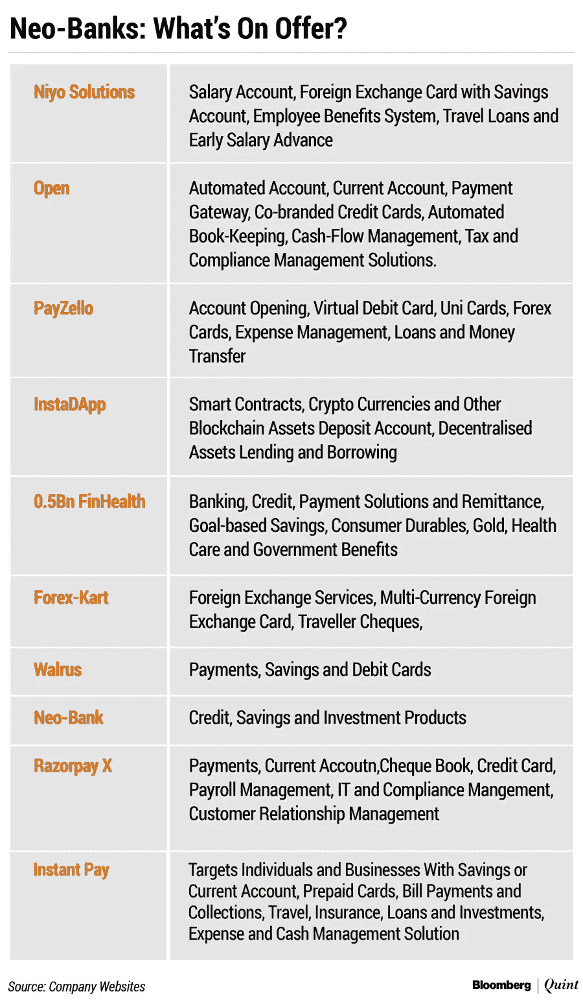

# 印度新银行的崛起

> 原文：<https://medium.datadriveninvestor.com/the-rise-of-neobanks-in-india-b157daf95535?source=collection_archive---------2----------------------->

## —印度不同新银行金融科技公司的市场概述

Photo by [Ales Nesetril](https://unsplash.com/@alesnesetril?utm_source=medium&utm_medium=referral) on [Unsplash](https://unsplash.com?utm_source=medium&utm_medium=referral)

仅在 2019 年，印度的金融科技初创公司就筹集了高达 37 亿美元的资金，而且理由充分。印度是世界上金融科技服务采用率最高的国家！不仅如此，印度对金融科技初创公司的年投资回报率也是世界上最高的，为 29%，而世界平均水平为 20%左右。因此，很明显，目前，金融科技公司是印度创业生态系统中更安全的*赌注之一。企业家和风险资本家都很早就意识到了这一点，这导致了一系列金融科技初创公司的涌现，提供了一系列不同的服务，从在线钱包到数字借贷……到现在的新银行。*

* [## 金融科技的全球趋势|数据驱动的投资者

### 各国可能已经封锁了边境，以减轻新冠肺炎疫情，但当地和国际贸易必须去…

www.datadriveninvestor.com](https://www.datadriveninvestor.com/2020/04/28/global-trends-in-fintech-technology/) 

许多新的“新银行”创业公司已经在这个国家出现，并且已经筹集了超过 9000 万美元！全球 neobank 市场在 2018 年价值 186 亿美元，预计在 2019 年至 2026 年期间将以约 46.5%的复合年增长率(CAGR)加速增长，到 2026 年将产生约 3946 亿美元的收入！所以，是的，这是网上银行业一个不断增长且*重要的*领域。

但是什么是新银行呢？它们是如何工作的？

我们来分解一下。

## **“什么是新银行？”**

新银行只存在于网上，没有任何实体分支机构，独立于或与传统银行合作。这些“银行”提供各种数字金融服务，如活期和储蓄账户、支付和转账。纯数字化使他们能够适应并遵守监管环境。

## “所以他们与私人银行合作？”

嗯，是也不是。他们不(或者说不被允许)提供银行提供的任何关键服务，如存款、存款利息或贷款。印度储备银行(RBI)仍然严格优先考虑银行的物理存在，最近加强了对数字银行服务提供商的一些物理存在的要求。

他们与银行合作，进行采购和前端管理，而所有交易都由银行处理。想象一下他们就像银行的销售代理一样！他们通过用户友好的平台和提供的多样化服务吸引顾客。所有由此产生的交易都是在银行的后端完成的。

为什么银行会参与其中？

传统银行愿意与这样的创业公司合作，为某些细分市场建立差异化或有针对性的业务主张，并获得他们带来的任何增量业务和收入。同时与这些新银行共享一些后端基础。

因此，要建立一个新账户，你只需登录任何一个 neobank 平台并启动这个过程。合作银行仍将是所有客户信息的主要保管人。所有交易都将由银行进行认证，并通过银行的欺诈监控流程，即使这些交易是由第三方发起的(在本例中为 neobank)。

不过，专家认为，这种服务仍然是新的，只要基础银行产品的核心承诺没有被打破，就有空间进行实验，以找到合适的产品市场。

## "但是我们为什么需要新银行呢？"

1.  **独特的客户体验** -客户能够以一种独特的、改进的方式与银行服务互动。新银行能够提供高度增强和个性化的客户体验，这是传统银行所缺乏的。
2.  **透明度:**新银行是透明的，并努力提供实时通知和对客户产生的任何费用和罚款的解释。
3.  **深刻见解:**大多数新银行都提供界面友好、易于理解的解决方案，以及对支付、应付款和应收款以及银行对账单等服务的宝贵见解。

## 印度球员

美国大约有 12 家新银行初创公司提供不同的服务，并与各种私人银行合作。

NiYO Solutions 和 OPEN 是最突出的两个，它们筹集的资金和用户的关注度都很高。

该公司在一份声明中表示，NiYO 筹集的资金将用于更快地开发和推出新产品，加强分销和营销，并寻找国际市场进行扩张，特别是可以通过新银行概念进行数字化颠覆的新兴市场。这家初创公司提供了两种解决方案，Bharat Payroll 解决方案为印度蓝领劳动力提供现代工资账户，Global Card 为旅行者提供银行服务。

另一个这样的平台 Open，将自己标榜为“商业银行服务，将从银行业务到发票和自动记账的一切结合在一起”。Open 与 ICICI 银行合作，允许其客户将他们在 60 多家银行的所有账户连接起来，并为小型企业提供由 Visa Inc .支持的预付费名片，以管理员工的支出。

*

*尽管数字银行和新银行的势头越来越大，但大多数银行尚未显示出持续的盈利能力。然而，它们有很大的潜力成为银行和金融服务的颠覆者，成为盈利实体的关键是说服传统银行投资于新时代的技术，并重新设计流程，以提供无缝、快捷的客户体验。*

***进入专家视角—** [**订阅 DDI 英特尔**](https://datadriveninvestor.com/ddi-intel)*