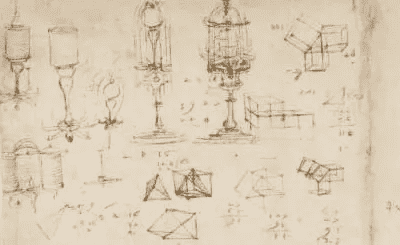

# 机器人的崛起

> 原文：<https://medium.datadriveninvestor.com/the-rise-of-robots-6c5bdb68fd88?source=collection_archive---------16----------------------->

## 深入了解机器人技术的发展。

机械自动机并不是一个新概念。由经验丰富的发明家开发的机器人示意图的证据可以追溯到公元前 10 世纪西周统治时期。雄心勃勃的工匠严石制造了能唱小夜曲和表演舞蹈动作的人形自动机。据说这台机器拥有像生命一样的器官，模仿骨骼、肌肉和关节。

当希腊人控制埃及时，一群工程师定居在亚历山大。创新者建造了自动机，并留下了一套文本，详细描述了由液压或蒸汽驱动的自动机的功能。

DaVinci’s Sketches

15 世纪晚期，莱昂纳多·达芬奇邀请了一位机械机器人骑士。包含设计的素描本在 20 世纪 50 年代被重新发现。这位机器人骑士能够站立、坐着、抬起面罩，并能独立操纵手臂，还有一个符合解剖学的下巴。机器人系统由一系列滑轮和电缆操作。

 [## 论机器人权利:机器人可以被奴役吗？数据驱动的投资者

### 人们可以随心所欲地对待他们的机器人吗？一个人可以对他们的机器人“暴力”吗？机器人应该是…

www.datadriveninvestor.com](https://www.datadriveninvestor.com/2020/02/13/on-robot-rights-can-robots-be-enslaved/) 

20 世纪初，美国小说家莱曼·弗兰克·鲍姆给了我们精彩的《绿野仙踪》。他讲述了电子人铁皮樵夫的故事，他是一个人类樵夫，在被邪恶的斧头砍断四肢、头部和身体后，被一个锡匠替换了。

1927 年，第一个屏幕上的机器人玛丽亚出现在电影《大都会》中。这部德国制作的电影是以未来的城市反乌托邦为背景的。

Maria of Metropolis

20 世纪 70 年代，机器人和未来电影风靡一时。至于用于现实世界的实用机器人技术的发展，直到 20 世纪 80 年代才真正开始。许多公司涌现出来，吹嘘他们计划开发现实生活中的机器人，可以帮助人类完成实际的日常任务。

在 20 世纪 90 年代，重点是扩大互联网和制造产品，路由和维护虚拟流量和存储所需的支持当时新成立的“万维网”。在 20 世纪 90 年代中期到后期的技术繁荣时期，商业和消费电信设备被制造了数百万台。这是其他产品快速发展的主要障碍。因此，机器人技术的发展在那些年里几乎被搁置了。

现在在 21 世纪，机器人被制造来做从送餐到拉动和运送你的网上订单的一切事情。它们在为人类提供支持方面变得与我们日常生活中经常使用的智能设备一样重要。

目前，大量涌入的机器人正在被创建，以服务于零售业。大多数大型零售商现在通过互联网销售大多数产品，因此需要在零售商仓库的库存取货-拉货系统中使用机器人。

机器人需要非常高质量的硬件来保持其应用和功能的准确性和耐用性。在产品设计和生产过程中，使用国内制造商将有助于缓解硬件供应商和 OEM 之间的任何沟通问题。拥有国内来源还将确保硬件不会被海关扣留或在交付过程中遭遇灾难性中断。例如，有时从外国运载硬件到美国的货船会经历极端恶劣的天气或条件，导致硬件损坏或丢失。

到目前为止，机器人的最佳用途是帮助残疾人处理日常活动和进行高风险手术以拯救生命的机器人。

机器人的未来是作为人类的补充，而不是替代。今天，机器人正在运送食物、进行手术、运送人员和货物以及帮助残疾人。因此，机器人技术将变得与汽车和计算机产业一样重要。

Gena 瓦兹奎 2020

感谢您的阅读！如果你喜欢这篇文章，请随意阅读我写的类似文章。

[量子飞跃——下一代计算技术](https://medium.com/datadriveninvestor/quantum-leap-the-next-generation-of-computing-781e647a4c57)

[生物识别筛查技术将如何改变旅行？](https://medium.com/swlh/how-will-biometric-screening-technology-change-travel-571b773a6f60)

[美国制造业的复苏——第二十二条军规](https://medium.com/@LegacyofGena/a-catch-22-the-resurgence-of-manufacturing-in-the-u-s-f195fffc70e)