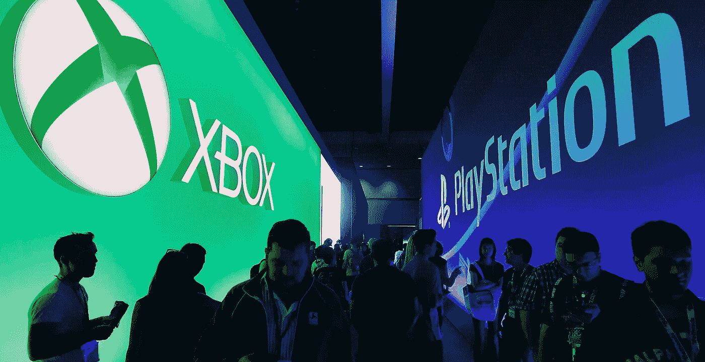
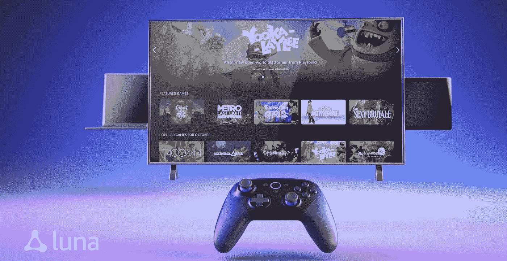

# 游戏战争的兴起

> 原文：<https://medium.datadriveninvestor.com/the-rise-of-the-games-war-9ad8dcd0b48a?source=collection_archive---------23----------------------->

## 我对 2021 年的技术预测排名第一

## 首席数字官蒂姆·弗兰克·安德森——查理·探戈

Photo by [Fábio Silva](https://unsplash.com/@tamarisco?utm_source=unsplash&utm_medium=referral&utm_content=creditCopyText)

由于全球疫情，2020 年的极端动荡和数字高速增长让我们所有人感到惊讶。2021 年有望成为我们回归某种新常态的一年，带来一些新的数字习惯和行为变化。

和前几年一样，我策划了未来一年最有趣和最紧迫的数字趋势，我将在十篇系列文章中揭示这些趋势——这是第一篇。让我们来看看。

# 为游戏大战做好准备

七年来，我们第一次见证了全新游戏主机的推出——索尼(PlayStation 5)和微软(Xbox series X)。尽管它们在接近 2020 年圣诞季时正式推出，但库存非常有限，几乎没有游戏可以充分利用这两个新强国在性能上的巨大飞跃。

The wait is over: after 7 years of waiting, 2 new consoles will arrive in 2021

这意味着全面爆发的游戏大战将发生在 2021 年。根据这两台机器的规格，我们将见证 2021 年推出的下一代游戏在图形质量上的巨大进步。

等待新硬件的七年时间太长了，因此与此同时，在线“吃到饱”游戏平台已经出现，开始参与竞争。[谷歌体育场](https://stadia.google.com/home)是一个非常雄心勃勃的计划，你可以选择支付固定的月费(69 丹麦克朗/月的专业访问费)。这样你就可以进入一组游戏，并且每个月都会有新的游戏加入。然后你可以按需购买额外的游戏。据宣传，它能够以每秒 60 帧的速度传输高达 4K 分辨率的视频游戏，随着 5G 和更快光纤连接的推出，8K/120 FPS 支持将在未来某个时候推出。

 [## 语音没有死亡——人工智能如何改变呼叫技术游戏|数据驱动的投资者

### 语音死了吗？这是一个公平的问题。关于流程数字化、新应用和增强型移动银行的讨论…

www.datadriveninvestor.com](https://www.datadriveninvestor.com/2020/10/08/voice-isnt-dead-how-ai-is-changing-the-call-tech-game/) 

和谷歌并不孤单。这项服务正在与索尼的 PlayStation Now 和 T4 的 Nvidia 的 GeForce Now 展开竞争。微软也有一个[云游戏服务](https://www.xbox.com/da-DK/xbox-game-pass/cloud-gaming/home)正在测试中，除此之外，预计亚马逊将在 2021 年推出一个成熟的竞争对手 Luna。凭借他们的 AWS 平台，亚马逊看起来是一个非常可怕的竞争对手。

The new Luna online gaming platform from Amazon will arrive in 2021

最后，苹果公司推出了 [Apple Arcade](https://www.apple.com/dk/apple-arcade/) ，尽管他们的游戏更加休闲，但他们现在已经将这项服务捆绑到非常有利的 [Apple One 订阅](https://www.apple.com/apple-one/)中，这必将取得巨大成功。

然后你可以在 Steam 这样的平台上一次只购买一个游戏。

这个新市场的风险很高:根据 Newzoo 的数据，包括电子竞技在内的在线游戏收入预计将在 2020 年达到 1740 亿美元——由于 Corona 危机，这是一个巨大的增长。预计该市场将在 2023 年继续增长至 2180 亿美元。这个市场现在被认为是这个星球上发展最快的产业之一，威胁着其他核心传统娱乐产业的收入。

因此，当我们进入 2021 年时，预计会有一场相当艰苦的游戏大战。

## 获得专家观点— [订阅 DDI 英特尔](https://datadriveninvestor.com/ddi-intel)