# 超文化拉丁人的崛起

> 原文：<https://medium.datadriveninvestor.com/the-rise-of-the-hypercultural-latinx-135816de6b49?source=collection_archive---------1----------------------->

**副总裁看门人**

在 20 世纪 80 年代，菲多利有一个秘密武器，它甚至不知道。他的名字叫理查德·蒙塔尼兹，他来自一个葡萄种植世家。他整天打扫浴室和拖地——他是一家菲多利工厂的看门人。然而，他也发明了美国最热门的小吃:火辣辣的奇多。他是第一个提问的菲多利员工，“如果我把*智利*放在一块芝士玉米条上会怎么样？”他确实这么做了。

作为菲多利公司新任副总裁，蒙塔尼兹推动这家休闲食品集团推出了第一款产品，以迎合美国一个被忽视的群体——西班牙裔的味蕾。[的故事](https://thehustle.co/hot-cheetos-inventor/)确实引人入胜，但也凸显了许多公司的盲点:西班牙裔市场。即使在创建于 20 世纪 40 年代的菲多利公司，40 年后他们才开始瞄准西班牙裔消费者，即使在那时，这也是纯粹的意外收获。在这篇文章中，我讨论了为什么初创企业最适合创建针对这个令人垂涎的美国拉美裔群体的公司。如果做得正确，这不仅会带来巨大的业务，还会让公司为居住在美国的代表性不足的社区推动前进。

作为一名在童年和青年时代大部分时间生活在美国的墨西哥裔千禧一代，认为即使是金融上最成功的美国公司也缺乏反映整个美国人口的人才和思想似乎是疯狂的。即使在德克萨斯州长大，那里的大多数少数民族是西班牙人，白人美国人也不知道西班牙文化。他们从我们这里学到的最多的文化是墨西哥卷饼，即使在那时，他们也把它翻译成他们自己的文化:Tex Mex Tacos。对于一个以真正融合了不同民族、文化和信仰而自豪的国家来说，只有一句话:做得更好。

 [## 数据驱动始于数据素养|数据驱动的投资者

### 光是听到“数据”这个词就令人生畏。老实说，只有 21%的全球员工对自己的工作充满信心

www.datadriveninvestor.com](https://www.datadriveninvestor.com/2020/03/22/data-driven-starts-with-data-literacy/) 

鉴于最近围绕乔治·弗洛伊德和大黑人的命也是命运动的事件，承认少数民族社区在他们的日常生活中面临的持续的种族主义是很重要的。虽然围绕非裔美国人生活的可操作性对话早就应该进行，但针对其他少数族裔社区(如西班牙裔)的种族主义同样应该成为更广泛对话的一部分。西班牙裔对警察滥用职权并不陌生。这个系统将所有有色人种视为罪犯。我们必须沟通。我们*都*有责任拆除种族主义的围墙。因为这与我的投资理论有关，不仅仅是个人对他人表现出种族歧视，公司和品牌也构成了我们美国人的生活。不幸的是，我认为大多数公司忽视美国拉美裔营销的一个重要原因是因为他们太专注于追求白人消费者。让我们直言不讳:[大多数做营销决策的人都是白人，对任何不属于他们的生活经历视而不见。他们认为营销给白种人会产生更高的利润，而事实上，正是这种想法产生了种族主义的潜在影响。因此，我相信，采取行动，建设一个不存在种族主义的世界，将会催生更多针对少数族裔的公司，比如美国的西班牙裔公司。](https://fortune.com/2017/06/09/white-men-senior-executives-fortune-500-companies-diversity-data/)

我们说的有多大？

如今，众所周知，美国的拉美裔代表着无与伦比的经济增长机会。截至 2019 年，共有[1.31 亿多文化美国人](https://www.forbes.com/sites/forbesagencycouncil/2019/01/25/how-the-u-s-hispanic-market-is-changing-this-year/#3831772464fc)，约占美国人口的 40%，其中西班牙裔占最大部分。从绝对数字来看，美国有近 6000 万拉美裔人，并将成为人口增长最快的群体。他们代表了超过 1.5 万亿美元的购买力，从 2010 年到 2018 年增长了 3 倍，而非西班牙裔白人增长了 2 倍。

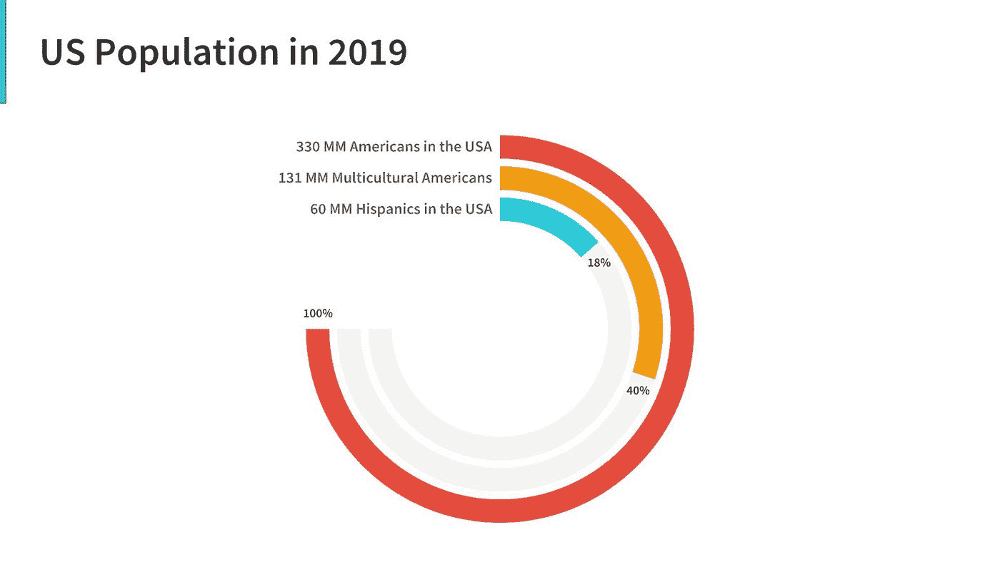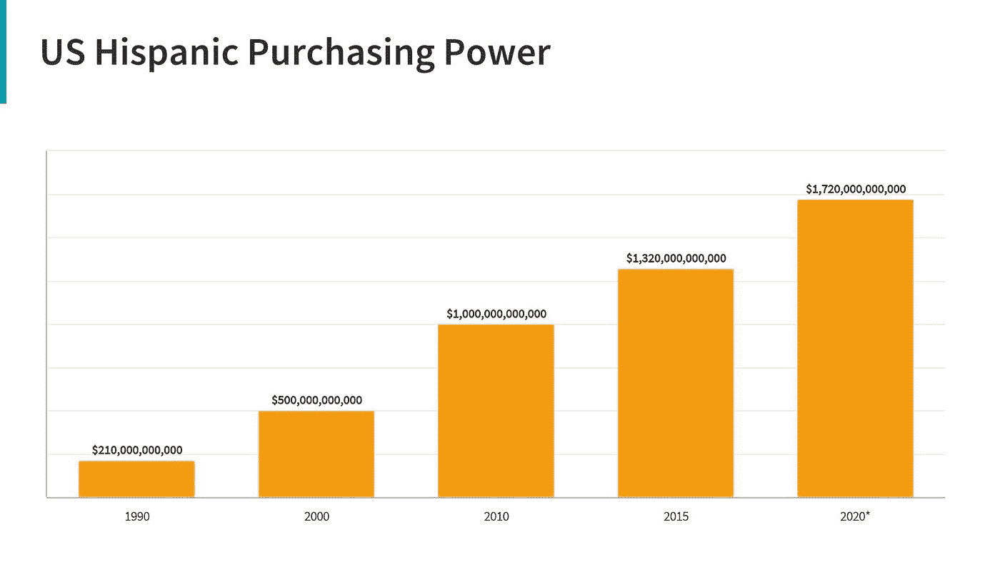

**美国拉美裔引领年轻人**

美国西班牙裔现在是美国最年轻的种族，平均年龄为 28 岁(白人平均年龄为 42 岁)。从长远来看，这意味着大多数美国拉美裔人是赛琳娜戈麦斯的年龄，大多数美国人是汤姆·布拉迪的年龄。美国拉美裔青年意味着大量的黄金消费年——翻译过来就是:对企业来说是$$。这群千禧一代精通数字技术，在移动设备和视频上花费了前所未有的时间；然而，大多数直接和间接广告并没有真正抓住他们最关心的东西:他们的习俗、文化和价值观。传统玩家就是不明白。而且，他们没有足够的影响力来吸引年轻的西班牙裔进入他们的线上或线下店面。我们只能说，没有拉美裔年轻人会像他们涌向 Supreme 或 Il Makiage 一样涌向世界各地的沃尔玛。

**传统品牌的广告搞错了**

看看这些品牌继续在西班牙市场玩俄罗斯轮盘赌的例子。公司对西班牙文化永无止境的嘲弄让我大吃一惊。这些品牌不仅给人以音盲的感觉，甚至带有种族歧视。想到我们生活在一个为了激励品牌做得更好而不得不抵制品牌的世界，这是很悲哀的。代表品牌的良好行为不应该被奖励，而是应该被期待。我们肯定不在那里。

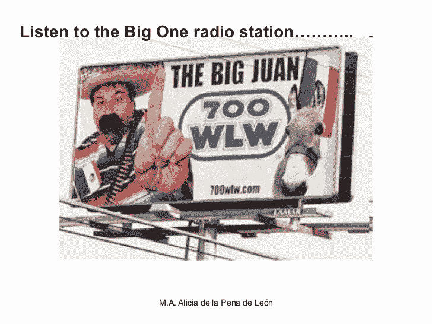

2007 年，辛辛那提当地的一家广播电台最终得罪了这座城市不断增长的人口。这则广告不仅嘲笑了一个以西班牙语为母语的人对英语单词“One”的发音，还继续强化人们的刻板印象，即所有墨西哥人都戴着墨西哥宽边帽，穿着雨披，留着卡通式的小胡子。我只想说，我还没见过一个家庭成员拥有雨披、子弹带或驴子。

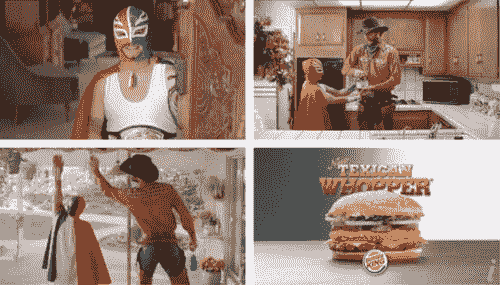

汉堡王在 2009 年做了一个广告，意外地强化了墨西哥男人矮的刻板印象。该视频因其对墨西哥人的刻板描述和对墨西哥国旗的攻击性使用而遭到抵制。没有一个国家比美国更以自己的国旗为荣。我仍然记得我在德克萨斯州上五年级时，那里最激烈的学生志愿者活动是每天早上挂美国国旗。那么，当他们认为墨西哥国旗几乎是神圣的时候，为什么他们可以嘲笑墨西哥国旗呢？

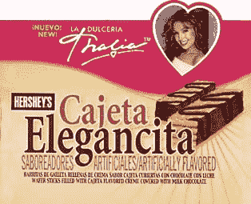

这则广告是营销团队不理解西班牙裔语言差异的绝佳例子。在这个 2005 年的广告中，墨西哥著名歌手塔利亚写道“Cajeta Elegancita”。在墨西哥，Cajeta 有奶糖的 G 级含义。对好时公司来说不幸的是，在拉丁美洲的部分地区，cajeta 也是一个贬义词，指女性身体的一部分。从我会说话开始，我就是塔利亚的粉丝，这无疑让我对好时坏了看法。

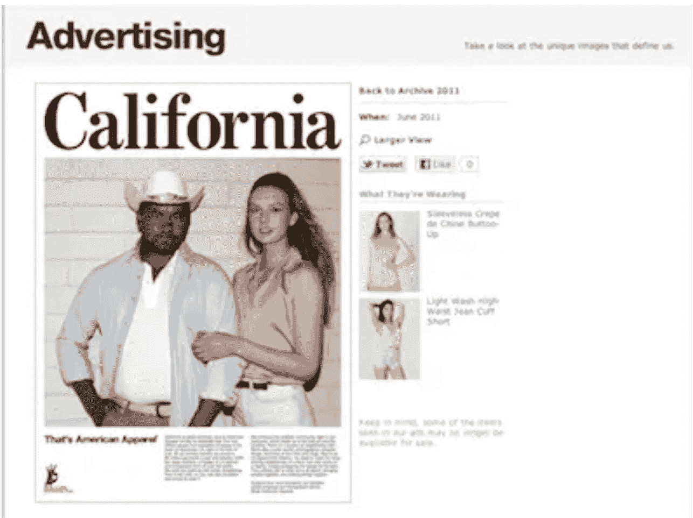

2012 年，美国服装公司被指控推广一种新的配饰:墨西哥人。作为一个墨西哥人，我喜欢看到更多的墨西哥人出现在我购物的品牌中，但是，我更希望墨西哥人是主要的主题，而不是一个白人女孩的糖果。

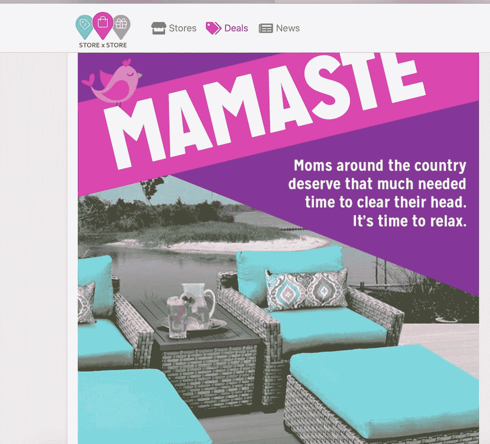

最近一次是在 2020 年 5 月，凯马特的母亲节广告[震撼了西班牙语使用者](https://wearemitu.com/culture/kmart-mothers-day-mamaste/)。当凯马特决定自己创造一个词(Mama + Namaste)时，他们创造了一个西班牙语使用者非正式使用的词，在性环境中表示“吮吸”。听着，我明白，西班牙人通常都很随和，但这并不意味着一家比女童子军饼干还老的公司可以有贬损的广告文案。

与上述例子不同的是，那些主动出击、迎合美国拉美裔消费者的新来者和初创企业，有机会与大型企业竞争并做大。然而，了解美国拉美裔的消费行为并进一步区分居住在美国的拉美裔是很重要的。毕竟，在西班牙裔社区惹上麻烦最简单的方法就是给每一个西班牙裔墨西哥人打电话。我在西班牙留学的时候，[这个](https://www.youtube.com/watch?v=eyGFz-zIjHE&feature=youtu.be)视频在我们西班牙语课上播放。这真正证明了我的观点:西班牙裔非常不同，尽管我们说同样的语言，但我们并不完全以同样的方式使用它。

**美国拉美裔消费者行为**

如果你是一名美国拉美裔人，你可能是在父母大肆购买科技产品(蓝牙、联网设备、4K 电视机、虚拟现实等)的环境中长大的。圣诞节那天，最令人羡慕的(然而也是最常见的)礼物是最新的 iPhones、Beats 或物联网玩具。看到一个小学生和一个母亲送同样的 iPhone 并不罕见。事实上，我记得有一年圣诞节，我当时 9 岁的弟弟和 23 岁的妹妹都收到了一部 Iphone。并且猜猜谁收到了更新的版本(提示:不是*她的*)。

我的观点是，在各个社会经济阶层中，西班牙裔的可支配收入不成比例地流向了屏幕(各种类型)和科技玩具。我的意思是，去你的西班牙朋友家看看:他们的电视屏幕可能比住在那里的人要多。事实上，令人困惑的是，29%的美国西班牙裔计划在超级杯前夕购买一台新电视机——罪名成立。见鬼，当我的家人搬家时，我们甚至在客厅装修之前就为每个房间都买了电视屏幕。技术——尤其是较新的技术，对西班牙裔来说,[更具吸引力。](https://www.pwc.se/sv/pdf-reports/pwc-emc-hispanics-report.pdf#page=7)

但是为什么呢？这与西班牙裔与生俱来的好奇心和测试未经测试的欲望有关。从技术角度来说，西班牙裔是早期采用者，而[比大多数人更早跨越鸿沟](https://medium.com/west-stringfellow/crossing-the-chasm-summary-and-review-9cfafdac9180)。

毫不奇怪，他们的手机是他们首选的发现工具，他们比普通人更关注移动设备。此外，西班牙裔消费者更有可能故意点击他们在手机应用程序中看到的广告——考虑到他们对这款设备的热爱，这并不罕见。然后，他们将这些新发现的信息传播到他们所在社区的可能性几乎是 T9 的两倍(碰巧他们自己也非常不同)。如果这还不足以吸引营销高管，西班牙裔在线评论产品和服务的比例也比非西班牙裔高。

**脸书 Ad 实验结果**

鉴于美国西班牙裔消费者的行为(见上文第节)，我在脸书做了一个为期两周的短期实验，以证明我的假设。

*我的假设*:通过付费社交网站锁定美国西班牙裔比锁定白人更便宜、更有效(点击率更高)。

*实验*:我用一种假的第一产品 SPF 喷雾为一个假的防晒品牌“反弹皮肤”创建了一个登陆页面。我做了几个广告。接下来的两个星期，我在脸书买了广告，目标是我确定的两个受众:基本的白人女孩和西班牙女孩。我把观众从脸书引向登陆页面——

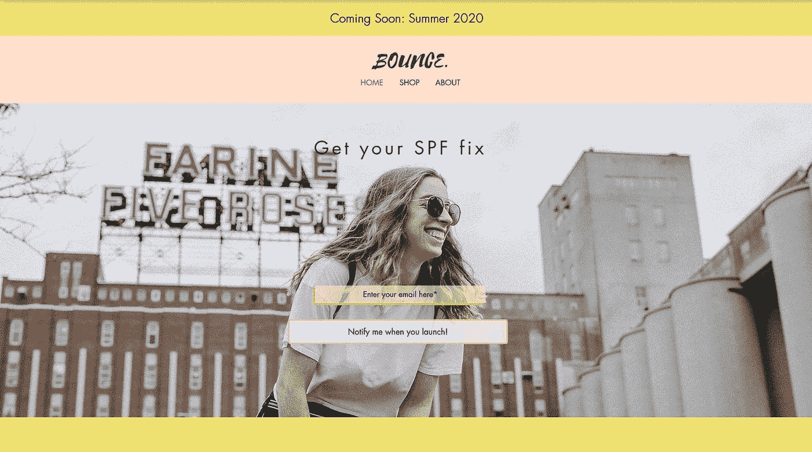

*使用的广告示例:*

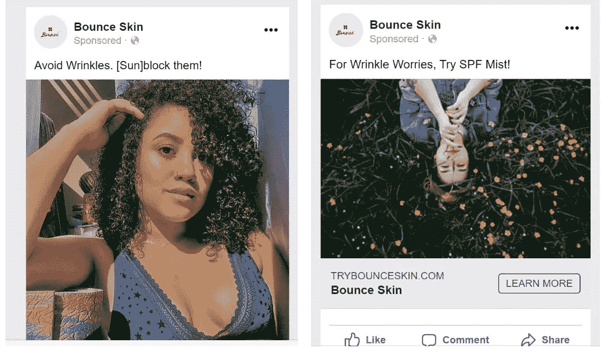

*结果:*

*   68%的女性年龄在 25-34 岁之间
*   地理位置在西班牙裔社区中占优势(38%的德克萨斯州，28%的佛罗里达州，13%的新泽西州，12%的加利福尼亚州)
*   总共 117.5k 次展示
*   总共 2，091 次点击

*点击费用:*

*   在西班牙裔观众中:每次点击 0.06 美元
*   白人女孩观众:每次点击 0.33 美元

*结论:*

根据我的短期实验的早期结果，我同意过去几年各种组织收集的数据点:使用广告瞄准美国西班牙裔社区比瞄准大多数消费者初创公司的目标客户(白人、Z 世代/千禧一代女性)更便宜，并产生更高的交谈率。

***免责声明*** *:这个假设并不是对美国拉美裔广告行为的全面研究，而是激励其他人在目标受众下更深入地研究这个问题。*

**超文化的拉丁人**

虽然上述行为在所有拉美裔人中普遍存在，但*第二代+* 拉美裔人的某些特征使他们成为更好的利基受众。第二代拉美裔的定义经常有争议，但在这里，我们指的是我们当中出生在美国、父母出生在西班牙语国家的人。这一代人经常感觉他们一只脚在美国，另一只脚在父母的原籍国。虽然有些人可能会认为这个群体是相当“粉饰”的，与他们的白人同行有许多相似之处，但我认为这只是意味着粗略地看了一下人口统计。如果你透过表面，藏在普通的视线里，你会注意到我称之为“*超文化拉丁人*”的兴起

*   她/他是第二代西班牙人，被反映他/她的文化的内容所吸引
*   语言对她来说仍然很重要，因为语言与身份密切相关，是文化和传统的重要组成部分。72%的美国西班牙裔家庭主要说西班牙语，这种语言在他们家附近流行
*   她是 100%西班牙裔，100%美国人。她继承了所有的文化财富和传统，同时也在寻找新的美国生活能给她的所有机会。
*   她擅长创造一种伪文化，这种文化融合了他/她父母的教养和她在美国的日常经历。
*   她知道媒体经常不报道她/他的生活(T21)。
*   她使用 Whatsapp 的可能性比她的白人同龄人高 87%

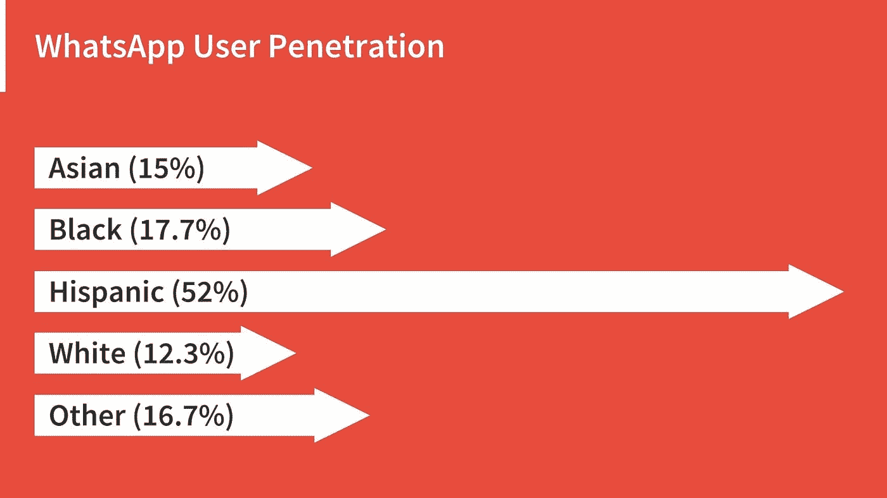

Source: [www.emarketer.com](http://www.emarketer.com)

把她想象成你的酷表妹——拥有亚历山大·奥卡西奥·科尔特斯( [AOC](https://www.instagram.com/aoc/?hl=en) )的大胆和[乐乐·庞斯](https://www.instagram.com/lelepons/?hl=en)(以及她的闹剧视频)的古怪。她是*中的《辣妹子》。*

*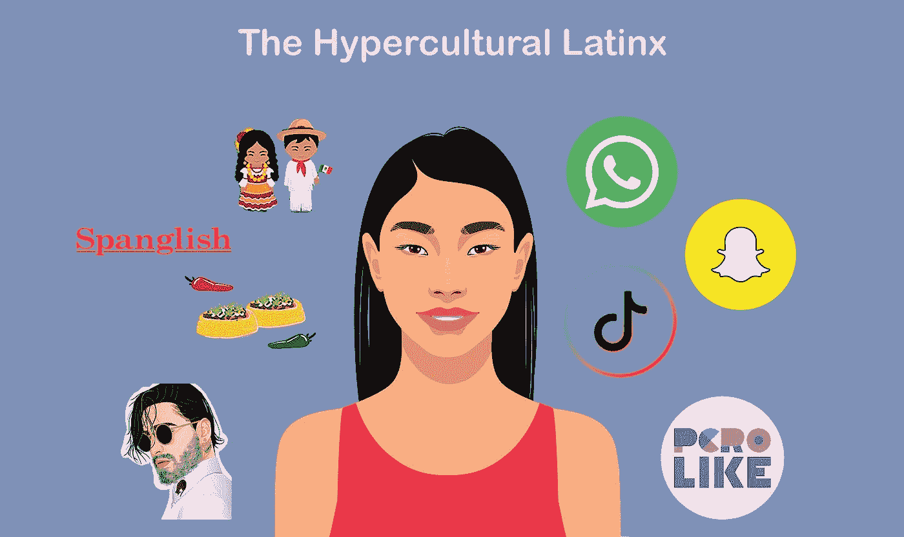*

*创业公司的空白区*

*我希望现在我已经让你相信，美国的拉美裔千禧一代是令人垂涎的，并希望把他们的钱用在他们所说的产品和服务上。*

**那么，你如何“得到它们”？*虽然这个问题的答案是多方面的，但我相信做得最好的品牌还不存在。资产负债表沉重的传统公司没有成为该领域的领导者是有原因的——担心*。害怕你会得不偿失。冒犯你试图吸引的同一批观众是有风险的。看看美容行业就知道了，它经常与种族问题联系在一起。甚至在美丽之外，公司也不断犯错。考虑到西班牙裔之间存在的细微差别，成为音盲并不难。然而，这不仅仅是将数字内容从英语翻译成西班牙语。那些最有可能从西班牙市场中分一杯羹的人呢？初创企业。**

**初创企业的优势在于没有不良营销或形象问题的历史(至少大多数是这样)。相反，他们可以从零开始，建立一个专门面向拉美裔千禧一代的品牌。“有真正理由去寻找拉美裔年轻人(又名 ***【超文化拉丁人】*** )的初创企业，如果创始人的精神特质与其受众一致，就更有可能成功”。我不是说创始人必须是拉美裔。但是，我认为我们不能削弱他/她与核心观众分享生活经历(奋斗和庆祝)的重要性。例如， [Spiritu](https://medium.com/authority-magazine/meet-danielle-levine-of-spiritu-changing-the-way-women-connect-and-shop-through-her-unique-online-55888ca2a7a1) ，一个拉丁裔订阅箱，通过捕捉拉丁裔生活中的相关时刻，并利用创始人在洛杉矶过西班牙裔生活的知识，覆盖了超过 125，000 名超文化拉丁裔。还有风险投资资助的米兔，一家专注于视频的初创公司，通过专注于 Tik Tok 皇后[罗莎](https://wearemitu.com/fierce/tiktok-queen-rosa-and-her-creator-adam-ray-okay-get-the-magazine-spotlight/)、[拉丁 Twitter](https://wearemitu.com/entertainment/latina-twitter-got-alex-russo-from-wizards-of-waverly-place-to-trend-on-twitter/) 趋势和[拉丁表情符号的下降](https://wearemitu.com/things-that-matter/more-than-100-new-emojis-are-dropping-this-year-and-our-latinx-cultura-is-represented-meet-the-tamale-and-pinata-emojis/)等内容，引起了在线拉丁裔观众的巨大共鸣。**

****美国拉美裔面对新冠肺炎的考量****

**如今写任何东西都不可能不提到房间里的白象:新冠肺炎。整个世界现在都处于生存状态。那么，这对我们西班牙裔意味着什么呢？这如何改变他们可支配收入的优先顺序？他们的日常生活发生了怎样的变化，哪些习惯会延续到疫情之后？虽然大多数答案仍不确定，但很明显，美国西班牙裔已经受到冠状病毒的影响。因为，尽管这种病毒没有歧视性，但拉丁美洲人正不成比例地受到新冠肺炎的侵袭。**

**美国拉美裔人更有可能将新冠肺炎视为对他们健康和财务的威胁。首先，他们中的近⅔人从事的工作没有医疗保险。其次，大多数人面临金融不稳定的风险，因为他们的工作绝大多数都在政府当局强制关闭的部门。这些行业包括酒店、食品&农业、危险材料、运输和物流。**

**虽然美国的西班牙裔是来自不同年代和国家的人的融合，但很大一部分被解雇或减薪的人是更年轻的第二代西班牙裔。与白人相比，年轻一代的 T2 人更关心自己的财务状况。这些 25 至 35 岁的西班牙裔人没有成熟的职业生涯，但容易受到经济下滑的影响。**

**因此，随着大量裁员涌入影响拉美裔千禧一代的生计，他们会怎么做？嗯，他们会做西班牙人最擅长的事情:生存，然后繁荣。毕竟，作为拉美裔人，我们可以依靠这样一个事实，即我们是具有弹性的[人。](https://www.ffyf.org/new-research-highlights-latino-families-resilient-despite-limited-resources/)**

**但是怎么做呢？**

**如果有一个时间让你的身边忙碌起来，那就是现在。**

**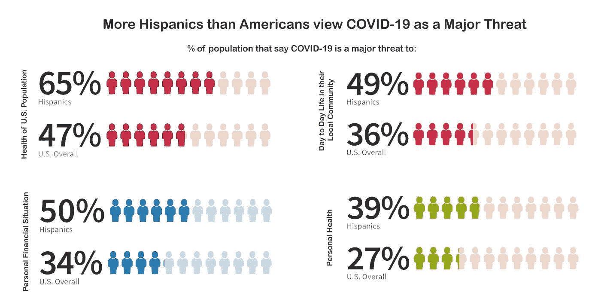**

***Chart created from data from the Pew Research Center***

**影响美国拉美裔的最大一级趋势是*新世界零工经济*。随着劳动力供应的激增，失业者将寻找传统和非传统的方式赚钱，也就是副业。那些有能力的公司已经在想办法利用这个失业群体。例如，Il Makiage 正在招聘兼职化妆师，为其客户群提供虚拟化妆教程。**

**然而，这不是拯救现有的劳动力市场，而是围绕它进行创新——产生了这个新的世界零工经济。美国拉美裔人特别适合在*新世界零工经济*中探索这些工作:零工经济和[激情经济](https://a16z.com/2019/10/08/passion-economy/)交汇处的工作。对拉美裔人来说，关键在于提升传统工作，将其转变为更有意义、更有利可图的工作。怎么会？嗯，就像康宝莱让我们的西班牙裔母亲和祖母把零工、兼职变成有意义的职业一样。在今天的世界里，那些西班牙裔母亲正在翻译我称之为新的、鼓舞人心的社会指南(稍后会有更多介绍)。**

*****康宝莱*** 速成课**

****TLDR** :康宝莱通过一个强大的类似大使的项目，将膳食补充剂业务发展到超过[50 亿美元](https://www.macrotrends.net/stocks/charts/HLF/herbalife/net-worth)的估值，该项目主要由在当地社区销售的西班牙裔女性组成。用风投的话来说，康宝莱将是独角兽的 5 倍！**

**虽然康宝莱是由一个白人商人在 20 世纪 80 年代第一次在他的汽车后备箱里销售产品时创立的，但真正的顾客很快变成了西班牙裔女族长。如今，康宝莱 80%的销售额来自西班牙裔观众及其强大的西班牙裔女性分销渠道。康宝莱是西班牙人中保守得最好的秘密。在西班牙裔社区之外，没有人谈论它。然而，作为西班牙裔社区的参与者，康宝莱已经完了。康宝莱是伴随我长大的。当我 8 岁的时候，我们一家第一次从墨西哥搬到德克萨斯州，这是我生活中为数不多的几个不变的产品之一。从初中到高中，我每天早上都喝这个。这成了我高中所有越野跑赛前仪式的一部分。事实上，它仍然放在我的湾区公寓里，也是我每天早上第一件要拿的东西。即使我不再和我的父母住在一起(他们第一次向我介绍了这些产品)，但每次我回到休斯顿的家，我都会确保从家里带一瓶康宝莱。我可以直接告诉你，走进一个西班牙家庭的食品储藏室，你不可能不认识康宝莱的大而笨重的容器。康宝莱之于西班牙裔就像星巴克咖啡之于白人女孩。**

**如果你对风险投资行业稍有了解，你可能会读到马克·安德森著名的[号召建立](https://a16z.com/2020/04/18/its-time-to-build/)。好吧，我向那些正在思考“建设”的人发出挑战，请他们考虑创造下一代康宝莱。作为一名投资者，我希望看到针对美国拉美裔的初创企业在以下方面进行创新:1)商业模式，2)客户获取策略，3)实现产品粘性的方法，或 4)在其他受众群体中重新利用成熟的模式。**

*****免责声明*** *:虽然康宝莱因其传销方式而受到媒体的负面指责，但我相信康宝莱的上市元素非常强大，值得新创业公司实施。毕竟，说出一个比康宝莱更植根于西班牙文化的产品？我会等…***

****在这个领域成为一家风险投资支持的初创企业****

**然而，并不是所有的初创企业都值得风险投资。风险投资是一个强大的工具，为了获得风险投资，你需要想成为十亿美元以上游戏中的一员。看看这个电视节目《亿万》的 30 秒剪辑。这位女性显然没有考虑整体商业计划及其组成部分(走向市场、商业模式、客户细分等)。作为一名风险投资者，我希望看到的不仅仅是千篇一律的答案。坦白地说，我厌倦了这些。因此，当谈到建立一个针对超文化拉丁人的风险投资支持的初创企业时，我希望看到一个关于规模能力的假设。那么，这个领域的初创企业如何展现规模化的机会呢？两件事:一个平台方法和一群社会向导。**

**平台方法是一种较新的商业模式，初创企业已经在不同程度上进行了测试。这种方法需要创建一个品牌组织，然后横向或纵向地推出新品牌。这种方法分散了风险，并使初创企业能够跨不同品牌共享基础设施和供应链。这方面的一个例子是我最喜欢的高价柠檬饮料背后的公司， [Iris Nova](https://www.irisnova.com/) 或 Glossier-team 分拆， [Arfa](https://www.wsj.com/articles/ex-glossier-executive-henry-daviss-next-act-is-a-house-of-brands-11557441991) 。对于西班牙裔市场，这意味着一系列品牌瞄准西班牙裔市场的一个细分市场。总部位于迈阿密的[卡森人寿](https://carsonlife.com/)利用名人效应走向市场，试图成为一个现代营养品牌。我与创始人索尼娅交谈过，她提到让名人参与具体的产品发布是关键。她还指出，创建一个品牌家族，而不仅仅是一个独立的品牌，这让她有信心在时机成熟时能够扩大规模。**

**我用“社会指导大军”的方法解释了如何使用类似康宝莱的策略(没有金字塔计划)来扩大初创企业的规模。在今天的冠状病毒世界中，这是失业的西班牙裔千禧一代合法化其副业的一种方式。它使用了一个会员和推荐项目，其中主要联系人是“社会向导”。这本社会指南鼓舞人心，受到超文化拉丁裔人口的推崇。看，同样地，我的 X 代母亲和她的朋友从康宝莱获得营养补充剂，从 [Monat](https://monatglobal.com/) 获得护发产品；我的父亲和他的朋友从 Immunotec 购买健康产品，我知道我们这一代，超文化的拉丁人，正在寻找我们自己的有抱负的品牌和产品，并成为他们的忠实顾客。毕竟，社交是西班牙文化与生俱来的，所以通过社交和相互购买非常有意义。**

**归根结底，初创公司还应该牢记客户群的需求，创造被忽视的机会。例如，我们的一项投资，习惯皮肤，指出超文化的拉丁人痴迷于他们的皮肤外观，却很难重新涂抹防晒霜。因此，Habit 围绕重新涂抹防晒霜的用例开发了一款产品，并正在积极地测试这一客户群。这款喷雾防晒产品非常适合西班牙人，因为他们天生是油性皮肤。同样，[陆乐](https://lelu-usa.com/)注意到大量第二代西班牙人与不讲西班牙语的配偶结婚。因此，很难保持西班牙语作为一种家庭语言(尤其是在孩子出生的时候)。因此，Ana 的创始人创造了一个面向家庭的解决方案，帮助这些类型的家庭动态保留和教授西班牙语的非西班牙语的配偶和子女。**

**我怀疑风投界的新宠将会为超文化的拉丁裔解决问题。**

****结论**:**

**蒙塔内兹可能没有高中文凭，但他有一个哲学博士学位——虽然不是你想的那种。他是自由的，不自由的，不确定的。就这样，他从看门人变成了菲多利帝国的支柱。**

**自蒙塔涅兹向菲多利高管们展示以来，已经过去了大约 40 年。对我们来说幸运的是，由于技术的创新，你不需要再等 40 多年才能再次成功瞄准美国拉美裔。事实上，你甚至不需要一个大型零食集团的支持。看看你的周围，越来越多的初创公司是在预算不足的情况下成立的——rx bar 的预算是 1 万美元，Mailchimp 的收入达到了 7 亿美元，Shopify 在获得风险投资之前独立运营了 6 年。**

**如果你能从这篇文章中想起一件事，那就是:**超文化的拉丁人**不仅仅是一个可爱的现象。她是大量未花掉的美元的所在地。但是，你得知道她在哪里闲逛，消费什么内容，谁给她灵感。很有可能，她藏在众目睽睽之下。**

**对于真正关心美国拉美裔市场的创业者来说:定义你的空间，利用你的优势，并与它一起经营。有了这些，你就有可能吸引到合适的风险投资者。**

**赢得多元超文化的拉丁人并不容易，但成功做到这一点的创业公司吸引了我的注意力和我的投资。**

****访问专家视图—** [**订阅 DDI 英特尔**](https://datadriveninvestor.com/ddi-intel)**