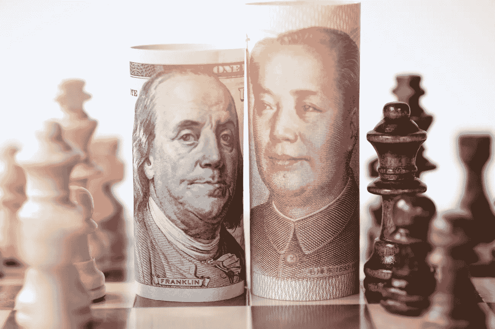
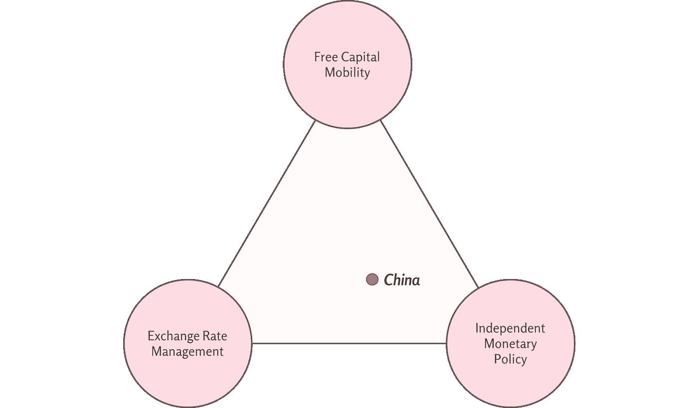
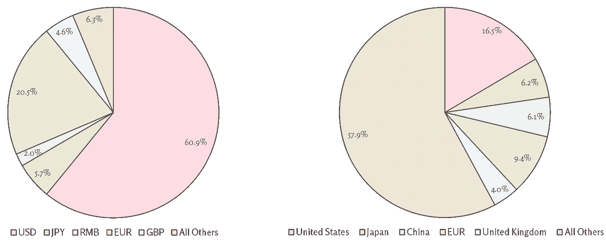

# 人民币的崛起:国际化的成本和收益

> 原文：<https://medium.datadriveninvestor.com/the-rise-of-the-renminbi-the-costs-and-benefits-of-internationalization-the-china-guys-19e1ae9bf66a?source=collection_archive---------20----------------------->

Image via: [Adobe Stock](https://stock.adobe.com/)

# 摘要

在推动人民币国际化的过程中，中国反对“不可能的三位一体”，这是一个经济原则，规定任何开放经济体都不能同时管理汇率、控制货币政策和允许资本完全流动。近年来，中国试图同时兼顾这三者，但收效甚微。为了获得完全国际化的人民币的好处，中国必须考虑向三角形一边迈出更大胆一步的利弊。

***想呆在对一切都了如指掌的中国？订阅我们的时事通讯让真知灼见直接送达您的收件箱:【www.thechinaguys.com】*******。****

*………*

*一种货币的全球采用通常反映了其发行国的经济实力。尽管中国在国际贸易和巨大的国内市场中占据主导地位，但替代的世界货币仍占全球支付总额的约 98%，而人民币[在中国以外很少被用作贸易和投资的载体货币](https://www.thechinaguys.com/the-digital-rmb-a-solution-to-chinas-usd-problem/)。以此为标志的差异，肯定不仅仅是市场因素在起作用。*

*如果没有足够健全的监管框架，中国从一个孤立的国有经济体系向一个主要由市场驱动的经济体系的转型(T21)将中国暴露在潜在的市场冲击之下，这些冲击来自大量的资本流入和货币不稳定。由于意识到过快推进人民币国际化的风险，中国在开放资本账户和允许人民币自由浮动方面一直行动缓慢。尽管如此，北京已经认识到全球货币固有的地缘政治和经济利益，并通过缓慢地调整经济政策的所有三个方面，对人民币国际化采取了渐进的方式。政府试图通过维持对货币兑换的控制、保留大量资本控制和管理货币政策来挫败“不可能的三位一体”；然而，要完全实现控制一种全球接受的货币的雄心，中国将不得不向三角形的一边迈出一步。*

## *中国的“不可能三位一体”*

**

**来源:* [*中国佬*](http://thechinaguys.com/)*

*[“不可能的三位一体”](https://www.economist.com/the-economist-explains/2016/09/09/what-is-the-impossible-trinity)规定，没有一个开放的经济体可以同时允许资本自由流动、管理货币汇率和制定独立的货币政策。想象一个资本自由流动、货币盯住美元的国家，这意味着有管理的汇率。假设市场有效，如果中国央行试图控制货币政策，并将利率设定在高于美国美联储利率的水平，投资者将会发现套利机会，并向中国的债券和储蓄市场大举投资。资本的涌入会给货币带来升值压力，最终打破其与美元的挂钩。同样，如果央行降息，人民币将面临下行压力。在这种情况下，如果该国希望其货币价值保持与美元挂钩，它必须对全球资本流动关闭其市场。*

*应国际社会的要求，中国在 2005 年从宽松的盯住美元过渡到有管理的浮动汇率制度。这种不寻常的体系包括一个与一篮子国际货币挂钩的基础价值，并允许人民币在一个狭窄的范围内浮动——允许[在一个交易日内不超过 2%的升值或贬值。有管理的浮动汇率允许相对更大范围的波动，因此，中国逐渐增加了资本账户敞口。然而，由于担心开放的货币市场会限制 PBOC 在经济危机时期进行干预的能力，中国仍然对让人民币完全浮动犹豫不决。](https://www.ft.com/content/3dcb4f0c-b807-11e9-8a88-aa6628ac896c)*

*为了缓解人民币不愿浮动的局面，中国放开了某些行业的资本流动，同时仍保持相对严格的控制。仅在 2020 年，[中国就向外资完全开放了人寿保险、证券和共同基金行业](https://www.bloomberg.com/news/articles/2020-01-22/china-s-finance-world-opens-up-to-foreigners-sort-of-quicktake),在疫情冠状病毒爆发后，[取消了合格境外机构投资者(QFII)计划及其人民币机制(RQFII)中合格境外投资者的投资限制](https://www.linkedin.com/feed/update/urn:li:activity:6664611760559009792),这两项计划是管理外国投资者进入国内股票和债券市场的举措。*

*然而，中国的资本管制依然严格。中国通过《外国投资法》(FIL)对[保留了一份负面清单](https://www.china-briefing.com/news/china-fdi-policy-negative-lists-encouraged-catalogues/)，该清单概述了禁止全部(有时是部分)外国风险所有权和投资的行业。此外，尽管 RQFII 和 QFII 的投资限制被取消，但中国继续禁止对大宗商品和期货、首次公开募股和私募投资基金的投资。对外投资的前景同样受到限制，中国公民每年的外汇兑换不得超过等值 5 万美元，机构投资者对非发达地区或超过 3 亿美元的对外投资要经过冗长的官僚审批程序。*

*为了保持对货币政策的自主权，中国决定慢慢放松对其货币兑换机制的控制，并逐步开放资本账户；然而，中国试图阻止“三难困境”并追求其全球货币雄心的决定值得讨论人民币国际化的内在收益和成本。*

# *人民币:国际化的好处*

## *穿越“美元陷阱”*

*外汇储备对于维持浮动货币的价值、为进口商和出口商提供流动性以及提供投资者信心至关重要。*

*自 2001 年加入世界贸易组织以来，中国积累了世界上最大的外汇储备。加入世贸组织推动了外国直接投资，而北京出于人民币贬值的目的，历来战略性地购买大量美元。与此同时，由于以美元计价的贸易流入和受限制的资本流出之间的不平衡，美元的自然盈余促成了大量的外汇储备。2014 年 6 月，中国外汇储备达到峰值，超过[4 万亿美元](https://www.scmp.com/economy/china-economy/article/3020410/how-much-chinas-forex-reserves-us-dollars-beijing-gives-two)，截至 2020 年 3 月，目前为[3.061 万亿美元。](https://www.reuters.com/article/china-economy-forex-reserves/update-1-chinas-march-forex-reserves-fall-more-than-expected-to-17-month-low-idUSL4N2BV2H2)*

*[2019 年，中国公布了历史外汇储备构成](https://www.scmp.com/economy/china-economy/article/3020410/how-much-chinas-forex-reserves-us-dollars-beijing-gives-two)，开创了先例。该报告指出，在 2005 年的购买狂潮之后，美元占中国外汇储备总额的近 80%。在 2014 年底储备总量的峰值时，美元构成已降至 58%，即价值 1.8 万亿美元的美元计价资产，其中 1 万亿美元投资于美国国债。举例来说，美元是全球使用最广泛的货币，平均占全球外汇储备的 65%。*

*对过度暴露于美元计价资产的担忧已成为北京推动人民币升值、防范“美元陷阱”的主要驱动力。与非多样化投资组合固有的危险类似，在外汇储备中过度持有单一货币会在该货币突然贬值的情况下带来巨大风险。如果美国经济下滑，美元贬值，中国的外汇账户将受到严重影响。此外，尽管美联储和美国政府之间的界限分明，但中国决策者担心美联储为了减少其未偿债务负担或出于其他政治目的而对美元进行战略性贬值的可能性。*

## *贸易融资*

*中国在大萧条期间受到严重影响，由于全球需求下降和许多进口国的信贷冻结，2008 年至 2009 年间，中国出口总额下降了 16%以上。没有便捷的贸易融资渠道，许多跨国公司开展高水平国际贸易的能力受到限制。在大衰退的情况下，许多组织都在努力应对全球美元存款短缺导致的信贷冻结，这最终导致了流动性危机，破坏了贸易融资环境。作为世界第二大经济体、最大的商品出口国和最大的贸易国，全球贸易融资领域的任何混乱都会对中国经济产生乘数效应。*

*国际化的人民币可以帮助中国出口商管理这一风险。在西方货币市场波动性加剧或系统性冲击的情况下，进口商仍将有办法寻求人民币计价的融资，并继续交易，同时将干扰降至最低。此外，全球接受的人民币将允许中国出口商在结算中对冲货币风险。在当前的贸易环境下，主要结算货币(美元、欧元、英镑)估值的大幅波动可能会使中国出口商面临巨大的利润差异，而以人民币进行交易将最大限度地降低他们在发票开具、结算和货币兑换阶段的利润损失风险。*

# *地缘政治实力*

## *全球外汇储备构成(左)与国际货币基金组织投票份额百分比(右)*

**

**Sources:* [*Currency Composition of Official Foreign Exchange Reserves (COFER)*](http://data.imf.org/)*,* [*International Monetary Fund (IMF)*](https://www.imf.org/external/np/sec/memdir/members.aspx)*,* [*The China Guys*](http://thechinaguys.com/)*

*货币越多，实力越强，中国寻求的是掌控全球货币带来的战略利益。尽管货币本质上是一种用于贸易的支付工具，但它也可以用来扩大其发行国的全球影响力。例如，美元在全球外汇储备中占最大份额，因此，美国在国际货币基金组织中拥有[最大的单一国家投票权份额，为 16.5%](https://www.imf.org/external/np/sec/memdir/members.aspx) 。欧元占全球外汇储备总额的 20.5%，在国际货币基金组织拥有 9.4%的投票权。相比之下，人民币仅占全球外汇储备总额的 2%——尽管由于中国的经济规模和贸易影响力，该国在国际货币基金组织中拥有不成比例的 6.1%的投票权。如果全球对人民币计价外汇储备的需求增加，中国的投票权份额将随之增加，并最终使北京能够在关键的全球金融决策上与美国抗衡。*

# *人民币:国际化的成本*

## *选择的挑战*

*根据不可能的三位一体理论，如果中国继续宽松地管理人民币汇率，而不是将其放松为纯粹的浮动制度，那么中国开放资本账户的能力将仍然有限，因为大量资本流动会将人民币推至交易区间之外。自由化的资本账户通常伴随着更强劲的市场、更高的经济稳定性和多样化的产业——所有这些都是全球采用一种货币的一般前提。尽管开放资本账户的好处值得考虑，但自由浮动的货币被认为对中国目前的经济模式来说过于自由。*

*自由浮动的汇率制度在很大程度上丧失了对货币估值保持战略控制的能力。自 2005 年以来，众所周知，在面临提高中国出口产品全球竞争力的压力时，中国会加速人民币贬值。如果中国允许人民币自由浮动，在经济动荡时期，PBOC 将失去其政策工具箱中一个具有历史意义的重要工具。*

*此外，由于自由浮动的货币更有可能被选为小国本币盯住的基本价值，PBOC 在制定非正统货币政策时将进一步感受到灵活性的限制。研究表明，美元兑人民币每升值 1%，中国的出口份额就会增加大约 0.123%。在今天的贸易总额范围内，2019 年 12 月人民币对美元汇率下降 1%，相当于中国每月出口收入增加约 29.4 亿美元。作为一个出口驱动型经济体，中国有很大的动力保持所有刺激贸易的途径，直到它有效地从依赖贸易(目前约占年 GDP 的 20%)转向更强劲的国内消费。*

## *政策转变风险*

*尽管国际化的人民币将给中国带来前所未有的经济和地缘政治机遇，但实现其雄心所需的货币政策转型将给中国经济带来巨大风险。*

*一种国际化的货币需要一个开放的资本账户，如果中国采取措施实现其人民币雄心，PBOC 将被迫放弃对市场的严格控制，并逐步过渡到更宽松的政策立场。与此同时，资本账户自由化和低利率时期伴随着大量资本流入，在此期间，银行内部无法跟上股票发行。这种资本的快速积累可能导致过度集中于特定的资产类别，并产生泡沫。*

*此外，由于有大量人民币集中在香港、伦敦和新加坡等国际经济中心，因此“在岸人民币”和“离岸人民币”之间的价值经常会因内地和离岸地区之间的货币政策和资本约束差异而出现差异。如果人民币向自由浮动汇率制度过渡，并且在岸和离岸人民币市场合并，这种价格差异将为离岸交易者带来巨大的套利机会，可能导致价格剧烈波动。例如，在 1997 年泰国爆发金融危机时，[大型对冲基金在泰铢与美元脱钩后，开始对离岸泰铢汇率进行投机。随后的空头头寸迅速导致泰铢贬值超过 60%，暴露了该地区的经济脆弱性。鉴于中国的经济实力和在全球贸易界的影响力，人民币可能会通过刺激国外需求在长期内恢复其价值；然而，如果不加以控制，最初浮动期间的剧烈冲击可能会给整个中国贸易环境带来冲击波，并使该地区陷入经济危机——类似于 1997 年泰铢引发的亚洲金融危机。](https://www.businessinsider.com/how-george-soros-broke-the-bank-of-thailand-2016-9)*

# *展望未来*

*中国已决定逐步实现人民币国际化，试图挫败不可能的三位一体，并减轻与自由浮动汇率制度和开放资本账户相关的许多系统性风险。为了帮助实现其雄心，中国通过人民币激励机制采取了重要措施，以扩大人民币的影响力。虽然这些努力已经成功地[推动了人民币在与中国相关的贸易中的采用](https://www.thechinaguys.com/the-digital-rmb-a-solution-to-chinas-usd-problem/)，但是，人民币对与中国出口无关的全球贸易的支持仍然乏力。如果中国继续追求发展一种全球接受的货币的雄心，北京将不得不考虑在“不可能的三位一体”中给自己定位，然后才能看到人民币的真正崛起。*

**原载于 2020 年 5 月 11 日***。***